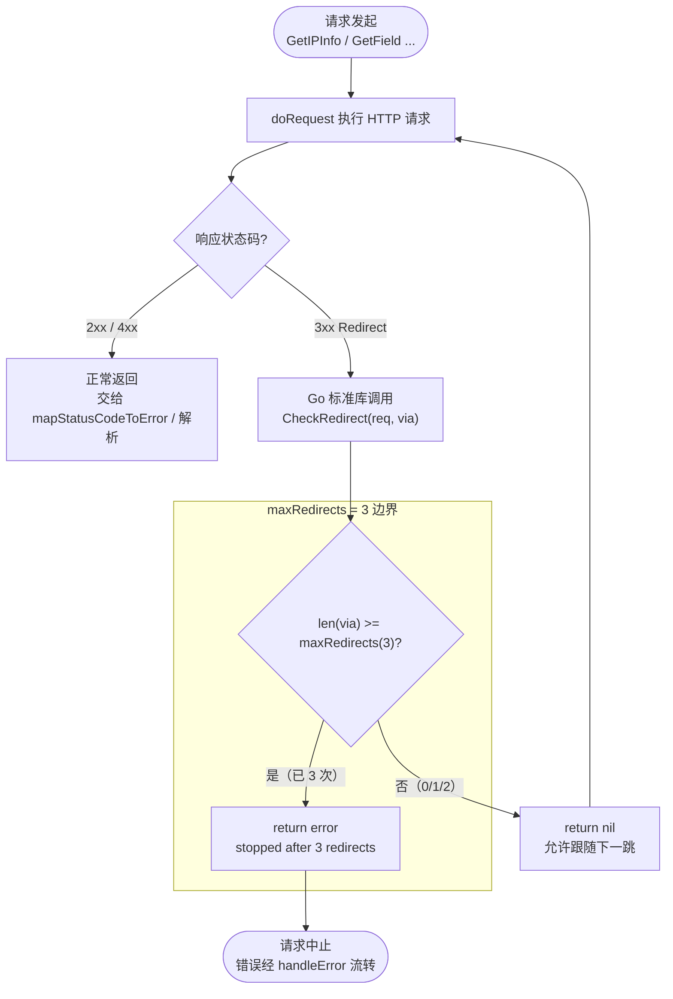

# 🔁 `maxRedirects` — 最大 HTTP 跳转次数

::: tip 🎨 一图抵千言
`maxRedirects` 约束 `http.Client` 跟随 3xx 重定向的最大次数。下图展示一次请求从发出到触及上限被中止的全过程：


:::

> `maxRedirects` 是 `ipapi` SDK 内部的包级常量，用于约束 `http.Client` 在请求 `ipapi.co` 时允许跟随的 **最大 HTTP 跳转（3xx Redirect）次数**。其值为 `3`，即在累计发起 3 次跳转后将主动中止请求，避免客户端陷入无限重定向循环或在恶意跳转链中越走越深。

---

## 📦 定义

```go
// pkg/ipapi/client.go
const (
	defaultBaseURL    = "https://ipapi.co/"
	defaultTimeout    = 10 * time.Second
	maxRedirects      = 3
	defaultRetryDelay = 500 * time.Millisecond
)
```

| 属性 | 值 |
| --- | --- |
| 🔤 名称 | `maxRedirects` |
| 🏷️ 类别 | 常量（包级、未导出） |
| 🔢 值 | `3` |
| 📐 类型 | 无类型常量（默认 `int`） |
| 📁 定义位置 | `pkg/ipapi/client.go` |
| 🛡️ 作用对象 | `Client.HTTPClient.CheckRedirect` |

> ⚠️ 这是一个 **未导出（小写开头）** 的常量，外部包无法直接引用。它仅在 SDK 内部生效，行为通过 `NewClient` 构造出的 `http.Client` 体现。

---

## 📖 说明

### 🎯 作用

`maxRedirects` 配置在 `NewClient` 创建的 `http.Client.CheckRedirect` 字段上。每当服务端返回 `3xx` 重定向响应时，Go 标准库会调用 `CheckRedirect` 决定是否继续跟随；SDK 在该回调中比较 `len(via)`（已跟随的跳转数）与 `maxRedirects`，一旦达到上限即返回错误，中止跳转链：

```go
// pkg/ipapi/client.go
func NewClient(opts ...ClientOption) *Client {
	c := &Client{
		HTTPClient: &http.Client{
			Timeout: defaultTimeout,
			CheckRedirect: func(req *http.Request, via []*http.Request) error {
				if len(via) >= maxRedirects {
					return fmt.Errorf("stopped after %d redirects", maxRedirects)
				}
				return nil
			},
		},
		BaseURL:   defaultBaseURL,
		UserAgent: "ipapi-go-client/1.0",
		Retries:   2,
	}

	for _, opt := range opts {
		opt(c)
	}
	return c
}
```

### 🧭 跳转计数的语义

`CheckRedirect` 的 `via []*http.Request` 参数保存的是 **已经发起的请求序列**（不含当前正要发起的请求）。因此判断条件使用 `len(via) >= maxRedirects`：

| `len(via)`（已跳转次数） | 行为 |
| --- | --- |
| `0`、`1`、`2` | ✅ 允许继续跟随（`return nil`） |
| `3`（及以上） | 🛑 返回 `"stopped after 3 redirects"`，中止跳转 |

也就是说，客户端最多跟随 **3 次** 跳转；第 4 次跳转会被拒绝，请求以错误终止。

### 🛡️ 为何限制跳转

1. **🪤 防御重定向循环**：服务端异常或配置错误时可能返回循环跳转（如 A→B→A），无上限会消耗带宽与 CPU 直至超时。
2. **⏳ 与超时协同**：`defaultTimeout` 为 `10 * time.Second`，限制跳转次数能在超时窗口内更快失败，避免在跳转链上空耗。
3. **🔒 安全边界**：防止恶意或被劫持的响应将客户端引向不受信任的下游主机链路。

### ⚙️ 自定义行为

由于 `maxRedirects` 未导出，无法直接修改其值。若需调整跳转上限，应通过 [`WithCustomHTTPClient`](../../api/with-custom-http-client) 注入自带 `CheckRedirect` 的 `*http.Client`，完全接管跳转策略：

```go
customHTTP := &http.Client{
	Timeout: 10 * time.Second,
	CheckRedirect: func(req *http.Request, via []*http.Request) error {
		if len(via) >= 5 { // 自定义为 5 次
			return fmt.Errorf("stopped after %d redirects", 5)
		}
		return nil
	},
}
client := ipapi.NewClient(ipapi.WithCustomHTTPClient(customHTTP))
```

> 💡 注入自定义 `*http.Client` 后，SDK 默认的 `maxRedirects` 行为将被 **整体覆盖**，需自行保证 `CheckRedirect`、`Timeout` 等字段的合理性。

::: warning 🛠️ 内部常量不可外部修改
`maxRedirects` 是 **未导出** 的包级常量，外部包无法通过 `ipapi.maxRedirects = N` 之类的方式改写。任何想调整跳转上限的尝试都必须走 [`WithCustomHTTPClient`](../../api/with-custom-http-client) 注入新的 `*http.Client`——直接赋值只会得到编译错误。这是 SDK 有意保留的内部边界，用以保证默认请求路径的跳转行为可被预测、可被测试。
:::

::: details 🔍 调试技巧：如何观察 CheckRedirect 是否被触发
若怀疑请求因跳转上限被中止，可在注入的自定义 `*http.Client.CheckRedirect` 中打印 `len(via)`，观察实际跟随的跳转链：

```go
customHTTP := &http.Client{
    Timeout: 10 * time.Second,
    CheckRedirect: func(req *http.Request, via []*http.Request) error {
        fmt.Printf("redirect %d -> %s\n", len(via), req.URL)
        if len(via) >= 3 {
            return fmt.Errorf("stopped after %d redirects", 3)
        }
        return nil
    },
}
client := ipapi.NewClient(ipapi.WithCustomHTTPClient(customHTTP))
```

预期日志形如 `redirect 1 -> ...`、`redirect 2 -> ...`、`redirect 3 -> ...`，随后即返回 `"stopped after 3 redirects"`。对照 [`doRequest`](../index) 的内部流程即可定位中止发生在哪一跳。
:::

---

## 💻 用法 / 示例

以下示例展示 `maxRedirects` 在真实跳转场景下的行为边界。第一个用例构造一个 **无限重定向** 的服务端，验证 SDK 在第 3 次跳转后主动中止；第二个用例构造一个跳转次数 **恰好在上限以内** 的链路，验证正常放行。

```go
package main

import (
	"fmt"
	"net/http"
	"net/http/httptest"
)

// 演示 SDK 默认 maxRedirects (3) 的行为：无限重定向 → 中止
func main() {
	// 🧪 场景一：服务端无限重定向
	loopServer := httptest.NewServer(http.HandlerFunc(func(w http.ResponseWriter, r *http.Request) {
		http.Redirect(w, r, "/redirect", http.StatusFound) // 每次都跳转
	}))
	defer loopServer.Close()

	client := ipapi.NewClient() // 内置 maxRedirects = 3
	resp, err := client.HTTPClient.Get(loopServer.URL)
	if err != nil {
		// ✅ 预期：在第 3 次跳转后被中止
		fmt.Printf("已按预期中止跳转: %v\n", err)
		// 输出类似：stopped after 3 redirects
	} else {
		resp.Body.Close()
	}

	// 🧪 场景二：跳转次数在上限以内（2 < 3），正常放行
	redirectCount := 0
	okServer := httptest.NewServer(http.HandlerFunc(func(w http.ResponseWriter, r *http.Request) {
		if r.URL.Path == "/final" {
			w.WriteHeader(http.StatusOK)
			return
		}
		redirectCount++
		if redirectCount < 3 { // 仅跳转 2 次，未触及上限
			http.Redirect(w, r, "/final", http.StatusFound)
			return
		}
		w.WriteHeader(http.StatusOK)
	}))
	defer okServer.Close()

	resp, err = client.HTTPClient.Get(okServer.URL)
	if err != nil {
		fmt.Printf("意外失败: %v\n", err)
		return
	}
	defer resp.Body.Close()
	fmt.Println("跳转在上限内，请求成功完成")
}
```

> 📌 上述逻辑与 SDK 自身的测试 `TestNewClient_CheckRedirect_TooManyRedirects`、`TestNewClient_CheckRedirect_AllowedRedirects`（位于 `pkg/ipapi/client_test.go`）保持一致，可对照源码阅读。

### 🧪 验证常量值

SDK 在 `pkg/ipapi/api_test.go` 中对常量值做了断言，确保不被意外改动：

```go
// pkg/ipapi/api_test.go
if maxRedirects != 3 {
	t.Errorf("expected maxRedirects 3, got %d", maxRedirects)
}
```

---

## 🔗 相关

- 🖥️ [`Client` 结构体](../../api/client) — `HTTPClient.CheckRedirect` 的宿主，承载跳转策略
- 🏗️ [`NewClient`](../../api/new-client) — 在此设置 `CheckRedirect` 回调，绑定 `maxRedirects`
- 🧰 [方法列表](../../api/methods) — 所有发起 HTTP 请求的查询方法均受该上限约束
- 📦 [数据模型](../../api/models) — `Client` 字段与响应结构定义
- 🚨 [错误类型](../../api/errors) — 跳转超限返回的错误会经 `handleError` 流转
- ⚙️ [配置选项](../../api/options) — `WithCustomHTTPClient` 等可覆盖默认跳转行为

---

## 👉 下一步

- 🔧 阅读 [自定义 HTTP 客户端](../../guide/custom-http) 了解如何用 `WithCustomHTTPClient` 接管 `CheckRedirect`、`Timeout` 等底层行为
- ⏱️ 结合 [`defaultTimeout`](./default-timeout) 理解跳转次数与超时窗口如何协同保护请求
- 🔁 参见 [重试机制概念](../../guide/retry-concept) 把跳转中止、超时、限流等失败纳入统一的容错与重试策略
- 🧪 运行 `go test ./pkg/ipapi/ -run CheckRedirect` 亲自验证 `maxRedirects` 的边界行为
