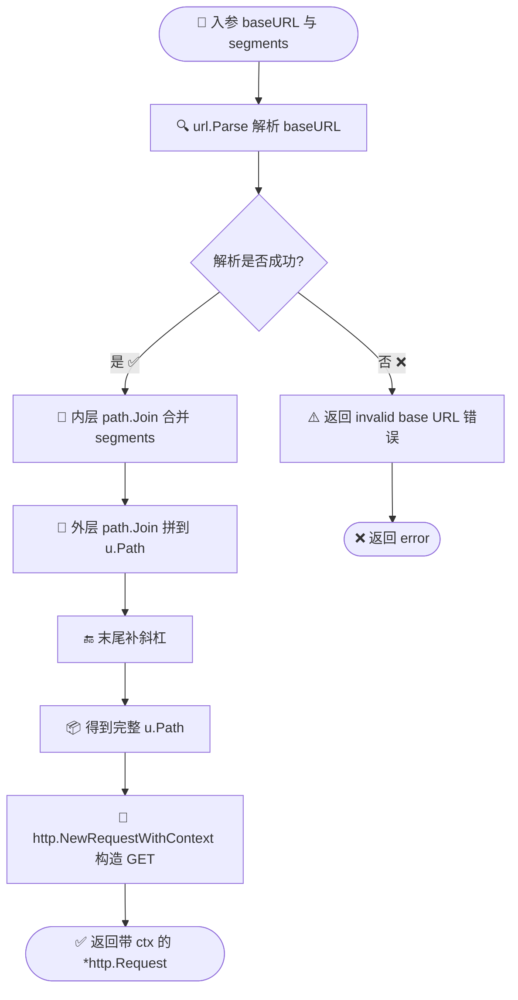

# 🧩 `newGetRequest` — URL 拼接与请求构建

> `newGetRequest` 是 `ipapi.co-skills` SDK 内部的请求构建器。每一个对外查询方法（`GetIPInfo`、`GetField`、`GetClientIPInfo` 等）在完成参数校验后，都会先调用它把 **baseURL + 若干路径段** 拼成一个合法的请求 URL，再创建出带 `context` 的 `*http.Request`。它串起了 **URL 解析 → 路径段拼接 → IPv6 安全处理 → 请求构造** 四个环节，是所有 GET 请求共同的起点。

::: warning 内部函数
`newGetRequest` 是 **未导出** 的内部函数（小写开头），不构成公开 API 契约，调用方不应直接依赖。其行为可在后续版本中调整。本页用于帮助使用者理解 SDK 内部如何统一构造请求 URL，特别是如何安全处理 IPv6 这类含冒号的特殊路径段。
:::

---

## 📦 定义

```go
// pkg/ipapi/api.go
func newGetRequest(ctx context.Context, baseURL string, segments ...string) (*http.Request, error)
```

| 属性 | 值 |
| --- | --- |
| 🔣 符号 | `newGetRequest` |
| 📛 类别 | 内部函数（未导出） |
| 📍 定义位置 | `pkg/ipapi/api.go` |
| 📥 入参 | `ctx context.Context` —— 请求上下文，用于超时与取消；`baseURL string` —— 客户端基础 URL（默认 `https://ipapi.co/`）；`segments ...string` —— 追加到路径后的可变参数段（如 IP、字段名、格式） |
| 📤 出参 | `*http.Request` —— 已完成 URL 构造的 GET 请求对象，方法固定为 `GET`、无 body；`error` —— URL 解析或请求构造失败时返回 |
| 🔗 上游调用 | `GetIPInfo` / `GetIPInfoRaw` / `GetField` / `GetClientIPInfo` / `GetClientIPInfoRaw` / `GetClientField` |
| 🔧 关键依赖 | 标准库 `net/url`、`net/http`、`path` |

---

## 🧭 说明

`newGetRequest` 的全部实现只有寥寥几行，但每一行都承担了明确的职责：

```go
func newGetRequest(ctx context.Context, baseURL string, segments ...string) (*http.Request, error) {
    u, err := url.Parse(baseURL)
    if err != nil {
        return nil, fmt.Errorf("invalid base URL: %w", err)
    }
    u.Path = path.Join(u.Path, path.Join(segments...)) + "/"
    return http.NewRequestWithContext(ctx, "GET", u.String(), nil)
}
```

### 1️⃣ 解析 baseURL

```go
u, err := url.Parse(baseURL)
if err != nil {
    return nil, fmt.Errorf("invalid base URL: %w", err)
}
```

先用 `url.Parse` 把 `baseURL` 解析成 `*url.URL`。若 `baseURL` 本身不合法（如含非法转义字符），立即返回一个以 `"invalid base URL: %w"` 包装的错误。这层校验把"配置错误"和"网络错误"区分开，调用方在排查时能立刻定位是 baseURL 写错了。

### 2️⃣ 拼接路径段（含 IPv6 安全处理）

::: tip 🎨 一图抵千言
下图展示 `newGetRequest` 如何把 `baseURL` 与可变 `segments` 拼成最终的请求 URL，核心是两次 `path.Join` 与末尾补斜杠。
:::



```go
u.Path = path.Join(u.Path, path.Join(segments...)) + "/"
```

这是函数最关键的一行，分三步：

- 🧵 **内层 `path.Join(segments...)`**：先把所有可变路径段合并成一个干净路径，自动清理多余的 `/`，例如 `path.Join("8.8.8.8", "json")` → `8.8.8.8/json`。
- 🧵 **外层 `path.Join(u.Path, ...)`**：再把合并后的段拼到 baseURL 已有的 `Path` 上，保证前缀（如 `/`）与段之间分隔正确。
- 🔚 **末尾补 `/`**：ipapi.co 的 API 期望路径以斜杠结尾（如 `https://ipapi.co/8.8.8.8/json/`），因此手动补一个 `/`。

> 💡 **为什么用 `path.Join` 而不是字符串拼接？**
> IPv6 地址（如 `2001:4860:4860::8888`）含冒号，IPv6 加端口（如 `[::1]:8080`）还含方括号。若用 `fmt.Sprintf("%s/%s", ...)` 等裸拼接，冒号会被 `url.String()` 当作 scheme 分隔符，方括号也可能被错误转义。`path.Join` 在路径语义下工作，配合 `url.Parse` 已解析出的 `u.Path` 字段赋值，能正确保留这些字符的路径含义，避免 IPv6 请求 URL 被破坏。

### 3️⃣ 构造带 context 的 GET 请求

```go
return http.NewRequestWithContext(ctx, "GET", u.String(), nil)
```

用 `http.NewRequestWithContext` 而非 `http.NewRequest`，使请求携带调用方传入的 `ctx`，从而支持 **超时取消** 与 **链路追踪**。方法固定为 `GET`、body 为 `nil`（ipapi.co 所有查询接口均为无 body 的 GET）。最终 `u.String()` 输出形如 `https://ipapi.co/8.8.8.8/json/` 的完整 URL。

> ⚠️ `newGetRequest` **只负责构建请求**，不发起请求。鉴权注入（`applyAuth`）、请求头设置（`setHeaders`）、实际发送与重试（`doRequest`）都在后续环节完成。

---

## 💻 用法 / 示例

`newGetRequest` 不可直接调用（未导出），但它是所有公开查询方法的共同前缀。下面用真实 Go 代码演示它的等价行为与在各方法中的调用形态。

### 示例 1：等价复刻 `newGetRequest` 的行为

```go
package main

import (
    "context"
    "fmt"
    "net/http"
    "net/url"
    "path"
)

// buildGetRequest 等价复刻 SDK 内部 newGetRequest 的行为
func buildGetRequest(ctx context.Context, baseURL string, segments ...string) (*http.Request, error) {
    u, err := url.Parse(baseURL)
    if err != nil {
        return nil, fmt.Errorf("invalid base URL: %w", err)
    }
    // path.Join 安全处理 IPv6 等含冒号/方括号的路径段
    u.Path = path.Join(u.Path, path.Join(segments...)) + "/"
    return http.NewRequestWithContext(ctx, "GET", u.String(), nil)
}

func main() {
    ctx := context.Background()

    // 普通 IPv4
    req1, _ := buildGetRequest(ctx, "https://ipapi.co/", "8.8.8.8", "json")
    fmt.Println(req1.URL.String()) // https://ipapi.co/8.8.8.8/json/

    // IPv6 —— 冒号不会被误判为 scheme 分隔符
    req2, _ := buildGetRequest(ctx, "https://ipapi.co/", "2001:4860:4860::8888", "json")
    fmt.Println(req2.URL.String()) // https://ipapi.co/2001:4860:4860::8888/json/

    // 单字段查询
    req3, _ := buildGetRequest(ctx, "https://ipapi.co/", "8.8.8.8", "country")
    fmt.Println(req3.URL.String()) // https://ipapi.co/8.8.8.8/country/
}
```

### 示例 2：SDK 内部各方法的真实调用形态

以下是 `pkg/ipapi/api.go` 中公开方法调用 `newGetRequest` 的真实签名形态，展示了 `segments` 可变参数的用法：

```go
// GetIPInfo / GetIPInfoRaw：段 = {ip, format}
req, err := newGetRequest(ctx, c.BaseURL, ip, format)

// GetField：段 = {ip, field}
req, err := newGetRequest(ctx, c.BaseURL, ip, field)

// GetClientIPInfoRaw：段 = {format}（查询调用方自身出口 IP）
req, err := newGetRequest(ctx, c.BaseURL, format)

// GetClientField：段 = {field}
req, err := newGetRequest(ctx, c.BaseURL, field)
```

### 示例 3：观察 context 透传带来的可取消性

由于 `newGetRequest` 用 `http.NewRequestWithContext(ctx, ...)` 绑定了上下文，调用方对 `ctx` 的取消会立刻传导到底层 HTTP 调用：

```go
package main

import (
    "context"
    "log"
    "time"

    "github.com/cyberspacesec/ipapi"
)

func main() {
    client := ipapi.NewClient(ipapi.WithAPIKey("YOUR_API_KEY"))

    // 500ms 后自动取消 —— newGetRequest 绑定的 ctx 会让 doRequest 中的
    // c.HTTPClient.Do(req) 立即返回 context.Canceled
    ctx, cancel := context.WithTimeout(context.Background(), 500*time.Millisecond)
    defer cancel()

    _, err := client.GetIPInfo(ctx, "8.8.8.8", "json")
    if err != nil {
        log.Printf("请求被取消或超时: %v", err) // 多为 context deadline exceeded
        return
    }
    log.Println("查询成功")
}
```

### 示例 4：通过自定义 baseURL 验证路径拼接

```go
package main

import (
    "context"
    "log"

    "github.com/cyberspacesec/ipapi"
)

func main() {
    // 显式覆盖 baseURL，便于观察 newGetRequest 的拼接结果
    client := ipapi.NewClient(
        ipapi.WithAPIKey("YOUR_API_KEY"),
        ipapi.WithBaseURL("https://ipapi.co/"),
    )

    ctx := context.Background()
    info, err := client.GetField(ctx, "8.8.8.8", "country")
    if err != nil {
        log.Fatalf("查询失败: %v", err)
    }
    // 对应请求 URL: https://ipapi.co/8.8.8.8/country/
    log.Printf("country = %v", info)
}
```

---

## 🔗 相关

- 🖥️ [Client 客户端](../../api/client) —— 提供 `BaseURL` 字段，是 `newGetRequest` 的 `baseURL` 来源
- 📚 [API 方法](../../api/methods) —— 所有调用 `newGetRequest` 的公开查询方法总览
- 🧱 [数据模型](../../api/models) —— 请求返回体反序列化所用的结构体（`IPInfo` 等）
- 🚨 [错误类型](../../api/errors) —— `newGetRequest` 自身仅产出 `invalid base URL` 错误，下游错误语义在此
- ⚙️ [选项函数](../../api/options) —— `WithBaseURL` / `WithCustomHTTPClient` 等可改变请求构建行为的配置项
- 🚀 [`doRequest` 请求调度](./do-request) —— 接收 `newGetRequest` 产出的请求并真正发起调用
- 🏷️ [`setHeaders` 请求头](./set-headers) —— 在 `newGetRequest` 之后为请求注入通用头
- 🔑 [`apikeyHeader` / `apikeyQuery`](./apikey-header) —— 在请求构建完成后注入鉴权信息

---

## 👉 下一步

- 📖 阅读 [Client 客户端](../../api/client)，了解 `BaseURL` 字段的默认值与覆盖方式
- 📚 浏览 [API 方法](../../api/methods)，对照各方法传入 `newGetRequest` 的路径段差异
- 🚀 跟读 [`doRequest` 请求调度](./do-request)，理解请求构建之后的限流、重试与错误解析链路
- ⚙️ 参考 [选项函数](../../api/options)，通过 `WithBaseURL` 指向自托管或镜像端点
- 🧪 查看 [基础用法示例](../../examples/basic-usage) 上手第一次查询
