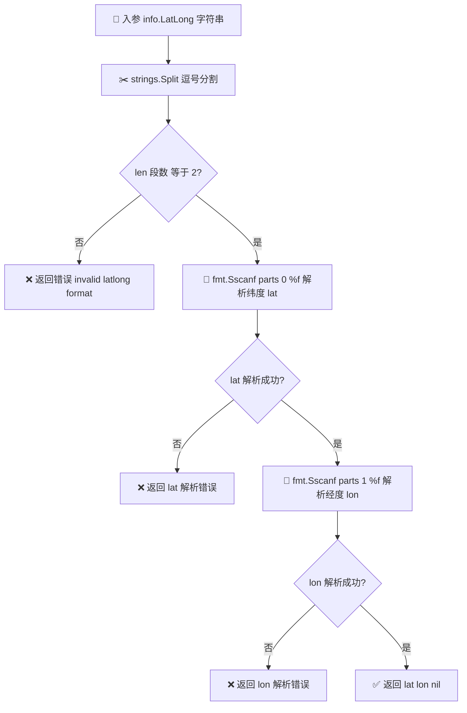

# 📍 ParseLatLong

> 🧩 `IPInfo` 方法 · 将 `LatLong` 字符串解析为经纬度数值

## 📐 定义

```go
func (info *IPInfo) ParseLatLong() (float64, float64, error)
```

## 📖 说明

`ParseLatLong` 是绑定在 [`IPInfo`](../../api/models) 结构体上的辅助方法，用于把 ipapi.co 返回的 `LatLong` 字段（形如 `"37.3860,-122.0838"` 的字符串）拆分并解析为两个 `float64` 值。

🔍 **解析规则**：

1. 以逗号 `,` 分割 `info.LatLong` 字符串。
2. 若分割后段数 **不等于 2**（例如空串、缺一端、多逗号），返回错误 `invalid latlong format`。
3. 使用 `fmt.Sscanf` 以 `%f` 格式分别解析纬度（lat）与经度（lon）。
4. 任一段解析失败，立刻返回对应的解析错误。
5. 成功时返回 `(lat, lon, nil)`。

::: tip 🎨 一图抵千言
下面的流程图直观展示了 `ParseLatLong` 从字符串到 `(lat, lon)` 数值的解析全流程，含格式校验与逐段解析的错误分支。
:::



⚠️ **注意点**：

- 该方法 **不会校验经纬度的有效范围**（纬度应在 `[-90, 90]`、经度在 `[-180, 180]`）。它只负责把字符串转成数字，地理合理性需由调用方自行判断。
- `LatLong` 字段为空字符串时，`strings.Split` 会得到长度为 1 的切片，从而触发 `invalid latlong format` 错误。
- 当 `info` 为 `nil` 时会触发空指针解引用，调用前请确保 `IPInfo` 实例已初始化。
- 此方法为 **纯字符串解析**，不发起任何网络请求，可在已缓存的 `IPInfo` 上安全复用。

## 🚀 用法 / 示例

### 基础示例

```go
package main

import (
    "fmt"
    "log"

    "github.com/cyberspacesec/ipapi.co-skills/pkg/ipapi"
)

func main() {
    // 通常通过 client.Lookup() 拿到 IPInfo，这里直接构造演示
    info := &ipapi.IPInfo{LatLong: "37.3860,-122.0838"}

    lat, lon, err := info.ParseLatLong()
    if err != nil {
        log.Fatalf("解析经纬度失败: %v", err)
    }

    fmt.Printf("纬度: %.4f\n", lat) // 纬度: 37.3860
    fmt.Printf("经度: %.4f\n", lon) // 经度: -122.0838
}
```

### 结合 Client 实战

```go
package main

import (
    "fmt"
    "log"

    "github.com/cyberspacesec/ipapi.co-skills/pkg/ipapi"
)

func main() {
    client := ipapi.NewClient()
    info, err := client.Lookup("8.8.8.8")
    if err != nil {
        log.Fatalf("查询失败: %v", err)
    }

    lat, lon, err := info.ParseLatLong()
    if err != nil {
        log.Fatalf("经纬度解析失败: %v", err)
    }

    fmt.Printf("Google DNS 位于 (%.4f, %.4f)\n", lat, lon)
}
```

### 错误处理示范

```go
package main

import (
    "fmt"

    "github.com/cyberspacesec/ipapi.co-skills/pkg/ipapi"
)

func main() {
    cases := []string{
        "37.3860,-122.0838", // 正常
        "invalid",           // 格式错误
        "abc,-122.0838",     // 纬度非数字
        "37.3860,xyz",       // 经度非数字
        "",                  // 空串
    }

    for _, ll := range cases {
        info := &ipapi.IPInfo{LatLong: ll}
        lat, lon, err := info.ParseLatLong()
        if err != nil {
            fmt.Printf("LatLong=%-20q ❌ 错误: %v\n", ll, err)
            continue
        }
        fmt.Printf("LatLong=%-20q ✅ lat=%.4f lon=%.4f\n", ll, lat, lon)
    }
}
```

预期输出：

```text
LatLong="37.3860,-122.0838  " ✅ lat=37.3860 lon=-122.0838
LatLong="invalid            " ❌ 错误: invalid latlong format
LatLong="abc,-122.0838      " ❌ 错误: expected integer
LatLong="37.3860,xyz        " ❌ 错误: expected integer
LatLong="                    " ❌ 错误: invalid latlong format
```

## 🔗 相关

- 🧱 [models](../../api/models) — `IPInfo` 结构体定义，包含 `LatLong`、`Latitude`、`Longitude` 等字段
- 🛠️ [methods](../../api/methods) — `IPInfo` 上的全部辅助方法一览（`ParseLatLong`、`GetPostal` 等）
- 📡 [client](../../api/client) — `Client` 查询入口，`Lookup` 返回填充好的 `IPInfo`
- ⚠️ [errors](../../api/errors) — SDK 错误类型与判断方式
- ⚙️ [options](../../api/options) — 配置 `Client` 的各项选项

## ➡️ 下一步

- 📡 学习如何通过 [`Client`](../../api/client) 获取 `IPInfo`，再调用本方法。
- 🧱 在 [models](../../api/models) 中了解 `Latitude` / `Longitude` 这两个已数字化的字段——若仅需数值，可直接读取它们而无需调用 `ParseLatLong`。
- 🛠️ 浏览 [methods](../../api/methods)，掌握 `IPInfo` 提供的其他便捷访问器。
- ⚠️ 阅读 [errors](../../api/errors)，学会区分网络错误与解析错误。
