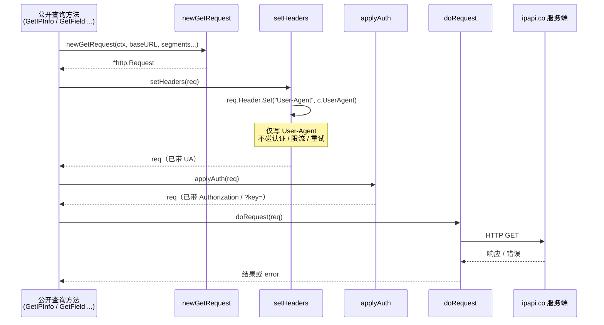

# 🧷 setHeaders 设置请求头

> `pkg/ipapi/api.go` — `Client` 的内部方法，负责为每个出站请求注入 `User-Agent` 头。

::: tip 🎨 一图抵千言
`setHeaders` 在请求生命周期中的位置：构造请求后立即注入 `User-Agent`，再交给认证注入与实际执行。


:::

## 定义

```go
// setHeaders sets common HTTP headers on the request.
func (c *Client) setHeaders(req *http.Request) {
	req.Header.Set("User-Agent", c.UserAgent)
}
```

## 说明

🔧 `setHeaders` 是一个**非导出**的内部辅助方法，由所有公开查询方法（`GetIPInfo`、`GetClientIPInfo`、`GetField` 等）在构造 `*http.Request` 后、发起请求前统一调用。

它的职责非常单一：

- 🏷️ 将 `Client.UserAgent` 字段的值写入请求的 `User-Agent` 头。
- 🚫 **不**处理认证（那是 [`applyAuth`](./apply-auth) 的事），**不**处理限流、重试或状态码映射。

### 为什么需要它

ipapi.co 服务端会依据 `User-Agent` 识别客户端来源、做统计与排障。SDK 默认使用 `ipapi-go-client/1.0` 作为 UA，确保服务端能正确归类本 SDK 的流量。集中在一个方法里设置，避免在每个查询方法中重复书写 `req.Header.Set(...)`，也方便未来扩展通用头（如 `Accept`、自定义追踪头）。

### 默认值

`UserAgent` 在 [`NewClient`](../../api/new-client) 中初始化为：

```go
UserAgent: "ipapi-go-client/1.0",
```

如需自定义，构造客户端时直接覆盖 `Client.UserAgent` 字段即可（见下方示例）。

::: details 🐛 调试技巧：如何确认 UA 真的被发出去了
当你在代理或服务端排查"为什么流量没被归类到本 SDK"时，可以用一个本地回显服务器捕获真实请求头，**无需触碰 `setHeaders` 这个非导出方法**：

```go
srv := httptest.NewServer(http.HandlerFunc(func(w http.ResponseWriter, r *http.Request) {
    log.Printf("UA = %q", r.Header.Get("User-Agent"))
    _, _ = w.Write([]byte(`{"ip":"8.8.8.8"}`))
}))
defer srv.Close()

c := ipapi.NewClient()
c.BaseURL = srv.URL + "/"
c.UserAgent = "my-app/2.3"
_, _ = c.GetIPInfo("8.8.8.8") // 观察日志输出
```

若日志中 UA 为 `my-app/2.3`，说明 `setHeaders` 已正确写入；若仍是默认值或为空，检查是否在 `NewClient` 之后又意外覆盖了 `UserAgent`，或自定义 [`HTTPClient`](../../api/options) 绕过了 SDK 路径。
:::

::: warning ⚠️ 内部方法，请勿直接调用
`setHeaders` 是**非导出**方法（小写开头），仅为解释 SDK 原理而披露。外部代码无法也**不应**通过反射等手段调用它。要控制 UA，请通过 `Client.UserAgent` 字段或封装 `ClientOption`（见下方示例）。未来版本可能重命名、合并或拆分此方法，任何依赖其存在/签名的代码都属于未定义行为。
:::

### 调用点

`setHeaders` 在 `api.go` 中被以下方法的请求构造阶段调用：

- `GetIPInfo`
- `GetClientIPInfo`
- `GetIPInfoRaw`
- `GetClientIPInfoRaw`
- `GetField`
- `GetClientField`

每个方法都会先 `http.NewRequest(...)`，再 `c.setHeaders(req)`，最后 `c.applyAuth(req)` 后交给 `c.doRequest(req)` 执行。

## 用法/示例

`setHeaders` 本身是非导出方法，**外部调用方无法直接调用**。下面的示例展示它如何在内部被使用，以及如何通过自定义 `UserAgent` 间接控制其行为。

### 自定义 User-Agent

```go
package main

import (
	"fmt"
	"net/http"
	"net/http/httptest"
	"net/url"
	"os"

	"github.com/cyberspacesec/ipapi.co-skills/pkg/ipapi"
)

func main() {
	// 用一个本地测试服务器捕获实际发出的 User-Agent 头
	srv := httptest.NewServer(http.HandlerFunc(func(w http.ResponseWriter, r *http.Request) {
		fmt.Fprintf(os.Stderr, "收到 User-Agent: %s\n", r.Header.Get("User-Agent"))
		// 返回最小合法 JSON
		_, _ = w.Write([]byte(`{"ip":"8.8.8.8","city":"Mountain View"}`))
	}))
	defer srv.Close()

	// 构造客户端，把 BaseURL 指向测试服务器，并自定义 UA
	client := ipapi.NewClient()
	client.BaseURL = srv.URL + "/"
	client.UserAgent = "my-app/2.3 (contact=ops@example.com)"

	// GetIPInfo 内部会调用 setHeaders，把上面的 UA 写入请求头
	info, err := client.GetIPInfo("8.8.8.8")
	if err != nil {
		fmt.Println("查询失败:", err)
		return
	}

	fmt.Printf("IP: %s, 城市: %s\n", info.IP, info.City)
	// 输出（stderr）: 收到 User-Agent: my-app/2.3 (contact=ops@example.com)
}
```

### 通过选项函数封装（推荐写法）

如果你的自定义 UA 需要在多处复用，可以把它包装成一个 `ClientOption`：

```go
// WithUserAgent 设置客户端的 User-Agent 头。
func WithUserAgent(ua string) ipapi.ClientOption {
	return func(c *ipapi.Client) {
		c.UserAgent = ua
	}
}

func main() {
	client := ipapi.NewClient(
		ipapi.WithAPIKey(os.Getenv("IPAPI_KEY")),
		WithUserAgent("my-service/1.0"),
	)
	// 后续所有请求都会带上 my-service/1.0
	_ = client
}
```

### 内部调用链（概念示意）

```go
// 以下为 SDK 内部逻辑的简化示意，外部无法调用 setHeaders
req, _ := http.NewRequest(http.MethodGet, c.BaseURL+target, nil)
c.setHeaders(req)   // ← 写入 User-Agent
c.applyAuth(req)    // ← 写入 Authorization / ?key=
resp, err := c.doRequest(req) // ← 限流、重试、状态码映射
```

## 相关

- 🏠 [`Client` 客户端](../../api/client) — `setHeaders` 的宿主类型与 `UserAgent` 字段定义
- 📖 [`方法详解`](../../api/methods) — 所有调用 `setHeaders` 的公开查询方法
- 🧩 [`数据模型`](../../api/models) — `IPInfo` 等响应结构
- ⚠️ [`错误类型`](../../api/errors) — `setHeaders` 不直接抛错，但其调用链上的 `doRequest` 会
- ⚙️ [`客户端选项`](../../api/options) — `ClientOption` 模式，可据此封装自定义 UA

## 下一步

- 🔐 学习认证注入：[`applyAuth`](./apply-auth)
- 🚀 看请求如何被执行：[`doRequest`](./do-request)
- 🏗 从 [`NewClient`](../../api/new-client) 了解默认 UA 的初始化
- 🧭 回到 [`Client` 概念](../../guide/client-concept) 理解整体设计
