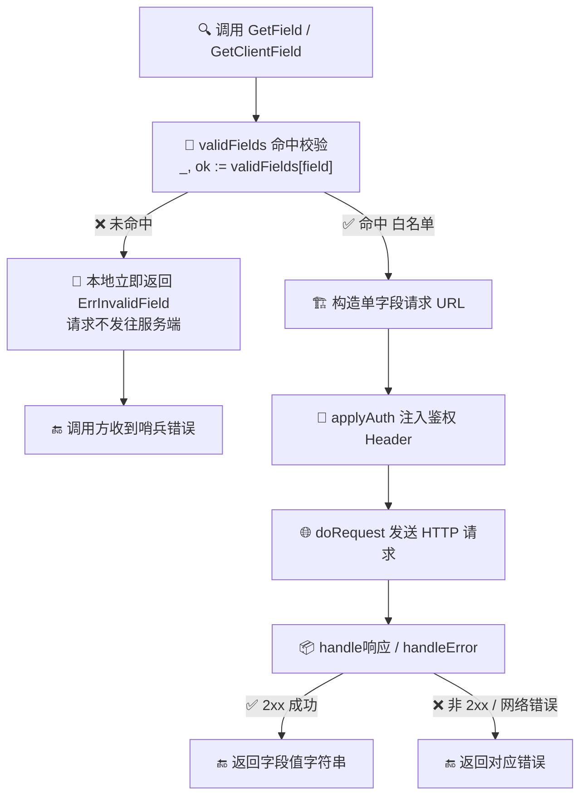

# ✅ 变量详解：validFields

> 🏷️ 类别：**变量（包级 var）** · 🔠 符号：`ipapi.validFields` · 📦 所在文件：[`api.go`](https://github.com/cyberspacesec/ipapi.co-skills/blob/main/pkg/ipapi/api.go)

本页详解 SDK 内部用于字段名白名单校验的 `validFields` 变量，涵盖其定义、设计意图、用法示例与相关 API。

---

## 📐 定义

`validFields` 是定义在 `pkg/ipapi/api.go` 顶部的**包级私有变量**，用 `map[string]struct{}` 实现一个集合（set）：

```go
package ipapi

var validFields = map[string]struct{}{
	"ip": {}, "network": {}, "version": {}, "city": {}, "region": {},
	"region_code": {}, "country": {}, "country_name": {}, "country_code": {},
	"country_code_iso3": {}, "country_capital": {}, "country_tld": {},
	"continent_code": {}, "in_eu": {}, "postal": {},
	"latitude": {}, "longitude": {}, "latlong": {}, "timezone": {},
	"utc_offset": {}, "languages": {}, "country_calling_code": {},
	"currency": {}, "currency_name": {}, "country_area": {},
	"country_population": {}, "asn": {}, "org": {}, "hostname": {},
}
```

| 属性 | 值 |
| --- | --- |
| 🔖 符号 | `ipapi.validFields`（小写开头，**未导出**） |
| 📦 所在文件 | [`api.go`](https://github.com/cyberspacesec/ipapi.co-skills/blob/main/pkg/ipapi/api.go)（第 15–24 行） |
| 🧩 类型 | `map[string]struct{}` |
| 📊 条目数 | **28** 个合法字段名 |
| 🔎 查找复杂度 | `O(1)`（基于哈希表的 map 查找） |
| 🌐 可见性 | 包内可见，外部无法直接访问 |

> 💡 **小知识：** Go 没有“集合（set）”这种内建类型。用 `map[string]struct{}` 是社区公认的轻量做法 —— `struct{{}}` 是**零宽度**类型，不占额外内存，仅用 map 的 key 来表达“存在 / 不存在”。

---

## 📖 说明

### 🎯 它的作用是什么？

`validFields` 是 ipapi.co 单字段查询接口所接受的**字段名白名单**。当调用 [`GetField`](../../api/get-field) 或 [`GetClientField`](../../api/get-client-field) 时，SDK 会先用这张表校验传入的 `field` 参数：

- ✅ 字段在表中 → 继续构造并发出 HTTP 请求。
- ❌ 字段不在表中 → **立即在本地返回 [`ErrInvalidField`](../errors/err-invalid-field)**，请求根本不会发往 ipapi.co 服务端。

这是典型的**“快速失败”（fail fast）**设计：把无效参数挡在客户端，避免一次毫无意义的网络往返，也避免把无效字段名拼进 URL。

::: tip 🎨 一图抵千言
下方流程图直观展示 `GetField` 的校验分支：命中 `validFields` 才会构造并发送 HTTP 请求，否则本地立即返回 `ErrInvalidField`，请求根本不会发往 ipapi.co。
:::



### 🧩 设计要点

| 要点 | 说明 |
| --- | --- |
| 🚫 未导出 | 小写 `validFields` 仅包内可用，外部使用者无法直接读取或篡改这张表，白名单的边界由 SDK 自己掌控。 |
| 🧪 与结构体对齐 | 表中的 28 个 key 与 [`IPInfo`](../../api/models) 结构体的 JSON tag **一一对应**（`RetrievedAt` 除外，它带 `json:"-"` 不会出现在响应里）。SDK 用 [`TestValidFields_Completeness`](https://github.com/cyberspacesec/ipapi.co-skills/blob/main/pkg/ipapi/api_test.go) 这条测试守护这种对齐关系。 |
| ⚡ `O(1)` 校验 | 用 `_, ok := validFields[field]` 一次 map 查找即可判定合法性，开销极低。 |
| 🧱 零值即空 | `struct{}{}` 作为 value 不携带任何信息，仅靠 key 的存在与否表达语义。 |

### 🧪 白名单的 28 个字段一览

下表列出全部 28 个合法字段，与 [`IPInfo`](../../api/models) 的对应关系一目了然：

| # | 字段名 | 所属分组 | # | 字段名 | 所属分组 |
| ---: | --- | --- | ---: | --- | --- |
| 1 | `ip` | 网络 | 15 | `postal` | 地理 |
| 2 | `network` | 网络 | 16 | `latitude` | 坐标 |
| 3 | `version` | 网络 | 17 | `longitude` | 坐标 |
| 4 | `city` | 地理 | 18 | `latlong` | 坐标 |
| 5 | `region` | 地理 | 19 | `timezone` | 时区 |
| 6 | `region_code` | 地理 | 20 | `utc_offset` | 时区 |
| 7 | `country` | 国家 | 21 | `languages` | 语言 |
| 8 | `country_name` | 国家 | 22 | `country_calling_code` | 电话 |
| 9 | `country_code` | 国家 | 23 | `currency` | 货币 |
| 10 | `country_code_iso3` | 国家 | 24 | `currency_name` | 货币 |
| 11 | `country_capital` | 国家 | 25 | `country_area` | 统计 |
| 12 | `country_tld` | 国家 | 26 | `country_population` | 统计 |
| 13 | `continent_code` | 洲 | 27 | `asn` | ASN |
| 14 | `in_eu` | 欧盟 | 28 | `org` / `hostname` | ASN |

> 📌 关于 `hostname`：它是否返回取决于服务端配置与 IP 类型，详见 [ASN / org / hostname 字段](../../api/field-asn)。

### 🚫 为什么不直接发请求让服务端校验？

- 💸 **省一次往返**：无效字段名是客户端拼写错误，没必要消耗一次网络请求。
- 🛡️ **避免脏 URL**：未校验直接拼接到 URL（如 `https://ipapi.co/任意字符串/`）可能得到语义不符的 200 响应，反而更难排查。
- 🎯 **错误更早、更明确**：本地立刻抛出 [`ErrInvalidField`](../errors/err-invalid-field)，调用方可在第一时间定位是字段名写错，而不是去解析服务端返回的错误体。

---

## 🛠 用法 / 示例

`validFields` 本身未导出，使用者无需、也不应直接访问它。正确做法是**通过 `GetField` / `GetClientField` 间接受益于这张白名单**。下面给出真实可运行的 Go 代码。

### ✅ 合法字段 —— 正常查询

```go
package main

import (
	"context"
	"fmt"
	"log"

	"github.com/cyberspacesec/ipapi.co-skills/pkg/ipapi"
)

func main() {
	client, err := ipapi.NewClient()
	if err != nil {
		log.Fatalf("创建客户端失败: %v", err)
	}

	ctx := context.Background()

	// "city" 在 validFields 白名单内，请求会正常发出
	city, err := client.GetField(ctx, "8.8.8.8", "city")
	if err != nil {
		log.Fatalf("查询 city 失败: %v", err)
	}
	fmt.Printf("8.8.8.8 所在城市: %s\n", city)

	// "asn" 同样合法，且对应 GetClientField 查询本机出口 IP 的 ASN
	asn, err := client.GetClientField(ctx, "asn")
	if err != nil {
		log.Fatalf("查询本机 asn 失败: %v", err)
	}
	fmt.Printf("本机出口 ASN: %s\n", asn)
}
```

预期输出（示例值）：

```text
8.8.8.8 所在城市: Mountain View
本机出口 ASN: AS15169
```

### ❌ 非法字段 —— 本地立即失败

```go
// "foo_bar" 不在 validFields 中，请求不会发往服务端
val, err := client.GetField(ctx, "8.8.8.8", "foo_bar")
if err != nil {
	// err 是 errors.Is(err, ipapi.ErrInvalidField) == true 的包装错误
	fmt.Println("被白名单拦截:", err)
	// 输出：被白名单拦截: invalid field name
	return
}
_ = val
```

### 🧪 自己枚举全部合法字段（用于批量校验）

如果你需要在外部维护一份与 SDK 对齐的字段清单（例如生成报表、做表单校验），推荐直接以 [`IPInfo`](../../api/models) 的 JSON tag 为准，而非去猜白名单内容。下面是一个与 `validFields` 完全等价的字段清单：

```go
// 与 pkg/ipapi/api.go 中的 validFields 一一对应
var myFieldList = []string{
	"ip", "network", "version", "city", "region", "region_code",
	"country", "country_name", "country_code", "country_code_iso3",
	"country_capital", "country_tld", "continent_code", "in_eu",
	"postal", "latitude", "longitude", "latlong", "timezone",
	"utc_offset", "languages", "country_calling_code",
	"currency", "currency_name", "country_area",
	"country_population", "asn", "org", "hostname",
}

func isValidField(field string) bool {
	for _, f := range myFieldList {
		if f == field {
			return true
		}
	}
	return false
}
```

> ⚠️ **维护提示：** 这份清单是“复制一份”的快照。SDK 自身用 [`TestValidFields_Completeness`](https://github.com/cyberspacesec/ipapi.co-skills/blob/main/pkg/ipapi/api_test.go) 守护它与 `IPInfo` 结构体的一致性 —— 任何新增字段都会让测试失败。因此升级 SDK 后，请同步更新你本地的 `myFieldList`。

---

## 🔗 相关

- 🧱 [`Client` 客户端](../../api/client) —— 持有这些查询方法的可复用客户端。
- 🔧 [`API 方法总览`](../../api/methods) —— 六个查询方法的统一说明，[`GetField`](../../api/get-field) 与 [`GetClientField`](../../api/get-client-field) 均依赖 `validFields` 做前置校验。
- 🗃 [`数据模型 IPInfo`](../../api/models) —— 白名单的 28 个 key 与 `IPInfo` 结构体的 JSON tag 一一对应。
- ⚠️ [`错误类型`](../../api/errors) —— 被白名单拦截时返回的哨兵错误 [`ErrInvalidField`](../errors/err-invalid-field) 的总览。
- ⚙️ [`选项函数 Options`](../../api/options) —— 构造 `Client` 时配置重试、限流、错误处理等行为。
- 📋 [`IPInfo 字段总览`](../../api/fields) —— 以表格形式纵览全部字段及其含义，是 `validFields` 的语义对照表。

---

## ➡️ 下一步

- 📖 阅读 [字段查询 Field 概念](../../guide/field-concept)，理解单字段查询在整体设计中的位置。
- 🚀 跑通 [单字段查询示例](../../examples/single-field)，在真实代码里体验白名单校验。
- 🛡️ 深入 [错误处理概念](../../guide/error-concept)，了解 `ErrInvalidField` 与其他哨兵错误的协作方式。
- 🧪 查阅 [`api_test.go`](https://github.com/cyberspacesec/ipapi.co-skills/blob/main/pkg/ipapi/api_test.go) 中的 `TestValidFields_Completeness`，看 SDK 如何用测试守护白名单与结构体的对齐。
