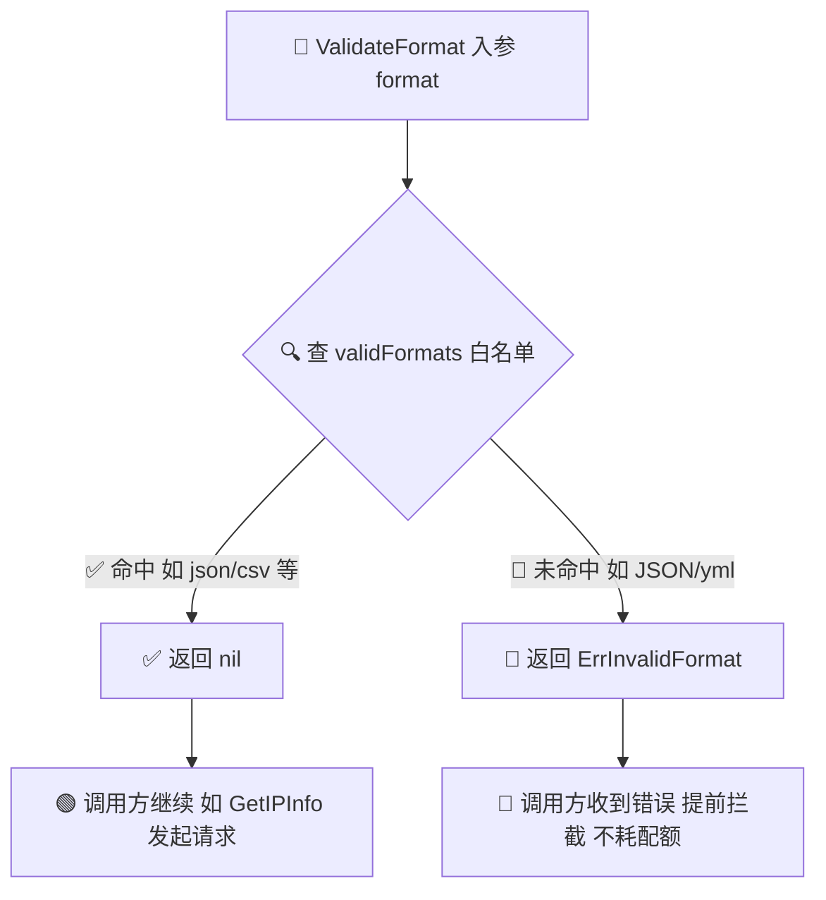

# 🗂️ validFormats

> 📦 变量 · 合法响应格式白名单，供 [`ValidateFormat`#-用法--示例) 用作成员判定依据。

## 📐 定义

```go
// validFormats contains all supported response formats.
var validFormats = map[Format]struct{}{
	FormatJSON:  {},
	FormatJSONP: {},
	FormatXML:   {},
	FormatCSV:   {},
	FormatYAML:  {},
}
```

| 属性 | 值 |
| --- | --- |
| 🏷️ 符号 | `ipapi.validFormats` |
| 📂 类别 | 变量（包级私有） |
| 🧩 类型 | `map[Format]struct{}` |
| 🔒 可见性 | 未导出（小写开头，仅包内可见） |
| 📜 定义位置 | `pkg/ipapi/client.go` |
| 🔢 条目数 | 5 |

## 💡 说明

`validFormats` 是一个 **集合（set）语义** 的映射，键为 SDK 支持的全部 [`Format`](../../api/models) 值，值为零字节占位 `struct{}{}`。它充当一份“合法格式白名单”，是 [`ValidateFormat`](../../api/methods) 函数的唯一判定依据：

- ✅ **白名单即真相来源**。`ValidateFormat(format)` 的全部逻辑就是一次 `map` 查表：若传入的字符串能在 `validFormats` 中找到对应键，则视为合法、返回 `nil`；否则返回 [`ErrInvalidFormat`](../errors/err-invalid-format)。因此，新增或下线某种响应格式时，只需增删本映射的一个条目即可，无需改动校验逻辑。
- 🧱 **`struct{}` 占位的妙处**。`struct{}{}` 是零字节类型，不占用额外内存，使用 `map[Format]struct{}` 而非 `map[Format]bool` 既能表达“存在性集合”的语义，又避免了每个条目携带一个无意义的布尔值，是 Go 中实现集合的惯用手法。
- 🔒 **未导出，仅作内部判定**。该变量以小写字母开头，包外不可直接访问；外部代码只能通过导出函数 `ValidateFormat` 间接使用它。这保证白名单的修改权始终收拢在 `ipapi` 包内，避免调用方误判或绕过校验。
- 🧩 **与预定义常量一一对应**。映射中的五个键正好对应 `FormatJSON`、`FormatJSONP`、`FormatXML`、`FormatCSV`、`FormatYAML` 五个导出常量，调用方应优先使用这些常量而非手写字符串字面量，从源头上规避大小写或拼写错误（如 `"JSON"`、`"yml"` 均不在白名单内，会被判为非法）。

> 💡 `validFormats` 本身不导出，文档化它是为了让你理解 `ValidateFormat` 的判定机制。日常开发请直接调用 `ipapi.ValidateFormat` 或使用预定义的 `Format*` 常量，无需、也无法直接访问该映射。

::: tip 🎨 一图抵千言
下图展示了 `ValidateFormat` 查 `validFormats` 白名单的判定流程：命中即放行返回 `nil`，未命中则返回 `ErrInvalidFormat`。
:::



## 💻 用法 / 示例

### 1️⃣ 通过 ValidateFormat 间接使用

`validFormats` 不能在包外直接引用，但 `ValidateFormat` 内部就是查这张表：

```go
package main

import (
	"fmt"

	"github.com/cyberspacesec/ipapi.co-skills/pkg/ipapi"
)

func main() {
	// ✅ 预定义常量必然在白名单内
	for _, f := range []ipapi.Format{
		ipapi.FormatJSON,
		ipapi.FormatJSONP,
		ipapi.FormatXML,
		ipapi.FormatCSV,
		ipapi.FormatYAML,
	} {
		if err := ipapi.ValidateFormat(string(f)); err != nil {
			fmt.Printf("意外：%q 校验失败：%v\n", f, err)
		} else {
			fmt.Printf("%q ✅ 合法格式\n", f)
		}
	}

	// 🚫 大小写或拼写错误不在白名单，触发 ErrInvalidFormat
	for _, bad := range []string{"JSON", "yml", "txt", "html", ""} {
		if err := ipapi.ValidateFormat(bad); err != nil {
			fmt.Printf("%q 🚫 %v\n", bad, err) // invalid response format
		}
	}
}
```

### 2️⃣ 调用查询方法前的隐式校验

`Client.GetIPInfo` 与 `Client.GetIPInfoRaw` 在发起请求前都会内部调用 `ValidateFormat`，即等价地查 `validFormats` 表。非法格式会在请求发出前就被拦截：

```go
ctx := context.Background()
client := ipapi.NewClient()

// ✅ 合法格式：请求正常发出
info, err := client.GetIPInfo(ctx, "8.8.8.8", string(ipapi.FormatJSON))

// 🚫 非法格式：未触网即返回 ErrInvalidFormat，不会消耗任何配额
_, err = client.GetIPInfo(ctx, "8.8.8.8", "yml")
if errors.Is(err, ipapi.ErrInvalidFormat) {
	fmt.Println("格式未通过白名单校验：", err)
}
```

### 3️⃣ 包内扩展白名单（仅示意）

如果你在 fork 中新增了一种响应格式，只需往 `validFormats` 增加一条，`ValidateFormat` 与全部查询方法即刻生效，无需改动校验逻辑：

```go
// 假设服务端新增了 "msgpack" 格式
const FormatMsgPack Format = "msgpack"

// 仅需在此追加一行，ValidateFormat 自动覆盖新格式
var validFormats = map[Format]struct{}{
	FormatJSON:    {},
	FormatJSONP:   {},
	FormatXML:     {},
	FormatCSV:     {},
	FormatYAML:    {},
	FormatMsgPack: {},
}
```

## 🔗 相关

- 🧱 [.](./../api/client](../../api/client) — `validFormats` 的定义所在文件，含 `Client` 配置与全部 `Format` 常量
- 📚 [.](./../api/methods](../../api/methods) — `ValidateFormat`、`GetIPInfo`、`GetIPInfoRaw` 等查询方法
- 🗂️ [.](./../api/models](../../api/models) — `Format` 类型定义与各 `Format*` 预定义常量
- ⚠️ [.](./../api/errors](../../api/errors) — `ErrInvalidFormat` 等错误一览
- 🎛️ [.](./../api/options](../../api/options) — 客户端可选配置项
- 🚫 [.](./errors/err-invalid-format](../errors/err-invalid-format) — 白名单校验失败时返回的哨兵错误

## ➡️ 下一步

- 📖 阅读 [.](./../api/methods](../../api/methods) 全面了解 `ValidateFormat` 的签名、返回值与各查询方法的前置校验流程
- 🗂️ 查阅 [.](./../api/models](../../api/models) 查看 `Format` 类型与全部预定义格式常量
- 🚀 跳转 [.](./../guide/formats](../../guide/formats) 了解 SDK 支持的全部响应格式与选型建议
- ⚠️ 参考 [.](./errors/err-invalid-format](../errors/err-invalid-format) 学习如何捕获并处理格式校验失败
