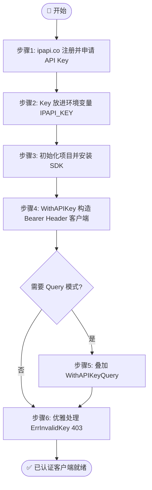
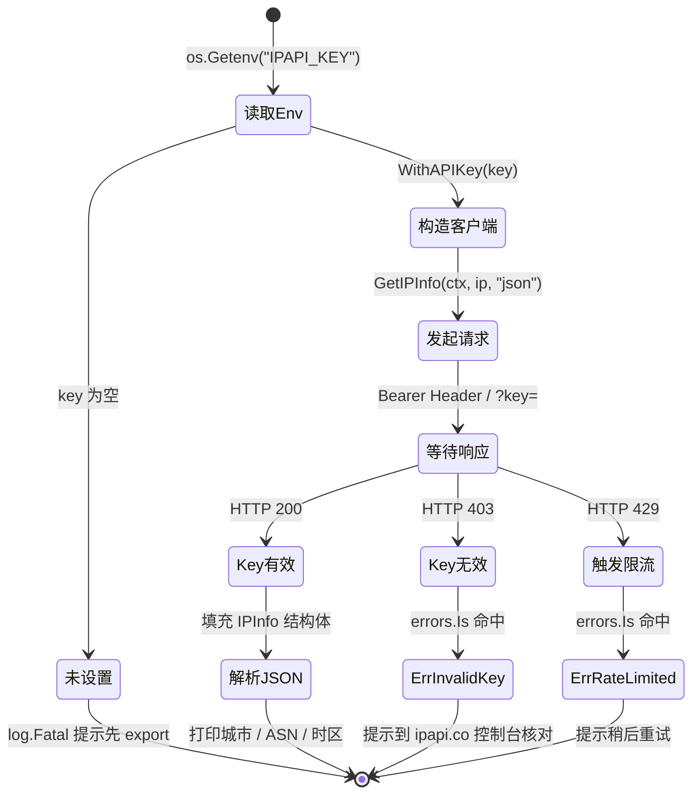

# 🎓 配置 API Key

> 手把手教你为 ipapi.co-skills SDK 配置 API Key：从申请、用环境变量安全注入，到 `WithAPIKey` 实战调用。

ipapi.co 提供免费额度，但**未认证请求配额低、共享 IP 池**。生产环境强烈建议申请并配置 API Key，以获得更高配额、独立计费与稳定可用性。本教程带你从零完成这一关键一步。

::: tip 🎨 一图抵千言
本教程的全流程：从注册申请 Key，到环境变量安全注入，再到 Bearer Header 默认认证与 403 错误识别。
:::



## 🎯 你将学到

- 📋 在 [ipapi.co](https://ipapi.co) 注册账号并申请 API Key
- 🔐 用环境变量安全注入 Key，避免硬编码进源码
- 🛠 使用 [`WithAPIKey`](../api/with-api-key) 选项构造已认证的客户端
- 🔀 了解 Bearer Header 与 `?key=` 查询参数两种认证模式
- ✅ 校验 Key 是否生效，并优雅处理 403 错误

## 📋 前置条件

在开始之前，请确认你已具备：

- 🐹 **Go 1.23.4 或更高版本**（运行 `go version` 检查）
- 🌐 可访问 `https://ipapi.co` 的网络
- ✅ 已完成 [快速开始](../guide/getting-started) 教程，能跑通一次基础查询
- 📦 已执行 `go get github.com/cyberspacesec/ipapi.co-skills` 安装 SDK

::: tip 💡 还没装好？
请先阅读 [安装指南](../guide/installation)，把 SDK 加入你的 `go.mod`。
:::

## 步骤 1：申请 API Key

1. 🌍 打开 [https://ipapi.co](https://ipapi.co)，点击右上角 **Sign up** 注册账号。
2. 📧 完成邮箱验证后登录控制台。
3. 🗝 在 **API Key** 页面复制你的 Key，形如 `abc123def456...`。
4. 💎 根据需要选择套餐（免费层即可起步）。

::: warning ⚠️ 保管好你的 Key
API Key 等同于密码。切勿截图发到群里、提交进 Git，或写进前端代码。下面我们会用环境变量安全地管理它。
:::

## 步骤 2：把 Key 放进环境变量

在终端中设置环境变量（推荐命名为 `IPAPI_KEY`）：

::: code-group

```bash [Linux / macOS 临时]
export IPAPI_KEY="你的真实Key"
```

```bash [Linux / macOS 永久]
# 追加到 ~/.bashrc 或 ~/.zshrc
echo 'export IPAPI_KEY="你的真实Key"' >> ~/.zshrc
source ~/.zshrc
```

```powershell [Windows PowerShell]
$env:IPAPI_KEY="你的真实Key"
# 永久：[Environment]::SetEnvironmentVariable("IPAPI_KEY","你的真实Key","User")
```

:::

::: danger 🔐 切勿硬编码
**不要**把 Key 直接写进 `main.go` 字符串字面量。一旦提交进版本库，泄露风险极高。用 `os.Getenv("IPAPI_KEY")` 在运行时读取，是更安全的做法。
:::

验证环境变量已生效：

```bash
echo $IPAPI_KEY   # 应输出你的 Key（macOS/Linux）
```

## 步骤 3：初始化项目并安装 SDK

如果你已有项目可跳过本步。否则新建：

```bash
mkdir apikey-demo && cd apikey-demo
go mod init apikey-demo
go get github.com/cyberspacesec/ipapi.co-skills
```

## 步骤 4：用 WithAPIKey 构造客户端

新建 `main.go`，使用 [`WithAPIKey`](../api/with-api-key) 选项把环境变量中的 Key 注入客户端。默认采用 **Bearer Header** 模式，Key 放在 `Authorization` 头中，不会出现在 URL 或日志里。

```go
package main

import (
	"context"
	"fmt"
	"log"
	"os"
	"time"

	"github.com/cyberspacesec/ipapi.co-skills/pkg/ipapi"
)

func main() {
	// 1. 从环境变量读取 Key
	key := os.Getenv("IPAPI_KEY")
	if key == "" {
		log.Fatal("环境变量 IPAPI_KEY 未设置，请先 export IPAPI_KEY=...")
	}

	// 2. 用 WithAPIKey 构造客户端（默认 Bearer Header 认证）
	client := ipapi.NewClient(
		ipapi.WithAPIKey(key),
	)

	// 3. 设置 5 秒超时上下文
	ctx, cancel := context.WithTimeout(context.Background(), 5*time.Second)
	defer cancel()

	// 4. 查询 Google DNS 的地理位置
	info, err := client.GetIPInfo(ctx, "8.8.8.8", "json")
	if err != nil {
		log.Fatalf("查询失败: %v", err)
	}

	fmt.Printf("🌐 IP: %s\n", info.IP)
	fmt.Printf("🏙 城市: %s, %s\n", info.City, info.CountryName)
	fmt.Printf("📡 ASN: %s (%s)\n", info.ASN, info.Org)
}
```

## 步骤 5：切换为 ?key= 查询参数模式（可选）

某些受限代理、CDN，或前端 JSONP 场景无法设置请求头时，可用 [`WithAPIKeyQuery`](../api/with-api-key-query) 切换为查询参数模式。

::: info 📋 两种认证模式速查
| 维度 | 📨 Bearer Header（默认） | 🔗 ?key= Query |
| --- | --- | --- |
| Key 位置 | `Authorization` 请求头 | URL 查询参数 |
| 出现在 URL | ❌ | ✅ |
| 出现在访问日志 | ❌ | ✅ |
| 安全性 | 🟢 高 | 🟡 较低 |
| 适用场景 | 后端服务（推荐） | JSONP / 网关按 URL 鉴权 |
:::

```go
package main

import (
	"context"
	"fmt"
	"log"
	"os"
	"time"

	"github.com/cyberspacesec/ipapi.co-skills/pkg/ipapi"
)

func main() {
	key := os.Getenv("IPAPI_KEY")
	if key == "" {
		log.Fatal("环境变量 IPAPI_KEY 未设置")
	}

	// WithAPIKeyQuery 切换为 ?key= 查询参数认证
	// 内部请求形如: https://ipapi.co/8.8.8.8/json/?key=你的Key
	client := ipapi.NewClient(
		ipapi.WithAPIKey(key),
		ipapi.WithAPIKeyQuery(),
	)

	ctx, cancel := context.WithTimeout(context.Background(), 5*time.Second)
	defer cancel()

	info, err := client.GetIPInfo(ctx, "8.8.8.8", "json")
	if err != nil {
		log.Fatalf("查询失败: %v", err)
	}

	fmt.Printf("🌐 IP: %s\n", info.IP)
	fmt.Printf("🏙 城市: %s, %s\n", info.City, info.CountryName)
}
```

::: warning ⚠️ 安全权衡
查询参数模式下，Key 会出现在 URL、访问日志、Referer 中。仅在 Header 不可用时使用，并优先选用受限/临时 Key。一般后端服务请坚持默认 Header 模式。
:::

## 步骤 6：优雅处理无效 Key（403）

当 Key 错误或失效时，服务端返回 403，SDK 会把它映射为 [`ErrInvalidKey`](../api/errors) 错误。用 `errors.Is` 精准识别：

::: details 🔧 Key 常见问题排查清单
| 现象 | 可能原因 | 排查建议 |
| --- | --- | --- |
| 一直返回 `ErrInvalidKey` | Key 拼写错误 / 多了空格 | 检查 `os.Getenv` 输出，去除首尾空格 |
| 之前能用，突然 403 | Key 被吊销 / 套餐到期 | 登录 ipapi.co 控制台核对状态 |
| 本地能跑，CI 报 403 | 环境变量未注入 CI | 在 CI secrets 里配置 `IPAPI_KEY` |
| 偶发 403 后又能用 | 触发了限流误判 | 检查是否同时返回 `ErrRateLimited` |
:::

```go
package main

import (
	"context"
	"errors"
	"fmt"
	"log"
	"os"
	"time"

	"github.com/cyberspacesec/ipapi.co-skills/pkg/ipapi"
)

func main() {
	key := os.Getenv("IPAPI_KEY")
	if key == "" {
		log.Fatal("环境变量 IPAPI_KEY 未设置")
	}

	client := ipapi.NewClient(
		ipapi.WithAPIKey(key),
	)

	ctx, cancel := context.WithTimeout(context.Background(), 5*time.Second)
	defer cancel()

	info, err := client.GetIPInfo(ctx, "8.8.8.8", "json")
	switch {
	case err == nil:
		fmt.Printf("🌐 IP: %s\n", info.IP)
		fmt.Printf("🏙 城市: %s, %s\n", info.City, info.CountryName)
	case errors.Is(err, ipapi.ErrInvalidKey):
		log.Fatalf("❌ API Key 无效或已失效，请到 ipapi.co 控制台核对: %v", err)
	case errors.Is(err, ipapi.ErrRateLimited):
		log.Fatalf("🚦 请求过于频繁，触发限流，请稍后重试: %v", err)
	default:
		log.Fatalf("查询失败: %v", err)
	}
}
```

::: tip 🎨 一图抵千言
换个视角：与其看申请步骤，不如看一次已认证请求的「Key 状态机」——从环境变量读取开始，Key 在整个请求生命周期里可能经历的每一种状态，以及它们对应的去向。
:::



## 📦 完整代码

下面是一个完整可运行的示例，整合了环境变量读取、Bearer Header 认证、超时上下文与 403 错误识别：

```go
package main

import (
	"context"
	"errors"
	"fmt"
	"log"
	"os"
	"time"

	"github.com/cyberspacesec/ipapi.co-skills/pkg/ipapi"
)

func main() {
	// 从环境变量安全读取 Key
	key := os.Getenv("IPAPI_KEY")
	if key == "" {
		log.Fatal("环境变量 IPAPI_KEY 未设置，请先 export IPAPI_KEY=你的Key")
	}

	// 构造已认证客户端（默认 Bearer Header 模式）
	client := ipapi.NewClient(
		ipapi.WithAPIKey(key),
	)

	// 设置 5 秒超时上下文
	ctx, cancel := context.WithTimeout(context.Background(), 5*time.Second)
	defer cancel()

	// 查询 Google DNS 的地理位置
	info, err := client.GetIPInfo(ctx, "8.8.8.8", "json")
	switch {
	case err == nil:
		fmt.Printf("🌐 IP: %s\n", info.IP)
		fmt.Printf("🏙 城市: %s, %s\n", info.City, info.CountryName)
		fmt.Printf("🧭 经纬度: %s\n", info.LatLong)
		fmt.Printf("⏰ 时区: %s (UTC%s)\n", info.Timezone, info.UTCOffset)
		fmt.Printf("📡 ASN: %s (%s)\n", info.ASN, info.Org)
	case errors.Is(err, ipapi.ErrInvalidKey):
		log.Fatalf("❌ API Key 无效或已失效，请到 ipapi.co 控制台核对: %v", err)
	case errors.Is(err, ipapi.ErrRateLimited):
		log.Fatalf("🚦 请求过于频繁，触发限流: %v", err)
	default:
		log.Fatalf("查询失败: %v", err)
	}
}
```

源码亦可见仓库示例：[examples/advanced_usage](https://github.com/cyberspacesec/ipapi.co-skills/blob/main/examples/advanced_usage/main.go)。

## 🖥 运行结果

确保已 `export IPAPI_KEY=...`，然后执行：

```bash
go run main.go
```

预期输出类似：

```
🌐 IP: 8.8.8.8
🏙 城市: Mountain View, United States
🧭 经纬度: 37.4056,-122.0775
⏰ 时区: America/Los_Angeles (UTC-07:00)
📡 ASN: AS15169 (Google LLC)
```

若 Key 无效，输出会落在 `ErrInvalidKey` 分支：

```
❌ API Key 无效或已失效，请到 ipapi.co 控制台核对: invalid API key: check API key
```

## ✅ 小结

- 📋 在 [ipapi.co](https://ipapi.co) 注册并复制 API Key。
- 🔐 用环境变量 `IPAPI_KEY` 保管 Key，**绝不**硬编码进源码。
- 🛠 [`WithAPIKey`](../api/with-api-key) 把 Key 注入客户端，默认走更安全的 Bearer Header。
- 🔀 需要 `?key=` 模式时叠加 [`WithAPIKeyQuery`](../api/with-api-key-query)（注意日志泄露风险）。
- 🛡 用 `errors.Is(err, ipapi.ErrInvalidKey)` 精准识别 403，提示用户核对 Key。

::: tip 💡 不认证也能用
省略 `WithAPIKey` 即可匿名调用，享受免费额度。但配额低且共享 IP 池，仅适合开发调试。
:::

## 🔜 下一步

- 📖 深入理解 [认证机制](../guide/auth-concept) 与两种模式对比
- 📚 浏览 API 参考：[`WithAPIKey`](../api/with-api-key)、[`WithAPIKeyQuery`](../api/with-api-key-query)、[错误类型](../api/errors)
- 🧪 跑实战示例 [带 API Key 认证](../examples/with-api-key)
- 🍳 学密钥管理实战 [Cookbook: yaml-config](../cookbook/yaml-config)
- ✅ 参考 [密钥管理最佳实践](../best-practices/secret-management)
- 🚀 继续下一篇教程：[查询指定 IP 的地理位置](./hello-ipapi)
