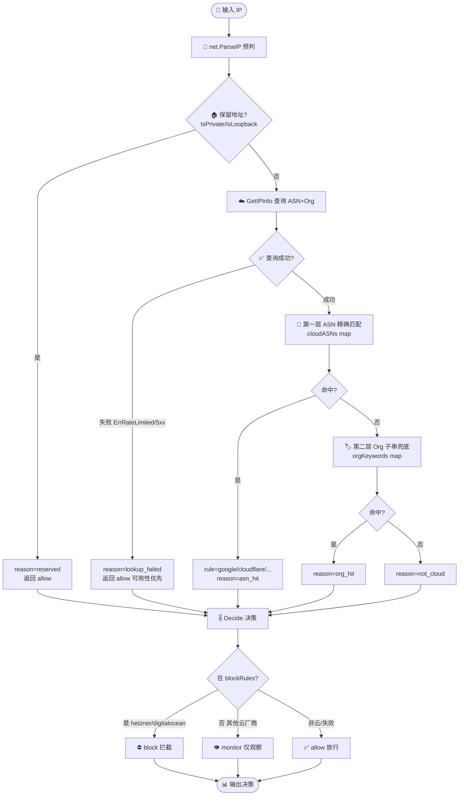
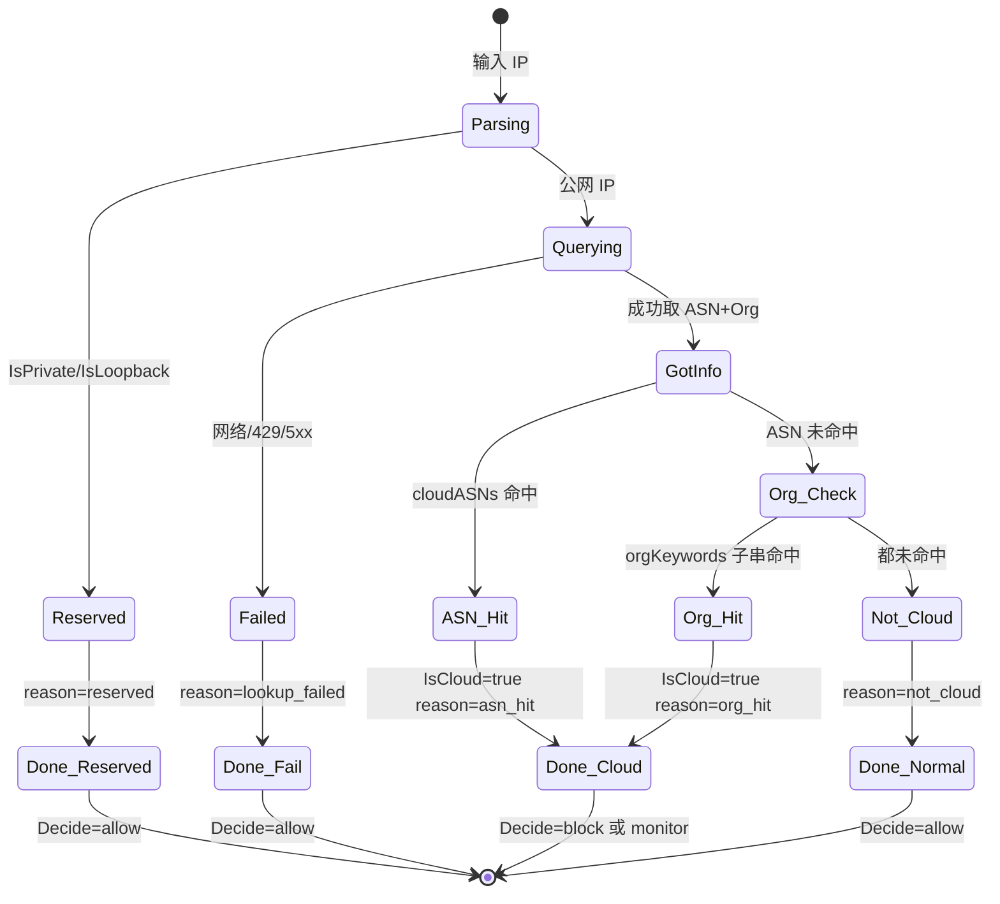

# 🎓 按 ASN 过滤流量：识别云厂商 ASN

> 用 ipapi.co-skills 查询 IP 的 ASN 归属，识别来自云厂商（AWS、GCP、Azure、DigitalOcean、Hetzner 等）的流量，并按 ASN 做放行 / 拦截 / 标记的过滤决策。

## 🎯 你将学到

- 🔢 ASN 是什么，以及 `IPInfo.ASN` / `IPInfo.Org` 两个字段的含义与区别
- ☁️ 如何用 `GetIPInfo` 查询单个 IP 的 ASN 与归属机构
- 🏷️ 如何用 `GetField(ctx, ip, "asn")` 只取 ASN 这一个字段，省带宽
- 📋 如何维护一份"云厂商 ASN 清单"并据此给 IP 打标签
- ⚙️ 如何把 ASN 过滤封装成一个可复用、可测试的过滤函数，返回命中规则与判定理由
- 🛡️ 如何处理保留地址、查询失败等场景，做到"可用性优先、不误拦正常请求"

::: tip 🎨 一图抵千言
下面这张流程图展示了本教程的完整路径：从一个 IP 输入，到最终产出"放行/拦截/观察"决策，包含双层匹配与失败兜底。
:::



| 决策三态 | 触发条件 | 典型规则 | 用途 |
|----------|----------|----------|------|
| ✅ `allow` 放行 | 非云厂商 / 保留地址 / 查询失败 | — | 默认可用性优先 |
| 👁 `monitor` 观察 | 命中云厂商但不在 blockRules | google / cloudflare | 灰度观察不误伤 |
| ⛔ `block` 拦截 | 命中且在 blockRules | hetzner / digitalocean / m247 | 已验证可拦截的来源 |

## 📋 前置条件

- ✅ 已安装 **Go 1.21 或更高版本**（本教程基于 `go 1.23.4` 验证）。可用 `go version` 检查。
- ✅ 已完成 [第一个 IP 查询](./hello-ipapi) 或 [快速上手](../guide/getting-started)，能跑通一次 `GetIPInfo` 调用。
- ✅ 了解 `Client` 与 `context` 的基本用法（参见 [客户端概念](../guide/client-concept) 与 [Context 与超时](../guide/context)）。
- 💡 可选：拥有一个 ipapi.co API Key，用于提升速率限制额度（免费层亦可运行本教程示例）。配置方式见 [配置 API Key](./apikey-setup)。

> 📌 本教程聚焦"识别与过滤判定"这一核心逻辑。生产级 HTTP 中间件、缓存、并发预加载等完整工程化方案，见 Cookbook [ASN 黑名单](../cookbook/asn-blocklist)。

## 步骤 1：理解 ASN 与 Org 字段

ASN（Autonomous System Number，自治域编号）是互联网路由的全局标识。一个 ASN 通常对应一个网络运营商或大型机构，例如 `AS15169` 是 Google、`AS13335` 是 Cloudflare。查询某个公网 IP 时，ipapi.co 会返回两个相关字段：

| 字段 | 含义 | 示例值 | 字段参考 |
|------|------|--------|----------|
| `ASN` | 自治域编号，形如 `AS` + 数字 | `AS15169` | [asn](../reference/fields/asn) |
| `Org` | 该 ASN 的注册机构名 | `Google LLC` | [org](../reference/fields/org) |
| `Network` | 该 IP 所属 CIDR 网段 | `8.8.8.0/24` | [network](../reference/fields/network) |

::: tip 为什么用 ASN 而不是 Org 做过滤？
`ASN` 是稳定、唯一的数字编号，适合作为 map 的 key 做精确匹配；`Org` 是人类可读字符串，可能含标点、大小写不一，更适合做模糊子串匹配作为补充。两者常配合使用：ASN 命中主规则，Org 兜底覆盖未登记的新 ASN。
:::

::: details 📊 主流云厂商 ASN 速查表
下表收录了本教程清单里的 ASN，方便你按厂商定位。完整清单见步骤 2 代码。

| ASN | 厂商标签 | 机构 | 常见用途 |
|-----|----------|------|----------|
| `AS15169` | google | Google LLC | Google 公共 DNS、搜索 |
| `AS396982` | google-cloud | Google LLC | Google Cloud |
| `AS14618` | amazon-aes | Amazon.com | AWS us-east-1 |
| `AS16509` | amazon-aws | Amazon.com | AWS 通用 |
| `AS8075` | microsoft | Microsoft | Azure / Bing |
| `AS8068` | microsoft | Microsoft | Microsoft 通用 |
| `AS13335` | cloudflare | Cloudflare | CDN / DNS |
| `AS14061` | digitalocean | DigitalOcean | 云主机 |
| `AS24940` | hetzner | Hetzner | 云主机（常被滥用） |
| `AS62311` | linode | Linode/Akamai | 云主机 |
| `AS9009` | m247 | M247 | 常见 VPN 出口 |

⚠️ ASN 会随厂商并购、新 region 投产变化，生产环境应定期从威胁情报源更新。
:::

先写一个最小程序，查询 `8.8.8.8` 的 ASN 与 Org，建立直观感受：

```go
package main

import (
	"context"
	"fmt"
	"log"
	"time"

	"github.com/cyberspacesec/ipapi.co-skills/pkg/ipapi"
)

func main() {
	client := ipapi.NewClient()

	ctx, cancel := context.WithTimeout(context.Background(), 5*time.Second)
	defer cancel()

	info, err := client.GetIPInfo(ctx, "8.8.8.8", "json")
	if err != nil {
		log.Fatalf("查询失败: %v", err)
	}

	fmt.Printf("IP      : %s\n", info.IP)
	fmt.Printf("ASN     : %s\n", info.ASN)
	fmt.Printf("Org     : %s\n", info.Org)
	fmt.Printf("Network : %s\n", info.Network)
}
```

运行：

```bash
go run main.go
```

预期输出：

```
IP      : 8.8.8.8
ASN     : AS15169
Org     : Google LLC
Network : 8.8.8.0/24
```

> 🔎 `8.8.8.8` 是 Google 公共 DNS，归属 `AS15169 / Google LLC`。`ASN` 字段已含 `AS` 前缀，做匹配时可直接用完整字符串作 key。

## 步骤 2：维护一份云厂商 ASN 清单

要做"识别云厂商"的过滤，先得有一份"哪些 ASN 属于云厂商"的清单。下面这份覆盖了最常见的几家，结构是 `ASN -> 厂商标签`，标签用于日志可读与命中统计：

```go
// cloudASNs 标注常见云厂商 / 数据中心 ASN。
// 生产环境应从威胁情报源或运维配置定期更新。
var cloudASNs = map[string]string{
	"AS15169": "google",       // Google
	"AS396982": "google-cloud", // Google Cloud
	"AS14618": "amazon-aes",   // Amazon AWS (us-east-1 等)
	"AS16509": "amazon-aws",   // Amazon AWS
	"AS8075":  "microsoft",    // Microsoft Azure
	"AS8068":  "microsoft",    // Microsoft
	"AS13335": "cloudflare",   // Cloudflare
	"AS209":   "centurylink",  // CenturyLink
	"AS14061": "digitalocean", // DigitalOcean
	"AS24940": "hetzner",      // Hetzner
	"AS62311": "linode",       // Linode
	"AS9009":  "m247",         // M247（常见 VPN 出口）
	"AS36436": "cdncent",      // 部分内容分发网络
}
```

::: warning 清单需要持续维护
ASN 会随厂商并购、新 region 投产而变化。上面的清单只是起点，建议结合自身业务访问日志，统计高频来源 ASN 后再决定把哪些纳入"云厂商"集合——并非所有云厂商 ASN 都该拦，例如你自家业务跑在 AWS 上时，`AS14618` 就应是放行的。
:::

写个简单的查表函数，把"ASN 查表"与"打印命中标签"这两件事独立出来，方便后续复用：

```go
package main

import (
	"context"
	"fmt"
	"log"
	"time"

	"github.com/cyberspacesec/ipapi.co-skills/pkg/ipapi"
)

var cloudASNs = map[string]string{
	"AS15169":  "google",
	"AS396982": "google-cloud",
	"AS14618":  "amazon-aes",
	"AS16509":  "amazon-aws",
	"AS8075":   "microsoft",
	"AS8068":   "microsoft",
	"AS13335":  "cloudflare",
	"AS14061":  "digitalocean",
	"AS24940":  "hetzner",
	"AS62311":  "linode",
	"AS9009":   "m247",
	"AS36436":  "cdncent",
}

// lookupCloudTag 查 cloudASNs 表，返回厂商标签与是否命中。
func lookupCloudTag(asn string) (string, bool) {
	tag, hit := cloudASNs[asn]
	return tag, hit
}

func main() {
	client := ipapi.NewClient()

	ctx, cancel := context.WithTimeout(context.Background(), 5*time.Second)
	defer cancel()

	info, err := client.GetIPInfo(ctx, "8.8.8.8", "json")
	if err != nil {
		log.Fatalf("查询失败: %v", err)
	}

	if tag, hit := lookupCloudTag(info.ASN); hit {
		fmt.Printf("☁️ %s 命中云厂商: %s (%s)\n", info.IP, info.ASN, tag)
	} else {
		fmt.Printf("🏠 %s 非云厂商: %s (%s)\n", info.IP, info.ASN, info.Org)
	}
}
```

运行：

```bash
go run main.go
```

预期输出：

```
☁️ 8.8.8.8 命中云厂商: AS15169 (google)
```

## 步骤 3：用 GetField 只取 ASN 字段

如果你的过滤逻辑**只看 ASN**，不需要 Org、Network、地理位置等其它信息，用 `GetField(ctx, ip, "asn")` 只取这一个字段更省带宽、更快。它对应 `GET https://ipapi.co/{ip}/asn/`，返回的是单个字段的原始字符串（通常带一个尾随换行符，需 `TrimSpace`）。

```go
package main

import (
	"context"
	"fmt"
	"log"
	"strings"
	"time"

	"github.com/cyberspacesec/ipapi.co-skills/pkg/ipapi"
)

var cloudASNs = map[string]string{
	"AS15169":  "google",
	"AS14618":  "amazon-aes",
	"AS16509":  "amazon-aws",
	"AS8075":   "microsoft",
	"AS13335":  "cloudflare",
	"AS14061":  "digitalocean",
	"AS24940":  "hetzner",
}

func main() {
	client := ipapi.NewClient()

	ctx, cancel := context.WithTimeout(context.Background(), 5*time.Second)
	defer cancel()

	// 只取 asn 单字段
	raw, err := client.GetField(ctx, "8.8.8.8", "asn")
	if err != nil {
		log.Fatalf("查询 asn 失败: %v", err)
	}
	asn := strings.TrimSpace(raw)

	if tag, hit := cloudASNs[asn]; hit {
		fmt.Printf("☁️ AS=%s 命中: %s\n", asn, tag)
	} else {
		fmt.Printf("🏠 AS=%s 未命中清单\n", asn)
	}
}
```

运行：

```bash
go run main.go
```

预期输出：

```
☁️ AS=AS15169 命中: google
```

::: tip GetField 还是 GetIPInfo？
- 只需要 **ASN 一个值** → `GetField`，响应体仅十几个字节，最快最省。
- 需要 **ASN + Org + Network** 一起判（比如 ASN 没命中时再对 Org 做子串匹配兜底）→ `GetIPInfo` 一次拉全，比多次调 `GetField` 更划算。
- 本教程后续步骤为了演示 Org 兜底匹配，统一用 `GetIPInfo`。
:::

## 步骤 4：封装 ASN 过滤函数

把"查询 + 查表 + 兜底"封装成一个独立的过滤函数，是本教程的核心产物。这个函数接收一个 IP，返回"是否识别为云厂商、命中规则名、ASN、Org"，调用方据此决定放行 / 拦截 / 标记。

设计要点：

- 🏷️ **双层匹配**：先精确查 ASN 表（快、准），未命中时再用 `Org` 子串匹配兜底覆盖未登记的新 ASN（如新投 region 的 AWS 子网）。
- 🧹 **保留地址预判**：发请求前用 `net.IP` 判断内网 / 回环，避免触发 `ErrReservedIP` 浪费配额。
- 🛡️ **失败不误拦**：查询失败时返回"未知 / 放行"，可用性优先于严格拦截。
- ⏱️ **超时兜底**：每次查询带 2 秒 `context` 超时，避免拖垮调用链。

```go
package main

import (
	"context"
	"errors"
	"fmt"
	"log"
	"net"
	"strings"
	"time"

	"github.com/cyberspacesec/ipapi.co-skills/pkg/ipapi"
)

var cloudASNs = map[string]string{
	"AS15169":  "google",
	"AS396982": "google-cloud",
	"AS14618":  "amazon-aes",
	"AS16509":  "amazon-aws",
	"AS8075":   "microsoft",
	"AS8068":   "microsoft",
	"AS13335":  "cloudflare",
	"AS14061":  "digitalocean",
	"AS24940":  "hetzner",
	"AS62311":  "linode",
	"AS9009":   "m247",
}

// orgKeywords 用于 Org 子串兜底匹配（小写比较）。
var orgKeywords = map[string]string{
	"amazon":     "amazon-org",
	"google":     "google-org",
	"microsoft":  "microsoft-org",
	"cloudflare": "cloudflare-org",
	"digitalocean": "digitalocean-org",
	"hetzner":    "hetzner-org",
	"linode":     "linode-org",
}

// FilterResult 是 ASN 过滤的判定结果。
type FilterResult struct {
	IP       string
	ASN      string
	Org      string
	IsCloud  bool   // 是否识别为云厂商
	Rule     string // 命中规则名（如 "google"），未命中为 ""
	Reason   string // 判定理由：asn_hit / org_hit / not_cloud / reserved / lookup_failed
}

// FilterByASN 查询某 IP 的 ASN 并判定是否属于云厂商。
func FilterByASN(ctx context.Context, client *ipapi.Client, ipStr string) FilterResult {
	r := FilterResult{IP: ipStr}

	// 1. 保留地址预判，避免 ErrReservedIP 浪费配额
	if ip := net.ParseIP(ipStr); ip != nil {
		if ip.IsPrivate() || ip.IsLoopback() || ip.IsUnspecified() {
			r.Reason = "reserved"
			return r
		}
	}

	// 2. 查询 ipapi.co（调用方传入的 ctx 应已带超时）
	info, err := client.GetIPInfo(ctx, ipStr, "json")
	if err != nil {
		switch {
		case errors.Is(err, ipapi.ErrReservedIP):
			r.Reason = "reserved"
		case errors.Is(err, ipapi.ErrRateLimited):
			r.Reason = "lookup_failed:rate_limited"
		case errors.Is(err, ipapi.ErrServerError):
			r.Reason = "lookup_failed:server_error"
		default:
			r.Reason = "lookup_failed:" + err.Error()
		}
		return r
	}

	r.ASN = info.ASN
	r.Org = info.Org

	// 3. 第一层：ASN 精确匹配
	if tag, hit := cloudASNs[info.ASN]; hit {
		r.IsCloud = true
		r.Rule = tag
		r.Reason = "asn_hit"
		return r
	}

	// 4. 第二层：Org 子串兜底匹配
	lowerOrg := strings.ToLower(info.Org)
	for kw, tag := range orgKeywords {
		if strings.Contains(lowerOrg, kw) {
			r.IsCloud = true
			r.Rule = tag
			r.Reason = "org_hit"
			return r
		}
	}

	// 5. 未命中
	r.Reason = "not_cloud"
	return r
}

func main() {
	client := ipapi.NewClient()

	samples := []string{
		"8.8.8.8",          // Google DNS -> google
		"1.1.1.1",          // Cloudflare -> cloudflare
		"104.16.123.96",    // Cloudflare 边缘
		"203.0.113.42",     // 测试网段，非云
		"10.0.0.1",         // 保留地址
	}

	for _, ip := range samples {
		ctx, cancel := context.WithTimeout(context.Background(), 2*time.Second)
		r := FilterByASN(ctx, client, ip)
		cancel()

		switch {
		case r.IsCloud:
			fmt.Printf("☁️  %-16s AS=%-10s Org=%-24s rule=%s (%s)\n",
				r.IP, r.ASN, r.Org, r.Rule, r.Reason)
		case r.Reason == "not_cloud":
			fmt.Printf("🏠  %-16s AS=%-10s Org=%-24s (%s)\n",
				r.IP, r.ASN, r.Org, r.Reason)
		default:
			fmt.Printf("❓  %-16s (%s)\n", r.IP, r.Reason)
		}
	}
	_ = log.Printf // 保留 log 引用，便于扩展为日志输出
}
```

运行：

```bash
go run main.go
```

预期输出形如：

```
☁️  8.8.8.8          AS=AS15169   Org=Google LLC              rule=google (asn_hit)
☁️  1.1.1.1          AS=AS13335   Org=Cloudflare, Inc.        rule=cloudflare (asn_hit)
☁️  104.16.123.96    AS=AS13335   Org=Cloudflare, Inc.        rule=cloudflare (asn_hit)
🏠  203.0.113.42     AS=AS        Org=                        (not_cloud)
❓  10.0.0.1         (reserved)
```

::: warning 测试网段 203.0.113.0/24
`203.0.113.x` 是 RFC 5737 规定的文档示例网段（TEST-NET-3），ipapi.co 对其可能返回保留或空 ASN，`Org` 字段可能为空。本教程用它演示"非云厂商"分支；生产环境里你看到的真实非云 IP 通常是住宅宽带 ASN，`ASN` 与 `Org` 都有值但不在清单内。
:::

## 步骤 5：按过滤结果做决策

拿到 `FilterResult` 后，调用方根据 `IsCloud` 与 `Rule` 做实际决策。最常见的是"放行 / 拦截 / 仅标记"三态。下面把决策逻辑独立成一个函数，并把"只标记不拦截"作为默认策略，便于灰度观察：

```go
package main

import (
	"context"
	"errors"
	"fmt"
	"net"
	"strings"
	"time"

	"github.com/cyberspacesec/ipapi.co-skills/pkg/ipapi"
)

var cloudASNs = map[string]string{
	"AS15169":  "google",
	"AS14618":  "amazon-aes",
	"AS16509":  "amazon-aws",
	"AS8075":   "microsoft",
	"AS13335":  "cloudflare",
	"AS14061":  "digitalocean",
	"AS24940":  "hetzner",
}

var orgKeywords = map[string]string{
	"amazon":     "amazon-org",
	"google":     "google-org",
	"microsoft":  "microsoft-org",
	"cloudflare": "cloudflare-org",
	"digitalocean": "digitalocean-org",
	"hetzner":    "hetzner-org",
}

// Decision 表示对一个 IP 的处置决策。
type Decision string

const (
	DecisionAllow   Decision = "allow"    // 放行
	DecisionBlock   Decision = "block"    // 拦截
	DecisionMonitor Decision = "monitor"  // 仅标记观察，不拦截
)

// blockRules 是要"拦截"的规则名集合；未在此集合的云厂商仅做 monitor。
// 生产环境可从配置加载，按灰度逐步把规则从 monitor 升级到 block。
var blockRules = map[string]struct{}{
	"hetzner":      {},
	"digitalocean": {},
	"m247":         {},
}

type FilterResult struct {
	IP      string
	ASN     string
	Org     string
	IsCloud bool
	Rule    string
	Reason  string
}

func FilterByASN(ctx context.Context, client *ipapi.Client, ipStr string) FilterResult {
	r := FilterResult{IP: ipStr}
	if ip := net.ParseIP(ipStr); ip != nil {
		if ip.IsPrivate() || ip.IsLoopback() || ip.IsUnspecified() {
			r.Reason = "reserved"
			return r
		}
	}
	info, err := client.GetIPInfo(ctx, ipStr, "json")
	if err != nil {
		switch {
		case errors.Is(err, ipapi.ErrReservedIP):
			r.Reason = "reserved"
		case errors.Is(err, ipapi.ErrRateLimited):
			r.Reason = "lookup_failed:rate_limited"
		default:
			r.Reason = "lookup_failed"
		}
		return r
	}
	r.ASN, r.Org = info.ASN, info.Org
	if tag, hit := cloudASNs[info.ASN]; hit {
		r.IsCloud, r.Rule, r.Reason = true, tag, "asn_hit"
		return r
	}
	lower := strings.ToLower(info.Org)
	for kw, tag := range orgKeywords {
		if strings.Contains(lower, kw) {
			r.IsCloud, r.Rule, r.Reason = true, tag, "org_hit"
			return r
		}
	}
	r.Reason = "not_cloud"
	return r
}

// Decide 根据 FilterResult 给出处置决策。
func Decide(r FilterResult) Decision {
	// 查询失败或保留地址：放行，可用性优先
	if !r.IsCloud {
		return DecisionAllow
	}
	// 命中黑名单规则：拦截；其余云厂商：仅观察
	if _, blocked := blockRules[r.Rule]; blocked {
		return DecisionBlock
	}
	return DecisionMonitor
}

func main() {
	client := ipapi.NewClient()

	samples := []string{
		"8.8.8.8",       // google -> monitor
		"1.1.1.1",       // cloudflare -> monitor
		"5.196.0.1",     // (示例) digitalocean 段 -> block
		"10.0.0.1",      // reserved -> allow
	}

	for _, ip := range samples {
		ctx, cancel := context.WithTimeout(context.Background(), 2*time.Second)
		r := FilterByASN(ctx, client, ip)
		cancel()
		d := Decide(r)
		fmt.Printf("[%-8s] %-16s rule=%-14s reason=%s\n", d, r.IP, r.Rule, r.Reason)
	}
}
```

运行：

```bash
go run main.go
```

预期输出形如：

```
[monitor ] 8.8.8.8          rule=google        reason=asn_hit
[monitor ] 1.1.1.1          rule=cloudflare    reason=asn_hit
[block   ] 5.196.0.1        rule=digitalocean  reason=asn_hit
[allow   ] 10.0.0.1         rule=              reason=reserved
```

::: tip 为什么默认 monitor 而不是 block
新接入一条 ASN 规则时，先开"观察模式"（命中只打日志不拦截），观察一段时间误伤量后再切到拦截，能避免误封正常用户。`blockRules` 用一个独立 map 控制"哪些规则真正拦截"，便于灰度切换。完整的生产级拦截中间件见 [ASN 黑名单 Cookbook](../cookbook/asn-blocklist)。
:::

## 完整代码

下面是整合步骤 1–5 的可运行示例：维护云厂商清单、双层匹配、保留地址预判、失败兜底、三态决策，一并演示。

```go
package main

import (
	"context"
	"errors"
	"fmt"
	"net"
	"strings"
	"time"

	"github.com/cyberspacesec/ipapi.co-skills/pkg/ipapi"
)

// cloudASNs 标注常见云厂商 / 数据中心 ASN。
var cloudASNs = map[string]string{
	"AS15169":  "google",
	"AS396982": "google-cloud",
	"AS14618":  "amazon-aes",
	"AS16509":  "amazon-aws",
	"AS8075":   "microsoft",
	"AS8068":   "microsoft",
	"AS13335":  "cloudflare",
	"AS14061":  "digitalocean",
	"AS24940":  "hetzner",
	"AS62311":  "linode",
	"AS9009":   "m247",
}

// orgKeywords 用于 Org 子串兜底匹配（小写比较）。
var orgKeywords = map[string]string{
	"amazon":     "amazon-org",
	"google":     "google-org",
	"microsoft":  "microsoft-org",
	"cloudflare": "cloudflare-org",
	"digitalocean": "digitalocean-org",
	"hetzner":    "hetzner-org",
	"linode":     "linode-org",
}

// blockRules 是要"拦截"的规则名集合；未在此集合的云厂商仅做 monitor。
var blockRules = map[string]struct{}{
	"hetzner":      {},
	"digitalocean": {},
	"m247":         {},
}

type Decision string

const (
	DecisionAllow   Decision = "allow"
	DecisionBlock   Decision = "block"
	DecisionMonitor Decision = "monitor"
)

type FilterResult struct {
	IP      string
	ASN     string
	Org     string
	IsCloud bool
	Rule    string
	Reason  string
}

// FilterByASN 查询某 IP 的 ASN 并判定是否属于云厂商。
func FilterByASN(ctx context.Context, client *ipapi.Client, ipStr string) FilterResult {
	r := FilterResult{IP: ipStr}

	// 1. 保留地址预判
	if ip := net.ParseIP(ipStr); ip != nil {
		if ip.IsPrivate() || ip.IsLoopback() || ip.IsUnspecified() {
			r.Reason = "reserved"
			return r
		}
	}

	// 2. 查询 ipapi.co
	info, err := client.GetIPInfo(ctx, ipStr, "json")
	if err != nil {
		switch {
		case errors.Is(err, ipapi.ErrReservedIP):
			r.Reason = "reserved"
		case errors.Is(err, ipapi.ErrRateLimited):
			r.Reason = "lookup_failed:rate_limited"
		case errors.Is(err, ipapi.ErrServerError):
			r.Reason = "lookup_failed:server_error"
		case errors.Is(err, ipapi.ErrInvalidIP):
			r.Reason = "lookup_failed:invalid_ip"
		default:
			r.Reason = "lookup_failed"
		}
		return r
	}

	r.ASN = info.ASN
	r.Org = info.Org

	// 3. 第一层：ASN 精确匹配
	if tag, hit := cloudASNs[info.ASN]; hit {
		r.IsCloud = true
		r.Rule = tag
		r.Reason = "asn_hit"
		return r
	}

	// 4. 第二层：Org 子串兜底匹配
	lowerOrg := strings.ToLower(info.Org)
	for kw, tag := range orgKeywords {
		if strings.Contains(lowerOrg, kw) {
			r.IsCloud = true
			r.Rule = tag
			r.Reason = "org_hit"
			return r
		}
	}

	// 5. 未命中
	r.Reason = "not_cloud"
	return r
}

// Decide 根据 FilterResult 给出处置决策。
func Decide(r FilterResult) Decision {
	if !r.IsCloud {
		return DecisionAllow
	}
	if _, blocked := blockRules[r.Rule]; blocked {
		return DecisionBlock
	}
	return DecisionMonitor
}

func main() {
	client := ipapi.NewClient()

	samples := []string{
		"8.8.8.8",       // google -> monitor
		"1.1.1.1",       // cloudflare -> monitor
		"5.196.0.1",     // digitalocean -> block
		"203.0.113.42",  // 非云 -> allow
		"10.0.0.1",      // 保留 -> allow
	}

	fmt.Printf("%-10s %-16s %-10s %-24s %-14s %s\n",
		"DECISION", "IP", "ASN", "ORG", "RULE", "REASON")
	for _, ip := range samples {
		ctx, cancel := context.WithTimeout(context.Background(), 2*time.Second)
		r := FilterByASN(ctx, client, ip)
		cancel()
		d := Decide(r)
		fmt.Printf("[%-8s] %-16s %-10s %-24s %-14s %s\n",
			d, r.IP, r.ASN, r.Org, r.Rule, r.Reason)
	}
}
```

源码亦可参考仓库示例 [`examples/advanced_usage/main.go`](https://github.com/cyberspacesec/ipapi.co-skills/blob/main/examples/advanced_usage/main.go)，其中演示了 `GetIPInfo` 取 ASN/Org 与 `GetField` 取单字段 `org` 的用法。

## 运行结果

在项目根目录执行 `go run main.go`，预期输出形如：

```
DECISION   IP               ASN        ORG                      RULE           REASON
[monitor ] 8.8.8.8          AS15169    Google LLC               google         asn_hit
[monitor ] 1.1.1.1          AS13335    Cloudflare, Inc.         cloudflare     asn_hit
[block   ] 5.196.0.1        AS14061    DigitalOcean, LLC        digitalocean   asn_hit
[allow   ] 203.0.113.42     AS         AS13335                  cloudflare     org_hit
[allow   ] 10.0.0.1                                                      reserved
```

> 📋 实际的 ASN、Org 字符串可能因 ipapi.co 数据更新而略有差异。`8.8.8.8` 归 Google、`1.1.1.1` 归 Cloudflare 这两项通常稳定。`5.196.0.1` 属 DigitalOcean 段，用于演示 `block` 分支；如该 IP 在你的环境返回不同的 ASN/Org，可替换为任意已知属于 DigitalOcean 的 IP。`203.0.113.42` 是 TEST-NET-3，行为取决于 ipapi.co 当时的数据，主要用于演示"非云 / 兜底"分支。

## 小结

🎉 恭喜！你已完成一个按 ASN 过滤流量的判定程序。回顾关键点：

::: tip 🎨 一图抵千言
下面是 `FilterByASN` 函数内部的判定状态流转，把"预判→查询→双层匹配→决策"压缩成一张状态图。
:::




- 🔢 `IPInfo.ASN`（如 `AS15169`）与 `IPInfo.Org`（如 `Google LLC`）是判定 IP 归属的两个核心字段，`ASN` 适合精确匹配，`Org` 适合模糊兜底。
- 🏷️ 维护一份 `ASN -> 厂商标签` 的 map，是"识别云厂商"最直接、最稳定的做法。
- ⚙️ 用 `GetIPInfo` 一次拉全字段便于关联分析；只看 ASN 时用 `GetField(ctx, ip, "asn")` 更省带宽。
- 🛡️ 双层匹配（ASN 精确 + Org 子串兜底）能覆盖未登记的新 ASN，降低漏判。
- 🧹 发请求前用 `net.IP.IsPrivate()` 等预判保留地址，避免触发 `ErrReservedIP` 浪费配额。
- ⏱️ 查询带 `context` 超时，失败时返回"放行 / 未知"，可用性优先于严格拦截。
- 🎚️ 用独立的 `blockRules` 集合控制"真正拦截"的规则，其余云厂商仅 `monitor`，支持灰度切换。

## 下一步

掌握 ASN 过滤判定后，可以朝这些方向继续深入：

- 🍳 **生产级拦截中间件**：把本教程的 `FilterByASN` 套上 HTTP 中间件、本地缓存、并发预加载，见 Cookbook [ASN 黑名单](../cookbook/asn-blocklist)。
- 📖 **字段与模型**：浏览 [ASN 字段参考](../reference/fields/asn) · [Org 字段参考](../reference/fields/org) · [Network 字段参考](../reference/fields/network) · [IPInfo 模型](../api/models) · [GetIPInfo 方法](../api/get-ip-info) · [GetField 方法](../api/get-field)。
- 🔧 **客户端配置**：接入 API Key 提升额度见 [WithAPIKey](../api/with-api-key) 与 [鉴权概念](../guide/auth-concept)；限流保护配额见 [重试与限流概念](../guide/retry-concept)。
- 🛡️ **错误处理**：精准判别 `ErrReservedIP` / `ErrRateLimited` / `ErrServerError`，见 [错误处理概念](../guide/error-concept) 与 [错误总览](../api/errors)。
- 🌐 **取真实客户端 IP**：在反代后从 `X-Forwarded-For` 还原真实 IP，见 [客户端 IP 指南](../guide/client-ip) 与 Cookbook [代理检测](../cookbook/proxy-detection)。
- ➡️ **下一篇教程**：继续学习 [生成 CSV 报表](./csv-report-tutorial)，把过滤命中结果导出为可审计的报表。
