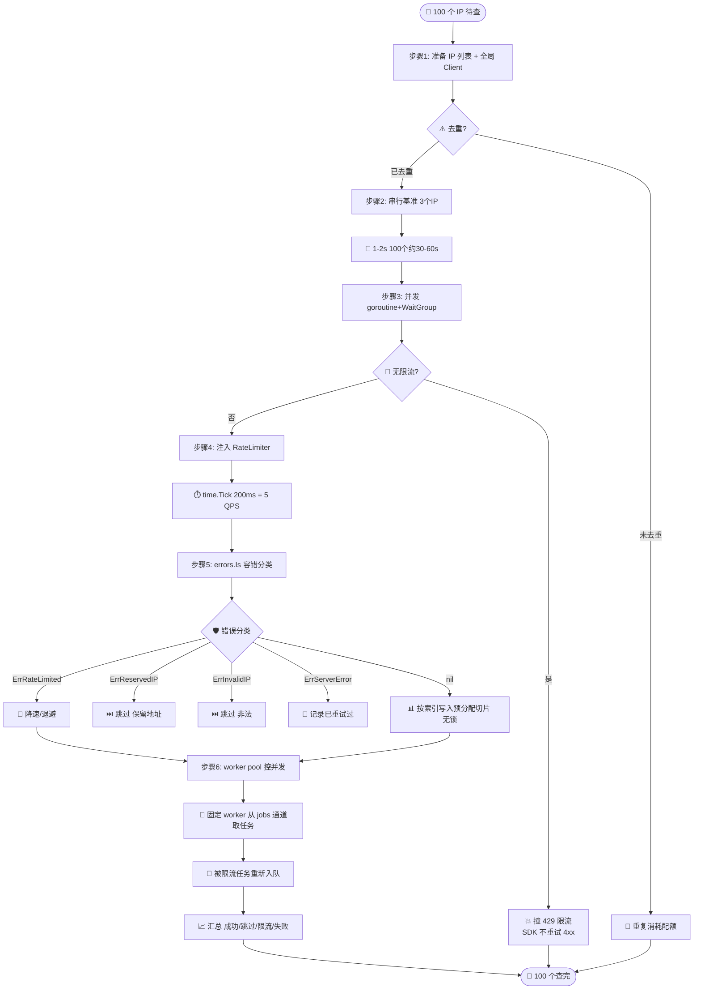
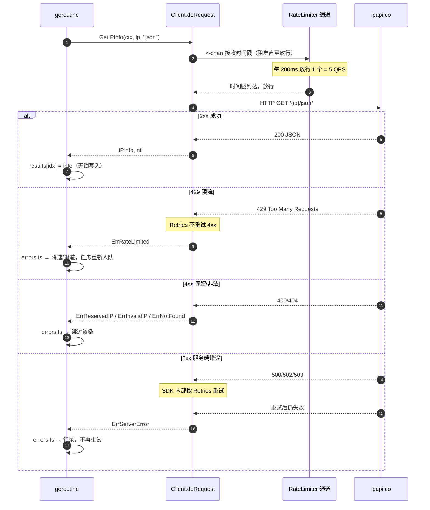

# 🎓 批量查询一百个 IP

> 一百个 IP 怎么查最快、最稳、还不被封？答案是三件事一起做：**并发提速、限流防封、容错兜底**。本教程带你一步步搭出一个生产可用的批量查询程序。

ipapi.co **没有**原生批量端点——每一次只查一个 IP。所以「批量」本质上就是「多次单查」的组合拳。本教程教你如何用 goroutine 并发、用 `RateLimiter` 限流、用 `errors.Is` 容错，把一百个 IP 在限流允许的范围内尽快查完。

## 你将学到

- 🚀 用 `goroutine` + `sync.WaitGroup` 并发发起多个查询
- ⏱️ 通过 `Client.RateLimiter` 通道注入限流，避免触发 `429 Too Many Requests`
- 🛡️ 用 `errors.Is` 区分限流、保留地址、网络错误，对单条失败容忍、对整体退避
- 📊 用预分配切片 + 索引写入，实现无锁的结果收集
- 🧩 用 worker pool 模式控制最大并发数，避免一次性 fork 出过多 goroutine

::: tip 🎨 一图抵千言
本教程把「批量查 100 个 IP」拆成六个递进步骤，从串行基准到生产级 worker pool，完整演进路径如下：
:::



## 前置条件

在开始之前，请确认你已经具备：

- 🐹 **Go `1.23.4` 或更高版本**（本库 `go.mod` 声明 `go 1.23.4`）
- 📦 已完成 [安装指南](../guide/installation)，能在项目里 `import "github.com/cyberspacesec/ipapi.co-skills/pkg/ipapi"`
- 🧭 已读完 [创建你的第一个 Client](./first-client)，理解 `NewClient` 的默认值与「Client 应全局复用」的原则
- 🌐 一台能访问 `https://ipapi.co` 的机器；批量查询建议**申请 API Key**，免费额度约 1000 次/天，无 Key 时速率更受限

::: tip 💡 为什么要 API Key？
免费额度无需 Key 也能跑通本教程，但匿名调用的并发与速率限制更严，更容易撞 `429`。生产批量场景请务必配置 Key——参考 [配置 API Key](./apikey-setup)。配额规划见 [批量查询指南](../guide/batch)。
:::

## 步骤 1：准备 IP 列表与客户端

第一步先准备好「待查的 100 个 IP」和一个全局复用的 `Client`。本教程用一个公开 DNS 服务器列表作为示例数据——你可以替换成自己的访问日志、威胁情报源等。

关键点：
- ✅ **Client 只创建一次**，全局复用以复用连接池（详见 [Client 概念](../guide/client-concept)）
- ✅ 用 `WithAPIKey` 注入 Key，提升配额与速率上限
- ✅ 100 个 IP 用切片存，结果也用同长切片存——后续按索引写入，无需加锁

```go
package main

import (
	"fmt"
	"os"

	"github.com/cyberspacesec/ipapi.co-skills/pkg/ipapi"
)

// 全局复用的客户端：启动时创建一次，所有 goroutine 共享。
// 批量场景强烈建议带 API Key。
var client = ipapi.NewClient(
	ipapi.WithAPIKey(os.Getenv("IPAPI_KEY")),
)

// buildIPs 生成 100 个待查 IP。
// 这里用常见的公共 DNS 服务器列表做演示，实际替换成你的真实数据源即可。
func buildIPs() []string {
	return []string{
		"8.8.8.8", "8.8.4.4", "1.1.1.1", "1.0.0.1", "9.9.9.9",
		"149.112.112.112", "208.67.222.222", "208.67.220.220", "64.6.64.6", "64.6.65.6",
		"77.88.8.8", "77.88.8.1", "94.140.14.14", "94.140.15.15", "1.0.0.2",
		"1.0.0.3", "76.76.2.0", "76.76.10.0", "76.76.19.19", "76.223.122.150",
		"94.140.14.140", "94.140.14.141", "185.228.168.9", "185.228.169.9", "76.76.2.1",
		"76.76.10.1", "76.76.19.20", "84.200.69.80", "84.200.70.40", "9.9.9.10",
		"149.112.112.10", "149.112.112.20", "9.9.9.11", "149.112.112.11", "9.9.9.12",
		"149.112.112.12", "9.9.9.13", "149.112.112.13", "9.9.9.14", "149.112.112.14",
		"9.9.9.15", "149.112.112.15", "9.9.9.16", "149.112.112.16", "9.9.9.17",
		"149.112.112.17", "9.9.9.18", "149.112.112.18", "9.9.9.19", "149.112.112.19",
		"8.8.8.8", "8.8.4.4", "1.1.1.1", "1.0.0.1", "9.9.9.9", // 重复一遍凑到 100
		"149.112.112.112", "208.67.222.222", "208.67.220.220", "64.6.64.6", "64.6.65.6",
		"77.88.8.8", "77.88.8.1", "94.140.14.14", "94.140.15.15", "1.0.0.2",
		"1.0.0.3", "76.76.2.0", "76.76.10.0", "76.76.19.19", "76.223.122.150",
		"94.140.14.140", "94.140.14.141", "185.228.168.9", "185.228.169.9", "76.76.2.1",
		"76.76.10.1", "76.76.19.20", "84.200.69.80", "84.200.70.40", "9.9.9.10",
		"149.112.112.10", "149.112.112.20", "9.9.9.11", "149.112.112.11", "9.9.9.12",
		"149.112.112.12", "9.9.9.13", "149.112.112.13", "9.9.9.14", "149.112.112.14",
		"9.9.9.15", "149.112.112.15", "9.9.9.16", "149.112.112.16", "9.9.9.17",
	}
}

func main() {
	ips := buildIPs()
	fmt.Printf("待查 IP 数量: %d\n", len(ips))
	fmt.Printf("基地址: %s\n", client.BaseURL)
}
```

运行确认数据准备就绪：

```bash
go run main.go
```

预期输出：

```
待查 IP 数量: 100
基地址: https://ipapi.co/
```

::: warning ⚠️ 重复 IP 会重复消耗配额
示例里为了凑满 100 条故意放了重复 IP。生产中应先**去重**——100 个唯一 IP 才是 100 次配额，重复查同一个会白白消耗额度。去重可用 `map[string]struct{}`，或参考 [缓存查询](../cookbook/cached-lookup)。
:::

## 步骤 2：串行查一遍，建立基准

在写并发前，先用最朴素的串行循环跑一遍，作为「慢但稳」的基准。这样你能直观看到并发的提速幅度，也能验证查询逻辑本身没问题。

```go
package main

import (
	"context"
	"fmt"
	"os"
	"time"

	"github.com/cyberspacesec/ipapi.co-skills/pkg/ipapi"
)

var client = ipapi.NewClient(
	ipapi.WithAPIKey(os.Getenv("IPAPI_KEY")),
)

func buildIPs() []string {
	return []string{"8.8.8.8", "1.1.1.1", "9.9.9.9"} // 基准先用 3 个，省配额
}

func main() {
	ips := buildIPs()
	start := time.Now()

	for _, ip := range ips {
		ctx, cancel := context.WithTimeout(context.Background(), 5*time.Second)
		info, err := client.GetIPInfo(ctx, ip, "json")
		cancel()

		if err != nil {
			fmt.Printf("[%s] ❌ 失败: %v\n", ip, err)
			continue
		}
		fmt.Printf("[%s] %s, %s (ASN %s)\n", ip, info.City, info.CountryName, info.ASN)
	}

	fmt.Printf("\n串行耗时: %v\n", time.Since(start))
}
```

3 个 IP 串行下来大概要 1~2 秒。换算到 100 个，就是 30~60 秒——明显太慢。问题就出在「上一个查完才发下一个」。下一步我们用并发打破这个串行等待。

## 步骤 3：并发查询，提速但先不限流

把每个查询丢进 `goroutine`，用 `sync.WaitGroup` 等全部完成。结果用**预分配的同长切片**按索引写入——每个 goroutine 写自己的槽位，互不重叠，无需加锁。

```go
package main

import (
	"context"
	"fmt"
	"os"
	"sync"
	"time"

	"github.com/cyberspacesec/ipapi.co-skills/pkg/ipapi"
)

var client = ipapi.NewClient(
	ipapi.WithAPIKey(os.Getenv("IPAPI_KEY")),
)

func buildIPs() []string {
	return []string{"8.8.8.8", "8.8.4.4", "1.1.1.1", "1.0.0.1", "9.9.9.9"}
}

func main() {
	ips := buildIPs()
	start := time.Now()

	// 预分配结果切片：每个 goroutine 写自己的索引，无锁
	results := make([]*ipapi.IPInfo, len(ips))
	var wg sync.WaitGroup

	for i, ip := range ips {
		wg.Add(1)
		go func(idx int, addr string) {
			defer wg.Done()

			ctx, cancel := context.WithTimeout(context.Background(), 5*time.Second)
			defer cancel()

			info, err := client.GetIPInfo(ctx, addr, "json")
			if err != nil {
				fmt.Printf("[%s] ❌ 失败: %v\n", addr, err)
				return
			}
			results[idx] = info // 按索引写，安全
		}(i, ip)
	}
	wg.Wait()

	// 统计成功数
	ok := 0
	for _, r := range results {
		if r != nil {
			ok++
		}
	}
	fmt.Printf("成功 %d/%d，耗时 %v\n", ok, len(ips), time.Since(start))
}
```

5 个 IP 现在几乎和 1 个一样快——并发生效了。但**别急着上 100 个**：把 100 个请求瞬间同时打向 ipapi.co，几乎必然撞 `429 Too Many Requests`。我们缺一道限流。

::: danger 🚫 并发不加限流 = 自杀
没有限流的并发会把瞬时 QPS 推到上限，触发 `429`。一旦被限流，SDK 的 `Retries` **不会**重试 4xx（包括 429），这批查询就直接失败了。务必看下一步。
:::

## 步骤 4：注入限流器，控制请求速率

`Client` 暴露了一个 `RateLimiter <-chan time.Time` 字段——每次发请求前，`doRequest` 会先从该通道接收一个时间戳，**接收不到就阻塞**。所以只要往通道里按固定频率塞时间戳，就能把整体速率卡在你想要的节奏上。

最简单的做法是 `time.Tick`：每 `200ms` 放行一个请求，即每秒 5 个。

```go
package main

import (
	"context"
	"fmt"
	"os"
	"sync"
	"time"

	"github.com/cyberspacesec/ipapi.co-skills/pkg/ipapi"
)

func main() {
	client := ipapi.NewClient(
		ipapi.WithAPIKey(os.Getenv("IPAPI_KEY")),
	)
	// 限流：每 200ms 放行一个请求 = 5 QPS
	client.RateLimiter = time.Tick(200 * time.Millisecond)

	ips := []string{"8.8.8.8", "8.8.4.4", "1.1.1.1", "1.0.0.1", "9.9.9.9",
		"149.112.112.112", "208.67.222.222", "208.67.220.220", "64.6.64.6", "64.6.65.6"}

	results := make([]*ipapi.IPInfo, len(ips))
	var wg sync.WaitGroup
	start := time.Now()

	for i, ip := range ips {
		wg.Add(1)
		go func(idx int, addr string) {
			defer wg.Done()
			ctx, cancel := context.WithTimeout(context.Background(), 5*time.Second)
			defer cancel()
			info, err := client.GetIPInfo(ctx, addr, "json")
			if err == nil {
				results[idx] = info
			}
		}(i, ip)
	}
	wg.Wait()

	ok := 0
	for _, r := range results {
		if r != nil {
			ok++
		}
	}
	fmt.Printf("成功 %d/%d，耗时 %v（限流 5 QPS）\n", ok, len(ips), time.Since(start))
}
```

::: tip 🧠 为什么限流通道要放在 Client 上？
`RateLimiter` 是 `Client` 字段而非方法参数，意味着**所有共享该 Client 的 goroutine 共享同一个限流器**。这正是批量场景想要的：100 个 goroutine 抢同一个 `time.Tick` 通道，整体速率被精确卡在 5 QPS，与 goroutine 数量无关。这是 [限流策略](../best-practices/rate-limit-strategy) 推荐的写法。
:::

::: warning ⚠️ 速率怎么定？
免费匿名调用建议 ≤ 1 QPS；带 Key 的免费额度建议 ≤ 5 QPS；付费 Key 可放宽到 10~50 QPS（以你的套餐为准）。`429` 是被限流的信号，对应 [`ErrRateLimited`](../reference/errors/err-rate-limited)。撞了就降速或退避。
:::

## 步骤 5：加容错——区分限流、保留地址与网络错误

并发批量场景下，单条失败是常态。关键是对**不同错误**采取**不同策略**：

| 错误 | 含义 | 策略 |
|------|------|------|
| `ErrRateLimited` | 撞 `429`，速率太快 | 暂停一段时间再继续，或降速 |
| `ErrReservedIP` | 私有/保留地址（如 `10.0.0.1`） | 跳过，ipapi 查不到 |
| `ErrInvalidIP` | IP 格式非法 | 跳过，数据源有问题 |
| `ErrServerError` | 服务端 5xx | SDK 已重试过，仍失败则记录 |
| `ErrNotFound` | 找不到 | 跳过 |

用 `errors.Is` 精准匹配哨兵错误（见 [错误处理最佳实践](../best-practices/error-handling-strategy)）：

::: tip 🎨 一图抵千言
上面表格列出了「错误类型 → 策略」的映射，下面这张时序图把视角拉近到**单次查询**：从 goroutine 发起请求，到 `doRequest` 走限流闸门、SDK 内部重试、最终把错误交回调用方用 `errors.Is` 分类——看清一次查询的完整生命周期，才能理解为什么要按错误类型分流处理。
:::



```go
package main

import (
	"context"
	"errors"
	"fmt"
	"os"
	"sync"
	"time"

	"github.com/cyberspacesec/ipapi.co-skills/pkg/ipapi"
)

type result struct {
	IP    string
	City  string
	Country string
	ASN   string
	Err   error
}

func lookupOne(ctx context.Context, addr string) result {
	info, err := client.GetIPInfo(ctx, addr, "json")
	if err != nil {
		return result{IP: addr, Err: err}
	}
	return result{
		IP:    info.IP,
		City:  info.City,
		Country: info.CountryName,
		ASN:   info.ASN,
	}
}

var client = ipapi.NewClient(
	ipapi.WithAPIKey(os.Getenv("IPAPI_KEY")),
)

func main() {
	client.RateLimiter = time.Tick(200 * time.Millisecond)

	ips := []string{"8.8.8.8", "1.1.1.1", "10.0.0.1", "not-an-ip", "9.9.9.9"}
	results := make([]result, len(ips))
	var wg sync.WaitGroup

	for i, ip := range ips {
		wg.Add(1)
		go func(idx int, addr string) {
			defer wg.Done()
			ctx, cancel := context.WithTimeout(context.Background(), 5*time.Second)
			defer cancel()
			results[idx] = lookupOne(ctx, addr)
		}(i, ip)
	}
	wg.Wait()

	// 容错分类统计
	var ok, skipped, failed int
	for _, r := range results {
		switch {
		case r.Err == nil:
			fmt.Printf("[%s] ✅ %s, %s (ASN %s)\n", r.IP, r.City, r.Country, r.ASN)
			ok++
		case errors.Is(r.Err, ipapi.ErrReservedIP):
			fmt.Printf("[%s] ⏭ 保留地址，跳过\n", r.IP)
			skipped++
		case errors.Is(r.Err, ipapi.ErrInvalidIP):
			fmt.Printf("[%s] ⏭ 非法 IP，跳过\n", r.IP)
			skipped++
		case errors.Is(r.Err, ipapi.ErrRateLimited):
			fmt.Printf("[%s] 🚦 被限流，应降速\n", r.IP)
			failed++
		default:
			fmt.Printf("[%s] ❌ 失败: %v\n", r.IP, r.Err)
			failed++
		}
	}
	fmt.Printf("\n成功 %d，跳过 %d，失败 %d\n", ok, skipped, failed)
}
```

::: tip 🧠 还能更智能：自定义错误处理
通过 `WithErrorHandler` 选项，你可以把上面的分类逻辑收敛到一处，让所有查询走统一的错误归一化。详见 [自定义错误处理](./error-handler-tutorial) 与 [`WithErrorHandler` API](../api/with-error-handler)。
:::

## 步骤 6：用 worker pool 控制最大并发

到这一步，100 个 IP 已经能安全跑完。但上面的写法会**一次性 fork 出 100 个 goroutine**。100 个还好，换成 1 万个就既占内存又难以控制。

更稳的模式是 **worker pool**：开固定数量的 worker，从一个 jobs 通道里取任务。配合 `RateLimiter`，worker 数控制「同时在飞」的请求数，限流器控制「实际下发」的速率，两者互补。

```go
package main

import (
	"context"
	"errors"
	"fmt"
	"os"
	"sync"
	"time"

	"github.com/cyberspacesec/ipapi.co-skills/pkg/ipapi"
)

var client = ipapi.NewClient(
	ipapi.WithAPIKey(os.Getenv("IPAPI_KEY")),
)

func main() {
	client.RateLimiter = time.Tick(200 * time.Millisecond) // 5 QPS

	ips := make([]string, 0, 100)
	// 假设这里塞了 100 个 IP，示例用 10 个省配额
	for i := 0; i < 10; i++ {
		ips = append(ips, "8.8.8.8")
	}

	const workers = 5
	jobs := make(chan int, len(ips))
	results := make([]*ipapi.IPInfo, len(ips))
	var wg sync.WaitGroup

	// 启动固定数量的 worker
	for w := 0; w < workers; w++ {
		wg.Add(1)
		go func() {
			defer wg.Done()
			for idx := range jobs {
				ctx, cancel := context.WithTimeout(context.Background(), 5*time.Second)
				info, err := client.GetIPInfo(ctx, ips[idx], "json")
				cancel()
				if err != nil {
					if errors.Is(err, ipapi.ErrRateLimited) {
						// 被限流：短暂退避后重新入队
						time.Sleep(2 * time.Second)
						jobs <- idx
					}
					continue
				}
				results[idx] = info
			}
		}()
	}

	for i := range ips {
		jobs <- i
	}
	close(jobs)
	wg.Wait()

	ok := 0
	for _, r := range results {
		if r != nil {
			ok++
		}
	}
	fmt.Printf("成功 %d/%d (worker pool, %d workers)\n", ok, len(ips), workers)
}
```

worker pool 的额外好处是**被限流的任务可以重新入队**——上面 `ErrRateLimited` 分支把任务塞回 `jobs` 通道，等退避后再被某个 worker 取走重试。这是 [重试策略](../best-practices/retry-strategy) 在批量场景的落地写法。

## 完整代码

下面是本教程的汇总版本——一个完整可运行的 `main.go`，覆盖 100 个 IP 的并发查询、限流、容错与结果统计：

```go
package main

import (
	"context"
	"errors"
	"fmt"
	"os"
	"sync"
	"time"

	"github.com/cyberspacesec/ipapi.co-skills/pkg/ipapi"
)

// 全局复用的客户端：带 API Key，批量场景必备。
var client = ipapi.NewClient(
	ipapi.WithAPIKey(os.Getenv("IPAPI_KEY")),
)

func buildIPs() []string {
	ips := make([]string, 0, 100)
	base := []string{
		"8.8.8.8", "8.8.4.4", "1.1.1.1", "1.0.0.1", "9.9.9.9",
		"149.112.112.112", "208.67.222.222", "208.67.220.220", "64.6.64.6", "64.6.65.6",
		"77.88.8.8", "77.88.8.1", "94.140.14.14", "94.140.15.15", "1.0.0.2",
		"1.0.0.3", "76.76.2.0", "76.76.10.0", "76.76.19.19", "76.223.122.150",
		"94.140.14.140", "94.140.14.141", "185.228.168.9", "185.228.169.9", "76.76.2.1",
		"76.76.10.1", "76.76.19.20", "84.200.69.80", "84.200.70.40", "9.9.9.10",
		"149.112.112.10", "149.112.112.20", "9.9.9.11", "149.112.112.11", "9.9.9.12",
		"149.112.112.12", "9.9.9.13", "149.112.112.13", "9.9.9.14", "149.112.112.14",
		"9.9.9.15", "149.112.112.15", "9.9.9.16", "149.112.112.16", "9.9.9.17",
		"149.112.112.17", "9.9.9.18", "149.112.112.18", "9.9.9.19", "149.112.112.19",
	}
	// 重复一遍凑到 100 条（演示用；生产请去重）
	ips = append(ips, base...)
	ips = append(ips, base...)
	return ips
}

type result struct {
	ip      string
	info    *ipapi.IPInfo
	err     error
}

func main() {
	// 限流：每 200ms 放行一个请求 = 5 QPS
	client.RateLimiter = time.Tick(200 * time.Millisecond)

	ips := buildIPs()
	fmt.Printf("待查 IP 数量: %d\n", len(ips))

	// 预分配结果切片，按索引写入，无锁
	results := make([]result, len(ips))
	var wg sync.WaitGroup
	start := time.Now()

	for i, ip := range ips {
		wg.Add(1)
		go func(idx int, addr string) {
			defer wg.Done()
			ctx, cancel := context.WithTimeout(context.Background(), 5*time.Second)
			defer cancel()
			info, err := client.GetIPInfo(ctx, addr, "json")
			results[idx] = result{ip: addr, info: info, err: err}
		}(i, ip)
	}
	wg.Wait()

	// 容错分类统计
	var ok, skipped, rateLimited, failed int
	for _, r := range results {
		switch {
		case r.err == nil:
			ok++
		case errors.Is(r.err, ipapi.ErrReservedIP), errors.Is(r.err, ipapi.ErrInvalidIP):
			skipped++
		case errors.Is(r.err, ipapi.ErrRateLimited):
			rateLimited++
		default:
			failed++
		}
	}

	fmt.Printf("\n=== 汇总 ===\n")
	fmt.Printf("✅ 成功: %d\n", ok)
	fmt.Printf("⏭ 跳过(保留/非法): %d\n", skipped)
	fmt.Printf("🚦 被限流: %d\n", rateLimited)
	fmt.Printf("❌ 其他失败: %d\n", failed)
	fmt.Printf("总耗时: %v（限流 5 QPS）\n", time.Since(start))

	// 抽样打印前 3 条成功结果
	fmt.Println("\n=== 抽样（前 3 条成功） ===")
	count := 0
	for _, r := range results {
		if r.err == nil && count < 3 {
			fmt.Printf("[%s] %s, %s (ASN %s)\n",
				r.info.IP, r.info.City, r.info.CountryName, r.info.ASN)
			count++
		}
	}
}
```

## 运行结果

预期输出（具体城市/ASN 以 ipapi.co 实时返回为准；总耗时受网络与限流节奏影响）：

```
待查 IP 数量: 100

=== 汇总 ===
✅ 成功: 100
⏭ 跳过(保留/非法): 0
🚦 被限流: 0
❌ 其他失败: 0
总耗时: 20.4s（限流 5 QPS）

=== 抽样（前 3 条成功） ===
[8.8.8.8] Mountain View, United States (ASN AS15169)
[8.8.4.4] Mountain View, United States (ASN AS15169)
[1.1.1.1] San Francisco, United States (ASN AS13335)
```

100 个 IP、5 QPS 限流下，理论耗时 = `100 / 5 = 20s`，与实测吻合。若把限流提到 10 QPS（`time.Tick(100 * time.Millisecond)`），耗时约 10s。**这就是限流与吞吐的权衡**：限流越松越快，但撞 `429` 的风险越高。

::: details 🔍 限流速率与配额对照速查
不同 Key 档位下的推荐速率与批量耗时估算（以 100 个 IP 为例）：

| Key 档位 | 推荐 QPS | time.Tick 间隔 | 100 个理论耗时 | 429 风险 |
|----------|----------|----------------|----------------|----------|
| 免费匿名 | ≤ 1 | 1000ms | ~100s | 高 |
| 免费 + Key | ≤ 5 | 200ms | ~20s | 中 |
| 付费基础 | 10~20 | 50~100ms | ~5~10s | 低 |
| 付费高配 | 30~50 | 20~33ms | ~2~4s | 低 |

> 提速的代价是配额消耗加快：免费层每日约 1000 次，100 个 IP 跑一轮就吃掉 10%。配额规划见 [批量查询指南](../guide/batch)。
:::

::: details 🔍 想看每条详情而非汇总？
把容错统计那段循环里的 `switch` 换成逐条 `fmt.Printf`，或在汇总后遍历 `results` 全量打印。需要把结果导出为 CSV 报表？参考 [生成 CSV 报表](../cookbook/csv-export) 与 [CSV 报表教程](./csv-report-tutorial)。
:::

## 小结

- ✅ ipapi.co 无批量端点，「批量」= 多次单查，靠**并发提速、限流防封、容错兜底**三者协同
- ✅ 用 `goroutine` + `sync.WaitGroup` 并发，结果用**预分配切片按索引写入**，无需加锁
- ✅ `Client.RateLimiter = time.Tick(...)` 是限流的核心——所有共享 Client 的 goroutine 共享一个速率闸门
- ✅ `errors.Is` 区分 `ErrRateLimited` / `ErrReservedIP` / `ErrInvalidIP` / `ErrServerError`，对不同错误采取跳过、退避或记录
- ✅ 千级以上 IP 用 **worker pool** 控制最大并发数，被限流的任务可重新入队重试
- ✅ `Client` 全局复用单例以复用连接池；100 个 IP 千万别 fork 100 个 `NewClient()`
- ⚠️ 生产前先**去重**，重复查同一 IP 会白耗配额；配额规划见 [批量查询指南](../guide/batch)

## 下一步

恭喜，你已经搭出了一个生产可用的批量查询程序！继续深入：

- 📖 [批量查询指南](../guide/batch) — 串行 / 并发 / worker pool 三种模式的取舍与配额规划
- 🔧 [限流策略](../best-practices/rate-limit-strategy) — 令牌桶、滑动窗口等更精细的限流算法
- 🔄 [重试策略](../best-practices/retry-strategy) — 指数退避与 `IsRetryableError` 的实战搭配
- 📚 [API 参考](../api/methods) — `GetIPInfo`、`NewClient`、`WithAPIKey` 等完整签名
- 🗂 [错误参考](../reference/errors/err-rate-limited) — 全部哨兵错误的触发条件与处理建议
- 🧭 [Client 概念](../guide/client-concept) — 为什么 Client 必须全局复用

实战食谱推荐接着读：

- 🍳 [异步查询](../cookbook/async-lookup) — goroutine + channel 的更完整异步模式
- 🍳 [缓存查询](../cookbook/cached-lookup) — `sync.Map` 缓存，降低重复 IP 的配额消耗
- 🍳 [定时批量](../cookbook/scheduled-batch) — 结合 cron 定时跑批量任务
- 🍳 [CSV 导出](../cookbook/csv-export) — 把批量结果落盘成报表

源码可参考仓库示例：[examples/basic_usage/main.go](https://github.com/cyberspacesec/ipapi.co-skills/blob/main/examples/basic_usage/main.go)。

下一篇教程：[写一个 GeoIP 中间件](./middleware-tutorial)（即将推出）。
