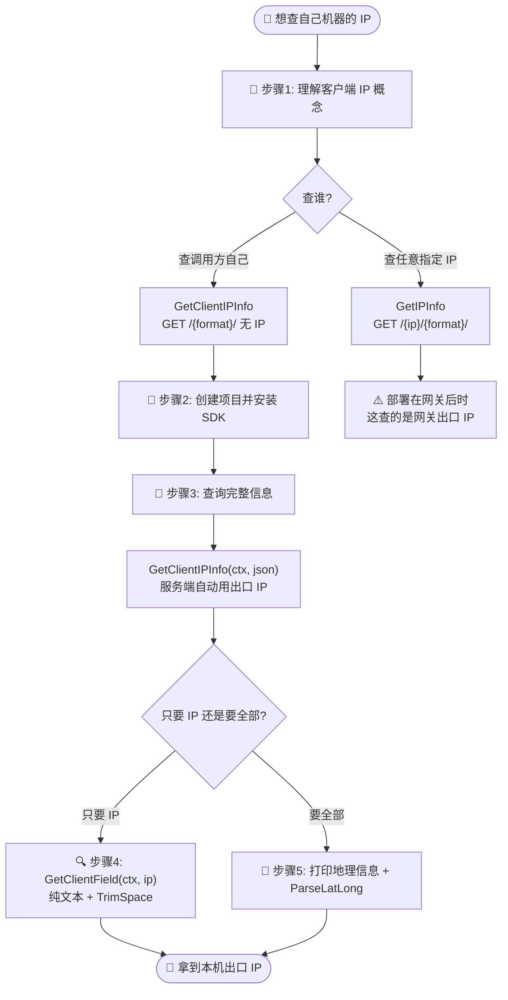
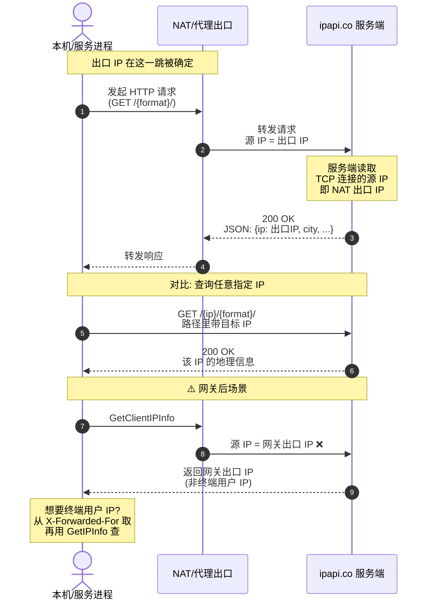

# 🎓 查询自己的公网 IP

> 不知道要查哪个 IP？那就查「发起请求的这台机器」自己。本教程带你用 `GetClientIPInfo` 探测本机出口 IP，并理解什么是「客户端 IP」。

## 🎯 你将学到

- 📡 理解「客户端 IP（出口 IP）」的概念，以及它和「终端用户 IP」的区别
- 🚀 用 `client.GetClientIPInfo(ctx, "json")` 查询本机出口 IP 的完整信息
- 🔍 用 `client.GetClientField(ctx, "ip")` 只取出口 IP 这一个字段
- 🧾 把 `*IPInfo` 里的城市、时区、ASN 等关键字段格式化打印
- ⚠️ 识别「出口 IP ≠ 终端用户 IP」这一常见误区，避免在网关/代理后误用

## 📋 前置条件

在开始之前，请确认你已具备以下条件：

- ✅ 已安装 **Go 1.21 或更高版本**（本教程基于 `go 1.23.4` 验证）。可用 `go version` 检查。
- ✅ 已完成 [第一个 IP 查询](./hello-ipapi) 教程，能跑通 `GetIPInfo` 的最小示例。
- ✅ 了解 `Client` 与 `context` 的基本用法，参见 [客户端概念](../guide/client-concept) 与 [Context 与超时](../guide/context)。
- ✅ 能够访问 `https://ipapi.co/`（免登录即可查询，免费额度有限）。
- 💡 可选：拥有一个 ipapi.co API Key，用于提升速率限制额度。免费层同样可以运行本教程的全部示例。

> 📌 本教程无需 API Key 即可运行。免费查询会受到速率限制，超出后可参考 [限流错误](../reference/errors/err-rate-limited) 处理。

::: tip 🎨 一图抵千言 — 客户端 IP 查询的完整流程
下图展示从「理解概念」到「拿到本机出口 IP」的全过程，重点区分两种查询端点与常见误区：
:::



## 🧠 步骤 1：理解什么是「客户端 IP」

在写代码之前，先厘清一个关键概念，否则很容易用错方法。

ipapi.co 的查询端点分两类：

| 端点 | SDK 方法 | 含义 |
|------|----------|------|
| `GET /{ip}/{format}/` | [`GetIPInfo`](../api/get-ip-info) | 查询**任意指定**的 IP |
| `GET /{format}/` | [`GetClientIPInfo`](../api/get-client-ip-info) | 查询**调用方自己**的出口 IP |

`GetClientIPInfo` 的请求路径里**没有 IP**，ipapi.co 服务端会自动把「发起这次 HTTP 请求的机器」的出口 IP 作为查询对象。

::: tip 🌐 什么是「出口 IP」
当你的机器访问公网时，经过 NAT、路由、代理之后，最终对外暴露的那个 IP 就是**出口 IP**。它通常是你的运营商分配的公网地址——也正是「别人看到的你的 IP」。
:::

> ⚠️ **关键区别**：`GetClientIPInfo` 返回的是 **SDK 所在机器** 的出口 IP，**不是**终端用户的 IP。如果你的服务部署在网关或反向代理后，要查终端用户 IP，应从 `X-Forwarded-For` 等请求头取出真实 IP，再用 `GetIPInfo` 查询。详见 [客户端 IP 检测指南](../guide/client-ip)。

::: tip 🎨 一图抵千言 — 一次请求的时序视角
上面的流程图讲的是「步骤」，下面的时序图讲的是「运行时谁先谁后」：客户端如何发起请求、ipapi.co 如何识别出口 IP、以及两种端点（带 IP / 不带 IP）在 HTTP 层的区别。
:::



::: details 🌐 出口 IP vs 终端用户 IP 的典型场景
| 部署形态 | SDK 调用方 | `GetClientIPInfo` 返回 | 终端用户真实 IP 怎么查 |
|----------|-----------|------------------------|------------------------|
| 本地开发机 | 你的电脑 | 运营商分配的公网 IP | 即本机，无需特殊处理 |
| 云服务器 | 服务进程 | 机房出口 IP | 同上，即机房 IP |
| 反向代理后端 | 后端服务 | **网关/代理出口 IP** ❌ | 取 `X-Forwarded-For` 再 `GetIPInfo` |
| CDN 回源 | 源站 | **CDN 节点 IP** ❌ | 取 `X-Forwarded-For` / `CF-Connecting-IP` |

记住：**`GetClientIPInfo` 永远返回「直接发起 HTTP 请求的那一跳」的出口 IP**，中间每多一层代理，结果就离终端用户远一层。
:::

## 🚀 步骤 2：创建项目并安装 SDK

新建一个干净的目录，初始化 Go 模块并拉取 SDK：

```bash
mkdir client-ip-demo
cd client-ip-demo
go mod init example.com/client-ip-demo
go get github.com/cyberspacesec/ipapi.co-skills/pkg/ipapi
```

> 🧭 关于安装方式、私有代理、版本选择的更多说明，参见 [安装指南](../guide/installation)。

## 🎯 步骤 3：查询本机出口 IP 的完整信息

在项目根目录新建 `main.go`，填入以下内容。这一步用 `GetClientIPInfo` 拿到自己出口 IP 的完整地理信息。

```go
package main

import (
	"context"
	"fmt"
	"log"
	"time"

	"github.com/cyberspacesec/ipapi.co-skills/pkg/ipapi"
)

func main() {
	// 1. 创建默认客户端（无需 API Key）
	client := ipapi.NewClient()

	// 2. 设置 5 秒超时，避免请求卡死
	ctx, cancel := context.WithTimeout(context.Background(), 5*time.Second)
	defer cancel()

	// 3. 查询「本机出口 IP」的完整信息
	info, err := client.GetClientIPInfo(ctx, "json")
	if err != nil {
		log.Fatalf("查询失败: %v", err)
	}

	// 4. 打印核心字段
	fmt.Printf("我的公网 IP  : %s\n", info.IP)
	fmt.Printf("IP 版本      : %s\n", info.Version)
	fmt.Printf("城市         : %s\n", info.City)
	fmt.Printf("国家         : %s (%s)\n", info.CountryName, info.CountryCode)
	fmt.Printf("时区         : %s (UTC%s)\n", info.Timezone, info.UTCOffset)
	fmt.Printf("ASN/Org      : %s / %s\n", info.ASN, info.Org)
}
```

逐段说明：

- 🧱 `ipapi.NewClient()` 用默认配置构造客户端，内置 10 秒 HTTP 超时与 2 次重试，参见 [客户端概念](../guide/client-concept)。
- ⏱️ `context.WithTimeout` 给本次请求再加一道 5 秒上限，理解 `context` 的用法见 [Context 与超时](../guide/context)。
- 🎯 `GetClientIPInfo(ctx, "json")` 是本教程的核心调用：参数**没有 IP**，只传格式 `"json"`，服务端自动用调用方出口 IP。详见 [GetClientIPInfo API](../api/get-client-ip-info)。
- 🧾 返回的 `info` 是 `*IPInfo`，所有字段定义见 [IPInfo 模型](../api/models) 与 [字段总览](../api/fields)。

运行：

```bash
go run main.go
```

如果一切正常，你会看到形如下面的输出（具体 IP 与城市取决于你的网络出口）：

```
我的公网 IP  : 203.0.113.42
IP 版本      : IPv4
城市         : Beijing
国家         : China (CN)
时区         : Asia/Shanghai (UTC+0800)
ASN/Org      : AS4134 / China Telecom
```

> 🎉 到这一步，你已经成功探测到本机出口 IP 了！下面的步骤带你用更轻量的方式只取 IP 字段，并打印更多细节。

## 🔍 步骤 4：只取出口 IP 这一个字段

如果你**只想知道自己的 IP 是什么**，不需要城市、时区等附加信息，拉取完整 JSON 就显得浪费。这时用 [`GetClientField`](../api/get-client-field) 只取单个字段更高效：

```go
package main

import (
	"context"
	"fmt"
	"log"
	"strings"
	"time"

	"github.com/cyberspacesec/ipapi.co-skills/pkg/ipapi"
)

func main() {
	client := ipapi.NewClient()

	ctx, cancel := context.WithTimeout(context.Background(), 5*time.Second)
	defer cancel()

	// 只取「ip」这一个字段
	myIP, err := client.GetClientField(ctx, "ip")
	if err != nil {
		log.Fatalf("查询失败: %v", err)
	}

	// 字段返回值带有尾随换行符，记得 trim
	fmt.Printf("我的公网 IP: %s\n", strings.TrimSpace(myIP))
}
```

几点说明：

- 🎯 `GetClientField(ctx, "ip")` 对应端点 `GET /ip/`，返回纯文本的出口 IP，不带 JSON 包裹。
- 🧹 单字段接口返回的是原始字符串，**末尾通常带一个换行符**，用 `strings.TrimSpace` 去掉更干净。
- 📋 合法字段名（如 `ip`、`city`、`country`、`asn`）见 [字段总览](../api/fields) 与 [字段参考目录](../reference/fields/ip)。

::: warning 🧹 别忘了 TrimSpace
单字段接口返回的是**纯文本**，末尾通常带一个 `\n` 换行符。直接使用会导致字符串比较失败、日志多一行、JSON 编码出现 `\n` 等问题：

```go
// ❌ 错误：可能拿到 "203.0.113.42\n"
myIP, _ := client.GetClientField(ctx, "ip")
if myIP == "203.0.113.42" { /* 永远不成立 */ }

// ✅ 正确：先 trim
myIP, _ := client.GetClientField(ctx, "ip")
myIP = strings.TrimSpace(myIP)
```

`GetIPInfo` 不存在此问题，因为 JSON 反序列化会自动剥离换行。
:::

## 🧾 步骤 5：打印完整地理信息并解析经纬度

`IPInfo` 里包含国家、城市、经纬度、时区、ASN、货币等几十个字段。把步骤 3 的打印部分扩展一下，并演示用 `ParseLatLong()` 解析经纬度字符串：

```go
// 打印常用地理字段
fmt.Printf("IP        : %s\n", info.IP)
fmt.Printf("版本      : %s\n", info.Version)
fmt.Printf("国家      : %s (%s)\n", info.CountryName, info.CountryCode)
fmt.Printf("地区/城市 : %s / %s\n", info.Region, info.City)
fmt.Printf("时区      : %s (UTC%s)\n", info.Timezone, info.UTCOffset)
fmt.Printf("经纬度    : %s\n", info.LatLong)
fmt.Printf("ASN/Org   : %s / %s\n", info.ASN, info.Org)
fmt.Printf("货币      : %s (%s)\n", info.CurrencyName, info.Currency)

// 解析经纬度字符串为两个浮点数
lat, lon, err := info.ParseLatLong()
if err != nil {
	log.Printf("经纬度解析失败: %v", err)
} else {
	fmt.Printf("解析坐标  : 纬度=%.4f, 经度=%.4f\n", lat, lon)
}
```

字段含义一览：

| 字段 | 含义 | 详细文档 |
|------|------|----------|
| `IP` | 出口 IP 地址 | [ip](../reference/fields/ip) |
| `Version` | IPv4 或 IPv6 | [version](../reference/fields/version) |
| `CountryName` / `CountryCode` | 国家名称与 ISO-2 代码 | [country_name](../reference/fields/country_name) / [country_code](../reference/fields/country_code) |
| `Region` / `City` | 一级行政区与城市 | [region](../reference/fields/region) / [city](../reference/fields/city) |
| `Timezone` / `UTCOffset` | 时区名与 UTC 偏移 | [utc_offset](../reference/fields/utc_offset) |
| `LatLong` | `"lat,lon"` 字符串 | [latlong](../reference/fields/latlong) |
| `ASN` / `Org` | 自治域号与归属机构 | [asn](../reference/fields/asn) / [org](../reference/fields/org) |
| `Currency` / `CurrencyName` | 货币代码与名称 | [currency](../reference/fields/currency) / [currency_name](../reference/fields/currency_name) |

> 🔎 `ParseLatLong()` 是 `IPInfo` 上的便捷方法，把 `"39.03,-77.50"` 拆成两个 `float64`，实现见仓库源码 [`models.go`](https://github.com/cyberspacesec/ipapi.co-skills/blob/main/pkg/ipapi/models.go)。

## 📦 完整代码

下面是整合了步骤 3 与步骤 5 的完整 `main.go`，可直接复制运行：

```go
package main

import (
	"context"
	"fmt"
	"log"
	"time"

	"github.com/cyberspacesec/ipapi.co-skills/pkg/ipapi"
)

func main() {
	// 创建默认客户端（无需 API Key）
	client := ipapi.NewClient()

	// 设置 5 秒超时
	ctx, cancel := context.WithTimeout(context.Background(), 5*time.Second)
	defer cancel()

	// 查询本机出口 IP 的完整信息
	info, err := client.GetClientIPInfo(ctx, "json")
	if err != nil {
		log.Fatalf("查询失败: %v", err)
	}

	// 打印常用地理字段
	fmt.Printf("IP        : %s\n", info.IP)
	fmt.Printf("版本      : %s\n", info.Version)
	fmt.Printf("国家      : %s (%s)\n", info.CountryName, info.CountryCode)
	fmt.Printf("地区/城市 : %s / %s\n", info.Region, info.City)
	fmt.Printf("时区      : %s (UTC%s)\n", info.Timezone, info.UTCOffset)
	fmt.Printf("经纬度    : %s\n", info.LatLong)
	fmt.Printf("ASN/Org   : %s / %s\n", info.ASN, info.Org)
	fmt.Printf("货币      : %s (%s)\n", info.CurrencyName, info.Currency)

	// 解析经纬度字符串为两个浮点数
	lat, lon, err := info.ParseLatLong()
	if err != nil {
		log.Printf("经纬度解析失败: %v", err)
	} else {
		fmt.Printf("解析坐标  : 纬度=%.4f, 经度=%.4f\n", lat, lon)
	}
}
```

源码亦可参考仓库示例 [`examples/basic_usage/main.go`](https://github.com/cyberspacesec/ipapi.co-skills/blob/main/examples/basic_usage/main.go)。

## 🖥️ 运行结果

在项目根目录执行 `go run main.go`，预期输出形如：

```
IP        : 203.0.113.42
版本      : IPv4
国家      : China (CN)
地区/城市 : Beijing / Beijing
时区      : Asia/Shanghai (UTC+0800)
经纬度    : 39.9042,116.4074
ASN/Org   : AS4134 / China Telecom
货币      : Chinese Yuan (CNY)
解析坐标  : 纬度=39.9042, 经度=116.4074
```

> 📋 实际的 IP、城市、经纬度、ASN 等数值取决于你本机的网络出口，与示例不同是正常的。如果在云服务器上运行，返回的将是该机房出口 IP 与所在城市——这正好可以用来做「服务部署位置自检」。

## 🧠 小结

🎉 恭喜！你已掌握「查询自己公网 IP」的全部要点。回顾一下：

- 📡 **客户端 IP = 出口 IP**：`GetClientIPInfo` 返回的是 SDK 所在机器对外的出口 IP，不是终端用户 IP。
- 🚀 `client.GetClientIPInfo(ctx, "json")` 对应 `GET /{format}/` 端点，路径无 IP，服务端自动用调用方出口 IP。
- 🔍 `client.GetClientField(ctx, "ip")` 只取单个字段，返回纯文本，记得 `strings.TrimSpace` 去掉尾随换行。
- 🧾 返回的 `*IPInfo` 携带国家、城市、时区、经纬度、ASN、货币等丰富字段，并自带 `ParseLatLong()` 等便捷方法。
- ⚠️ **常见误区**：服务在网关/代理后时，要查终端用户 IP 应从 `X-Forwarded-For` 取真实 IP 再用 `GetIPInfo`，而非用 `GetClientIPInfo`（那只会拿到网关自己的出口 IP）。

## ➡️ 下一步

掌握本机出口 IP 探测后，可以朝这些方向继续深入：

- 📖 **深入概念**：阅读 [客户端 IP 检测指南](../guide/client-ip) 与 [工作原理](../guide/how-it-works)。
- 🔧 **API 速查**：浏览 [`GetClientIPInfo`](../api/get-client-ip-info)、[`GetClientField`](../api/get-client-field) 与 [`GetClientIPInfoRaw`](../api/get-client-ip-info-raw)（用于 XML/CSV/YAML 等原始格式）。
- 📋 **字段参考**：在 [字段总览](../api/fields) 与 [字段参考目录](../reference/fields/ip) 中查看全部可用字段。
- 🍳 **实战菜谱**：在 [Cookbook](../cookbook/) 中找到 [时区问候](../cookbook/timezone-greeting)、[按国家限流](../cookbook/rate-limit-by-country)、[日志增强](../cookbook/log-enrichment) 等完整示例。
- ➡️ **下一篇教程**：继续学习《查询 IPv6 地址》（[./ipv6-tutorial](./ipv6-tutorial)），了解如何查询 IPv6 出口地址与保留地址处理。
