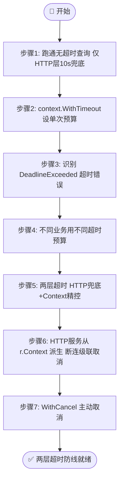
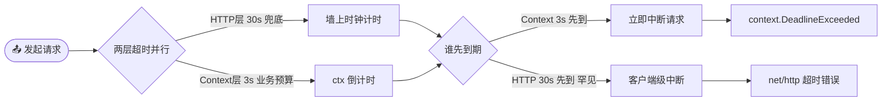

# 🎓 为请求加超时

> 网络请求天生不可靠。本篇带你用 `context.WithTimeout` 为每一次 ipapi.co 查询精确设定期限——从单次超时、超时错误识别，到 HTTP 服务里让客户端断连自动级联取消。

::: tip 🎨 一图抵千言
本教程从「为什么不设超时危险」起步，逐步引入单次 Context 超时、错误识别、两层超时防线、HTTP 服务级联取消，最后到主动取消。
:::



## 🎯 你将学到

- ⏱ 理解为什么超时要「每次请求单独设」，而不是在客户端初始化时一刀切
- 🛠 用 `context.WithTimeout` 为 [`GetIPInfo`](../api/get-ip-info) 等方法设置单次调用预算
- 🔍 用 `errors.Is(err, context.DeadlineExceeded)` 精准识别超时错误
- 🧬 搭配 `http.Client.Timeout` 兜底，构建「两层超时」防线
- 🌐 在 HTTP 服务里从 `r.Context()` 派生 ctx，让客户端断连级联取消上游查询
- 🚫 用 `context.WithCancel` 主动中断在途请求

## ✅ 前置条件

- 🐹 已安装 **Go 1.21+**（推荐 1.23+，运行 `go version` 检查）
- ✅ 完成教程：[第一个 IP 查询](./hello-ipapi)（能跑通一次基础查询）
- 📚 了解 [`NewClient`](../api/new-client) 与 [`GetIPInfo`](../api/get-ip-info) 的基本用法
- 🧠 大致了解 Go 标准库 `context` 包的 `WithTimeout` / `WithCancel` / `Background` 概念（不懂也没关系，本篇会边写边讲）

::: tip 💡 还没装好？
请先阅读 [安装指南](../guide/installation)，把 SDK 加入你的 `go.mod`。
:::

## 🧠 为什么必须设超时

[`NewClient`](../api/new-client) 默认给底层 `http.Client` 设了 `10 * time.Second` 的兜底超时（见 [`defaultTimeout`](../reference/internal/default-timeout)），同时所有查询方法的第一个参数都是 `context.Context`，请求内部通过 `http.NewRequestWithContext(ctx, ...)` 透传。这意味着超时**天然分两层**：

| 层级 | 谁控制 | 粒度 | 角色 |
| --- | --- | --- | --- |
| 🥇 HTTP 层 | `http.Client.Timeout` | 客户端全局 | **兜底**——防止任何一次请求无限挂起 |
| 🥈 Context 层 | `context.WithTimeout` | 单次调用 | **业务级**——按调用方预算精确控制 |

两层各司其职：HTTP 层是「安全网」，Context 层是「业务预算」，取**更短者**生效。如果完全不设 Context 超时、又把 HTTP 超时调高或设 `0`，一个慢请求就可能占满 goroutine，在 Web 服务里把请求池拖垮、甚至形成雪崩。详见 [超时策略最佳实践](../best-practices/timeout-strategy)。

::: tip 🎨 两层超时如何取更短者
HTTP 层超时覆盖整次请求（DNS+连接+TLS+读 body），Context 层超时随 ctx 透传到 `http.NewRequestWithContext`，两者并行倒计时，先到期的先生效。
:::



> 📌 **关键点**：本教程的主角是 **Context 层**。它让不同业务用不同预算——登录校验给 1s，批量补全给 30s，互不影响，且与 HTTP handler 的 `r.Context()` 天然衔接。

## 🪜 步骤 1：创建项目并跑通一次无超时查询

先初始化一个最小项目，确认环境正常：

```bash
mkdir context-timeout-demo && cd context-timeout-demo
go mod init context-timeout-demo
go get github.com/cyberspacesec/ipapi.co-skills/pkg/ipapi
```

新建 `main.go`，先用 `context.Background()` 跑通一次查询（此时只有 HTTP 层 10s 兜底）：

```go
package main

import (
	"context"
	"fmt"
	"log"

	"github.com/cyberspacesec/ipapi.co-skills/pkg/ipapi"
)

func main() {
	client := ipapi.NewClient()

	// 注意：这里没有设 Context 超时，只靠 HTTP 层 10s 兜底
	info, err := client.GetIPInfo(context.Background(), "8.8.8.8", "json")
	if err != nil {
		log.Fatalf("查询失败: %v", err)
	}
	fmt.Printf("IP: %s | 国家: %s\n", info.IP, info.CountryName)
}
```

运行确认无误后再继续：

```bash
go run main.go
```

> ⚠️ **注意**：`context.Background()` 永不超时、永不被取消。本步只是用来跑通环境，**生产代码不要这样写**——后面几步会逐步把它换成带超时的 ctx。

## ⏱ 步骤 2：用 context.WithTimeout 为单次查询设超时

最核心的一步：用 `context.WithTimeout` 创建一个带期限的 ctx，传给 [`GetIPInfo`](../api/get-ip-info) 的第一个参数。超时随 ctx 透传进底层 HTTP 请求，到点会**立即中断**在途调用。

```go
package main

import (
	"context"
	"fmt"
	"log"
	"time"

	"github.com/cyberspacesec/ipapi.co-skills/pkg/ipapi"
)

func main() {
	client := ipapi.NewClient()

	// ① 为这次查询设置 5 秒超时预算
	ctx, cancel := context.WithTimeout(context.Background(), 5*time.Second)
	// ② 别忘了释放——否则泄漏计时器/资源
	defer cancel()

	// ③ 超时随 ctx 传进去；5s 内未返回则请求被中断
	info, err := client.GetIPInfo(ctx, "8.8.8.8", "json")
	if err != nil {
		log.Fatalf("查询失败: %v", err)
	}
	fmt.Printf("IP: %s | 国家: %s | 超时预算: 5s\n", info.IP, info.CountryName)
}
```

::: warning ⚠️ 别忘 defer cancel()
`WithTimeout` 返回的 ctx **必须**调用 `cancel()`，否则会泄漏内部计时器/ goroutine。习惯上紧跟 `defer cancel()`。即使请求已提前返回，`cancel` 也是安全的——它只是释放 ctx 占用的资源。
:::

> 💡 **小贴士**：为什么「每次请求单独设」？因为不同业务合理超时不同——详情查询需要宽一点，单字段查询可以快速失败。若在 `NewClient` 时设一个固定超时让所有请求共用，慢请求会拖累快请求。详见 FAQ：[超时怎么设](../faq/context-timeout)。

## 🔍 步骤 3：识别超时错误（DeadlineExceeded）

当 ctx 超时，[`GetIPInfo`](../api/get-ip-info) 返回的错误是 `context.DeadlineExceeded`（可能被 `fmt.Errorf("%w", ...)` 包装）。**不要**用字符串匹配，要用 `errors.Is` 精准识别，并对超时做降级或重试：

```go
package main

import (
	"context"
	"errors"
	"fmt"
	"log"
	"time"

	"github.com/cyberspacesec/ipapi.co-skills/pkg/ipapi"
)

func main() {
	client := ipapi.NewClient()

	// 故意设一个极短超时，模拟上游慢响应触发超时
	ctx, cancel := context.WithTimeout(context.Background(), 1*time.Millisecond)
	defer cancel()

	info, err := client.GetIPInfo(ctx, "8.8.8.8", "json")
	switch {
	case err == nil:
		fmt.Printf("IP: %s | 国家: %s\n", info.IP, info.CountryName)
	case errors.Is(err, context.DeadlineExceeded):
		// Context 超时——通常是上游慢，可降级或重试
		log.Printf("⏱ 查询超时（1ms 预算太短）: %v", err)
	default:
		log.Fatalf("查询失败: %v", err)
	}
}
```

> 🧬 **原理**：SDK 的 `doRequest` 把 ctx 透传给 `http.NewRequestWithContext`。Go 的 `net/http` 在 ctx 到期时会主动关闭底层连接，正在读 body 的调用立即收到 `context.DeadlineExceeded`，无需自己管定时器。

::: tip 💡 DeadlineExceeded vs Canceled
- `DeadlineExceeded`：时间到了，可考虑降级或重试。
- `Canceled`：有人主动 `cancel()` 或上游断连，重试无意义，应快速退出。
- 两者都通过 `errors.Is` 判定，兼容 `fmt.Errorf("...: %w", err)` 的包装。
:::

::: details 🧰 超时预算建议起点
| 业务场景 | 建议 Context 预算 | 理由 |
| --- | --- | --- |
| 单字段查询 `GetField` | 800ms~1s | 数据量小，快速失败 |
| 详情查询 `GetIPInfo` | 3~5s | 需覆盖默认重试链路（3 次 + 2×500ms） |
| HTTP handler 内调用 | 与上游请求预算挂钩，通常 3s | 客户端断连需级联取消 |
| 批量补全 | 30s+ | 允许多次重试与排队 |
| 关闭重试 `Retries=0` | 可压到 1~2s | 无退避等待，单次请求为主 |

::: warning ⚠️ 别用字符串匹配判超时
`strings.Contains(err.Error(), "deadline exceeded")` 在错误被包装后可能失效。永远用 `errors.Is(err, context.DeadlineExceeded)`。
:::
:::

## 🎯 步骤 4：不同业务用不同超时预算

Context 超时是「单次调用」粒度，可以按业务差异化。详情查询给宽一点，单字段查询快速失败，互不影响：

```go
package main

import (
	"context"
	"fmt"
	"log"
	"time"

	"github.com/cyberspacesec/ipapi.co-skills/pkg/ipapi"
)

func main() {
	client := ipapi.NewClient()

	// 详情查询：给宽一点（5s），覆盖默认重试链路
	func() {
		ctx, cancel := context.WithTimeout(context.Background(), 5*time.Second)
		defer cancel()
		info, err := client.GetIPInfo(ctx, "8.8.8.8", "json")
		if err != nil {
			log.Printf("详情查询失败: %v", err)
			return
		}
		fmt.Printf("[详情] %s -> %s\n", info.IP, info.CountryName)
	}()

	// 单字段查询：快速失败（800ms）
	func() {
		ctx, cancel := context.WithTimeout(context.Background(), 800*time.Millisecond)
		defer cancel()
		country, err := client.GetField(ctx, "8.8.8.8", "country")
		if err != nil {
			log.Printf("单字段查询失败: %v", err)
			return
		}
		fmt.Printf("[单字段] country=%s\n", country)
	}()
}
```

> ⚠️ **注意超时与重试的关系**：SDK 默认 `Retries=2`、重试间隔 `500ms`（[`defaultRetryDelay`](../reference/internal/default-retry-delay)）。最坏情况耗时约为 `3 次请求 × 单次耗时 + 2 × 500ms`。**Context 超时覆盖整段重试链路**，设得过短会把「本可重试成功」的请求提前掐死。短超时场景请给足预算（默认重试下至少 3~5s），或调小 `Retries`。

## 🧬 步骤 5：两层超时——HTTP 兜底 + Context 精控

HTTP 层超时（`http.Client.Timeout`）是「全局安全网」，Context 层是「业务预算」。两层并存时先到期的先生效。下面用 [`WithCustomHTTPClient`](../api/with-custom-http-client) 把 HTTP 层调高作兜底，再用 Context 设更短的预算作主控：

```go
package main

import (
	"context"
	"fmt"
	"log"
	"net/http"
	"time"

	"github.com/cyberspacesec/ipapi.co-skills/pkg/ipapi"
)

func main() {
	// HTTP 层兜底 30s（覆盖默认 10s），防止极端情况下无限挂起
	client := ipapi.NewClient(
		ipapi.WithCustomHTTPClient(&http.Client{
			Timeout: 30 * time.Second,
		}),
	)

	// Context 层 3s——比 HTTP 层短，先触发，作为业务主控
	ctx, cancel := context.WithTimeout(context.Background(), 3*time.Second)
	defer cancel()

	info, err := client.GetIPInfo(ctx, "8.8.8.8", "json")
	if err != nil {
		log.Fatalf("查询失败: %v", err)
	}
	fmt.Printf("IP: %s | 国家: %s | HTTP兜底: 30s | Context: 3s\n", info.IP, info.CountryName)
}
```

::: warning ⚠️ 别设 http.Client.Timeout 为 0
`0` 在 `net/http` 里表示**无超时**，等于拆掉兜底。除非你 100% 确定每次调用都带 Context 超时，否则别这么干。两层叠加才能既灵活又有兜底——详见 [超时策略](../best-practices/timeout-strategy)。
:::

## 🌐 步骤 6：HTTP 服务里从 r.Context() 派生

服务端最危险的是「客户端已断开，后端还在查 IP」。正确做法是从请求的 `r.Context()` 派生子 ctx——客户端断连时 `r.Context()` 自动取消，级联中断上游 ipapi 查询；再叠加自己的预算上限，防止上游慢响应拖垮本服务：

```go
package main

import (
	"context"
	"encoding/json"
	"errors"
	"log"
	"net/http"
	"time"

	"github.com/cyberspacesec/ipapi.co-skills/pkg/ipapi"
)

func main() {
	client := ipapi.NewClient()

	mux := http.NewServeMux()
	mux.HandleFunc("/lookup", func(w http.ResponseWriter, r *http.Request) {
		// 客户端断开 → r.Context() 取消 → ipapi 请求立即中断
		// 同时叠加 3s 预算，防止上游慢响应拖垮本服务
		ctx, cancel := context.WithTimeout(r.Context(), 3*time.Second)
		defer cancel()

		ip := r.URL.Query().Get("ip")
		info, err := client.GetIPInfo(ctx, ip, "json")
		switch {
		case err == nil:
			_ = json.NewEncoder(w).Encode(info)
		case errors.Is(err, context.Canceled):
			// 客户端已走，无需回写
			return
		case errors.Is(err, context.DeadlineExceeded):
			http.Error(w, "query timed out", http.StatusGatewayTimeout)
		default:
			http.Error(w, err.Error(), http.StatusBadGateway)
		}
	})

	log.Println("listening on :8080")
	log.Fatal(http.ListenAndServe(":8080", mux))
}
```

测试：在另一个终端执行 `curl 'http://localhost:8080/lookup?ip=8.8.8.8'`，正常返回 JSON；若在 3s 内用 `Ctrl+C` 中断 curl，后端查询也会随之取消。

> 📌 **关键**：handler 里**别用 `context.Background()` 派生**。那样客户端断开后请求仍在空跑。永远从 `r.Context()` 派生，让断连级联取消。

## 🚫 步骤 7：主动取消（WithCancel）

除超时外，`context.WithCancel` 支持业务侧主动中断——比如用户点了「取消」按钮，或并发查询里某一路先拿到结果就停掉其他路。取消会立即中断在途的 HTTP 调用，而不是干等：

```go
package main

import (
	"context"
	"errors"
	"fmt"
	"log"
	"time"

	"github.com/cyberspacesec/ipapi.co-skills/pkg/ipapi"
)

func main() {
	client := ipapi.NewClient()

	ctx, cancel := context.WithCancel(context.Background())
	defer cancel()

	// 模拟业务侧在 100ms 后主动取消
	go func() {
		time.Sleep(100 * time.Millisecond)
		cancel()
	}()

	_, err := client.GetIPInfo(ctx, "8.8.8.8", "json")
	switch {
	case err == nil:
		fmt.Println("查询成功（未在 100ms 内被取消）")
	case errors.Is(err, context.Canceled):
		log.Printf("🚫 查询被主动取消: %v", err)
	default:
		log.Fatalf("查询失败: %v", err)
	}
}
```

> 🧠 **原理**：`WithCancel` 与 `WithTimeout` 共享同一套取消机制。`WithTimeout` 等价于「到点自动 `cancel()`」，所以业务侧主动 `cancel()` 和超时到点对底层 HTTP 请求的效果完全一致——都是立即关闭连接。

## 📝 完整代码

下面是整合了「每次请求单独设超时 + 错误识别 + 两层超时 + HTTP 服务派生」的完整可运行示例。把它存为 `main.go` 即可运行：

```go
package main

import (
	"context"
	"encoding/json"
	"errors"
	"fmt"
	"log"
	"net/http"
	"time"

	"github.com/cyberspacesec/ipapi.co-skills/pkg/ipapi"
)

func main() {
	// HTTP 层兜底 30s，作安全网；Context 层按业务精控
	client := ipapi.NewClient(
		ipapi.WithCustomHTTPClient(&http.Client{
			Timeout: 30 * time.Second,
		}),
	)

	// ① 单次查询：5s 预算 + 错误识别
	lookupOnce(client)

	// ② HTTP 服务：从 r.Context() 派生，断连级联取消
	serve(client)
}

// lookupOnce 演示单次调用的 Context 超时与错误识别
func lookupOnce(client *ipapi.Client) {
	ctx, cancel := context.WithTimeout(context.Background(), 5*time.Second)
	defer cancel()

	info, err := client.GetIPInfo(ctx, "8.8.8.8", "json")
	switch {
	case err == nil:
		fmt.Printf("🌐 [单次] %s -> %s (%s)\n", info.IP, info.CountryName, info.CountryCode)
	case errors.Is(err, context.DeadlineExceeded):
		log.Printf("⏱ [单次] 查询超时: %v", err)
	default:
		log.Printf("[单次] 查询失败: %v", err)
	}
}

// serve 启动一个 HTTP 服务，演示从 r.Context() 派生 ctx
func serve(client *ipapi.Client) {
	mux := http.NewServeMux()
	mux.HandleFunc("/lookup", func(w http.ResponseWriter, r *http.Request) {
		// 客户端断开 → r.Context() 取消 → ipapi 请求取消；再叠加 3s 预算
		ctx, cancel := context.WithTimeout(r.Context(), 3*time.Second)
		defer cancel()

		ip := r.URL.Query().Get("ip")
		info, err := client.GetIPInfo(ctx, ip, "json")
		switch {
		case err == nil:
			_ = json.NewEncoder(w).Encode(info)
		case errors.Is(err, context.Canceled):
			return // 客户端已走，无需回写
		case errors.Is(err, context.DeadlineExceeded):
			http.Error(w, "query timed out", http.StatusGatewayTimeout)
		default:
			http.Error(w, err.Error(), http.StatusBadGateway)
		}
	})

	log.Println("listening on :8080")
	log.Fatal(http.ListenAndServe(":8080", mux))
}
```

## 🖥 运行结果

先跑 `lookupOnce` 阶段（HTTP 服务随后启动并阻塞）。在网络正常时，预期输出类似：

```text
🌐 [单次] 8.8.8.8 -> United States (US)
2026/07/03 20:30:00 listening on :8080
```

在另一个终端发起请求：

```bash
curl -s 'http://localhost:8080/lookup?ip=8.8.8.8' | jq '{ip, country_name, city}'
```

预期返回：

```json
{
  "ip": "8.8.8.8",
  "country_name": "United States",
  "city": "Mountain View"
}
```

若把步骤 3 的 `1ms` 极短超时代入，会落在超时分支：

```text
2026/07/03 20:30:01 ⏱ 查询超时（1ms 预算太短）: context deadline exceeded
```

> 🐛 **排错**：如果看到 `context deadline exceeded` 但你设的超时并不短，多半是上游真的慢或网络不通。先确认能访问 `https://ipapi.co/`，再考虑调高预算或排查代理。

## ✅ 小结

- ⏱ 所有查询方法的第一个参数都是 `context.Context`，超时随 ctx 透传到底层 HTTP 请求并**立即中断**在途调用
- 🛠 `context.WithTimeout` 按「单次调用」粒度设预算，不同业务可差异化，比客户端级固定超时更灵活
- 🧬 搭配 `http.Client.Timeout`（默认 10s）作兜底，构成「两层超时」，取更短者生效
- 🔍 用 `errors.Is(err, context.DeadlineExceeded)` / `context.Canceled` 精准识别超时与取消，**不要**用字符串匹配
- 🌐 HTTP handler 里从 `r.Context()` 派生 ctx，让客户端断连级联取消上游查询
- 🚫 `WithCancel` 支持业务侧主动中断；`WithTimeout` 等价于「到点自动 cancel」
- ⚠️ 每一个 `WithTimeout` / `WithCancel` 都紧跟 `defer cancel()`，避免泄漏计时器

::: tip 💡 记住一句话
HTTP 层超时是「保险丝」，Context 层超时是「业务预算」。两者缺一不可，**先到期的先生效**。
:::

## 🚀 下一步

- 📖 深入阅读 [Context 超时控制指南](../guide/context) 与 [超时策略最佳实践](../best-practices/timeout-strategy)
- 📚 浏览 API 参考：[`GetIPInfo`](../api/get-ip-info)、[`GetField`](../api/get-field)、[`NewClient`](../api/new-client)、[Options 选项](../api/options)
- 🍳 学实战配方：[异步并发查询](../cookbook/async-lookup)、[缓存查询](../cookbook/cached-lookup)
- ❓ 看 FAQ：[超时怎么设](../faq/context-timeout)
- 🛠 了解 [自定义 HTTP 客户端](./custom-http-tutorial)，配合 `http.Transport` 调优细粒度超时（`DialContext`、`ResponseHeaderTimeout`）
- ➡️ 继续下一篇教程：[加限流器](./rate-limit-tutorial)
