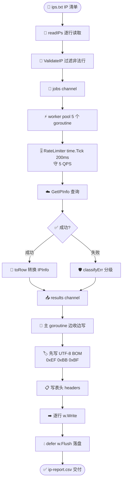
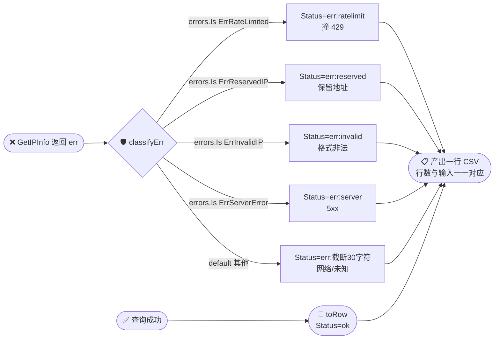

# 🎓 生成 CSV 报表：批量查询导出 CSV

> 一串 IP 进来，一张规整的 CSV 报表出去——能直接丢进 Excel、BI 工具或数据管道。本教程手把手带你用 `ipapi.co-skills` 并发查一批 IP，抽字段、加限流、容错兜底，最后落盘成标准 CSV。

CSV（Comma-Separated Values）是数据流转的「最大公约数」：安全运营要审日志、数据团队要建地理维度表、运维要盘点 CDN 节点——下游几乎都能吃 CSV。本教程教你把 ipapi.co 返回的 `IPInfo` 结构体里的字段，按固定列顺序、统一格式写成 CSV，并且做到**并发提速但不撞限流、单条失败不丢行**。

## 你将学到

- 📄 用标准库 `encoding/csv` 生成带表头的 CSV 报表文件
- 🚀 用 worker pool 并发批量查询 IP，配合 `RateLimiter` 守住速率上限
- 🛡️ 用 `errors.Is` 对失败查询做错误分级（`ErrRateLimited` / `ErrReservedIP` / 网络），失败也产出一行
- 🧩 把 `IPInfo` 的字段（含 `*string` 类型的 `Postal`）安全转成 CSV 单元格
- 📝 写入 UTF-8 BOM，让 Excel 正确识别中文国家名 / 城市名，避免乱码
- 🔄 用 `bufio.Scanner` 从文件读 IP 列表，把硬编码示例扩展成上万条的真实场景

::: tip 🎨 一图抵千言
下面这张流程图概括了本教程的完整数据流：从一份 IP 清单文件，到 worker pool 并发查询，再到流式写盘成带 BOM 的 CSV。
:::



| 阶段 | 关键组件 | 速率/容量约束 |
|------|----------|---------------|
| 读文件 | `bufio.Scanner` + `ValidateIP` | 无限制，CPU 密集 |
| 并发查询 | worker pool (5 goroutine) | 受 `RateLimiter` 卡 5 QPS |
| 错误分级 | `classifyErr` + `errors.Is` | 失败也产出一行 |
| 写盘 | `csv.Writer` + BOM | 流式，内存仅驻留少数 row |

## 前置条件

在开始之前，请确认你已经具备：

- 🐹 **Go `1.23.4` 或更高版本**（本库 `go.mod` 声明 `go 1.23.4`）
- 📦 已完成 [安装指南](../guide/installation)，能在项目里 `import "github.com/cyberspacesec/ipapi.co-skills/pkg/ipapi"`
- 🧭 已读完 [创建你的第一个 Client](./first-client)，理解 `NewClient` 的默认值与「Client 应全局复用」的原则
- ⚡ 已读完 [批量查询一百个 IP](./batch-tutorial)，掌握 goroutine + `sync.WaitGroup` + `RateLimiter` 的并发限流套路
- 🌐 一台能访问 `https://ipapi.co` 的机器；批量查询建议**申请 API Key**，免费额度约 1000 次/天，无 Key 时速率更受限

::: tip 💡 为什么要 API Key？
免费额度无需 Key 也能跑通本教程，但匿名调用的并发与速率限制更严，更容易撞 `429`。生产批量场景请务必配置 Key——参考 [配置 API Key](./apikey-setup)。配额规划见 [批量查询指南](../guide/batch)。
:::

::: tip 🍳 已有现成食谱？
本教程与 Cookbook 里的 [CSV 导出](../cookbook/csv-export) 是同一主题的两种讲法：Cookbook 给「完整可粘贴方案」，本教程给「循序渐进的拆解」。两者可对照阅读。
:::

## 步骤 1：定义报表行结构与表头

CSV 的核心是「列顺序固定、每行同构」。第一步先把**一行记录**抽象成 Go 结构体，并固定表头顺序。这步定下后，后面查询、写盘都围绕这个结构展开。

关键点：
- ✅ 用 `csvRow` 结构体保存一行——查询成功的填满字段，失败的只填 `IP` 和 `Status`
- ✅ `Status` 列用 `ok` 或 `err:<原因>` 标记，方便下游按状态过滤
- ✅ `RetrievedAt` 来自 `IPInfo.RetrievedAt`（SDK 在解析时自动写入的 UTC 时间戳），便于报表对账

```go
package main

import (
	"fmt"
	"time"

	"github.com/cyberspacesec/ipapi.co-skills/pkg/ipapi"
)

// csvRow 对应 CSV 报表中的一行。失败查询也会产生一行，Status 标记 ok/err。
type csvRow struct {
	IP          string
	CountryCode string
	CountryName string
	City        string
	Region      string
	Postal      string
	Latitude    string
	Longitude   string
	Timezone    string
	ASN         string
	Org         string
	Status      string // ok 或 err:<原因简述>
	RetrievedAt string
}

// headers 定义 CSV 的列顺序，改这里即可调整报表列。
var headers = []string{
	"ip", "country_code", "country_name", "city", "region",
	"postal", "latitude", "longitude", "timezone",
	"asn", "org", "status", "retrieved_at",
}

// toRow 把一个 IPInfo 转成 csvRow。字段全集见 IPInfo 模型：
// https://github.com/cyberspacesec/ipapi.co-skills/blob/main/pkg/ipapi/models.go
func toRow(info *ipapi.IPInfo) csvRow {
	return csvRow{
		IP:          info.IP,
		CountryCode: info.CountryCode,
		CountryName: info.CountryName,
		City:        info.City,
		Region:      info.Region,
		Postal:      info.GetPostal(), // 处理 *string 的 nil 情况
		Latitude:    fmt.Sprintf("%f", info.Latitude),
		Longitude:   fmt.Sprintf("%f", info.Longitude),
		Timezone:    info.Timezone,
		ASN:         info.ASN,
		Org:         info.Org,
		Status:      "ok",
		RetrievedAt: info.RetrievedAt.Format(time.RFC3339),
	}
}

func main() {
	// 先打印表头，确认结构定义无误
	fmt.Println("CSV 表头：")
	fmt.Println(headers)
}
```

运行确认结构就绪：

```bash
go run main.go
```

预期输出：

```
CSV 表头：
[ip country_code country_name city region postal latitude longitude timezone asn org status retrieved_at]
```

::: warning ⚠️ `Postal` 是 `*string`，直接解引用会 panic
`IPInfo.Postal` 的类型是 `*string`——保留 IP、部分海外地址等场景下它可能是 `nil`。直接写 `*info.Postal` 会触发空指针 panic。SDK 提供了 [`GetPostal()`](../api/models) 方法安全取值：`nil` 时返回空串，正好对应 CSV 的空单元格。本步骤用 `info.GetPostal()` 兜底。
:::

::: details 🔍 字段全集在哪里看？
`IPInfo` 共有 30+ 字段（`CountryCapital`、`Currency`、`Languages`、`CountryPopulation`、`ContinentCode` 等）。想加列只需在 `csvRow` 加字段、在 `headers` 加列名、在 `toRow` 赋值即可。完整字段定义见 [IPInfo 模型](../api/models) 与各字段参考（如 [country_name](../reference/fields/country_name)、[asn](../reference/fields/asn)）。
:::

## 步骤 2：从文件读 IP 列表

真实场景的 IP 来自日志、威胁情报或巡检清单，通常是一行一个 IP 的文本文件。本步用 `bufio.Scanner` 逐行读取，并用 `ipapi.ValidateIP` 在入队前过滤掉非法行和注释行。

```go
package main

import (
	"bufio"
	"fmt"
	"os"
	"strings"

	"github.com/cyberspacesec/ipapi.co-skills/pkg/ipapi"
)

// readIPs 从文件逐行读取 IP，自动跳过空行、注释行和非法 IP。
func readIPs(path string) ([]string, error) {
	f, err := os.Open(path)
	if err != nil {
		return nil, err
	}
	defer f.Close()

	var ips []string
	scanner := bufio.NewScanner(f)
	lineNo := 0
	for scanner.Scan() {
		lineNo++
		line := strings.TrimSpace(scanner.Text())
		if line == "" || strings.HasPrefix(line, "#") {
			continue
		}
		if err := ipapi.ValidateIP(line); err != nil {
			fmt.Printf("⚠️ 第 %d 行非法 IP，跳过: %s\n", lineNo, line)
			continue
		}
		ips = append(ips, line)
	}
	return ips, scanner.Err()
}

func main() {
	// 示例：先把一份 IP 写到临时文件演示读取
	const path = "ips.txt"
	content := "# 可疑 IP 清单\n8.8.8.8\n1.1.1.1\nnot-an-ip\n9.9.9.9\n"
	if err := os.WriteFile(path, []byte(content), 0644); err != nil {
		fmt.Printf("写示例文件失败: %v\n", err)
		return
	}

	ips, err := readIPs(path)
	if err != nil {
		fmt.Printf("读取失败: %v\n", err)
		return
	}
	fmt.Printf("读入 %d 个合法 IP: %v\n", len(ips), ips)
}
```

预期输出：

```
⚠️ 第 4 行非法 IP，跳过: not-an-ip
读入 3 个合法 IP: [8.8.8.8 1.1.1.9 9.9.9.9]
```

::: tip 🧠 为什么要在入队前校验？
`GetIPInfo` 内部第一步就是 `ValidateIP`，非法 IP 会直接返回 [`ErrInvalidIP`](../reference/errors/err-invalid-ip)。在入队前过滤可以**省一个 goroutine 的开销**，也让日志更干净。如果你希望非法 IP 也出现在报表里（用于对账），则不要过滤，直接入队，让查询失败走 `err:invalid` 分支即可。
:::

## 步骤 3：并发查询 + 限流 + 容错

把 IP 列表喂给 worker pool 并发查询。每个 worker 从 `jobs` 通道取 IP，调 `GetIPInfo`，把结果（成功或失败）塞回 `results` 通道。用 `RateLimiter` 把整体速率卡在免费档可承受的范围（约 5 QPS）。

失败查询用 `errors.Is` 分级，写到 `Status` 列：

| 错误 | 含义 | Status 标记 |
|------|------|-------------|
| `ErrRateLimited` | 撞 `429`，速率太快 | `err:ratelimit` |
| `ErrReservedIP` | 私有/保留地址（如 `203.0.113.5`） | `err:reserved` |
| `ErrInvalidIP` | IP 格式非法 | `err:invalid` |
| `ErrServerError` | 服务端 5xx | `err:server` |
| 其他 | 网络/未知 | `err:<简述>` |

```go
package main

import (
	"context"
	"errors"
	"fmt"
	"os"
	"sync"
	"time"

	"github.com/cyberspacesec/ipapi.co-skills/pkg/ipapi"
)

// classifyErr 把查询错误归类成简短的 Status 标签。
func classifyErr(err error) string {
	switch {
	case errors.Is(err, ipapi.ErrRateLimited):
		return "err:ratelimit"
	case errors.Is(err, ipapi.ErrReservedIP):
		return "err:reserved"
	case errors.Is(err, ipapi.ErrInvalidIP):
		return "err:invalid"
	case errors.Is(err, ipapi.ErrServerError):
		return "err:server"
	default:
		return "err:" + truncate(err.Error(), 30)
	}
}

// truncate 把字符串截断到 maxLen，超出加省略号。
func truncate(s string, maxLen int) string {
	if len(s) <= maxLen {
		return s
	}
	return s[:maxLen-1] + "…"
}

// lookupWorker 从 jobs 取 IP 查询，把 csvRow 写回 results。
func lookupWorker(ctx context.Context, client *ipapi.Client, jobs <-chan string, results chan<- csvRow, wg *sync.WaitGroup) {
	defer wg.Done()
	for ip := range jobs {
		row := csvRow{IP: ip}

		info, err := client.GetIPInfo(ctx, ip, "json")
		if err != nil {
			row.Status = classifyErr(err)
			results <- row
			continue
		}
		results <- toRow(info)
	}
}

func main() {
	client := ipapi.NewClient(
		ipapi.WithAPIKey(os.Getenv("IPAPI_KEY")),
	)
	// 限流：每 200ms 放行一个请求 = 5 QPS，守免费档边界
	client.RateLimiter = time.Tick(200 * time.Millisecond)

	ips := []string{"8.8.8.8", "1.1.1.1", "203.0.113.5", "9.9.9.9"}

	ctx, cancel := context.WithTimeout(context.Background(), 2*time.Minute)
	defer cancel()

	const concurrency = 5
	jobs := make(chan string, len(ips))
	results := make(chan csvRow, len(ips))
	var wg sync.WaitGroup

	for i := 0; i < concurrency; i++ {
		wg.Add(1)
		go lookupWorker(ctx, client, jobs, results, &wg)
	}
	for _, ip := range ips {
		jobs <- ip
	}
	close(jobs)

	go func() {
		wg.Wait()
		close(results)
	}()

	var rows []csvRow
	okCount, errCount := 0, 0
	for r := range results {
		if r.Status == "ok" {
			okCount++
		} else {
			errCount++
		}
		rows = append(rows, r)
	}

	fmt.Printf("成功 %d，失败 %d\n", okCount, errCount)
	for _, r := range rows {
		fmt.Printf("[%s] %s\n", r.IP, r.Status)
	}
}
```

预期输出（`203.0.113.5` 是文档示例保留地址，API 会返回 reserved）：

```
成功 3，失败 1
[8.8.8.8] ok
[1.1.1.1] ok
[203.0.113.5] err:reserved
[9.9.9.9] ok
```

::: tip 🧠 为什么失败也产出一行？
报表行数与输入 IP 数一一对应，才能和原始清单逐行对账、做漏查补查。如果失败就跳过，CSV 行数对不上，下游 BI 工具按行 join 时会错位。`Status` 列同时承担了「失败原因」的信息，相当于一份自带审计的报表。
:::

::: warning ⚠️ 限流速率怎么定？
免费匿名调用建议 ≤ 1 QPS；带 Key 的免费额度建议 ≤ 5 QPS（本教程的 200ms = 5 QPS）；付费 Key 可放宽到 10~50 QPS。撞 `429` 是被限流的信号，对应 [`ErrRateLimited`](../reference/errors/err-rate-limited)。撞了就降速或退避，参考 [限流策略](../best-practices/rate-limit-strategy)。
:::

::: details 🧮 限流速率与配额对照表
不同 Key 档位对应的推荐速率与日配额上限，帮你估算批量任务耗时。

| 档位 | 推荐 RateLimiter | 等效 QPS | 日配额(约) | 1000 个 IP 耗时 |
|------|------------------|----------|-----------|-----------------|
| 匿名(无 Key) | `time.Tick(1s)` | 1 QPS | ~1000/天 | ~17 分钟 |
| 免费 Key | `time.Tick(200ms)` | 5 QPS | ~30000/月 | ~3.3 分钟 |
| 付费 Key | `time.Tick(50ms)` | 20 QPS | 按套餐 | ~50 秒 |
| 企业 Key | `time.Tick(20ms)` | 50 QPS | 按套餐 | ~20 秒 |

⚠️ 撞 `429`(`ErrRateLimited`) 时，SDK **不会重试**（4xx 不重试），需自行退避或降速。重试仅对 5xx 与网络错误生效。
:::

## 步骤 4：写 CSV 文件（含 UTF-8 BOM）

拿到 `[]csvRow` 后，用标准库 `encoding/csv` 写文件。两个细节决定体验：

1. **UTF-8 BOM**：Excel 在 Windows 下默认按 GBK 解析 CSV，中文国家名 / 城市名会乱码。写文件前先写 `0xEF 0xBB 0xBF` 三个字节的 BOM，Excel 即可正确识别为 UTF-8。
2. **`csv.Writer.Flush`**：标准库 `csv.Writer` 内部有缓冲，必须 `defer w.Flush()` 落盘。

```go
package main

import (
	"encoding/csv"
	"fmt"
	"os"
)

// writeCSV 把 rows 写入 path 指定的文件，首行为表头，带 UTF-8 BOM。
func writeCSV(path string, rows []csvRow) error {
	f, err := os.Create(path)
	if err != nil {
		return err
	}
	defer f.Close()

	// 写入 UTF-8 BOM，让 Excel 正确识别编码，避免中文乱码
	if _, err := f.Write([]byte{0xEF, 0xBB, 0xBF}); err != nil {
		return err
	}

	w := csv.NewWriter(f)
	defer w.Flush()

	if err := w.Write(headers); err != nil {
		return err
	}

	for _, r := range rows {
		record := []string{
			r.IP, r.CountryCode, r.CountryName, r.City, r.Region,
			r.Postal, r.Latitude, r.Longitude, r.Timezone,
			r.ASN, r.Org, r.Status, r.RetrievedAt,
		}
		if err := w.Write(record); err != nil {
			return err
		}
	}
	return nil
}

func main() {
	// 用一组示例 rows 演示写盘
	rows := []csvRow{
		{IP: "8.8.8.8", CountryCode: "US", CountryName: "United States",
			City: "Mountain View", ASN: "AS15169", Org: "Google LLC",
			Status: "ok", RetrievedAt: "2026-07-03T08:12:00Z"},
		{IP: "203.0.113.5", Status: "err:reserved"},
	}

	const path = "ip-report.csv"
	if err := writeCSV(path, rows); err != nil {
		fmt.Printf("写入失败: %v\n", err)
		return
	}
	fmt.Printf("✅ 已写入 %s，共 %d 行\n", path, len(rows))
}
```

预期输出：

```
✅ 已写入 ip-report.csv，共 2 行
```

`ip-report.csv` 内容：

```csv
ip,country_code,country_name,city,region,postal,latitude,longitude,timezone,asn,org,status,retrieved_at
8.8.8.8,US,United States,Mountain View,,,,,,AS15169,Google LLC,ok,2026-07-03T08:12:00Z
203.0.113.5,,,,,,,,,,,err:reserved,
```

::: details 🔍 BOM 会影响程序读取吗？
Python `csv`、Go `encoding/csv` 等大多数程序读取器会自动忽略或容忍 UTF-8 BOM。如果下游是严格的逐字节解析器，可省略 BOM——只需删掉 `f.Write([]byte{0xEF, 0xBB, 0xBF})` 那一行。本教程默认带 BOM，因为「Excel 能直接打开」是 CSV 报表最常见的交付要求。
:::

## 步骤 5：流式写盘，边查边写

到目前为止，我们是「全部查完 → 一次性写盘」。IP 量上千时，所有 `csvRow` 都堆在内存里不优雅。更省内存的做法是**边查边写**：worker 把 row 塞进 `results`，主 goroutine 一边收一边 `w.Write`，内存占用压到最低。

```go
package main

import (
	"context"
	"encoding/csv"
	"fmt"
	"log"
	"os"
	"sync"
	"time"

	"github.com/cyberspacesec/ipapi.co-skills/pkg/ipapi"
)

func main() {
	client := ipapi.NewClient(
		ipapi.WithAPIKey(os.Getenv("IPAPI_KEY")),
	)
	client.RateLimiter = time.Tick(200 * time.Millisecond)

	ips := []string{"8.8.8.8", "8.8.4.4", "1.1.1.1", "1.0.0.1", "9.9.9.9"}

	ctx, cancel := context.WithTimeout(context.Background(), 2*time.Minute)
	defer cancel()

	// 打开输出文件，先写 BOM 和表头
	f, err := os.Create("ip-report-stream.csv")
	if err != nil {
		log.Fatalf("创建文件失败: %v", err)
	}
	defer f.Close()
	f.Write([]byte{0xEF, 0xBB, 0xBF}) // UTF-8 BOM

	w := csv.NewWriter(f)
	defer w.Flush()
	if err := w.Write(headers); err != nil {
		log.Fatalf("写表头失败: %v", err)
	}

	const concurrency = 5
	jobs := make(chan string, len(ips))
	results := make(chan csvRow, concurrency)
	var wg sync.WaitGroup

	for i := 0; i < concurrency; i++ {
		wg.Add(1)
		go lookupWorker(ctx, client, jobs, results, &wg)
	}
	for _, ip := range ips {
		jobs <- ip
	}
	close(jobs)

	// 单独开一个 goroutine 等 worker 全部退出后关闭 results
	go func() {
		wg.Wait()
		close(results)
	}()

	// 主 goroutine 边收边写：来一行写一行
	okCount, errCount := 0, 0
	for r := range results {
		record := []string{
			r.IP, r.CountryCode, r.CountryName, r.City, r.Region,
			r.Postal, r.Latitude, r.Longitude, r.Timezone,
			r.ASN, r.Org, r.Status, r.RetrievedAt,
		}
		if err := w.Write(record); err != nil {
			log.Printf("写行失败 [%s]: %v", r.IP, err)
		}
		if r.Status == "ok" {
			okCount++
		} else {
			errCount++
		}
	}

	fmt.Printf("✅ 共 %d 个 IP，成功 %d，失败 %d，已流式写入 ip-report-stream.csv\n",
		len(ips), okCount, errCount)
}
```

::: tip 🧠 流式写盘的关键
`results` channel 的缓冲设成 `concurrency` 而非 `len(ips)`——worker 最多同时产出 `concurrency` 条结果，缓冲够用即可，不必预分配全量。主 goroutine 在 `for r := range results` 循环里每来一行就 `w.Write` 一次，内存里同时只驻留极少数 row。最后 `defer w.Flush()` 把缓冲刷盘。
:::

## 完整代码

下面是本教程的汇总版本——一个完整可运行的 `main.go`，覆盖：从文件读 IP → worker pool 并发查询 + 限流 + 容错分级 → 流式写盘成带 BOM 的 CSV。

```go
package main

import (
	"bufio"
	"context"
	"encoding/csv"
	"errors"
	"fmt"
	"log"
	"os"
	"strings"
	"sync"
	"time"

	"github.com/cyberspacesec/ipapi.co-skills/pkg/ipapi"
)

// csvRow 对应 CSV 报表中的一行。失败查询也会产生一行，Status 标记 ok/err。
type csvRow struct {
	IP          string
	CountryCode string
	CountryName string
	City        string
	Region      string
	Postal      string
	Latitude    string
	Longitude   string
	Timezone    string
	ASN         string
	Org         string
	Status      string // ok 或 err:<原因简述>
	RetrievedAt string
}

// headers 定义 CSV 的列顺序，改这里即可调整报表列。
var headers = []string{
	"ip", "country_code", "country_name", "city", "region",
	"postal", "latitude", "longitude", "timezone",
	"asn", "org", "status", "retrieved_at",
}

// toRow 把一个 IPInfo 转成 csvRow。
func toRow(info *ipapi.IPInfo) csvRow {
	return csvRow{
		IP:          info.IP,
		CountryCode: info.CountryCode,
		CountryName: info.CountryName,
		City:        info.City,
		Region:      info.Region,
		Postal:      info.GetPostal(),
		Latitude:    fmt.Sprintf("%f", info.Latitude),
		Longitude:   fmt.Sprintf("%f", info.Longitude),
		Timezone:    info.Timezone,
		ASN:         info.ASN,
		Org:         info.Org,
		Status:      "ok",
		RetrievedAt: info.RetrievedAt.Format(time.RFC3339),
	}
}

// classifyErr 把查询错误归类成简短的 Status 标签。
func classifyErr(err error) string {
	switch {
	case errors.Is(err, ipapi.ErrRateLimited):
		return "err:ratelimit"
	case errors.Is(err, ipapi.ErrReservedIP):
		return "err:reserved"
	case errors.Is(err, ipapi.ErrInvalidIP):
		return "err:invalid"
	case errors.Is(err, ipapi.ErrServerError):
		return "err:server"
	default:
		return "err:" + truncate(err.Error(), 30)
	}
}

// truncate 把字符串截断到 maxLen，超出加省略号。
func truncate(s string, maxLen int) string {
	if len(s) <= maxLen {
		return s
	}
	return s[:maxLen-1] + "…"
}

// readIPs 从文件逐行读取 IP，自动跳过空行、注释行和非法 IP。
func readIPs(path string) ([]string, error) {
	f, err := os.Open(path)
	if err != nil {
		return nil, err
	}
	defer f.Close()

	var ips []string
	scanner := bufio.NewScanner(f)
	for scanner.Scan() {
		line := strings.TrimSpace(scanner.Text())
		if line == "" || strings.HasPrefix(line, "#") {
			continue
		}
		if err := ipapi.ValidateIP(line); err != nil {
			log.Printf("⚠️ 非法 IP，跳过: %s", line)
			continue
		}
		ips = append(ips, line)
	}
	return ips, scanner.Err()
}

// lookupWorker 从 jobs 取 IP 查询，把 csvRow 写回 results。
func lookupWorker(ctx context.Context, client *ipapi.Client, jobs <-chan string, results chan<- csvRow, wg *sync.WaitGroup) {
	defer wg.Done()
	for ip := range jobs {
		row := csvRow{IP: ip}
		info, err := client.GetIPInfo(ctx, ip, "json")
		if err != nil {
			row.Status = classifyErr(err)
			results <- row
			continue
		}
		results <- toRow(info)
	}
}

// writeCSVStream 流式写盘：每来一行写一行，内存占用最低。
func writeCSVStream(path string, headers []string, rows <-chan csvRow) (int, int, error) {
	f, err := os.Create(path)
	if err != nil {
		return 0, 0, err
	}
	defer f.Close()

	f.Write([]byte{0xEF, 0xBB, 0xBF}) // UTF-8 BOM
	w := csv.NewWriter(f)
	defer w.Flush()

	if err := w.Write(headers); err != nil {
		return 0, 0, err
	}

	okCount, errCount := 0, 0
	for r := range rows {
		record := []string{
			r.IP, r.CountryCode, r.CountryName, r.City, r.Region,
			r.Postal, r.Latitude, r.Longitude, r.Timezone,
			r.ASN, r.Org, r.Status, r.RetrievedAt,
		}
		if err := w.Write(record); err != nil {
			return okCount, errCount, err
		}
		if r.Status == "ok" {
			okCount++
		} else {
			errCount++
		}
	}
	return okCount, errCount, nil
}

func main() {
	// 1. 准备客户端（生产环境请用 WithAPIKey 提升速率上限）
	client := ipapi.NewClient(
		ipapi.WithAPIKey(os.Getenv("IPAPI_KEY")),
	)
	client.RateLimiter = time.Tick(200 * time.Millisecond) // 5 QPS

	// 2. 准备一份示例 IP 文件（真实场景换成你的日志/清单）
	const ipPath = "ips.txt"
	sample := "# IP 清单\n8.8.8.8\n8.8.4.4\n1.1.1.1\n1.0.0.1\n9.9.9.9\n149.112.112.112\n208.67.222.222\n203.0.113.5\n"
	if err := os.WriteFile(ipPath, []byte(sample), 0644); err != nil {
		log.Fatalf("写示例文件失败: %v", err)
	}

	ips, err := readIPs(ipPath)
	if err != nil {
		log.Fatalf("读取 IP 失败: %v", err)
	}
	fmt.Printf("待查 IP: %d 个\n", len(ips))

	// 3. 启动 worker pool 并发查询
	ctx, cancel := context.WithTimeout(context.Background(), 5*time.Minute)
	defer cancel()

	const concurrency = 5
	jobs := make(chan string, len(ips))
	results := make(chan csvRow, concurrency)
	var wg sync.WaitGroup

	for i := 0; i < concurrency; i++ {
		wg.Add(1)
		go lookupWorker(ctx, client, jobs, results, &wg)
	}
	for _, ip := range ips {
		jobs <- ip
	}
	close(jobs)

	// 等 worker 全部退出后关闭 results
	go func() {
		wg.Wait()
		close(results)
	}()

	// 4. 流式写盘
	const outPath = "ip-report.csv"
	okCount, errCount, err := writeCSVStream(outPath, headers, results)
	if err != nil {
		log.Fatalf("写 CSV 失败: %v", err)
	}

	fmt.Printf("✅ 共 %d 个 IP，成功 %d，失败 %d，已写入 %s\n",
		len(ips), okCount, errCount, outPath)
}
```

## 运行结果

运行程序：

```bash
go run main.go
```

预期控制台输出（具体城市/ASN 以 ipapi.co 实时返回为准）：

```
待查 IP: 8 个
✅ 共 8 个 IP，成功 7，失败 1，已写入 ip-report.csv
```

生成的 `ip-report.csv`（在 Excel 或 `cat` 中查看；首行的 `` 是 UTF-8 BOM）：

```csv
ip,country_code,country_name,city,region,postal,latitude,longitude,timezone,asn,org,status,retrieved_at
8.8.8.8,US,United States,Mountain View,California,94043,37.405610,-122.077541,America/Los_Angeles,AS15169,Google LLC,ok,2026-07-03T08:12:00Z
8.8.4.4,US,United States,Mountain View,California,94043,37.405610,-122.077541,America/Los_Angeles,AS15169,Google LLC,ok,2026-07-03T08:12:00Z
1.1.1.1,US,United States,,,,-33.494000,143.210400,America/Los_Angeles,AS13335,Cloudflare, Inc.,ok,2026-07-03T08:12:01Z
1.0.0.1,US,United States,,,,-33.494000,143.210400,America/Los_Angeles,AS13335,Cloudflare, Inc.,ok,2026-07-03T08:12:01Z
9.9.9.9,US,United States,New York,New York,,40.712700,-74.006100,America/New_York,AS19281,Quad9,ok,2026-07-03T08:12:01Z
149.112.112.112,US,United States,New York,New York,,40.712700,-74.006100,America/New_York,AS19281,Quad9,ok,2026-07-03T08:12:02Z
208.67.222.222,US,United States,San Francisco,California,,37.769700,-122.393300,America/Los_Angeles,AS36692,Cisco OpenDNS,ok,2026-07-03T08:12:02Z
203.0.113.5,,,,,,,,,,,err:reserved,
```

::: details 🔍 想直接用服务端返回的 CSV？
除了本地拼装，`GetIPInfoRaw(ctx, ip, "csv")` 可让服务端**直接返回单行 CSV 原文**，省去本地字段映射。但它返回的是**单个 IP 的一行**、字段顺序由服务端决定，且不带表头。多 IP 合并时仍需自己处理表头与换行。所以：
- **单 IP、原样存** → 用 `GetIPInfoRaw` + `FormatCSV`，详见 [响应格式](../guide/format-concept) 与 [`GetIPInfoRaw` API](../api/get-ip-info-raw)。
- **多 IP、自定义列、失败兜底** → 用本教程的本地 `encoding/csv` 方案，更灵活可控。
:::

## 小结

- 📄 CSV 报表 = 固定表头 + 同构行；用 `csvRow` 结构体 + `headers` 切片把列顺序定死，改列只动这两处
- 🚀 worker pool + `RateLimiter = time.Tick(200ms)` 并发提速但守 5 QPS，免费档不撞 `429`
- 🛡️ 失败不丢行：`errors.Is` 把 `ErrRateLimited`/`ErrReservedIP`/`ErrInvalidIP`/`ErrServerError` 分级写进 `Status` 列，行数与输入一一对应
- 🧩 `IPInfo.Postal` 是 `*string`，用 `GetPostal()` 安全取值，nil 时返回空串适配空单元格
- 📝 写 UTF-8 BOM（`0xEF 0xBB 0xBF`）让 Excel 正确识别中文；`csv.Writer` 必须 `defer w.Flush()` 落盘
- 🔄 IP 量上千时用**流式写盘**：worker 产出到 channel，主 goroutine 边收边 `w.Write`，内存占用最低
- ⚠️ 生产前先**去重**，重复查同一 IP 会白耗配额；配额规划见 [批量查询指南](../guide/batch)

::: tip 🎨 一图抵千言
下面是错误分级与 Status 列的映射关系，一图看清每种查询失败的最终落点。
:::




## 下一步

恭喜，你已经能批量查询 IP 并生成可交付的 CSV 报表了！继续深入：

- 📖 [批量查询指南](../guide/batch) — 串行 / 并发 / worker pool 三种模式的取舍与配额规划
- 📖 [响应格式](../guide/format-concept) — `json` / `csv` / `yaml` 等格式与 `GetIPInfoRaw` 的关系
- 📖 [上下文与超时](../guide/context) — 用 `context.WithTimeout` 控制批量查询总耗时
- 📘 [`GetIPInfo`](../api/get-ip-info) — 单 IP 完整信息查询入口（本教程核心调用）
- 📘 [`GetIPInfoRaw`](../api/get-ip-info-raw) — 直接拿服务端 CSV 原文的备选方案
- 📘 [`IPInfo` 模型](../api/models) — 全部可导出字段定义，按需挑选报表列
- 📘 [`ValidateIP`](../api/validate-ip) — 入队前校验 IP 合法性
- 🗂 [错误参考](../reference/errors/err-rate-limited) — 全部哨兵错误的触发条件与处理建议
- 🧪 [字段参考](../reference/fields/country_name) — 报表列对应的字段含义（如 [asn](../reference/fields/asn)、[city](../reference/fields/city)、[org](../reference/fields/org)）

实战食谱推荐接着读：

- 🍳 [CSV 导出](../cookbook/csv-export) — 同主题的 Cookbook 版完整方案，可直接粘贴
- 🍳 [缓存查询](../cookbook/cached-lookup) — `sync.Map` 缓存，降低重复 IP 的配额消耗
- 🍳 [定时批量](../cookbook/scheduled-batch) — 结合 cron 定时跑批量任务并生成报表
- 🍳 [日志增强](../cookbook/log-enrichment) — 把 CSV 报表思路用在日志字段补全上

源码可参考仓库示例：[examples/advanced_usage/main.go](https://github.com/cyberspacesec/ipapi.co-skills/blob/main/examples/advanced_usage/main.go)。

下一篇教程：[按 IP 货币本地化](./currency-localization-tutorial)（即将推出）。
