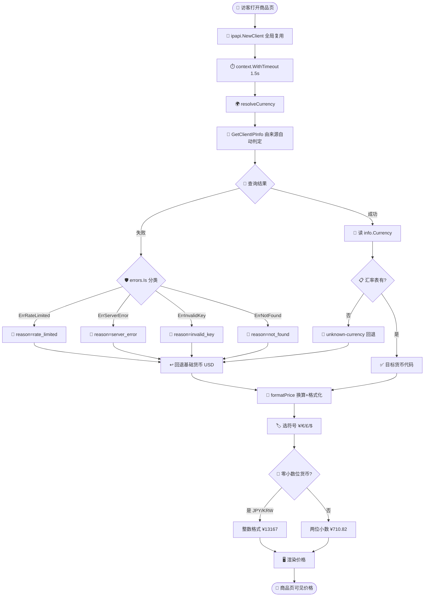

# 🎓 按 IP 货币本地化：电商价格本地化实战

> 当日本东京的访客打开你的商品页时，他期望看到 `¥13,200`，而不是 `$99.00 USD` 再自己心算汇率。本教程带你从零开始，用 `ipapi.co-skills` SDK 把访客 IP 解析为本地货币，并完成价格换算与格式化。

## 🎯 你将学到

- 🌍 用 `GetClientIPInfo` 拿到访客所在国的货币代码与货币名称
- 💱 读取 `IPInfo.Currency` / `IPInfo.CurrencyName` 两个字段
- 💰 维护一份基础货币到目标货币的汇率表，做价格换算
- 🎨 按货币代码选择符号（`¥` / `€` / `£` / `$`）与小数位
- 🛡️ 查询失败或货币不可识别时，优雅回退到基础货币
- ⏱️ 用 `context.WithTimeout` 给单次查询设上限，避免拖慢商品页

::: tip 🎨 一图抵千言
本教程从「访客打开商品页」到「渲染本地货币价格」的完整链路如下，含失败回退分支：
:::



## 📋 前置条件

- ✅ 已安装 **Go 1.21+**（本教程基于 Go 1.23）
- ✅ 已完成 [第一个 IP 查询](./hello-ipapi) 或 [快速入门](../guide/getting-started)，能跑通一次 `GetIPInfo`
- ✅ 了解 `Client` 与 `context` 的基本用法（参见 [客户端概念](../guide/client-concept) 与 [Context](../guide/context)）
- 💡 可选：拥有一个 ipapi.co API Key，用于提升速率限制额度（免费层亦可运行本教程示例）
- 📚 建议先读 [字段概念](../guide/field-concept)，了解 `currency` 字段的含义

## 🚀 步骤 1：初始化项目与客户端

先建一个可运行的项目，并引入 SDK。

```bash
mkdir currency-localization-demo && cd currency-localization-demo
go mod init currency-localization-demo
go get github.com/cyberspacesec/ipapi.co-skills/pkg/ipapi
```

接着写一个最小程序，创建客户端并打印一行确认信息：

```go
package main

import (
	"fmt"
	"log"

	"github.com/cyberspacesec/ipapi.co-skills/pkg/ipapi"
)

func main() {
	// 创建客户端；如有 API Key 可传入 ipapi.WithAPIKey("xxx")
	client := ipapi.NewClient()

	if client == nil {
		log.Fatal("客户端初始化失败")
	}
	fmt.Println("✅ 客户端就绪，准备做货币本地化")
}
```

运行：

```bash
go run main.go
```

预期输出：

```
✅ 客户端就绪，准备做货币本地化
```

## 🌍 步骤 2：拿到访客所在国的货币

`GetClientIPInfo(ctx, "json")` 对应 `GET https://ipapi.co/json/`，由 ipapi.co 根据请求来源 IP 自动判定访客归属，**你不需要解析 `X-Forwarded-For`**。返回的 `IPInfo` 里直接带 `Currency`（ISO 4217 三字母码，如 `JPY`）和 `CurrencyName`（全称，如 `Japanese Yen`）。

为了教程可复现，本步先用一个固定 IP（`8.8.8.8`，归属美国）演示字段读取；下一步再切换到"访客自身 IP"。

```go
package main

import (
	"context"
	"fmt"
	"log"
	"time"

	"github.com/cyberspacesec/ipapi.co-skills/pkg/ipapi"
)

func main() {
	client := ipapi.NewClient()

	ctx, cancel := context.WithTimeout(context.Background(), 5*time.Second)
	defer cancel()

	// 用固定 IP 演示：8.8.8.8 归属美国，货币应为 USD
	info, err := client.GetIPInfo(ctx, "8.8.8.8", "json")
	if err != nil {
		log.Fatalf("查询失败: %v", err)
	}

	fmt.Printf("IP        : %s\n", info.IP)
	fmt.Printf("国家      : %s (%s)\n", info.CountryName, info.CountryCode)
	fmt.Printf("货币代码  : %s\n", info.Currency)
	fmt.Printf("货币名称  : %s\n", info.CurrencyName)
}
```

运行：

```bash
go run main.go
```

预期输出：

```
IP        : 8.8.8.8
国家      : United States (US)
货币代码  : USD
货币名称  : United States Dollar
```

::: tip 为什么直接读 currency 字段？
ipapi.co 已经把"这个 IP 属于哪个国家 → 该国法定货币是什么"这一步映射做完了。你不需要自己维护一份"国家代码 → 货币代码"的对照表，也不会因为国家增减、货币改制而漏更新。字段细节见 [currency 字段参考](../reference/fields/currency) 与 [currency_name 字段参考](../reference/fields/currency_name)。
:::

## 🌐 步骤 3：切换到访客自身 IP

真实场景里，你要本地化的是**当前正在浏览页面的访客**，而不是某个固定 IP。把 `GetIPInfo(ctx, ip, "json")` 换成 `GetClientIPInfo(ctx, "json")`，由 ipapi.co 根据请求来源自动判定：

```go
package main

import (
	"context"
	"fmt"
	"log"
	"time"

	"github.com/cyberspacesec/ipapi.co-skills/pkg/ipapi"
)

func main() {
	client := ipapi.NewClient()

	ctx, cancel := context.WithTimeout(context.Background(), 5*time.Second)
	defer cancel()

	// 不传 IP：由 ipapi.co 根据请求来源自动判定访客
	info, err := client.GetClientIPInfo(ctx, "json")
	if err != nil {
		log.Fatalf("查询访客 IP 失败: %v", err)
	}

	fmt.Printf("访客国家: %s (%s)\n", info.CountryName, info.CountryCode)
	fmt.Printf("本地货币: %s (%s)\n", info.Currency, info.CurrencyName)
}
```

运行：

```bash
go run main.go
```

预期输出（具体国家与货币取决于你的真实出口 IP）：

```
访客国家: China (CN)
本地货币: CNY (Chinese Yuan）
```

::: warning 部署在反向代理后？
`GetClientIPInfo` 拿到的是 ipapi.co 看到的请求来源 IP。如果你在 Nginx / CDN / 负载均衡之后，这个 IP 可能是代理的 IP 而非真实访客。此时应在业务层解析 `X-Forwarded-For` 得到真实 IP，再用 `GetIPInfo(ctx, realIP, "json")` 显式查询。参见 [查询访客自身 IP 指南](../guide/client-ip)。
:::

## 💱 步骤 4：维护汇率表并换算价格

拿到货币代码后，需要把它换成展示金额。做法是：商品在后端以**基础货币**（这里用 `USD`）计价，再乘以"基础货币 → 目标货币"的汇率。本步先做最朴素的换算，不做格式化。

```go
package main

import (
	"context"
	"fmt"
	"log"
	"time"

	"github.com/cyberspacesec/ipapi.co-skills/pkg/ipapi"
)

// 基础货币：所有商品在后端以它计价。
const baseCurrency = "USD"

// rateTable 是基础货币 → 目标货币的汇率表（1 基础货币 = N 目标货币）。
// 生产环境应从汇率供应商定时拉取，这里用静态值演示。
var rateTable = map[string]float64{
	"USD": 1.0,
	"EUR": 0.90,
	"GBP": 0.79,
	"JPY": 133.0,
	"CNY": 7.18,
	"KRW": 1330.0,
	"INR": 83.0,
	"AUD": 1.52,
	"CAD": 1.36,
}

// convert 把以基础货币计价的金额，换算为目标货币的金额。
// 若目标货币不在汇率表中，返回原值并标记是否命中。
func convert(baseAmount float64, currency string) (float64, bool) {
	rate, ok := rateTable[currency]
	if !ok || rate == 0 {
		return baseAmount, false
	}
	return baseAmount * rate, true
}

func main() {
	client := ipapi.NewClient()

	ctx, cancel := context.WithTimeout(context.Background(), 5*time.Second)
	defer cancel()

	info, err := client.GetClientIPInfo(ctx, "json")
	if err != nil {
		log.Fatalf("查询访客 IP 失败: %v", err)
	}

	// 模拟一个商品：基础价 99.00 USD
	const productBasePrice = 99.00

	amount, ok := convert(productBasePrice, info.Currency)
	if !ok {
		// 货币不在汇率表：本步先退回基础货币，下一步再做正式回退
		fmt.Printf("⚠️ 未配置 %s 的汇率，暂用基础货币\n", info.Currency)
		amount, _ = convert(productBasePrice, baseCurrency)
	}

	fmt.Printf("商品基础价: %.2f %s\n", productBasePrice, baseCurrency)
	fmt.Printf("访客货币  : %s\n", info.Currency)
	fmt.Printf("换算金额  : %.2f\n", amount)
}
```

运行：

```bash
go run main.go
```

预期输出（访客在中国时）：

```
商品基础价: 99.00 USD
访客货币  : CNY
换算金额  : 710.82
```

## 🎨 步骤 5：按货币选择符号与小数位

光有数字还不够。日元（JPY）、韩元（KRW）等货币最小单位是"元"本身，没有"分"，按两位小数格式化会得到 `¥13200.00` 这样别扭的展示。本步根据货币代码选择符号，并对零小数位货币做特殊处理。

```go
package main

import (
	"context"
	"fmt"
	"log"
	"strconv"
	"time"

	"github.com/cyberspacesec/ipapi.co-skills/pkg/ipapi"
)

const baseCurrency = "USD"

var rateTable = map[string]float64{
	"USD": 1.0, "EUR": 0.90, "GBP": 0.79, "JPY": 133.0,
	"CNY": 7.18, "KRW": 1330.0, "INR": 83.0, "AUD": 1.52, "CAD": 1.36,
}

// currencySymbol 货币代码到展示符号的映射。
var currencySymbol = map[string]string{
	"USD": "$", "EUR": "€", "GBP": "£", "JPY": "¥",
	"CNY": "¥", "KRW": "₩", "INR": "₹", "AUD": "A$", "CAD": "C$",
}

// zeroDecimalCurrencies 这些货币最小单位是元本身，不显示小数位（ISO 4217 约定）。
var zeroDecimalCurrencies = map[string]struct{}{
	"JPY": {}, "KRW": {}, "VND": {}, "CLP": {}, "ISK": {}, "HUF": {},
}

// formatPrice 把以基础货币计价的金额，换算并格式化为目标货币的展示串。
func formatPrice(baseAmount float64, currency string) string {
	rate, ok := rateTable[currency]
	if !ok || rate == 0 {
		rate = 1.0
		currency = baseCurrency
	}
	amount := baseAmount * rate

	symbol := currencySymbol[currency]
	if symbol == "" {
		symbol = currency + " " // 未知符号时退化为代码前缀
	}

	// 零小数位货币：四舍五入到整数
	if _, zero := zeroDecimalCurrencies[currency]; zero {
		return symbol + strconv.FormatFloat(amount, 'f', 0, 64)
	}
	// 两位小数货币
	return symbol + strconv.FormatFloat(amount, 'f', 2, 64)
}

func main() {
	client := ipapi.NewClient()

	ctx, cancel := context.WithTimeout(context.Background(), 5*time.Second)
	defer cancel()

	info, err := client.GetClientIPInfo(ctx, "json")
	if err != nil {
		log.Fatalf("查询访客 IP 失败: %v", err)
	}

	const productBasePrice = 99.00
	display := formatPrice(productBasePrice, info.Currency)

	fmt.Printf("🛒 商品价格：%s  (访客地区：%s，货币：%s)\n",
		display, info.CountryName, info.Currency)
}
```

运行：

```bash
go run main.go
```

预期输出（访客在中国时）：

```
🛒 商品价格：¥710.82  (访客地区：China，货币：CNY)
```

::: tip 零小数位货币
ISO 4217 规定日元（JPY）、韩元（KRW）、冰岛克朗（ISK）等货币最小单位是元本身，没有"分"。统一用两位小数会得到 `¥13200.00` 这样别扭的展示。把它们特殊处理为 `¥13200`，更符合本地习惯。
:::

::: details 📚 货币符号与小数位速查
常见货币的符号、小数位与展示示例，供 `formatPrice` 实现参考：

| 货币代码 | 符号 | 小数位 | 示例（基础 99 USD） | 备注 |
|----------|------|--------|---------------------|------|
| USD | `$` | 2 | `$99.00` | 基础货币 |
| EUR | `€` | 2 | `€89.10` | 欧元区 |
| GBP | `£` | 2 | `£78.21` | 英国 |
| CNY | `¥` | 2 | `¥710.82` | 中国 |
| JPY | `¥` | 0 | `¥13167` | 零小数位 |
| KRW | `₩` | 0 | `¥131670` | 零小数位 |
| INR | `₹` | 2 | `₹8217.00` | 印度 |
| AUD | `A$` | 2 | `A$150.48` | 澳元 |
| CAD | `C$` | 2 | `C$134.64` | 加元 |

> 未在表中的货币，`formatPrice` 会退化为「代码 + 空格 + 金额」前缀，确保永远能渲染。
:::

## 🛡️ 步骤 6：失败回退到基础货币

电商场景里，**商品页永远要能渲染出一个价格**。ipapi.co 查询失败（限流、超时、服务异常）或查到的货币不在汇率表内时，必须回退到基础货币 `USD`，而不是抛错导致页面空白。本步用 `errors.Is` 区分失败类型，便于事后排查。

```go
package main

import (
	"context"
	"errors"
	"fmt"
	"log"
	"strconv"
	"time"

	"github.com/cyberspacesec/ipapi.co-skills/pkg/ipapi"
)

const baseCurrency = "USD"

var rateTable = map[string]float64{
	"USD": 1.0, "EUR": 0.90, "GBP": 0.79, "JPY": 133.0,
	"CNY": 7.18, "KRW": 1330.0, "INR": 83.0, "AUD": 1.52, "CAD": 1.36,
}

var currencySymbol = map[string]string{
	"USD": "$", "EUR": "€", "GBP": "£", "JPY": "¥",
	"CNY": "¥", "KRW": "₩", "INR": "₹", "AUD": "A$", "CAD": "C$",
}

var zeroDecimalCurrencies = map[string]struct{}{
	"JPY": {}, "KRW": {}, "VND": {}, "CLP": {}, "ISK": {}, "HUF": {},
}

func formatPrice(baseAmount float64, currency string) string {
	rate, ok := rateTable[currency]
	if !ok || rate == 0 {
		rate = 1.0
		currency = baseCurrency
	}
	amount := baseAmount * rate

	symbol := currencySymbol[currency]
	if symbol == "" {
		symbol = currency + " "
	}
	if _, zero := zeroDecimalCurrencies[currency]; zero {
		return symbol + strconv.FormatFloat(amount, 'f', 0, 64)
	}
	return symbol + strconv.FormatFloat(amount, 'f', 2, 64)
}

// resolveCurrency 返回访客应使用的货币代码。
// 失败或货币不在汇率表内时，回退到 baseCurrency。
func resolveCurrency(ctx context.Context, client *ipapi.Client) (currency, country string) {
	info, err := client.GetClientIPInfo(ctx, "json")
	if err != nil {
		// 区分失败类型，便于排查；无论何种失败都回退到基础货币
		reason := "unknown"
		switch {
		case errors.Is(err, ipapi.ErrRateLimited):
			reason = "rate_limited"
		case errors.Is(err, ipapi.ErrServerError):
			reason = "server_error"
		case errors.Is(err, ipapi.ErrInvalidKey):
			reason = "invalid_key"
		case errors.Is(err, ipapi.ErrNotFound):
			reason = "not_found"
		}
		log.Printf("currency-lookup fallback reason=%s err=%v", reason, err)
		return baseCurrency, ""
	}

	cur := info.Currency
	if _, ok := rateTable[cur]; !ok {
		// 汇率表里没有该货币，回退
		log.Printf("currency-lookup unknown-currency currency=%s -> fallback %s",
			cur, baseCurrency)
		return baseCurrency, info.CountryName
	}
	return cur, info.CountryName
}

func main() {
	client := ipapi.NewClient()

	// 单次查询带超时，即使 ipapi.co 慢响应也不阻塞太久
	ctx, cancel := context.WithTimeout(context.Background(), 1500*time.Millisecond)
	defer cancel()

	currency, country := resolveCurrency(ctx, client)

	const productBasePrice = 99.00
	display := formatPrice(productBasePrice, currency)

	countryDisplay := country
	if countryDisplay == "" {
		countryDisplay = "未知"
	}
	fmt.Printf("🛒 商品价格：%s  (访客地区：%s，货币：%s)\n",
		display, countryDisplay, currency)
}
```

运行：

```bash
go run main.go
```

预期输出（访客在中国、查询正常时）：

```
🛒 商品价格：¥710.82  (访客地区：China，货币：CNY)
```

若查询失败（例如触发限流），日志会记录原因，输出回退为：

```
currency-lookup fallback reason=rate_limited err=...
🛒 商品价格：$99.00  (访客地区：未知，货币：USD)
```

::: tip 可用性优先于精确性
这是"展示场景"应有的取舍：商品页永远能渲染出一个价格，只是货币可能不是本地最优解。把失败原因写进日志，事后就能回答"那次回退到 USD，是因为限流、服务挂了、还是 API Key 配错了"。错误判别思路见 [错误处理策略](../best-practices/error-handling-strategy)。
:::

换一个视角看上面这套流程：从「访客浏览器发起商品页请求」到「页面拿到本地货币价格字符串」，是一次涉及前端、后端、ipapi.co 与本地汇率表的多方协作。下面的时序图聚焦一次请求里各角色之间的调用顺序与回退决策点，与前面的流程图（强调分支与状态）互补。

::: tip 🎨 一图抵千言
时序视角：聚焦"谁在何时调用谁"，以及失败时回退发生在哪一步。
:::

```mermaid
sequenceDiagram
    autonumber
    participant Browser as 🖥️ 访客浏览器
    participant Backend as 🛒 商品页后端
    participant Client as 🐹 ipapi.Client
    participant Ipapi as 🌐 ipapi.co API
    participant Table as 📋 本地汇率表

    Browser->>Backend: HTTP GET /product/123
    activate Backend
    Backend->>Client: resolveCurrency(ctx, client)
    activate Client
    Client->>Ipapi: GET /json/ (来源 IP 自动判定)
    activate Ipapi
    alt 查询成功
        Ipapi-->>Client: 200 IPInfo{Currency, CountryName}
        deactivate Ipapi
        Client->>Table: 查 rateTable[Currency]
        alt 命中汇率
            Table-->>Client: rate 命中
            Client-->>Backend: (currency, country)
        else 未知货币
            Table-->>Client: 未命中
            Client-->>Backend: 回退 baseCurrency=USD
        end
    else 查询失败/超时
        Ipapi-->>Client: 错误 (ErrRateLimited / ErrServerError / ErrInvalidKey / ErrNotFound)
        deactivate Ipapi
        Client-->>Backend: 回退 baseCurrency=USD, 记录 reason 日志
    end
    deactivate Client
    Backend->>Backend: formatPrice(99.00, currency) 换算+选符号+小数位
    Backend-->>Browser: HTML 含本地货币价格 (¥710.82 / ¥13167 / $99.00)
    deactivate Backend
```

## 📦 完整代码

下面是整合后的可运行示例：查询访客货币 → 换算 → 格式化 → 失败回退，一次性串起来。

```go
package main

import (
	"context"
	"errors"
	"fmt"
	"log"
	"strconv"
	"time"

	"github.com/cyberspacesec/ipapi.co-skills/pkg/ipapi"
)

// 基础货币：所有商品在后端以它计价。
const baseCurrency = "USD"

// rateTable 是基础货币 → 目标货币的汇率表（1 基础货币 = N 目标货币）。
// 生产环境应从汇率供应商定时拉取，这里用静态值演示。
var rateTable = map[string]float64{
	"USD": 1.0, "EUR": 0.90, "GBP": 0.79, "JPY": 133.0,
	"CNY": 7.18, "KRW": 1330.0, "INR": 83.0, "AUD": 1.52, "CAD": 1.36,
}

// currencySymbol 货币代码到展示符号的映射。
var currencySymbol = map[string]string{
	"USD": "$", "EUR": "€", "GBP": "£", "JPY": "¥",
	"CNY": "¥", "KRW": "₩", "INR": "₹", "AUD": "A$", "CAD": "C$",
}

// zeroDecimalCurrencies 这些货币最小单位是元本身，不显示小数位（ISO 4217 约定）。
var zeroDecimalCurrencies = map[string]struct{}{
	"JPY": {}, "KRW": {}, "VND": {}, "CLP": {}, "ISK": {}, "HUF": {},
}

// resolveCurrency 返回访客应使用的货币代码。
// 失败或货币不在汇率表内时，回退到 baseCurrency。
func resolveCurrency(ctx context.Context, client *ipapi.Client) (currency, country string) {
	info, err := client.GetClientIPInfo(ctx, "json")
	if err != nil {
		reason := "unknown"
		switch {
		case errors.Is(err, ipapi.ErrRateLimited):
			reason = "rate_limited"
		case errors.Is(err, ipapi.ErrServerError):
			reason = "server_error"
		case errors.Is(err, ipapi.ErrInvalidKey):
			reason = "invalid_key"
		case errors.Is(err, ipapi.ErrNotFound):
			reason = "not_found"
		}
		log.Printf("currency-lookup fallback reason=%s err=%v", reason, err)
		return baseCurrency, ""
	}

	cur := info.Currency
	if _, ok := rateTable[cur]; !ok {
		log.Printf("currency-lookup unknown-currency currency=%s -> fallback %s",
			cur, baseCurrency)
		return baseCurrency, info.CountryName
	}
	return cur, info.CountryName
}

// formatPrice 把以基础货币计价的金额，换算并格式化为目标货币的展示串。
func formatPrice(baseAmount float64, currency string) string {
	rate, ok := rateTable[currency]
	if !ok || rate == 0 {
		rate = 1.0
		currency = baseCurrency
	}
	amount := baseAmount * rate

	symbol := currencySymbol[currency]
	if symbol == "" {
		symbol = currency + " "
	}
	if _, zero := zeroDecimalCurrencies[currency]; zero {
		return symbol + strconv.FormatFloat(amount, 'f', 0, 64)
	}
	return symbol + strconv.FormatFloat(amount, 'f', 2, 64)
}

func main() {
	// 如有 API Key 可传入 ipapi.WithAPIKey("xxx")
	client := ipapi.NewClient()

	// 单次查询带超时，即使 ipapi.co 慢响应也不阻塞太久
	ctx, cancel := context.WithTimeout(context.Background(), 1500*time.Millisecond)
	defer cancel()

	currency, country := resolveCurrency(ctx, client)

	// 模拟一个商品：基础价 99.00 USD
	const productBasePrice = 99.00
	display := formatPrice(productBasePrice, currency)

	countryDisplay := country
	if countryDisplay == "" {
		countryDisplay = "未知"
	}
	fmt.Printf("🛒 商品价格：%s  (访客地区：%s，货币：%s)\n",
		display, countryDisplay, currency)
}
```

## 🖥️ 运行结果

```bash
go run main.go
```

访客在中国（查询正常）：

```
🛒 商品价格：¥710.82  (访客地区：China，货币：CNY)
```

访客在日本（查询正常）：

```
🛒 商品价格：¥13167  (访客地区：Japan，货币：JPY)
```

访客在欧元区（查询正常）：

```
🛒 商品价格：€89.10  (访客地区：Germany，货币：EUR)
```

查询失败（如触发限流，回退到基础货币）：

```
currency-lookup fallback reason=rate_limited err=API rate limit exceeded: ...
🛒 商品价格：$99.00  (访客地区：未知，货币：USD)
```

## 🧠 小结

- 🌍 `GetClientIPInfo(ctx, "json")` 由 ipapi.co 自动判定访客归属，省去解析 `X-Forwarded-For` 的麻烦；反向代理后应改用 `GetIPInfo` 显式传真实 IP。
- 💱 `IPInfo.Currency`（ISO 4217 三字母码）与 `IPInfo.CurrencyName`（全称）直接可用，无需自建"国家 → 货币"对照表。
- 💰 维护一份基础货币到目标货币的汇率表，商品以基础货币计价、按汇率换算，是最朴素也最可控的做法。
- 🎨 按货币代码选符号，并对 JPY/KRW 等零小数位货币做特殊处理，展示才符合本地习惯。
- 🛡️ 查询失败或货币不可识别时回退到基础货币，用 `errors.Is` 区分 `ErrRateLimited` / `ErrServerError` / `ErrInvalidKey` / `ErrNotFound` 便于排查——**可用性优先于精确性**。
- ⏱️ `context.WithTimeout` 给单次查询设上限（如 1.5 秒），即使 ipapi.co 慢响应也不阻塞商品页渲染。

## ➡️ 下一步

- 📖 深入阅读：[查询访客自身 IP](../guide/client-ip) · [Context 与超时](../guide/context) · [currency 字段参考](../reference/fields/currency) · [currency_name 字段参考](../reference/fields/currency_name)
- 🔧 API 参考：[GetClientIPInfo](../api/get-client-ip-info) · [GetIPInfo](../api/get-ip-info) · [IPInfo 数据模型](../api/models) · [客户端选项](../api/options)
- 🍳 实战配方：[货币展示（含 TTL 缓存与 HTTP 中间件的生产配方）](../cookbook/currency-display) · [按国家做速率限制](../cookbook/rate-limit-by-country) · [时区问候语](../cookbook/timezone-greeting)
- 🧭 最佳实践：[优雅降级](../best-practices/graceful-degradation) · [本地化最佳实践](../best-practices/localization) · [错误处理策略](../best-practices/error-handling-strategy)
- 📚 继续学习：下一篇教程 [显示用户本地时间](./timezone-display-tutorial)（待发布）——用 `IPInfo.Timezone` 把服务器时间转换为访客本地时间
