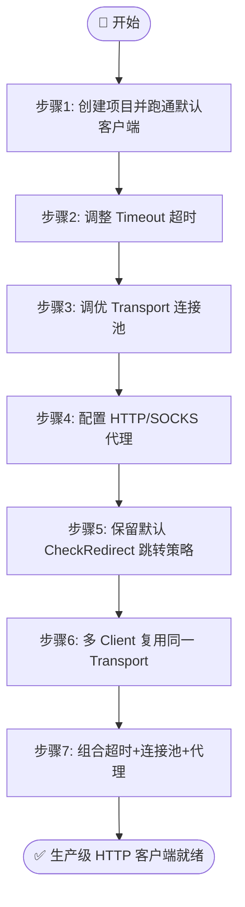
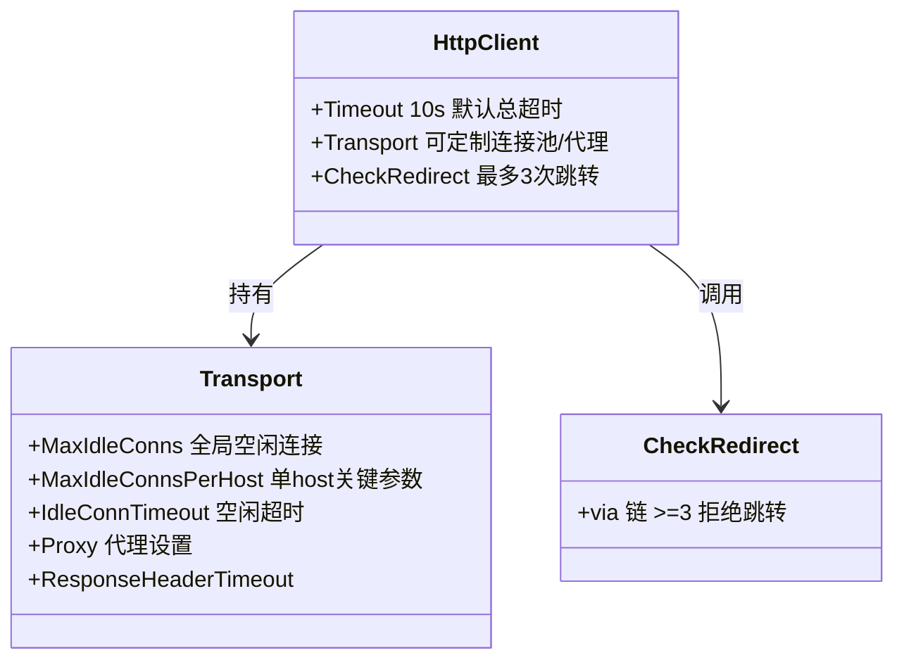

# 🎓 定制 HTTP 客户端

> 默认 `http.Client` 已经够用，但当你需要更短的超时、更激进的重试或走代理出网时，就该把底层客户端换成自己的了。本篇带你一步步调超时、配连接池、接代理。

::: tip 🎨 一图抵千言
本教程从默认客户端起步，逐步调超时、配连接池、接代理、复用 Transport，最后组合成生产级客户端。
:::



## 🎯 你将学到

- 🔍 理解 SDK 默认 `http.Client` 的行为（超时、跳转限制）
- ⏱ 用 `WithCustomHTTPClient` 调整请求超时
- 🔗 调优 `http.Transport` 的连接池参数
- 🌐 通过 HTTP/SOCKS 代理转发请求
- 🔒 保留默认跳转策略的同时自定义传输层
- 📦 在多个 `Client` 之间复用同一个 `Transport`

## ✅ 前置条件

- 已安装 **Go 1.21+**（推荐 1.23+）
- 完成教程：[快速开始](./hello-ipapi)（或阅读 [安装指南](../guide/installation)）
- 了解 [`NewClient`](../api/new-client) 与 [`WithCustomHTTPClient`](../api/with-custom-http-client) 的基本用法
- 一台能访问 `https://ipapi.co/` 的机器；若在内网/受限环境，准备一个可用的 HTTP 代理地址

## 🧠 为什么需要定制 HTTP 客户端

[`NewClient`](../api/new-client) 默认创建的 `http.Client` 已经设置了一个合理的起点：

```go
&http.Client{
	Timeout: 10 * time.Second, // 默认总超时 10s
	CheckRedirect: func(req *http.Request, via []*http.Request) error {
		if len(via) >= maxRedirects { // 最多 3 次跳转
			return fmt.Errorf("stopped after %d redirects", maxRedirects)
		}
		return nil
	},
}
```

这套默认值适合大多数场景，但在以下情况你会想自己改：

::: tip 🎨 默认 http.Client 结构
下图展示 SDK 默认 `http.Client` 的关键字段与可定制点：
:::



| 场景 | 默认值不够用的原因 |
| --- | --- |
| 🐌 慢网络 / 高延迟 | 10s 超时太短，频繁超时失败 |
| ⚡ 批量并发查询 | 默认连接池对单 host 复用不足 |
| 🏢 公司内网出口 | 必须走代理才能访问 `ipapi.co` |
| 🛡 安全审计 | 需要自定义 TLS 配置或证书校验 |

SDK 通过 [`WithCustomHTTPClient`](../api/with-custom-http-client) 把整个 `*http.Client` 的控制权交给你，下面我们一步步改。

## 🪜 步骤 1：创建项目并引入 SDK

先初始化一个最小项目：

```bash
mkdir custom-http-demo && cd custom-http-demo
go mod init custom-http-demo
go get github.com/cyberspacesec/ipapi.co-skills/pkg/ipapi
```

新建 `main.go`，先用默认客户端跑通，确认环境正常：

```go
package main

import (
	"context"
	"fmt"
	"log"

	"github.com/cyberspacesec/ipapi.co-skills/pkg/ipapi"
)

func main() {
	client := ipapi.NewClient()

	ctx := context.Background()
	info, err := client.GetIPInfo(ctx, "8.8.8.8", "json")
	if err != nil {
		log.Fatalf("查询失败: %v", err)
	}
	fmt.Printf("IP: %s\n国家: %s (%s)\n组织: %s\n",
		info.IP, info.CountryName, info.CountryCode, info.Org)
}
```

运行确认无误后再继续：

```bash
go run main.go
```

## ⏱ 步骤 2：调整超时

最常见的需求是把超时调长或调短。直接传一个自定义的 `http.Client`：

```go
package main

import (
	"context"
	"fmt"
	"log"
	"net/http"
	"time"

	"github.com/cyberspacesec/ipapi.co-skills/pkg/ipapi"
)

func main() {
	client := ipapi.NewClient(
		ipapi.WithCustomHTTPClient(&http.Client{
			Timeout: 30 * time.Second, // 总超时调到 30s，适合慢网络
		}),
	)

	ctx := context.Background()
	info, err := client.GetIPInfo(ctx, "8.8.8.8", "json")
	if err != nil {
		log.Fatalf("查询失败: %v", err)
	}
	fmt.Printf("IP: %s | 国家: %s | 超时: 30s\n", info.IP, info.CountryName)
}
```

> 💡 **小贴士**：`http.Client.Timeout` 是**整个请求**（含 DNS、连接、TLS、读 body）的墙上时钟上限。如果你只想限制某个阶段，请用 `context.WithTimeout` 包裹调用——见 [Context 超时指南](../guide/context)。

> ⚠️ **注意**：传入自定义 `http.Client` 后，默认的 `CheckRedirect`（最多 3 次跳转）会**被覆盖**。如果你仍想保留跳转限制，需要自己写 `CheckRedirect`，见步骤 5。

## 🔗 步骤 3：调优连接池

SDK 默认 `http.Client` 没有显式设置 `Transport`，用的是 `http.DefaultTransport`。在高并发批量查询时，显式调优连接池能减少握手开销：

```go
package main

import (
	"context"
	"fmt"
	"log"
	"net/http"
	"time"

	"github.com/cyberspacesec/ipapi.co-skills/pkg/ipapi"
)

func main() {
	transport := &http.Transport{
		MaxIdleConns:        100, // 全局最大空闲连接
		MaxIdleConnsPerHost: 20,  // 单 host 最大空闲连接（ipapi.co 是同一 host，这个最关键）
		IdleConnTimeout:     90 * time.Second,
		ResponseHeaderTimeout: 10 * time.Second,
		ExpectContinueTimeout: 1 * time.Second,
	}

	client := ipapi.NewClient(
		ipapi.WithCustomHTTPClient(&http.Client{
			Timeout:   20 * time.Second,
			Transport: transport,
		}),
	)

	ctx := context.Background()

	// 并发查询多个 IP，连接池会复用底层 TCP/TLS 连接
	ips := []string{"8.8.8.8", "1.1.1.1", "9.9.9.9"}
	for _, ip := range ips {
		info, err := client.GetIPInfo(ctx, ip, "json")
		if err != nil {
			log.Printf("查询 %s 失败: %v", ip, err)
			continue
		}
		fmt.Printf("%s -> %s, %s\n", ip, info.CountryName, info.Org)
	}
}
```

> 📌 **为什么 `MaxIdleConnsPerHost` 最关键？** 因为所有请求都打到 `ipapi.co` 这一个 host，全局 `MaxIdleConns` 再大，单 host 上限才是真正的瓶颈。Go 默认每 host 只缓存 2 个空闲连接，并发场景下会频繁新建连接。

::: details 🔧 http.Transport 关键参数速查
| 参数 | 作用 | 推荐起点 |
| --- | --- | --- |
| `MaxIdleConns` | 全局最大空闲连接数 | 100 |
| `MaxIdleConnsPerHost` | 单 host 最大空闲连接（同 host 最关键） | 20 |
| `IdleConnTimeout` | 空闲连接超时 | 90s |
| `ResponseHeaderTimeout` | 等待响应头超时 | 10s |
| `ExpectContinueTimeout` | 等待 100-continue 超时 | 1s |
| `Proxy` | 代理设置 | `ProxyFromEnvironment` |

::: warning ⚠️ MaxIdleConnsPerHost 别用默认值
Go 的 `http.DefaultTransport` 默认 `MaxIdleConnsPerHost=2`，对所有请求都打 `ipapi.co` 的 SDK 来说，并发查询时连接池几乎形同虚设，必须显式调高。
:::
:::

## 🌐 步骤 4：配置代理

受限于公司网络或想隐藏出口 IP 时，让请求走代理。`http.Transport` 的 `Proxy` 字段支持 `http.ProxyURL`（固定代理）或 `http.ProxyFromEnvironment`（读 `HTTP_PROXY`/`HTTPS_PROXY` 环境变量）。

### 4.1 固定 HTTP 代理

```go
package main

import (
	"context"
	"fmt"
	"log"
	"net/http"
	"net/url"
	"time"

	"github.com/cyberspacesec/ipapi.co-skills/pkg/ipapi"
)

func main() {
	proxyURL, err := url.Parse("http://127.0.0.1:8080")
	if err != nil {
		log.Fatalf("解析代理地址失败: %v", err)
	}

	client := ipapi.NewClient(
		ipapi.WithCustomHTTPClient(&http.Client{
			Timeout: 30 * time.Second,
			Transport: &http.Transport{
				Proxy: http.ProxyURL(proxyURL),
			},
		}),
	)

	ctx := context.Background()
	info, err := client.GetClientIPInfo(ctx, "json")
	if err != nil {
		log.Fatalf("查询失败: %v", err)
	}
	// 此时返回的 IP 是代理出口 IP，而非本机 IP
	fmt.Printf("出口 IP: %s\n国家: %s\n", info.IP, info.CountryName)
}
```

### 4.2 从环境变量读代理（推荐生产用法）

```go
package main

import (
	"context"
	"fmt"
	"log"
	"net/http"
	"time"

	"github.com/cyberspacesec/ipapi.co-skills/pkg/ipapi"
)

func main() {
	// 启动前可设置：export HTTPS_PROXY=http://127.0.0.1:8080
	client := ipapi.NewClient(
		ipapi.WithCustomHTTPClient(&http.Client{
			Timeout: 30 * time.Second,
			Transport: &http.Transport{
				Proxy: http.ProxyFromEnvironment,
			},
		}),
	)

	ctx := context.Background()
	info, err := client.GetClientIPInfo(ctx, "json")
	if err != nil {
		log.Fatalf("查询失败: %v", err)
	}
	fmt.Printf("出口 IP: %s\n国家: %s\n", info.IP, info.CountryName)
}
```

> 🔐 **安全提示**：`http.ProxyFromEnvironment` 也会读取 `NO_PROXY`，可用来排除内网地址不走代理。生产环境建议用这种方式，避免把代理地址硬编码进二进制。

## 🔒 步骤 5：保留默认跳转策略 + 自定义传输层

直接传 `&http.Client{Transport: ...}` 会丢失默认的 `CheckRedirect`（最多 3 次跳转）。如果你既想自定义传输层、又想保留跳转保护，把 `CheckRedirect` 也补上：

```go
package main

import (
	"context"
	"fmt"
	"log"
	"net/http"
	"time"

	"github.com/cyberspacesec/ipapi.co-skills/pkg/ipapi"
)

const maxRedirects = 3

func main() {
	transport := &http.Transport{
		MaxIdleConns:        100,
		MaxIdleConnsPerHost: 20,
		IdleConnTimeout:     90 * time.Second,
	}

	client := ipapi.NewClient(
		ipapi.WithCustomHTTPClient(&http.Client{
			Timeout: 20 * time.Second,
			Transport: transport,
			CheckRedirect: func(req *http.Request, via []*http.Request) error {
				if len(via) >= maxRedirects {
					return fmt.Errorf("stopped after %d redirects", maxRedirects)
				}
				return nil
			},
		}),
	)

	ctx := context.Background()
	info, err := client.GetIPInfo(ctx, "8.8.8.8", "json")
	if err != nil {
		log.Fatalf("查询失败: %v", err)
	}
	fmt.Printf("IP: %s | 国家: %s\n", info.IP, info.CountryName)
}
```

## 📦 步骤 6：多个 Client 复用同一个 Transport

如果你有多个不同配置的 `Client`（比如不同的 `APIKey`、不同的 `UserAgent`），但访问的是同一个 host，让它们共享 `Transport` 能最大化连接复用：

```go
package main

import (
	"context"
	"fmt"
	"log"
	"net/http"
	"time"

	"github.com/cyberspacesec/ipapi.co-skills/pkg/ipapi"
)

func main() {
	// 共享的传输层，所有 Client 复用底层连接池
	sharedTransport := &http.Transport{
		MaxIdleConns:        200,
		MaxIdleConnsPerHost: 50,
		IdleConnTimeout:     120 * time.Second,
	}

	// 客户端 A：免费 key，短超时
	freeClient := ipapi.NewClient(
		ipapi.WithAPIKey("free_key_a"),
		ipapi.WithCustomHTTPClient(&http.Client{
			Timeout:   10 * time.Second,
			Transport: sharedTransport,
		}),
	)

	// 客户端 B：付费 key，长超时
	proClient := ipapi.NewClient(
		ipapi.WithAPIKey("pro_key_b"),
		ipapi.WithCustomHTTPClient(&http.Client{
			Timeout:   30 * time.Second,
			Transport: sharedTransport,
		}),
	)

	ctx := context.Background()

	if info, err := freeClient.GetIPInfo(ctx, "8.8.8.8", "json"); err == nil {
		fmt.Printf("[免费] %s -> %s\n", info.IP, info.CountryName)
	} else {
		log.Printf("[免费] 失败: %v", err)
	}

	if info, err := proClient.GetIPInfo(ctx, "1.1.1.1", "json"); err == nil {
		fmt.Printf("[付费] %s -> %s\n", info.IP, info.CountryName)
	} else {
		log.Printf("[付费] 失败: %v", err)
	}
}
```

> 🧠 **原理**：`http.Transport` 持有连接池。多个 `http.Client` 共享同一个 `Transport` 时，对同一 host 的请求会复用已建立的 keep-alive 连接，省掉重复的 TCP/TLS 握手。

## 🧪 步骤 7：组合超时 + 连接池 + 代理

把前面学到的组合起来，写一个生产可用的客户端构造函数：

```go
package main

import (
	"context"
	"fmt"
	"log"
	"net/http"
	"net/url"
	"time"

	"github.com/cyberspacesec/ipapi.co-skills/pkg/ipapi"
)

const maxRedirects = 3

// newProductionClient 构造一个生产级客户端：固定代理 + 调优连接池 + 跳转保护
func newProductionClient(apiKey, proxyAddr string) *ipapi.Client {
	transport := &http.Transport{
		MaxIdleConns:          100,
		MaxIdleConnsPerHost:   20,
		IdleConnTimeout:       90 * time.Second,
		ResponseHeaderTimeout: 10 * time.Second,
		ExpectContinueTimeout: 1 * time.Second,
	}

	if proxyAddr != "" {
		proxyURL, err := url.Parse(proxyAddr)
		if err != nil {
			log.Fatalf("无效的代理地址 %q: %v", proxyAddr, err)
		}
		transport.Proxy = http.ProxyURL(proxyURL)
	}

	return ipapi.NewClient(
		ipapi.WithAPIKey(apiKey),
		ipapi.WithCustomHTTPClient(&http.Client{
			Timeout:   25 * time.Second,
			Transport: transport,
			CheckRedirect: func(req *http.Request, via []*http.Request) error {
				if len(via) >= maxRedirects {
					return fmt.Errorf("stopped after %d redirects", maxRedirects)
				}
				return nil
			},
		}),
	)
}

func main() {
	// 留空 proxyAddr 则不走代理；填写则走指定代理
	client := newProductionClient("your_api_key", "http://127.0.0.1:8080")

	ctx := context.Background()
	info, err := client.GetIPInfo(ctx, "8.8.8.8", "json")
	if err != nil {
		log.Fatalf("查询失败: %v", err)
	}
	fmt.Printf("IP: %s\n国家: %s (%s)\n组织: %s\nASN: %s\n",
		info.IP, info.CountryName, info.CountryCode, info.Org, info.ASN)
}
```

## 📝 完整代码

下面是整合了超时、连接池、代理的完整可运行示例。把它存为 `main.go` 即可运行：

```go
package main

import (
	"context"
	"fmt"
	"log"
	"net/http"
	"net/url"
	"time"

	"github.com/cyberspacesec/ipapi.co-skills/pkg/ipapi"
)

const maxRedirects = 3

func main() {
	// 1. 准备代理（不需要代理可把 proxyAddr 留空）
	proxyAddr := "http://127.0.0.1:8080"

	transport := &http.Transport{
		MaxIdleConns:          100,
		MaxIdleConnsPerHost:   20,
		IdleConnTimeout:       90 * time.Second,
		ResponseHeaderTimeout: 10 * time.Second,
		ExpectContinueTimeout: 1 * time.Second,
	}

	if proxyAddr != "" {
		proxyURL, err := url.Parse(proxyAddr)
		if err != nil {
			log.Fatalf("无效的代理地址 %q: %v", proxyAddr, err)
		}
		transport.Proxy = http.ProxyURL(proxyURL)
	}

	// 2. 构造客户端：超时 + 连接池 + 代理 + 跳转保护
	client := ipapi.NewClient(
		ipapi.WithAPIKey("your_api_key"),
		ipapi.WithCustomHTTPClient(&http.Client{
			Timeout:   25 * time.Second,
			Transport: transport,
			CheckRedirect: func(req *http.Request, via []*http.Request) error {
				if len(via) >= maxRedirects {
					return fmt.Errorf("stopped after %d redirects", maxRedirects)
				}
				return nil
			},
		}),
	)

	// 3. 查询
	ctx := context.Background()
	ips := []string{"8.8.8.8", "1.1.1.1", "9.9.9.9"}
	for _, ip := range ips {
		info, err := client.GetIPInfo(ctx, ip, "json")
		if err != nil {
			log.Printf("查询 %s 失败: %v", ip, err)
			continue
		}
		fmt.Printf("%-14s -> %-20s | %-10s | %s\n",
			info.IP, info.CountryName, info.CountryCode, info.Org)
	}
}
```

## 🖥 运行结果

假设代理可用、网络正常，运行后预期输出类似：

```text
8.8.8.8        -> United States      | US         | Google LLC
1.1.1.1        -> Australia          | AU         | Cloudflare, Inc.
9.9.9.9        -> United States      | US         | Quad9
```

如果代理地址不可达，你会看到类似错误：

```text
2026/07/03 20:30:01 查询 8.8.8.8 失败: request failed after 2 retries: Get "https://ipapi.co/8.8.8.8/json/": proxyconnect tcp: dial tcp 127.0.0.1:8080: connect: connection refused
```

> 🐛 **排错**：看到 `proxyconnect tcp` 字样说明请求确实走了代理（说明配置生效），只是代理本身连不上——检查代理地址和端口是否正确、代理是否已启动。

## ✅ 小结

- 🎛 [`WithCustomHTTPClient`](../api/with-custom-http-client) 把整个 `*http.Client` 的控制权交给你
- ⏱ `http.Client.Timeout` 控制单次请求的墙上时钟总超时
- 🔗 `http.Transport` 的 `MaxIdleConnsPerHost` 是同 host 并发场景的关键参数
- 🌐 `Transport.Proxy` 支持 `http.ProxyURL`（固定）和 `http.ProxyFromEnvironment`（读环境变量）
- ⚠️ 自定义 `http.Client` 会覆盖默认 `CheckRedirect`，需要跳转保护请自行补上
- 📦 多个 `Client` 共享同一个 `Transport` 可最大化连接复用

## 🚀 下一步

- 📖 深入阅读 [自定义 HTTP 客户端概念](../guide/custom-http) 与 [`WithCustomHTTPClient` API](../api/with-custom-http-client)
- ⏱ 学习 [Context 超时控制](../guide/context)，用 `context.WithTimeout` 做更细粒度的超时
- 🔁 了解 [重试机制](../guide/retry-concept) 与默认重试如何与自定义客户端配合
- 📘 在 [Cookbook](../cookbook/) 找实战配方，如 [代理检测](../cookbook/proxy-detection)、[缓存查询](../cookbook/cached-lookup)
- 📚 浏览 [API 参考](../api/methods) 的 [`NewClient`](../api/new-client) 与各 [`Option`](../api/options)
- ➡️ 继续下一篇教程：[错误处理入门](./error-branches-tutorial)
