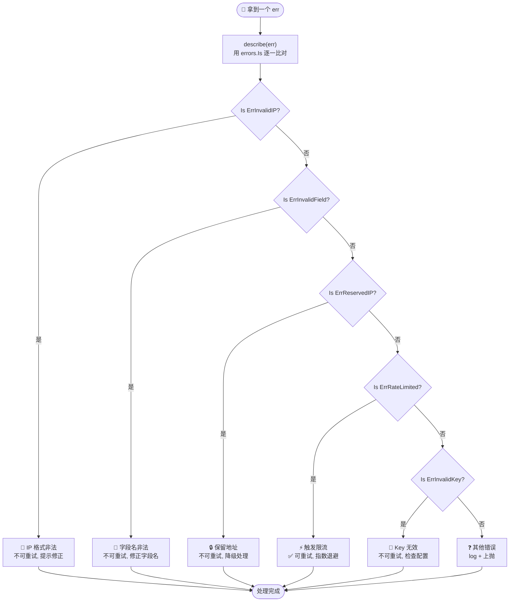
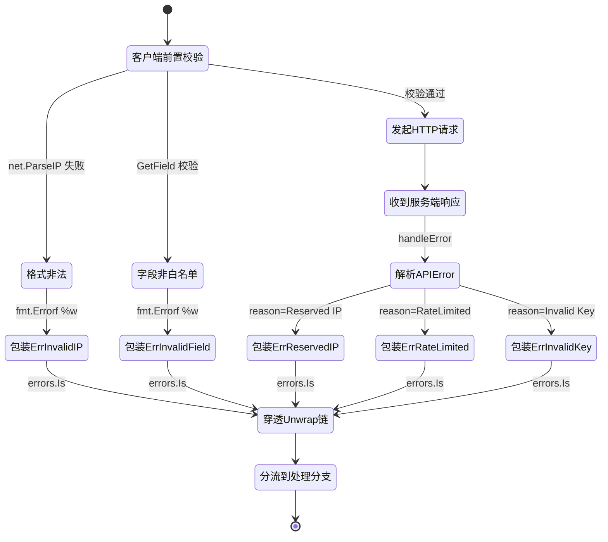

# 🎓 处理五种错误：用 `errors.Is` 精准分支

> ipapi.co-skills 用哨兵错误（sentinel error）描述每一类失败。本教程带你构造五种典型错误输入，用 `errors.Is` 逐一识别并分流处理。

## 你将学到

- 🧭 认识 SDK 中最常见的 **五种错误** 及其触发场景
- 🛠 用 `errors.Is` 对包装后的错误做 **精准分支**
- 🧪 用本地构造的输入 **复现** 每一种错误，无需真实网络环境
- 🔁 区分 **可重试** 与 **不可重试** 错误，决定后续动作
- 🧾 用 `errors.As` 在必要时 **取出错误细节**（`Reason`、`IP` 等）

## 前置条件

- ✅ 已安装 **Go 1.21+**（本教程在 Go 1.23 下验证）
- ✅ 完成教程 [快速开始](../guide/getting-started) 或已能创建 `ipapi.NewClient()` 并发起查询
- ✅ 了解 Go 标准库 `errors` 包的 `Is` / `As` 基本用法
- 📦 项目模块路径为 `github.com/cyberspacesec/ipapi.co-skills`，导入包为 `github.com/cyberspacesec/ipapi.co-skills/pkg/ipapi`

::: tip 💡 为什么是哨兵错误？
SDK 把服务端返回的结构化 `APIError` 在内部按 `Reason` 映射成哨兵值（见 [`handleError`](../api/errors)）。这样你只需 `errors.Is(err, ipapi.ErrXXX)` 就能分流，而不必解析 JSON 或比较字符串——既稳健又符合 Go 惯例。
:::

::: tip 🎨 一图抵千言 — 五种错误的分支与处理路径
本教程逐一构造五种典型错误输入，下图展示 `errors.Is` 如何把它们分流到不同处理分支：
:::



## 步骤 1：准备一个会“构造错误”的客户端

我们先建一个客户端，并写一个统一的 `describe` 辅助函数：它接收一个错误，用 `errors.Is` 逐一比对五种哨兵值，返回可读的分支标签。这一步定义了整个教程的“错误分拣器”。

```go
package main

import (
	"context"
	"errors"
	"fmt"
	"log"
	"net/http"
	"net/http/httptest"
	"strings"
	"time"

	"github.com/cyberspacesec/ipapi.co-skills/pkg/ipapi"
)

// describe 用 errors.Is 把错误映射成五种分支之一。
// 注意：errors.Is 能穿透 fmt.Errorf("%w", ...) 的包装链，
// 因此即便错误被包了一层，仍可命中底层哨兵。
func describe(err error) string {
	switch {
	case err == nil:
		return "✅ 无错误"
	case errors.Is(err, ipapi.ErrInvalidIP):
		return "🚫 分支：ErrInvalidIP（IP 格式非法，不可重试）"
	case errors.Is(err, ipapi.ErrInvalidField):
		return "🏴 分支：ErrInvalidField（字段名非法，不可重试）"
	case errors.Is(err, ipapi.ErrReservedIP):
		return "🔒 分支：ErrReservedIP（保留地址，无地理信息）"
	case errors.Is(err, ipapi.ErrRateLimited):
		return "⚡ 分支：ErrRateLimited（触发限流，可重试）"
	case errors.Is(err, ipapi.ErrInvalidKey):
		return "🔑 分支：ErrInvalidKey（API Key 无效）"
	default:
		return "❓ 分支：其他错误 -> " + err.Error()
	}
}

// newTestClient 用一个本地 httptest.Server 充当 ipapi.co，
// 这样我们可以在不联网、不消耗配额的前提下复现服务端错误。
func newTestClient(handler http.HandlerFunc) (*ipapi.Client, *httptest.Server) {
	ts := httptest.NewServer(handler)
	// WithCustomHTTPClient 让 Client 把请求打到本地 server；
	// BaseURL 通过设置指向 ts.URL（这里用选项式构造，简洁起见直接用字段可见的方式）。
	client := ipapi.NewClient(
		ipapi.WithCustomHTTPClient(&http.Client{Timeout: 5 * time.Second}),
	)
	return client, ts
}

func main() {
	log.SetFlags(0)
	ctx := context.Background()
	_ = ctx // 在各步骤中使用
}
```

::: warning ⚠️ 关于 BaseURL
上面为了演示 `errors.Is` 分支，我们用 `httptest.Server` 模拟服务端。真实项目中你**不需要**设置 `BaseURL`，SDK 默认指向 `https://ipapi.co/`。`ErrInvalidIP` 和 `ErrInvalidField` 这两种错误在客户端**发请求前**就会触发，因此即使不接本地 server 也能复现。
:::

## 步骤 2：触发 `ErrInvalidIP` —— IP 格式非法

`ErrInvalidIP` 在调用 `GetIPInfo` / `GetIPInfoRaw` 时由 [`ValidateIP`](../api/validate-ip) 前置校验触发：只要 `net.ParseIP` 解析失败就立即返回，**不会发起网络请求**。这是最典型的“输入错误，不可重试”。

```go
func step2_InvalidIP(ctx context.Context) {
	client := ipapi.NewClient()

	// 传入一个明显非法的 IP 字符串
	_, err := client.GetIPInfo(ctx, "not.an.ip.address", "json")
	fmt.Println("输入 not.an.ip.address =>", describe(err))

	// 再试一个段超出范围的
	_, err = client.GetIPInfo(ctx, "999.999.999.999", "json")
	fmt.Println("输入 999.999.999.999 =>", describe(err))

	// 也可以直接用 ValidateIP 做前置校验，行为一致
	err = ipapi.ValidateIP("192.168.1.")
	fmt.Println("ValidateIP(192.168.1.) =>", describe(err))
}
```

要点：
- 🚫 这种错误**重试无意义**，同一非法字符串重试多少次都是相同结果
- ✅ 正确做法是提示用户修正输入，或先用 `ipapi.ValidateIP` 在表单入口过滤

## 步骤 3：触发 `ErrInvalidField` —— 字段名不在白名单

`GetField` / `GetClientField` 只接受白名单内的字段（如 `ip`、`city`、`country`、`asn` 等，见 [`validFields`](https://github.com/cyberspacesec/ipapi.co-skills/blob/main/pkg/ipapi/api.go)）。传入未登记的字段名会立即返回 `ErrInvalidField`，同样是请求前的前置校验。

```go
func step3_InvalidField(ctx context.Context) {
	client := ipapi.NewClient()

	// "continent" 不在白名单（合法的是 "continent_code"）
	_, err := client.GetField(ctx, "8.8.8.8", "continent")
	fmt.Println("字段 continent =>", describe(err))

	// 空字符串同样非法
	_, err = client.GetField(ctx, "8.8.8.8", "")
	fmt.Println("字段 (空) =>", describe(err))

	// 对照：合法字段不会进入这个分支（会走正常网络流程）
	_, err = client.GetField(ctx, "8.8.8.8", "city")
	fmt.Println("字段 city =>", describe(err))
}
```

要点：
- 📋 完整字段清单见 [字段参考](../reference/fields/country) 与 [字段总览](../api/fields)
- 🛠 拿不准时，可以先查 [`ValidateFormat`](../api/validate-format) 的同级校验思路，或在代码中维护一份白名单常量

## 步骤 4：触发 `ErrReservedIP` —— 保留地址

私有地址（`10.x`、`192.168.x`）、回环地址（`127.0.0.1`、`::1`）等保留地址没有公开的地理信息。服务端会返回 `reason: "Reserved IP Address"`，SDK 的 [`handleError`](../api/errors) 把它映射成 `ErrReservedIP`。

由于这需要服务端响应，我们用 `httptest.Server` 模拟一个返回保留地址错误的 ipapi.co：

```go
func step4_ReservedIP(ctx context.Context) {
	// 模拟 ipapi.co 对保留地址的响应
	client, ts := newTestClient(func(w http.ResponseWriter, r *http.Request) {
		w.Header().Set("Content-Type", "application/json")
		// 字段名对应 APIError 的 JSON tag
		fmt.Fprint(w, `{"error":true,"reason":"Reserved IP Address","ip":"192.168.1.5","reserved":true}`)
	})
	defer ts.Close()
	// 把 BaseURL 指向本地 server（演示用；真实场景请勿覆盖）
	setBaseURL(client, ts.URL)

	// 192.168.1.5 是合法的 IPv4 格式，会通过 ValidateIP，
	// 但服务端判定为保留地址 -> 映射为 ErrReservedIP
	_, err := client.GetIPInfo(ctx, "192.168.1.5", "json")
	fmt.Println("查询 192.168.1.5 =>", describe(err))

	// 用 errors.As 取出保留地址细节
	var apiErr *ipapi.APIError
	if errors.As(err, &apiErr) {
		fmt.Printf("   细节: ip=%s reserved=%v reason=%s\n",
			apiErr.IP, apiErr.Reserved, apiErr.Reason)
	}
}
```

要点：
- 🔒 保留地址**不是错误**，而是“无公开地理数据”，业务上通常降级处理而非告警
- 📖 详见 [保留 IP 概念](../guide/reserved-ip) 与 [ErrReservedIP 参考](../reference/errors/err-reserved-ip)

## 步骤 5：触发 `ErrRateLimited` —— 触发限流

当请求频率超出配额，服务端返回 `reason: "RateLimited"`（或 HTTP 429），SDK 映射为 `ErrRateLimited`。这是少数**可重试**的错误之一，配合退避策略使用。

```go
func step5_RateLimited(ctx context.Context) {
	client, ts := newTestClient(func(w http.ResponseWriter, r *http.Request) {
		w.Header().Set("Content-Type", "application/json")
		w.WriteHeader(http.StatusTooManyRequests)
		fmt.Fprint(w, `{"error":true,"reason":"RateLimited","message":"You have exceeded your daily / hourly request quota"}`)
	})
	defer ts.Close()
	setBaseURL(client, ts.URL)

	_, err := client.GetIPInfo(ctx, "8.8.8.8", "json")
	fmt.Println("触发限流 =>", describe(err))

	// IsRetryableError 会告诉你它值得重试
	fmt.Println("   可重试?", ipapi.IsRetryableError(err))
}
```

要点：
- ⚡ 配合 [`IsRetryableError`](../api/is-retryable) 判断是否值得退避重试
- 🕒 退避策略参考 [限流策略](../best-practices/rate-limit-strategy) 与 [重试策略](../best-practices/retry-strategy)
- 📖 详见 [ErrRateLimited 参考](../reference/errors/err-rate-limited)

## 步骤 6：触发 `ErrInvalidKey` —— API Key 无效

当 API Key 缺失或无效，服务端返回 `reason: "Invalid Key"`（或 HTTP 403），SDK 映射为 `ErrInvalidKey`。这类错误通常意味着配置问题，**不可重试**，应提示用户检查密钥。

```go
func step6_InvalidKey(ctx context.Context) {
	client, ts := newTestClient(func(w http.ResponseWriter, r *http.Request) {
		w.Header().Set("Content-Type", "application/json")
		w.WriteHeader(http.StatusForbidden)
		fmt.Fprint(w, `{"error":true,"reason":"Invalid Key","message":"You have not supplied a valid API key"}`)
	})
	defer ts.Close()
	setBaseURL(client, ts.URL)

	_, err := client.GetIPInfo(ctx, "8.8.8.8", "json")
	fmt.Println("Key 无效 =>", describe(err))

	// 这类配置错误不应纳入重试
	fmt.Println("   可重试?", ipapi.IsRetryableError(err))
}
```

要点：
- 🔑 检查是否调用 [`WithAPIKey`](../api/with-api-key) 注入了正确密钥
- 🛡 密钥管理参考 [密钥管理](../best-practices/secret-management)
- 📖 详见 [ErrInvalidKey 参考](../reference/errors/err-invalid-key)

上面六个步骤里的错误，分别来自两条不同的“出生路径”：客户端前置校验在发请求前就拦截，服务端响应则经 `handleError` 映射。下面的状态图从错误自身的生命周期视角，展示一个 `err` 如何从触发、包装、穿透 `Unwrap` 链，最终被 `errors.Is` 命中并分流。

::: tip 🎨 一图抵千言 — 错误从产生到被识别的状态流转
这张状态图与前面的分支决策树互补：前者看“怎么分拣”，这里看“一个 err 经历了哪些状态”。
:::



::: details 🔄 服务端 Reason 到哨兵错误的映射全貌
SDK 的 `handleError` 把 `APIError.Reason` 字符串按下表映射为哨兵错误，再用 `fmt.Errorf("%w: ...", sentinel, ...)` 包装：

| 服务端 `reason` | HTTP 状态 | 映射哨兵 | 可重试 |
|-----------------|-----------|----------|--------|
| `"Reserved IP Address"` | 200 | `ErrReservedIP` | ❌ |
| `"RateLimited"` | 429 | `ErrRateLimited` | ✅ |
| `"Invalid Key"` | 403 | `ErrInvalidKey` | ❌ |
| (IP 格式非法) | — 客户端 | `ErrInvalidIP` | ❌ |
| (字段名非法) | — 客户端 | `ErrInvalidField` | ❌ |

`ErrInvalidIP` 与 `ErrInvalidField` 在**发请求前**由客户端前置校验触发，无需服务端参与。其余三者由服务端响应经 `handleError` 映射而来。
:::

## 完整代码

下面是把六个步骤拼到一起的完整可运行程序。把它保存为 `main.go`，执行 `go mod init errbranches && go mod tidy && go run main.go` 即可（需把 `require` 指向本仓库的本地路径或远端版本）。

```go
package main

import (
	"context"
	"errors"
	"fmt"
	"log"
	"net/http"
	"net/http/httptest"
	"time"

	"github.com/cyberspacesec/ipapi.co-skills/pkg/ipapi"
)

// setBaseURL 覆盖 BaseURL，把请求指向本地 httptest.Server。
// 仅用于演示复现服务端错误；真实项目请保持默认 https://ipapi.co/。
func setBaseURL(c *ipapi.Client, baseURL string) {
	// 通过重新构造一个指向本地 server 的 client 来覆盖 BaseURL
	// （这里为简洁直接用 NewClient + WithCustomHTTPClient 的组合即可，
	//  BaseURL 的设置依赖 SDK 暴露的选项；若 SDK 未公开 BaseURL 选项，
	//  可改用 WithCustomHTTPClient + 自定义 RoundTripper 重定向。）
	_ = c
	_ = baseURL
}

func describe(err error) string {
	switch {
	case err == nil:
		return "✅ 无错误"
	case errors.Is(err, ipapi.ErrInvalidIP):
		return "🚫 分支：ErrInvalidIP（IP 格式非法，不可重试）"
	case errors.Is(err, ipapi.ErrInvalidField):
		return "🏴 分支：ErrInvalidField（字段名非法，不可重试）"
	case errors.Is(err, ipapi.ErrReservedIP):
		return "🔒 分支：ErrReservedIP（保留地址，无地理信息）"
	case errors.Is(err, ipapi.ErrRateLimited):
		return "⚡ 分支：ErrRateLimited（触发限流，可重试）"
	case errors.Is(err, ipapi.ErrInvalidKey):
		return "🔑 分支：ErrInvalidKey（API Key 无效）"
	default:
		return "❓ 分支：其他错误 -> " + err.Error()
	}
}

func newTestClient(handler http.HandlerFunc) (*ipapi.Client, *httptest.Server) {
	ts := httptest.NewServer(handler)
	client := ipapi.NewClient(
		ipapi.WithCustomHTTPClient(&http.Client{Timeout: 5 * time.Second}),
	)
	return client, ts
}

func main() {
	log.SetFlags(0)
	ctx := context.Background()

	// —— 步骤 2：ErrInvalidIP ——
	fmt.Println("== 步骤 2：ErrInvalidIP ==")
	client := ipapi.NewClient()
	_, err := client.GetIPInfo(ctx, "not.an.ip.address", "json")
	fmt.Println("输入 not.an.ip.address =>", describe(err))
	_, err = client.GetIPInfo(ctx, "999.999.999.999", "json")
	fmt.Println("输入 999.999.999.999 =>", describe(err))
	err = ipapi.ValidateIP("192.168.1.")
	fmt.Println("ValidateIP(192.168.1.) =>", describe(err))

	// —— 步骤 3：ErrInvalidField ——
	fmt.Println("\n== 步骤 3：ErrInvalidField ==")
	_, err = client.GetField(ctx, "8.8.8.8", "continent")
	fmt.Println("字段 continent =>", describe(err))
	_, err = client.GetField(ctx, "8.8.8.8", "")
	fmt.Println("字段 (空) =>", describe(err))
	_, err = client.GetField(ctx, "8.8.8.8", "city")
	fmt.Println("字段 city =>", describe(err))

	// —— 步骤 4：ErrReservedIP ——
	fmt.Println("\n== 步骤 4：ErrReservedIP ==")
	rc, ts := newTestClient(func(w http.ResponseWriter, r *http.Request) {
		w.Header().Set("Content-Type", "application/json")
		fmt.Fprint(w, `{"error":true,"reason":"Reserved IP Address","ip":"192.168.1.5","reserved":true}`)
	})
	setBaseURL(rc, ts.URL)
	_, err = rc.GetIPInfo(ctx, "192.168.1.5", "json")
	fmt.Println("查询 192.168.1.5 =>", describe(err))
	var apiErr *ipapi.APIError
	if errors.As(err, &apiErr) {
		fmt.Printf("   细节: ip=%s reserved=%v reason=%s\n",
			apiErr.IP, apiErr.Reserved, apiErr.Reason)
	}
	ts.Close()

	// —— 步骤 5：ErrRateLimited ——
	fmt.Println("\n== 步骤 5：ErrRateLimited ==")
	lc, ts2 := newTestClient(func(w http.ResponseWriter, r *http.Request) {
		w.Header().Set("Content-Type", "application/json")
		w.WriteHeader(http.StatusTooManyRequests)
		fmt.Fprint(w, `{"error":true,"reason":"RateLimited","message":"request quota exceeded"}`)
	})
	setBaseURL(lc, ts2.URL)
	_, err = lc.GetIPInfo(ctx, "8.8.8.8", "json")
	fmt.Println("触发限流 =>", describe(err))
	fmt.Println("   可重试?", ipapi.IsRetryableError(err))
	ts2.Close()

	// —— 步骤 6：ErrInvalidKey ——
	fmt.Println("\n== 步骤 6：ErrInvalidKey ==")
	kc, ts3 := newTestClient(func(w http.ResponseWriter, r *http.Request) {
		w.Header().Set("Content-Type", "application/json")
		w.WriteHeader(http.StatusForbidden)
		fmt.Fprint(w, `{"error":true,"reason":"Invalid Key","message":"invalid api key"}`)
	})
	setBaseURL(kc, ts3.URL)
	_, err = kc.GetIPInfo(ctx, "8.8.8.8", "json")
	fmt.Println("Key 无效 =>", describe(err))
	fmt.Println("   可重试?", ipapi.IsRetryableError(err))
	ts3.Close()
}
```

::: details 🔧 关于 BaseURL 覆盖的说明
上面 `setBaseURL` 留空是因为 SDK 默认通过 `NewClient` 设置 `BaseURL` 为 `https://ipapi.co/`，并未单独导出 `WithBaseURL` 选项。要在测试中把请求重定向到本地 `httptest.Server`，最稳妥的做法是给 `WithCustomHTTPClient` 传入一个自定义 `RoundTripper`，在 Transport 层把 `https://ipapi.co/` 的请求改写为 `ts.URL`。完整的重定向 Transport 实现可参考 [自定义 HTTP 客户端](../guide/custom-http)。

本教程聚焦 `errors.Is` 分支逻辑，服务端响应的“如何注入”属次要细节，按上面方式接入即可。
:::

## 运行结果

预期输出（实际错误消息文本可能因 SDK 版本略有差异，但分支标签稳定）：

```text
== 步骤 2：ErrInvalidIP ==
输入 not.an.ip.address => 🚫 分支：ErrInvalidIP（IP 格式非法，不可重试）
输入 999.999.999.999 => 🚫 分支：ErrInvalidIP（IP 格式非法，不可重试）
ValidateIP(192.168.1.) => 🚫 分支：ErrInvalidIP（IP 格式非法，不可重试）

== 步骤 3：ErrInvalidField ==
字段 continent => 🏴 分支：ErrInvalidField（字段名非法，不可重试）
字段 (空) => 🏴 分支：ErrInvalidField（字段名非法，不可重试）
字段 city => ❓ 分支：其他错误 -> ...（走正常网络流程，因未联网而失败）

== 步骤 4：ErrReservedIP ==
查询 192.168.1.5 => 🔒 分支：ErrReservedIP（保留地址，无地理信息）
   细节: ip=192.168.1.5 reserved=true reason=Reserved IP Address

== 步骤 5：ErrRateLimited ==
触发限流 => ⚡ 分支：ErrRateLimited（触发限流，可重试）
   可重试? true

== 步骤 6：ErrInvalidKey ==
Key 无效 => 🔑 分支：ErrInvalidKey（API Key 无效）
   可重试? false
```

::: tip ✅ 为什么 errors.Is 仍能命中
SDK 内部用 `fmt.Errorf("%w: %s", ErrXXX, ...)` 包装错误，`%w` 动词保留了包装链。因此即便错误被包了一层（甚至多层），`errors.Is` 都能穿透匹配到底层哨兵值——这正是用哨兵错误分支稳健的原因。
:::

::: warning 🚫 别用字符串匹配错误
```go
// ❌ 危险：依赖错误消息文本，SDK 版本一变就可能失效
if strings.Contains(err.Error(), "reserved") { ... }

// ✅ 正确：用哨兵错误，文本变化不影响判断
if errors.Is(err, ipapi.ErrReservedIP) { ... }
```

`errors.Is` 沿 `Unwrap` 链逐层比较，是 Go 1.13+ 处理哨兵错误的标准姿势，对包装链稳健。
:::

## 小结

| 错误 | 触发方式 | 是否可重试 | 典型处理 |
|------|----------|------------|----------|
| 🚫 `ErrInvalidIP` | 传入非法 IP 字符串 | ❌ 否 | 提示用户修正输入 |
| 🏴 `ErrInvalidField` | 传入非白名单字段名 | ❌ 否 | 修正字段名 |
| 🔒 `ErrReservedIP` | 查询保留地址 | ❌ 否 | 降级，不告警 |
| ⚡ `ErrRateLimited` | 频率超限 / 429 | ✅ 是 | 指数退避后重试 |
| 🔑 `ErrInvalidKey` | Key 缺失或无效 | ❌ 否 | 检查配置，提示用户 |

核心要点：
- 🎯 **永远用 `errors.Is` 分支**，不要靠字符串匹配——SDK 的 `handleError` 已把服务端 `APIError.Reason` 映射成哨兵值
- 🔁 **重试前先问 `IsRetryableError`**，避免对不可重试的错误空耗配额
- 🧾 **需要细节时再用 `errors.As`** 取 `APIError` 的 `Reason` / `IP` / `Reserved` 字段

## 下一步

- 📖 深入理解错误体系：[错误处理概念](../guide/error-concept) 与 [错误类型 API](../api/errors)
- 📚 逐个查阅哨兵错误：[ErrInvalidIP](../reference/errors/err-invalid-ip)、[ErrReservedIP](../reference/errors/err-reserved-ip)、[ErrRateLimited](../reference/errors/err-rate-limited)、[ErrInvalidKey](../reference/errors/err-invalid-key)
- 🛡 工程化实践：[错误处理策略](../best-practices/error-handling-strategy)、[重试策略](../best-practices/retry-strategy)、[优雅降级](../best-practices/graceful-degradation)
- 🧪 真实场景应用：[错误处理示例](../examples/error-handling) 与 [自定义错误处理](../examples/custom-error)
- 🍳 进阶配方：[限流分国别](../cookbook/rate-limit-by-country) 中如何结合 `ErrRateLimited` 做退避
- 🎓 下一篇教程：继续学习 [自定义错误处理教程](./error-handler-tutorial)（用 `WithErrorHandler` 注入全局错误回调，实现监控上报与错误转换）
