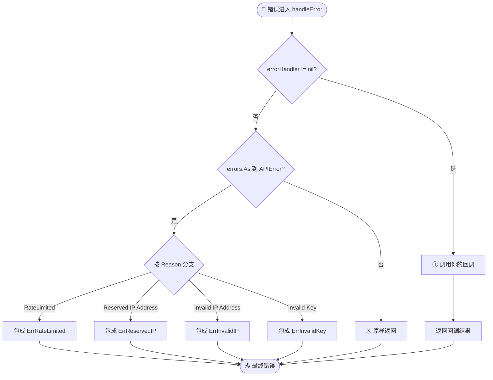
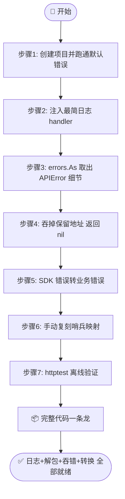

# 🎓 自定义错误处理

> SDK 默认会把 `APIError.Reason` 映射成哨兵错误再扔回来，但你想在错误离开 SDK 之前再干点啥——写日志、打监控、吞掉保留地址、把限流转成业务错——又不想在每个调用点重复 `if err != nil`。本篇带你用 `WithErrorHandler` 接一个全局回调，把日志、监控、错误转换都收口到一处。

---

## 🎯 你将学到

- 🔍 理解 SDK 默认的 `handleError` 流程（`errorHandler` 优先，否则 `Reason → 哨兵` 映射）
- 📝 用 [`WithErrorHandler`](../api/with-error-handler) 注入一个全局错误回调，统一写日志
- 🧩 在回调里用 `errors.As` 解包 [`APIError`](../api/models)，提取 `Reason` / `IP` / `Message` 等细节
- 🪂 用「返回 `nil`」吞掉特定错误（如保留 IP 地址）
- 🔀 用「返回新错误」把 SDK 错误转换成业务层自己的错误类型
- ⚠️ 规避 handler 优先级陷阱：设了 handler 后默认哨兵映射就不再执行
- 🧪 用 `httptest` 起一个假上游，不依赖真实网络验证 handler 行为

---

## ✅ 前置条件

- 🐹 已安装 **Go 1.21+**（推荐 1.23+）
- 📚 已完成 [第一个 IP 查询](./hello-ipapi) 与 [创建你的第一个 Client](./first-client)，能跑通基本查询
- 🛡 建议先读 [错误处理概念](../guide/error-concept)，认识 10 个哨兵错误与 [`APIError`](../api/models) 结构
- 📖 了解 [`WithErrorHandler`](../api/with-error-handler) 的签名与回调契约
- 🌐 一台能访问 `https://ipapi.co/` 的机器（最后一步用本地 `httptest` 模拟，可离线验证）

---

## 🧠 为什么需要自定义错误处理

先看 SDK 内部「错误出口」长什么样。每个方法（`GetIPInfo`、`GetField`、`GetClientIPInfo` …）在返回错误前都会调一次 [`handleError`](../api/errors)：

```go
func (c *Client) handleError(err error) error {
	if c.errorHandler != nil {
		return c.errorHandler(err) // ① 优先：你设的回调
	}

	var apiErr *APIError
	if errors.As(err, &apiErr) { // ② 否则：按 Reason 映射哨兵
		switch apiErr.Reason {
		case "RateLimited":
			return fmt.Errorf("%w: %s", ErrRateLimited, apiErr.Message)
		case "Reserved IP Address":
			return fmt.Errorf("%w: %s", ErrReservedIP, apiErr.IP)
		case "Invalid IP Address":
			return fmt.Errorf("%w: %s", ErrInvalidIP, apiErr.IP)
		case "Invalid Key":
			return fmt.Errorf("%w: %s", ErrInvalidKey, apiErr.Message)
		}
	}

	return err // ③ 兜底：原样返回
}
```

也就是说，**所有错误都从这一个口子出去**。这正好是接日志/监控的天然切点：与其在每个调用点写 `if err != nil { log.Println(err) }`，不如在 `handleError` 里拦一道。

下面这些场景，`WithErrorHandler` 都能优雅解决：

::: tip 🎨 handleError 决策流程
下图展示 SDK 默认 `handleError` 的三条分支：handler 优先 → Reason 哨兵映射 → 原样兜底。
:::



| 场景 | 不用 handler 的痛点 | 用 handler 的解法 |
| --- | --- | --- |
| 📝 统一日志 | 每个调用点重复 `log.Printf` | 回调里写一次，全局生效 |
| 📊 监控上报 | 调用点散落埋点 | 回调里 `sentry.CaptureException` 一次到位 |
| 🪂 吞保留地址 | 每处都要 `errors.Is(ErrReservedIP)` 判断 | 回调里返回 `nil`，调用方无感 |
| 🔀 错误转换 | 调用方处理 SDK 哨兵 | 回调里转成业务错误，调用方只认业务错 |
| 🧮 错误计数 | 没有聚合点 | 回调里按 `Reason` 打指标 |

::: warning ⚠️ 优先级陷阱
设了 `errorHandler` 后，`handleError` **直接返回你的回调结果**，不再走 `Reason → 哨兵` 映射。也就是说：默认行为（把 `APIError` 包成 `ErrRateLimited` 等）会被你的回调**取代**。如果你还想保留哨兵匹配，得在回调里自己处理，或者干脆 `return err` 原样上抛。
:::

接下来我们一步步把它接上。

::: tip 🎨 一图抵千言
先看本教程的整体流程：从理解默认 handleError 出口，到注入回调、解包细节、吞错、业务转换，最后用 httptest 离线验证。
:::



---

## 🪜 步骤 1：创建项目并引入 SDK

先初始化一个最小项目：

```bash
mkdir error-handler-demo && cd error-handler-demo
go mod init error-handler-demo
go get github.com/cyberspacesec/ipapi.co-skills/pkg/ipapi
```

新建 `main.go`，先用默认客户端跑一个会失败的查询，看看默认错误长什么样：

```go
package main

import (
	"context"
	"fmt"
	"time"

	"github.com/cyberspacesec/ipapi.co-skills/pkg/ipapi"
)

func main() {
	client := ipapi.NewClient()
	ctx, cancel := context.WithTimeout(context.Background(), 10*time.Second)
	defer cancel()

	// 故意用一个非法 IP，触发默认错误路径
	info, err := client.GetIPInfo(ctx, "not.a.valid.ip", "json")
	if err != nil {
		fmt.Printf("默认错误: %v\n", err)
		return
	}
	fmt.Printf("IP: %s, 国家: %s\n", info.IP, info.CountryName)
}
```

运行：

```bash
go run main.go
```

由于 `not.a.valid.ip` 过不了本地的 `net.ParseIP` 校验，会在请求发出前就被 [`ValidateIP`](../api/validate-ip) 拦下，输出类似：

```text
默认错误: invalid IP address
```

> 🐛 **注意**：本地校验失败返回的是裸 `ErrInvalidIP`，**没有**经过 `Reason` 映射（因为它根本不是 `APIError`）。下一步我们接上 handler 后，会看到它照样被回调拦截。

---

## 🪜 步骤 2：注入一个最简日志 handler

现在用 [`WithErrorHandler`](../api/with-error-handler) 注入一个回调，先把每个错误原样打印出来，再继续向上抛：

```go
package main

import (
	"context"
	"fmt"
	"log"
	"time"

	"github.com/cyberspacesec/ipapi.co-skills/pkg/ipapi"
)

func main() {
	client := ipapi.NewClient(
		ipapi.WithErrorHandler(func(err error) error {
			log.Printf("[ipapi] 拦截到错误: %v", err)
			return err // 原样返回，调用方仍能拿到
		}),
	)

	ctx, cancel := context.WithTimeout(context.Background(), 10*time.Second)
	defer cancel()

	info, err := client.GetIPInfo(ctx, "not.a.valid.ip", "json")
	if err != nil {
		fmt.Printf("调用方拿到的错误: %v\n", err)
		return
	}
	fmt.Printf("IP: %s, 国家: %s\n", info.IP, info.CountryName)
}
```

运行：

```bash
go run main.go
```

预期输出：

```text
2026/07/03 20:40:00 [ipapi] 拦截到错误: invalid IP address
调用方拿到的错误: invalid IP address
```

可以看到：handler 拦截到了错误并打印日志，同时 `return err` 让调用方仍然拿到同一个错误。这就是「全局日志」的最小骨架——**一次注入，所有方法生效**。

---

## 🪜 步骤 3：用 errors.As 取出 APIError 细节

光打印 `invalid IP address` 这种本地校验错误信息量有限。真正有价值的细节在服务端返回的 [`APIError`](../api/models) 里：`Reason`、`Message`、`IP`、`Reserved`。我们用 `errors.As` 在回调里把它解包出来。

```go
package main

import (
	"context"
	"errors"
	"fmt"
	"log"
	"time"

	"github.com/cyberspacesec/ipapi.co-skills/pkg/ipapi"
)

func main() {
	client := ipapi.NewClient(
		ipapi.WithErrorHandler(func(err error) error {
			// 尝试解包成 *APIError，取结构化细节
			var apiErr *ipapi.APIError
			if errors.As(err, &apiErr) {
				log.Printf(
					"[ipapi] 服务端错误 reason=%q ip=%q reserved=%v msg=%q",
					apiErr.Reason, apiErr.IP, apiErr.Reserved, apiErr.Message,
				)
			} else {
				// 非服务端错误（本地校验、网络错误等），原样记录
				log.Printf("[ipapi] 本地/网络错误: %v", err)
			}
			return err
		}),
	)

	ctx, cancel := context.WithTimeout(context.Background(), 10*time.Second)
	defer cancel()

	// 8.8.8.8 是合法 IP，会真正发请求；若被限流或服务端报错，会得到 *APIError
	info, err := client.GetIPInfo(ctx, "8.8.8.8", "json")
	if err != nil {
		fmt.Printf("调用方拿到的错误: %v\n", err)
		return
	}
	fmt.Printf("IP: %s, 国家: %s\n", info.IP, info.CountryName)
}
```

运行：

```bash
go run main.go
```

正常情况下 `8.8.8.8` 查询成功，handler 不会被触发，直接打印：

```text
IP: 8.8.8.8, 国家: United States
```

如果你触发了限流或用了无效 Key，handler 就会打印结构化细节，类似：

```text
2026/07/03 20:41:00 [ipapi] 服务端错误 reason="RateLimited" ip="8.8.8.8" reserved=false msg="You are limited to 1000 requests per day"
```

> 💡 **为什么用 `errors.As` 而不是类型断言**：`errors.As` 能穿透 `%w` 包装链。即使错误被 `fmt.Errorf("%w", err)` 包过一层，依然能取到内部的 `*APIError`，而 `err.(*ipapi.APIError)` 会失败。

---

## 🪜 步骤 4：吞掉特定错误（返回 nil）

有些错误在业务上不算错。比如查询保留地址（`127.0.0.1`、`192.168.x.x` 等），上游会返回 `Reserved IP Address`，但你的业务可能只是想「查不到就算了」，不想让调用方处理这个错误。

handler 返回 `nil`，就能把错误**吞掉**：

```go
package main

import (
	"context"
	"errors"
	"fmt"
	"log"
	"time"

	"github.com/cyberspacesec/ipapi.co-skills/pkg/ipapi"
)

func main() {
	client := ipapi.NewClient(
		ipapi.WithErrorHandler(func(err error) error {
			var apiErr *ipapi.APIError
			if errors.As(err, &apiErr) && apiErr.Reserved {
				// 保留地址：记一笔日志，然后吞掉，让调用方拿到 nil
				log.Printf("[ipapi] 保留地址 %s，已忽略", apiErr.IP)
				return nil
			}
			// 其它错误照常上抛
			return err
		}),
	)

	ctx, cancel := context.WithTimeout(context.Background(), 10*time.Second)
	defer cancel()

	// 127.0.0.1 是回环地址，上游返回 Reserved IP Address
	info, err := client.GetIPInfo(ctx, "127.0.0.1", "json")
	if err != nil {
		fmt.Printf("调用方收到错误: %v\n", err)
		return
	}
	if info == nil {
		fmt.Println("调用方拿到 nil（错误被吞掉，info 也是 nil）")
		return
	}
	fmt.Printf("IP: %s\n", info.IP)
}
```

运行：

```bash
go run main.go
```

预期输出：

```text
2026/07/03 20:42:00 [ipapi] 保留地址 127.0.0.1，已忽略
调用方拿到 nil（错误被吞掉，info 也是 nil）
```

::: warning ⚠️ 吞错要谨慎
返回 `nil` 后，`GetIPInfo` 会返回 `(nil, nil)`——调用方既拿不到错误也拿不到 `IPInfo`。务必在调用方判 `info == nil`，否则容易空指针。吞错只适合「查不到也无所谓」的场景，关键路径上的错误请继续上抛。
:::

::: details 🧰 吞错的几种典型场景
| 场景 | 判断条件 | 处理 |
| --- | --- | --- |
| 保留地址 | `apiErr.Reserved == true` | 返回 `nil`，调用方判 `info == nil` |
| 命中黑名单 | `apiErr.IP` 在业务黑名单 | 返回 `nil` + 记日志 |
| 容忍限流 | `errors.Is(err, ErrRateLimited)` 且业务可降级 | 返回 `nil` + 命中缓存兜底 |

::: tip 💡 判断顺序建议
先 `errors.As` 解包结构化细节 → 再按 `Reserved` / `Reason` / `errors.Is` 三层判断，避免漏判被 `fmt.Errorf("%w")` 包装过的错误。
:::
:::

---

## 🪜 步骤 5：把 SDK 错误转换成业务错误

如果你的服务层不想让 SDK 的哨兵错误「泄漏」到上层，可以在 handler 里做一次转换：把 `ErrRateLimited` 等映射成业务自定义错误，上层只认业务错。

```go
package main

import (
	"context"
	"errors"
	"fmt"
	"log"
	"time"

	"github.com/cyberspacesec/ipapi.co-skills/pkg/ipapi"
)

// 业务自定义错误
var ErrGeoLookupBusy = errors.New("地理查询服务繁忙，请稍后重试")

func main() {
	client := ipapi.NewClient(
		ipapi.WithAPIKey("YOUR_API_KEY"), // 换成你的 Key
		ipapi.WithErrorHandler(func(err error) error {
			// 记日志
			log.Printf("[ipapi] 原始错误: %v", err)

			// 错误转换：限流 → 业务「繁忙」错误
			if errors.Is(err, ipapi.ErrRateLimited) {
				return ErrGeoLookupBusy
			}
			return err
		}),
	)

	ctx, cancel := context.WithTimeout(context.Background(), 10*time.Second)
	defer cancel()

	info, err := client.GetIPInfo(ctx, "8.8.8.8", "json")
	if err != nil {
		// 上层只处理业务错误，不碰 SDK 哨兵
		if errors.Is(err, ErrGeoLookupBusy) {
			fmt.Println("业务层感知：服务繁忙，触发退避")
			return
		}
		fmt.Printf("其它错误: %v\n", err)
		return
	}
	fmt.Printf("IP: %s, 国家: %s\n", info.IP, info.CountryName)
}
```

> 🐛 **注意转换链**：这一步有个细节——默认 `handleError` 会把 `APIError.Reason == "RateLimited"` 包成 `ErrRateLimited`，但**你设了 handler 后这层映射就不执行了**。所以回调里收到的 `err` 可能还是裸的 `*APIError`，`errors.Is(err, ipapi.ErrRateLimited)` 会判不出来。
>
> 想让转换生效，回调里要先自己解包 `APIError` 再判断。下一步我们会用「保留哨兵映射」的写法修好这一点。

---

## 🪜 步骤 6：在 handler 里保留默认哨兵映射

为了让上一步的错误转换真正可靠，我们在回调里**手动复刻** SDK 默认的 `Reason → 哨兵` 映射，再做业务转换。这样既保留 `errors.Is` 能力，又能接日志。

```go
package main

import (
	"context"
	"errors"
	"fmt"
	"log"
	"time"

	"github.com/cyberspacesec/ipapi.co-skills/pkg/ipapi"
)

var ErrGeoLookupBusy = errors.New("地理查询服务繁忙，请稍后重试")

// mapToSentinel 复刻 handleError 默认的 Reason → 哨兵映射
func mapToSentinel(err error) error {
	var apiErr *ipapi.APIError
	if !errors.As(err, &apiErr) {
		return err
	}
	switch apiErr.Reason {
	case "RateLimited":
		return fmt.Errorf("%w: %s", ipapi.ErrRateLimited, apiErr.Message)
	case "Reserved IP Address":
		return fmt.Errorf("%w: %s", ipapi.ErrReservedIP, apiErr.IP)
	case "Invalid IP Address":
		return fmt.Errorf("%w: %s", ipapi.ErrInvalidIP, apiErr.IP)
	case "Invalid Key":
		return fmt.Errorf("%w: %s", ipapi.ErrInvalidKey, apiErr.Message)
	}
	return err
}

func main() {
	client := ipapi.NewClient(
		ipapi.WithAPIKey("YOUR_API_KEY"),
		ipapi.WithErrorHandler(func(err error) error {
			// ① 记日志（原始形态）
			log.Printf("[ipapi] 原始错误: %v", err)

			// ② 先做默认的 Reason → 哨兵映射，保留 errors.Is 能力
			err = mapToSentinel(err)

			// ③ 再做业务转换
			if errors.Is(err, ipapi.ErrRateLimited) {
				return ErrGeoLookupBusy
			}
			return err
		}),
	)

	ctx, cancel := context.WithTimeout(context.Background(), 10*time.Second)
	defer cancel()

	info, err := client.GetIPInfo(ctx, "8.8.8.8", "json")
	if err != nil {
		switch {
		case errors.Is(err, ErrGeoLookupBusy):
			fmt.Println("业务层感知：服务繁忙，触发退避")
		case errors.Is(err, ipapi.ErrInvalidKey):
			fmt.Println("业务层感知：API Key 无效")
		case errors.Is(err, ipapi.ErrReservedIP):
			fmt.Println("业务层感知：保留地址")
		default:
			fmt.Printf("其它错误: %v\n", err)
		}
		return
	}
	fmt.Printf("IP: %s, 国家: %s\n", info.IP, info.CountryName)
}
```

这样 handler 既接了日志、又保留了哨兵匹配、还能做业务转换，三者兼得。

---

## 🪜 步骤 7：用 httptest 离线验证 handler

前面几步要么依赖真实网络、要么得等限流才触发 `*APIError`，不好复现。我们用标准库 `httptest` 起一个假上游，直接控制返回的 `APIError`，离线验证 handler 的吞错与转换逻辑。

```go
package main

import (
	"context"
	"errors"
	"fmt"
	"log"
	"net/http"
	"net/http/httptest"
	"time"

	"github.com/cyberspacesec/ipapi.co-skills/pkg/ipapi"
)

var ErrGeoLookupBusy = errors.New("地理查询服务繁忙，请稍后重试")

func mapToSentinel(err error) error {
	var apiErr *ipapi.APIError
	if !errors.As(err, &apiErr) {
		return err
	}
	switch apiErr.Reason {
	case "RateLimited":
		return fmt.Errorf("%w: %s", ipapi.ErrRateLimited, apiErr.Message)
	case "Reserved IP Address":
		return fmt.Errorf("%w: %s", ipapi.ErrReservedIP, apiErr.IP)
	case "Invalid IP Address":
		return fmt.Errorf("%w: %s", ipapi.ErrInvalidIP, apiErr.IP)
	case "Invalid Key":
		return fmt.Errorf("%w: %s", ipapi.ErrInvalidKey, apiErr.Message)
	}
	return err
}

func main() {
	// 假上游：永远返回限流错误
	server := httptest.NewServer(http.HandlerFunc(func(w http.ResponseWriter, r *http.Request) {
		w.Header().Set("Content-Type", "application/json")
		w.WriteHeader(http.StatusTooManyRequests)
		fmt.Fprint(w, `{"error":true,"reason":"RateLimited","message":"test limit","ip":"8.8.8.8"}`)
	}))
	defer server.Close()

	client := ipapi.NewClient(
		ipapi.WithCustomHTTPClient(&http.Client{Timeout: 5 * time.Second}),
		ipapi.WithErrorHandler(func(err error) error {
			log.Printf("[ipapi] 拦截: %v", err)
			err = mapToSentinel(err)
			if errors.Is(err, ipapi.ErrRateLimited) {
				return ErrGeoLookupBusy // 转业务错误
			}
			return err
		}),
	)
	client.BaseURL = server.URL // 指向假上游

	ctx, cancel := context.WithTimeout(context.Background(), 5*time.Second)
	defer cancel()

	info, err := client.GetIPInfo(ctx, "8.8.8.8", "json")
	if err != nil {
		if errors.Is(err, ErrGeoLookupBusy) {
			fmt.Println("✅ 业务层正确感知到「服务繁忙」")
		} else {
			fmt.Printf("❌ 未转换，得到: %v\n", err)
		}
		return
	}
	fmt.Printf("IP: %s\n", info.IP)
}
```

运行：

```bash
go run main.go
```

预期输出：

```text
2026/07/03 20:43:00 [ipapi] 拦截: ipapi error: test limit (reason: RateLimited)
✅ 业务层正确感知到「服务繁忙」
```

这条路径完全不依赖真实网络，可以放进 CI 里回归。你可以改 `server` 返回的 `reason` 和 `status`，覆盖保留地址、无效 Key 等分支。

---

## 📦 完整代码

把前面几步合到一个文件里，演示「日志 + 解包细节 + 吞保留地址 + 业务转换」一条龙：

```go
package main

import (
	"context"
	"errors"
	"fmt"
	"log"
	"net/http"
	"net/http/httptest"
	"time"

	"github.com/cyberspacesec/ipapi.co-skills/pkg/ipapi"
)

// 业务自定义错误
var ErrGeoLookupBusy = errors.New("地理查询服务繁忙，请稍后重试")

// mapToSentinel 复刻 handleError 默认的 Reason → 哨兵映射，
// 让设了 handler 后仍能用 errors.Is 匹配哨兵。
func mapToSentinel(err error) error {
	var apiErr *ipapi.APIError
	if !errors.As(err, &apiErr) {
		return err
	}
	switch apiErr.Reason {
	case "RateLimited":
		return fmt.Errorf("%w: %s", ipapi.ErrRateLimited, apiErr.Message)
	case "Reserved IP Address":
		return fmt.Errorf("%w: %s", ipapi.ErrReservedIP, apiErr.IP)
	case "Invalid IP Address":
		return fmt.Errorf("%w: %s", ipapi.ErrInvalidIP, apiErr.IP)
	case "Invalid Key":
		return fmt.Errorf("%w: %s", ipapi.ErrInvalidKey, apiErr.Message)
	}
	return err
}

// makeHandler 组装一个「日志 + 哨兵保留 + 业务转换 + 吞保留地址」的回调
func makeHandler() func(error) error {
	return func(err error) error {
		// ① 记日志（原始形态，含结构化细节）
		var apiErr *ipapi.APIError
		if errors.As(err, &apiErr) {
			log.Printf(
				"[ipapi] 服务端错误 reason=%q ip=%q reserved=%v msg=%q",
				apiErr.Reason, apiErr.IP, apiErr.Reserved, apiErr.Message,
			)
		} else {
			log.Printf("[ipapi] 本地/网络错误: %v", err)
		}

		// ② 吞掉保留地址（业务上不算错）
		if errors.As(err, &apiErr) && apiErr.Reserved {
			return nil
		}

		// ③ 复刻默认哨兵映射，保留 errors.Is 能力
		err = mapToSentinel(err)

		// ④ 业务转换：限流 → 「服务繁忙」
		if errors.Is(err, ipapi.ErrRateLimited) {
			return ErrGeoLookupBusy
		}
		return err
	}
}

func main() {
	// 假上游：默认返回限流，路径含 127.0.0.1 时返回保留地址
	server := httptest.NewServer(http.HandlerFunc(func(w http.ResponseWriter, r *http.Request) {
		w.Header().Set("Content-Type", "application/json")
		switch {
		case len(r.URL.Path) > 0 && r.URL.Path[1:13] == "127.0.0.1/":
			w.WriteHeader(http.StatusOK)
			fmt.Fprint(w, `{"error":true,"reason":"Reserved IP Address","ip":"127.0.0.1","reserved":true}`)
		default:
			w.WriteHeader(http.StatusTooManyRequests)
			fmt.Fprint(w, `{"error":true,"reason":"RateLimited","message":"test limit","ip":"8.8.8.8"}`)
		}
	}))
	defer server.Close()

	client := ipapi.NewClient(
		ipapi.WithCustomHTTPClient(&http.Client{Timeout: 5 * time.Second}),
		ipapi.WithErrorHandler(makeHandler()),
	)
	client.BaseURL = server.URL

	ctx, cancel := context.WithTimeout(context.Background(), 10*time.Second)
	defer cancel()

	// 场景一：限流 → 业务错误
	fmt.Println("== 查询 8.8.8.8（假上游返回限流）==")
	if _, err := client.GetIPInfo(ctx, "8.8.8.8", "json"); err != nil {
		switch {
		case errors.Is(err, ErrGeoLookupBusy):
			fmt.Println("→ 业务层感知：服务繁忙")
		default:
			fmt.Printf("→ 其它: %v\n", err)
		}
	}

	// 场景二：保留地址 → 吞掉
	fmt.Println("== 查询 127.0.0.1（假上游返回保留地址）==")
	info, err := client.GetIPInfo(ctx, "127.0.0.1", "json")
	if err != nil {
		fmt.Printf("→ 收到错误: %v\n", err)
	} else if info == nil {
		fmt.Println("→ 错误被吞掉，info 为 nil")
	}
}
```

---

## 🖥 运行结果

跑完整代码，预期输出类似：

```text
== 查询 8.8.8.8（假上游返回限流）==
2026/07/03 20:44:00 [ipapi] 服务端错误 reason="RateLimited" ip="8.8.8.8" reserved=false msg="test limit"
→ 业务层感知：服务繁忙
== 查询 127.0.0.1（假上游返回保留地址）==
2026/07/03 20:44:00 [ipapi] 服务端错误 reason="Reserved IP Address" ip="127.0.0.1" reserved=true msg=""
→ 错误被吞掉，info 为 nil
```

两个场景都符合预期：限流被转成业务错误、保留地址被吞掉，且日志里都打了结构化细节。

> 🐛 **排错**：如果你看到 `info` 不为 `nil` 但字段全空，多半是假上游返回了 `200` 但 body 不是合法 JSON 或不含 `error` 字段，导致 `doRequest` 没把它当 `APIError` 处理。确认假上游的 `reason` 字段拼写与 SDK `handleError` 里的 `case` 完全一致（区分大小写）。

---

## ✅ 小结

- 🚪 SDK 所有错误都从 [`handleError`](../api/errors) 这一个口子出去——接日志/监控的天然切点
- 📝 [`WithErrorHandler`](../api/with-error-handler) 注入的回调会**取代**默认的 `Reason → 哨兵` 映射，回调返回值就是最终错误
- 🧩 用 `errors.As(err, &apiErr)` 解包 [`APIError`](../api/models)，取 `Reason` / `IP` / `Reserved` / `Message` 打结构化日志
- 🪂 回调返回 `nil` 能吞掉错误（如保留地址），但调用方会拿到 `(nil, nil)`，务必判 `info == nil`
- 🔀 回调返回新错误可做业务转换（如 `ErrRateLimited` → `ErrGeoLookupBusy`）
- ⚠️ 设了 handler 后默认哨兵映射失效；想保留 `errors.Is` 能力，需在回调里手动复刻映射（见步骤 6 的 `mapToSentinel`）
- 🧪 用 `httptest` 起假上游可离线、可复现地验证 handler 各分支，适合进 CI

---

## 🚀 下一步

- 📖 深入阅读 [错误处理概念](../guide/error-concept) 与 [重试与限流](../guide/retry-concept)，理解 handler 与内置重试的协同
- 📚 浏览 API 参考：[`WithErrorHandler`](../api/with-error-handler)、[`handleError`](../api/errors)、[`APIError`](../api/models)、[`IsRetryableError`](../api/is-retryable)、[`WrapError`](../api/wrap-error)
- 🛡 查阅错误详解：[`ErrRateLimited`](../reference/errors/err-rate-limited)、[`ErrReservedIP`](../reference/errors/err-reserved-ip)、[`ErrInvalidKey`](../reference/errors/err-invalid-key)
- 🍳 在 [Cookbook](../cookbook/) 找实战配方，如 [日志增强](../cookbook/log-enrichment)、[欺诈检测](../cookbook/fraud-detection)、[gRPC 拦截器](../cookbook/grpc-interceptor)
- 🔧 看示例：[自定义错误处理示例](../examples/custom-error) 与 [错误处理示例](../examples/error-handling)（源码见 [examples/custom-error/main.go](https://github.com/cyberspacesec/ipapi.co-skills/blob/main/examples/custom-error/main.go)）
- ➡️ 继续下一篇教程：[识别保留地址](./reserved-ip-tutorial)（深入保留 IP 的识别与处理），或回到 [教程首页](../reference/index)
