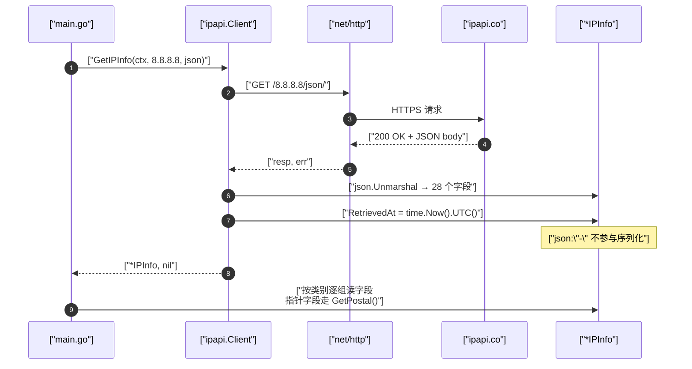

# 🎓 探索 IPInfo 结构体

> `GetIPInfo` 返回的 `*IPInfo` 是整个 SDK 的数据核心。本教程带你把它的每一个字段都打印出来，逐个理解含义，建立对 IP 地理信息的完整心智模型。

## 🎯 你将学到

- 🔍 用 `GetIPInfo` 拿到一条完整的 `IPInfo` 记录
- 🗺️ 按类别遍历 `IPInfo` 的网络、地理、国家、坐标、时间、货币、ASN 等全部字段
- 🧠 理解每个字段背后的语义与典型用途
- 📌 掌握 `Postal *string` 指针字段与 `GetPostal()` 安全访问器
- ⏱️ 认识 `RetrievedAt` 这个 SDK 自动填充、不参与序列化的元字段

## 📋 前置条件

- ✅ 已安装 **Go 1.23+**（本库 `go.mod` 声明 `go 1.23.4`）
- ✅ 已完成 [第一个 IP 查询](./hello-ipapi) 或 [创建你的第一个 Client](./first-client)，能跑通 `NewClient` 与 `GetIPInfo`
- ✅ 了解 `context` 超时的基本用法（参见 [Context 指南](../guide/context)）
- 💡 可选：拥有一个 ipapi.co API Key，用于提升免费层速率限制（本教程示例无需 Key 即可运行）

::: tip 🎨 一图抵千言 — IPInfo 字段全景与遍历路径
`IPInfo` 的 28 个字段按语义可分为 6 组。本教程按下面的顺序逐组探索，建立完整心智模型：
:::

```mermaid
flowchart TD
    Start([🚀 开始探索]) --> S1[🌐 步骤1: 初始化并查询一条记录]
    S1 --> S1a["GetIPInfo(ctx, 8.8.8.8, json)"]
    S1a --> S2[🌐 步骤2: 网络字段]
    S2 --> S2a["IP / Network / Version<br/>ASN / Org / Hostname"]
    S2a --> S3[🗺️ 步骤3: 地理与国家字段]
    S3 --> S3a["City / Region / Country*<br/>ContinentCode / InEU"]
    S3a --> S4[📍 步骤4: 坐标与邮政编码]
    S4 --> S4a["Latitude / Longitude / LatLong<br/>Postal *string 指针"]
    S4a --> S4b{Postal 为 nil?}
    S4b -->|是| GetPostal["用 GetPostal 安全访问<br/>返回空串"]
    S4b -->|否| Direct["可直接解引用"]
    GetPostal --> S5[🕐 步骤5: 时间字段]
    Direct --> S5
    S5 --> S5a["Timezone / UTCOffset"]
    S5a --> S6[💰 步骤6: 货币语言统计字段]
    S6 --> S6a["Currency / Languages<br/>CountryArea / Population"]
    S6a --> S7[⏱️ 步骤7: SDK 元字段 RetrievedAt]
    S7 --> S7a["json:\"-\" 不参与序列化<br/>time.Now UTC 填充"]
    S7a --> Done([🎉 全部字段摸完])
```

## 🚀 步骤 1：初始化项目并查询一条记录

先建项目、引入 SDK，再查询 `8.8.8.8` 拿到一条完整的 `IPInfo`。

::: tip 🎨 一图抵千言 — 一次查询的内部时序
从你调用 `GetIPInfo` 到拿到字段齐全的 `IPInfo`，SDK 在背后完成了请求、反序列化与元字段填充。下面的时序图把这条链路拆开：
:::



```bash
mkdir explore-ipinfo && cd explore-ipinfo
go mod init explore-ipinfo
go get github.com/cyberspacesec/ipapi.co-skills/pkg/ipapi
```

写下第一个程序，只做一件事：查询并确认返回值非空。

```go
package main

import (
	"context"
	"fmt"
	"log"
	"time"

	"github.com/cyberspacesec/ipapi.co-skills/pkg/ipapi"
)

func main() {
	client := ipapi.NewClient()

	ctx, cancel := context.WithTimeout(context.Background(), 5*time.Second)
	defer cancel()

	info, err := client.GetIPInfo(ctx, "8.8.8.8", "json")
	if err != nil {
		log.Fatalf("查询失败: %v", err)
	}

	fmt.Printf("✅ 查询成功，IP = %s\n", info.IP)
}
```

运行：

```bash
go run main.go
```

预期输出：

```
✅ 查询成功，IP = 8.8.8.8
```

`GetIPInfo(ctx, ip, "json")` 对应 `GET https://ipapi.co/{ip}/json/`，返回的 JSON 会被自动反序列化进 `IPInfo` 结构体。结构体定义见 [数据模型](../api/models)。

::: details 🗂️ IPInfo 结构体字段分类速查
| 分类 | 代表字段 | 数量 | 用途 |
|------|----------|------|------|
| 🌐 网络 | `IP` `Network` `Version` `ASN` `Org` `Hostname` | 6 | 网络归属与反查 |
| 🗺️ 地理国家 | `City` `Region` `Country*` `ContinentCode` `InEU` | 11 | 地理定位与国家属性 |
| 📍 坐标邮政 | `Latitude` `Longitude` `LatLong` `Postal` | 4 | 精确位置（Postal 为指针） |
| 🕐 时间 | `Timezone` `UTCOffset` | 2 | 本地化时间显示 |
| 💰 货币统计 | `Currency*` `Languages` `CountryArea` `CountryPopulation` `CountryCallingCode` | 6 | 本地化与数据分析 |
| ⏱️ SDK 元 | `RetrievedAt` | 1 | 缓存与新鲜度（不序列化） |

合计覆盖 `IPInfo` 全部字段。指针类型只有 `Postal *string`，访问器为 `GetPostal()`。
:::

## 🌐 步骤 2：打印网络相关字段

`IPInfo` 的第一组字段描述「这个 IP 在网络层面是什么」。我们把它们单独打印出来。

```go
package main

import (
	"context"
	"fmt"
	"log"
	"time"

	"github.com/cyberspacesec/ipapi.co-skills/pkg/ipapi"
)

func main() {
	client := ipapi.NewClient()

	ctx, cancel := context.WithTimeout(context.Background(), 5*time.Second)
	defer cancel()

	info, err := client.GetIPInfo(ctx, "8.8.8.8", "json")
	if err != nil {
		log.Fatalf("查询失败: %v", err)
	}

	fmt.Println("─── 🌐 网络字段 ───")
	fmt.Printf("IP       = %s   （查询的 IP 地址本身）\n", info.IP)
	fmt.Printf("Network  = %s   （IP 所在网段，CIDR 表示）\n", info.Network)
	fmt.Printf("Version  = %s   （IP 版本：IPv4 / IPv6）\n", info.Version)
	fmt.Printf("ASN      = %s   （自治系统号）\n", info.ASN)
	fmt.Printf("Org      = %s   （ASN 所属组织）\n", info.Org)
	fmt.Printf("Hostname = %s   （反向 DNS 主机名，可为空）\n", info.Hostname)
}
```

字段含义速览：

| 字段 | 含义 | 示例 |
| --- | --- | --- |
| `IP` | 本次查询的目标 IP | `8.8.8.8` |
| `Network` | IP 所属网段（CIDR） | `8.8.8.0/24` |
| `Version` | IP 版本 | `IPv4` |
| `ASN` | 自治系统号 | `AS15169` |
| `Org` | ASN 归属组织 | `Google LLC` |
| `Hostname` | 反向 DNS 主机名 | `dns.google`（可能为空） |

::: tip 💡 Hostname 可能为空
`Hostname` 使用了 `json:"hostname,omitempty"`，它是一个 **可选 add-on 字段**，并非所有查询都会返回值。直接读 `info.Hostname` 是安全的（值类型 `string`，缺省时为零值 `""`），无需判空指针。
:::

更多网络字段细节见 [网络字段分类](../reference/fields/network)。

## 🗺️ 步骤 3：打印地理与国家字段

第二组字段回答「这个 IP 在地球上的哪个位置、属于哪个国家」。

```go
package main

import (
	"context"
	"fmt"
	"log"
	"time"

	"github.com/cyberspacesec/ipapi.co-skills/pkg/ipapi"
)

func main() {
	client := ipapi.NewClient()

	ctx, cancel := context.WithTimeout(context.Background(), 5*time.Second)
	defer cancel()

	info, err := client.GetIPInfo(ctx, "8.8.8.8", "json")
	if err != nil {
		log.Fatalf("查询失败: %v", err)
	}

	fmt.Println("─── 🗺️ 地理与国家字段 ───")
	fmt.Printf("City            = %s   （城市名）\n", info.City)
	fmt.Printf("Region          = %s   （州/省/大区名）\n", info.Region)
	fmt.Printf("RegionCode      = %s   （州/省代码）\n", info.RegionCode)
	fmt.Printf("Country         = %s   （国家代码，如 US）\n", info.Country)
	fmt.Printf("CountryName     = %s   （国家全名）\n", info.CountryName)
	fmt.Printf("CountryCode     = %s   （ISO 3166-1 alpha-2 国家代码）\n", info.CountryCode)
	fmt.Printf("CountryCodeISO3 = %s   （ISO 3166-1 alpha-3 国家代码）\n", info.CountryCodeISO3)
	fmt.Printf("CountryCapital  = %s   （该国首都）\n", info.CountryCapital)
	fmt.Printf("CountryTLD      = %s   （国家顶级域名，如 .us）\n", info.CountryTLD)
	fmt.Printf("ContinentCode   = %s   （洲代码，如 NA）\n", info.ContinentCode)
	fmt.Printf("InEU            = %t   （是否位于欧盟，用于 GDPR 合规）\n", info.InEU)
}
```

字段含义速览：

| 字段 | 含义 | 示例 |
| --- | --- | --- |
| `City` | 城市 | `Mountain View` |
| `Region` | 州/省/大区 | `California` |
| `RegionCode` | 州/省代码 | `CA` |
| `Country` | 国家代码（同 `country_code`） | `US` |
| `CountryName` | 国家全名 | `United States` |
| `CountryCode` | ISO alpha-2 国家代码 | `US` |
| `CountryCodeISO3` | ISO alpha-3 国家代码 | `USA` |
| `CountryCapital` | 首都 | `Washington, D.C.` |
| `CountryTLD` | 国家顶级域名 | `.us` |
| `ContinentCode` | 洲代码 | `NA` |
| `InEU` | 是否在欧盟（GDPR 判定） | `false` |

更多国家字段细节见 [国家字段分类](../reference/fields/country) 与 [地理字段分类](../reference/fields/city)。

## 📮 步骤 4：打印坐标与邮政编码

第三组字段给出精确的经纬度与邮政编码。这里要特别注意 `Postal` 是 **指针类型**。

```go
package main

import (
	"context"
	"fmt"
	"log"
	"time"

	"github.com/cyberspacesec/ipapi.co-skills/pkg/ipapi"
)

func main() {
	client := ipapi.NewClient()

	ctx, cancel := context.WithTimeout(context.Background(), 5*time.Second)
	defer cancel()

	info, err := client.GetIPInfo(ctx, "8.8.8.8", "json")
	if err != nil {
		log.Fatalf("查询失败: %v", err)
	}

	fmt.Println("─── 📍 坐标与邮政编码 ───")
	fmt.Printf("Latitude  = %f   （纬度）\n", info.Latitude)
	fmt.Printf("Longitude = %f   （经度）\n", info.Longitude)
	fmt.Printf("LatLong   = %s   （纬经度字符串，格式 \"lat,lon\"）\n", info.LatLong)

	// ⚠️ Postal 是 *string 指针，直接解引用前必须判 nil！
	// 推荐使用安全访问器 GetPostal()，nil 时返回空串。
	fmt.Printf("Postal    = %s   （邮政编码，可能为空）\n", info.GetPostal())

	// 也可以用 ParseLatLong() 把 LatLong 字符串解析成两个 float64
	lat, lon, err := info.ParseLatLong()
	if err != nil {
		fmt.Printf("ParseLatLong 失败: %v\n", err)
	} else {
		fmt.Printf("ParseLatLong → lat=%f, lon=%f\n", lat, lon)
	}
}
```

::: warning ⚠️ Postal 是指针字段
`Postal *string` 用指针而非值类型，是因为 **部分国家没有邮政编码体系**，需要区分「空字符串」和「接口根本没有返回该字段」两种情况：

- 接口未返回 `postal` → `info.Postal == nil`
- 接口返回 `"postal": ""` → `info.Postal` 指向空串

直接 `*info.Postal` 在 `nil` 时会 panic。**始终用 `info.GetPostal()` 安全访问**，它在 `nil` 时返回 `""`。所有指针类型字段都应优先走对应的 `Get*()` 方法。
:::

更多坐标字段细节见 [坐标字段分类](../reference/fields/latlong) 与 [邮政编码字段](../reference/fields/postal)。

## 🕐 步骤 5：打印时间字段

第四组字段描述该 IP 所在地的时区信息，常用于本地化时间显示。

```go
package main

import (
	"context"
	"fmt"
	"log"
	"time"

	"github.com/cyberspacesec/ipapi.co-skills/pkg/ipapi"
)

func main() {
	client := ipapi.NewClient()

	ctx, cancel := context.WithTimeout(context.Background(), 5*time.Second)
	defer cancel()

	info, err := client.GetIPInfo(ctx, "8.8.8.8", "json")
	if err != nil {
		log.Fatalf("查询失败: %v", err)
	}

	fmt.Println("─── 🕐 时间字段 ───")
	fmt.Printf("Timezone   = %s   （IANA 时区名，如 America/Los_Angeles）\n", info.Timezone)
	fmt.Printf("UTCOffset  = %s   （相对 UTC 的偏移，如 -0700）\n", info.UTCOffset)

	// 借助 Timezone 把「现在」转换成目标 IP 所在地的本地时间
	if info.Timezone != "" {
		loc, err := time.LoadLocation(info.Timezone)
		if err == nil {
			fmt.Printf("该 IP 所在地当前时间 = %s\n", time.Now().In(loc).Format("2006-01-02 15:04:05 MST"))
		}
	}
}
```

字段含义速览：

| 字段 | 含义 | 示例 |
| --- | --- | --- |
| `Timezone` | IANA 时区标识 | `America/Los_Angeles` |
| `UTCOffset` | 相对 UTC 偏移 | `-0700` |

更多时间字段细节见 [时间字段分类](../reference/fields/utc_offset)。

## 💰 步骤 6：打印货币、语言与国家统计字段

第五组字段给出该国家的货币、语言及宏观统计信息，常用于电商本地化与数据分析。

```go
package main

import (
	"context"
	"fmt"
	"log"
	"time"

	"github.com/cyberspacesec/ipapi.co-skills/pkg/ipapi"
)

func main() {
	client := ipapi.NewClient()

	ctx, cancel := context.WithTimeout(context.Background(), 5*time.Second)
	defer cancel()

	info, err := client.GetIPInfo(ctx, "8.8.8.8", "json")
	if err != nil {
		log.Fatalf("查询失败: %v", err)
	}

	fmt.Println("─── 💰 货币 / 语言 / 统计字段 ───")
	fmt.Printf("CountryCallingCode = %s   （国际电话区号，如 +1）\n", info.CountryCallingCode)
	fmt.Printf("Currency           = %s   （货币代码，如 USD）\n", info.Currency)
	fmt.Printf("CurrencyName       = %s   （货币名称，如 US Dollar）\n", info.CurrencyName)
	fmt.Printf("Languages          = %s   （官方语言列表，逗号分隔）\n", info.Languages)
	fmt.Printf("CountryArea        = %.0f km²   （国土面积）\n", info.CountryArea)
	fmt.Printf("CountryPopulation  = %d   （国家人口）\n", info.CountryPopulation)
}
```

字段含义速览：

| 字段 | 含义 | 示例 |
| --- | --- | --- |
| `CountryCallingCode` | 国际电话区号 | `+1` |
| `Currency` | ISO 4217 货币代码 | `USD` |
| `CurrencyName` | 货币全名 | `US Dollar` |
| `Languages` | 官方语言（多语言逗号分隔） | `en` |
| `CountryArea` | 国土面积（km²） | `9629091` |
| `CountryPopulation` | 国家人口 | `327167434` |

更多货币字段细节见 [货币字段分类](../reference/fields/currency) 与 [统计字段分类](../reference/fields/country_population)。

## ⏱️ 步骤 7：认识 SDK 元字段 RetrievedAt

最后还有一个**不在 API 响应里、由 SDK 自动填充**的字段：`RetrievedAt`。

```go
package main

import (
	"context"
	"fmt"
	"log"
	"time"

	"github.com/cyberspacesec/ipapi.co-skills/pkg/ipapi"
)

func main() {
	client := ipapi.NewClient()

	ctx, cancel := context.WithTimeout(context.Background(), 5*time.Second)
	defer cancel()

	info, err := client.GetIPInfo(ctx, "8.8.8.8", "json")
	if err != nil {
		log.Fatalf("查询失败: %v", err)
	}

	fmt.Println("─── ⏱️ SDK 元字段 ───")
	fmt.Printf("RetrievedAt = %s   （SDK 记录的查询时刻，UTC）\n", info.RetrievedAt.Format(time.RFC3339))
}
```

::: tip 💡 RetrievedAt 不参与序列化
`RetrievedAt time.Time` 的 JSON tag 是 `json:"-"`，意味着：

- ✅ **不会** 出现在 ipapi.co 返回的 JSON 里 —— 它不是 API 字段。
- ✅ **不会** 被序列化进你自己的 JSON 输出 —— 用 `json.Marshal(info)` 时会被忽略。
- ✅ 由 SDK 在 `GetIPInfo` / `GetClientIPInfo` 内部用 `time.Now().UTC()` 填充，记录「这条数据是什么时候查到的」。

它非常适合用于缓存过期判断、数据新鲜度校验与日志审计。
:::

## 🧩 完整代码

把上述所有步骤合并成一个完整程序，分门别类地把 `IPInfo` 全部字段打印出来。

```go
package main

import (
	"context"
	"fmt"
	"log"
	"time"

	"github.com/cyberspacesec/ipapi.co-skills/pkg/ipapi"
)

func main() {
	client := ipapi.NewClient()

	ctx, cancel := context.WithTimeout(context.Background(), 5*time.Second)
	defer cancel()

	// 查询 8.8.8.8 的完整记录
	info, err := client.GetIPInfo(ctx, "8.8.8.8", "json")
	if err != nil {
		log.Fatalf("查询失败: %v", err)
	}

	// 🌐 网络字段
	fmt.Println("─── 🌐 网络字段 ───")
	fmt.Printf("IP       = %s\n", info.IP)
	fmt.Printf("Network  = %s\n", info.Network)
	fmt.Printf("Version  = %s\n", info.Version)
	fmt.Printf("ASN      = %s\n", info.ASN)
	fmt.Printf("Org      = %s\n", info.Org)
	fmt.Printf("Hostname = %s\n", info.Hostname)

	// 🗺️ 地理与国家字段
	fmt.Println("\n─── 🗺️ 地理与国家字段 ───")
	fmt.Printf("City            = %s\n", info.City)
	fmt.Printf("Region          = %s\n", info.Region)
	fmt.Printf("RegionCode      = %s\n", info.RegionCode)
	fmt.Printf("Country         = %s\n", info.Country)
	fmt.Printf("CountryName     = %s\n", info.CountryName)
	fmt.Printf("CountryCode     = %s\n", info.CountryCode)
	fmt.Printf("CountryCodeISO3 = %s\n", info.CountryCodeISO3)
	fmt.Printf("CountryCapital  = %s\n", info.CountryCapital)
	fmt.Printf("CountryTLD      = %s\n", info.CountryTLD)
	fmt.Printf("ContinentCode   = %s\n", info.ContinentCode)
	fmt.Printf("InEU            = %t\n", info.InEU)

	// 📍 坐标与邮政编码
	fmt.Println("\n─── 📍 坐标与邮政编码 ───")
	fmt.Printf("Latitude  = %f\n", info.Latitude)
	fmt.Printf("Longitude = %f\n", info.Longitude)
	fmt.Printf("LatLong   = %s\n", info.LatLong)
	fmt.Printf("Postal    = %s   （用 GetPostal() 安全访问）\n", info.GetPostal())

	// 🕐 时间字段
	fmt.Println("\n─── 🕐 时间字段 ───")
	fmt.Printf("Timezone  = %s\n", info.Timezone)
	fmt.Printf("UTCOffset = %s\n", info.UTCOffset)

	// 💰 货币 / 语言 / 统计字段
	fmt.Println("\n─── 💰 货币 / 语言 / 统计字段 ───")
	fmt.Printf("CountryCallingCode = %s\n", info.CountryCallingCode)
	fmt.Printf("Currency           = %s\n", info.Currency)
	fmt.Printf("CurrencyName       = %s\n", info.CurrencyName)
	fmt.Printf("Languages          = %s\n", info.Languages)
	fmt.Printf("CountryArea        = %.0f km²\n", info.CountryArea)
	fmt.Printf("CountryPopulation  = %d\n", info.CountryPopulation)

	// ⏱️ SDK 元字段
	fmt.Println("\n─── ⏱️ SDK 元字段 ───")
	fmt.Printf("RetrievedAt = %s\n", info.RetrievedAt.Format(time.RFC3339))

	// 🧮 附加演示：解析 LatLong 字符串
	if lat, lon, err := info.ParseLatLong(); err == nil {
		fmt.Printf("\nParseLatLong → lat=%f, lon=%f\n", lat, lon)
	}
}
```

## 🖥️ 运行结果

```bash
go run main.go
```

预期输出（实际城市/坐标等以 ipapi.co 当时返回为准）：

```text
─── 🌐 网络字段 ───
IP       = 8.8.8.8
Network  = 8.8.8.0/24
Version  = IPv4
ASN      = AS15169
Org      = Google LLC
Hostname = dns.google

─── 🗺️ 地理与国家字段 ───
City            = Mountain View
Region          = California
RegionCode      = CA
Country         = US
CountryName     = United States
CountryCode     = US
CountryCodeISO3 = USA
CountryCapital  = Washington, D.C.
CountryTLD      = .us
ContinentCode   = NA
InEU            = false

─── 📍 坐标与邮政编码 ───
Latitude  = 37.405600
Longitude = -122.077500
LatLong   = 37.4056,-122.0775
Postal    = 94043   （用 GetPostal() 安全访问）

─── 🕐 时间字段 ───
Timezone  = America/Los_Angeles
UTCOffset = -0700

─── 💰 货币 / 语言 / 统计字段 ───
CountryCallingCode = +1
Currency           = USD
CurrencyName       = US Dollar
Languages          = en
CountryArea        = 9629091 km²
CountryPopulation  = 327167434

─── ⏱️ SDK 元字段 ───
RetrievedAt = 2026-07-03T12:00:00Z

ParseLatLong → lat=37.405600, lon=-122.077500
```

::: tip 💡 输出可能因 IP 与时间不同而变化
- `8.8.8.8` 的地理位置由 ipapi.co 数据库决定，可能随其数据更新而变化。
- `UTCOffset` 与 `RetrievedAt` 受查询时的夏令时与系统时钟影响。
- 查询保留地址（如 `127.0.0.1`）时，地理字段大多为空，详见 [保留地址识别教程](./error-branches-tutorial)。
:::

## 📝 小结

🎉 恭喜！你已经把 `IPInfo` 的全部字段摸了一遍。回顾要点：

- 🌐 **网络字段**（`IP` / `Network` / `Version` / `ASN` / `Org` / `Hostname`）描述 IP 的网络归属，`Hostname` 是可选 add-on，可能为空。
- 🗺️ **地理与国家字段**（`City` / `Region` / `Country*` / `ContinentCode` / `InEU`）描述 IP 的地理位置与国家属性，`InEU` 直接服务于 GDPR 合规判断。
- 📍 **坐标与邮政编码**（`Latitude` / `Longitude` / `LatLong` / `Postal`）给出精确位置；`Postal` 是 **指针字段**，务必用 `GetPostal()` 安全访问，`LatLong` 可用 `ParseLatLong()` 解析。
- 🕐 **时间字段**（`Timezone` / `UTCOffset`）支持本地化时间显示。
- 💰 **货币 / 语言 / 统计字段**（`CountryCallingCode` / `Currency` / `CurrencyName` / `Languages` / `CountryArea` / `CountryPopulation`）服务于本地化与数据分析。
- ⏱️ **`RetrievedAt`** 是 SDK 自动填充的元字段，`json:"-"` 不参与序列化，适合做缓存过期与新鲜度判断。

记住一条铁律：**指针类型字段走 `Get*()`，值类型字段直接读**。

::: danger 🚨 三大易踩坑点
1. **`*info.Postal` 直接解引用** —— `Postal` 是 `*string`，接口未返回时为 `nil`，解引用会 panic。务必用 `info.GetPostal()`。
2. **误以为 `Hostname` 一定有值** —— 它是 `omitempty` 可选字段，部分查询返回空串，读 `info.Hostname` 安全（零值 `""`），但别拿它做必填判断。
3. **把 `RetrievedAt` 当 API 字段写回** —— 它的 JSON tag 是 `json:"-"`，`json.Marshal(info)` 时会被丢弃；若需持久化查询时刻，要单独序列化这个字段。
:::

完整的结构体定义可对照源码 [models.go](https://github.com/cyberspacesec/ipapi.co-skills/blob/main/pkg/ipapi/models.go) 与 [数据模型文档](../api/models)。

## 🚀 下一步

- 📖 想只取一个字段、省带宽？读 [查询单个字段教程](./single-field-tutorial)
- 🍳 想看实战场景？翻阅 [Cookbook](../cookbook/)，例如 [按 IP 货币本地化](../cookbook/currency-display) 与 [显示用户本地时间](../cookbook/timezone-greeting)
- 📚 想逐字段深挖语义？看 [字段总览](../api/fields) 与 [数据模型](../api/models)
- 🧭 想理解查询返回值的整体生命周期？读 [字段概念](../guide/field-concept) 与 [客户端概念](../guide/client-concept)
- ➡️ 下一篇教程：[查询单个字段](./single-field-tutorial) —— 用 `GetField` 精准取值，告别整包 JSON
