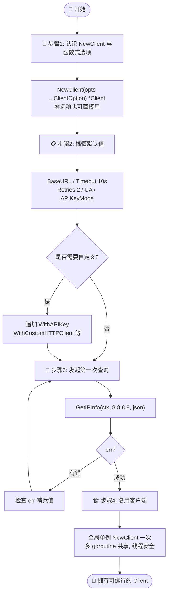
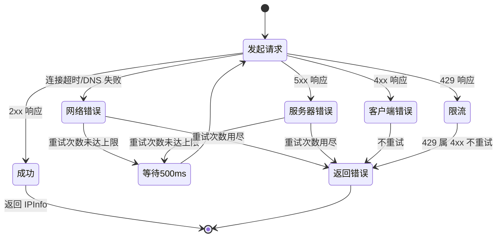

# 🎓 创建你的第一个 Client

> 从零开始，用 `ipapi.co-skills` Go SDK 创建一个可运行的 IP 查询客户端，并搞懂每一个默认值背后的设计。

## 你将学到

- 🧩 用 `ipapi.NewClient()` 创建一个开箱即用的客户端
- 📋 列出 `NewClient` 在你不传任何选项时给出的**默认值**，以及它们为什么这样设计
- 🏗 写出第一个能真正跑起来、有正确超时与错误处理的查询程序
- 🧭 理解 `Client` 的复用模型，避免最常见的性能陷阱

## 前置条件

在开始之前，请确认你已经具备：

- 🐹 **Go `1.23.4` 或更高版本**（本库 `go.mod` 声明 `go 1.23.4`）
- 📦 已完成 [安装指南](../guide/installation)，能在项目里 `import "github.com/cyberspacesec/ipapi.co-skills/pkg/ipapi"`
- 🌐 一台能访问 `https://ipapi.co` 的机器（免费额度无需 API Key 即可跑通本教程）

::: tip 💡 还没装好？
如果你还没初始化项目，先执行：

```bash
mkdir myapp && cd myapp
go mod init myapp
go get github.com/cyberspacesec/ipapi.co-skills
```

详细的版本要求、国内代理配置见 [安装](../guide/installation)。
:::

::: tip 🎨 一图抵千言 — 本教程的步骤流程
从「认识 NewClient」到「并发复用 Client」，下面这张图串起了本教程的全部步骤与决策点：
:::



## 步骤 1：认识 `NewClient` 与函数式选项

`Client` 是整个 SDK 的核心，所有查询都通过它发起。它采用 **函数式选项（functional options）** 模式构造：

```go
func NewClient(opts ...ClientOption) *Client
```

最吸引人的地方在于——**不传任何选项，它也能直接用**。`NewClient()` 会为你填好一组合理的默认值，覆盖基地址、超时、重试、User-Agent 等关键参数。

先写一个「只创建、不发请求」的最小程序，确认环境通了：

```go
package main

import (
	"fmt"

	"github.com/cyberspacesec/ipapi.co-skills/pkg/ipapi"
)

func main() {
	// 最简：全部使用默认值，无需 API Key
	client := ipapi.NewClient()

	// BaseURL 是导出字段，可以直接读
	fmt.Printf("客户端创建成功 ✅\n")
	fmt.Printf("基地址: %s\n", client.BaseURL)
	fmt.Printf("重试次数: %d\n", client.Retries)
	fmt.Printf("User-Agent: %s\n", client.UserAgent)
}
```

运行：

```bash
go run main.go
```

预期输出：

```
客户端创建成功 ✅
基地址: https://ipapi.co/
重试次数: 2
User-Agent: ipapi-go-client/1.0
```

::: tip 🧠 为什么是函数式选项？
函数式选项让你「按需」配置：本地开发一行 `NewClient()` 就够；上生产再追加 `WithAPIKey`、`WithCustomHTTPClient` 等。默认值与自定义之间没有「构造函数爆炸」，调用点永远清爽。完整选项清单见 [API 参考 - 选项](../api/with-api-key)。
:::

## 步骤 2：搞懂 `NewClient` 的默认值

`NewClient()` 不传选项时，内部会这样初始化（对应源码 `client.go`）：

| 字段 | 默认值 | 常量来源 | 为什么这样设计 |
|------|--------|----------|----------------|
| `BaseURL` | `https://ipapi.co/` | `defaultBaseURL` | 官方 API 域名，无需自填 |
| `HTTPClient.Timeout` | `10s` | `defaultTimeout` | 互联网上地理查询的合理上限，既不太短导致误超时，也不太长拖垮服务 |
| `HTTPClient.CheckRedirect` | 最多 3 次跳转 | `maxRedirects` | 防止恶意/异常重定向链把请求拖死 |
| `UserAgent` | `ipapi-go-client/1.0` | 硬编码 | 让服务端能识别本 SDK 的流量，便于排障 |
| `Retries` | `2` | 硬编码 | 仅对**网络错误**与 **5xx** 重试，每次间隔 `500ms`（`defaultRetryDelay`） |
| `APIKeyMode` | `APIKeyHeader` | `iota` 零值 | 默认用 `Authorization: Bearer <key>` 头部认证，更安全 |
| `APIKey` | `""`（空） | 零值 | 免费额度不需要 Key；留空即匿名调用 |
| `RateLimiter` | `nil` | 零值 | 不内置限流，由你按业务节奏注入 `time.Tick` 通道 |
| `Callback` | `""`（空） | 零值 | 仅 JSONP 场景才需要 |

把这页表格记在心里，你就掌握了 `Client` 的「出厂状态」。每个常量的逐字解析见 [功能点深度参考](../reference/)。

::: warning ⚠️ 重试只覆盖一部分错误
`Retries: 2` **不会**重试 4xx（例如 `429 Too Many Requests`、`403 Invalid Key`）——这些是客户端问题，重试无意义。只有网络层错误和 5xx 才会按 `500ms` 间隔重试。详见 [重试概念](../guide/retry-concept) 与 [`IsRetryableError`](../api/is-retryable)。
:::

::: details 🔄 重试机制的状态流转
下面这张状态图展示了 `doRequest` 内部对一次请求的重试决策过程：



关键结论：**4xx（含 429）永不重试**，只有网络错误与 5xx 才会按 500ms 间隔最多重试 2 次（共 3 次尝试）。
:::

## 步骤 3：发起第一次查询

光创建客户端不够，我们来真正查一个 IP。本步骤查询 Google DNS `8.8.8.8` 的地理位置信息。

关键点：
- 用 `context.WithTimeout` 给单次请求设一个比 `HTTPClient.Timeout` 更细粒度的上限
- 调用 `GetIPInfo(ctx, ip, "json")`，返回解析好的 `*IPInfo`
- 永远检查 `err`——SDK 会把 `4xx/5xx`、限流、无效 IP 等映射成清晰的哨兵错误

```go
package main

import (
	"context"
	"fmt"
	"log"
	"time"

	"github.com/cyberspacesec/ipapi.co-skills/pkg/ipapi"
)

func main() {
	// 1. 创建默认客户端
	client := ipapi.NewClient()

	// 2. 带 5 秒超时的上下文（比 HTTPClient 的 10s 更短，优先级更高）
	ctx, cancel := context.WithTimeout(context.Background(), 5*time.Second)
	defer cancel()

	// 3. 查询 8.8.8.8 的完整信息
	info, err := client.GetIPInfo(ctx, "8.8.8.8", "json")
	if err != nil {
		log.Fatalf("查询失败: %v", err)
	}

	// 4. 打印关键字段
	fmt.Printf("🌐 IP: %s\n", info.IP)
	fmt.Printf("🏙 城市: %s, %s\n", info.City, info.CountryName)
	fmt.Printf("🧭 经纬度: %s\n", info.LatLong)
	fmt.Printf("⏰ 时区: %s (UTC%s)\n", info.Timezone, info.UTCOffset)
	fmt.Printf("📡 ASN: %s (%s)\n", info.ASN, info.Org)
}
```

运行：

```bash
go run main.go
```

`GetIPInfo` 还会顺手填上 `RetrievedAt`（UTC 时间戳），方便你做缓存与对账。完整的 28 个字段含义见 [字段详解](../reference/)，方法签名见 [`GetIPInfo` API](../api/get-ip-info)。

## 步骤 4：复用客户端，别每次都 `NewClient()`

`Client` 是 **线程安全** 的——内部每次请求都新建 `*http.Request`，没有共享可变状态。这意味着你应该在应用启动时创建一次、全局复用，而不是每来一个请求就 `NewClient()`。

复用的好处是复用底层 `http.Client` 的连接池，省掉大量 TCP/TLS 握手开销。

::: info 📊 NewClient 每次请求 vs 全局复用对照
| 模式 | 连接池 | TLS 握手 | 内存 | 适用场景 |
|------|--------|----------|------|----------|
| 每次请求 `NewClient()` | ❌ 无法复用 | 每次重新握手 | 频繁分配 | 不推荐 |
| 全局单例复用 | ✅ 复用连接池 | 仅首次握手 | 稳定 | ✅ 生产推荐 |
| 按协程独立 Client | 部分 | 部分复用 | 中等 | 特殊隔离需求 |

一个全局 `Client` 足以支撑高并发查询，内部无共享可变状态。
:::

```go
package main

import (
	"context"
	"fmt"
	"log"
	"sync"
	"time"

	"github.com/cyberspacesec/ipapi.co-skills/pkg/ipapi"
)

// 全局单例：启动时创建一次，所有 goroutine 共享
var client = ipapi.NewClient()

func lookup(ip string, wg *sync.WaitGroup) {
	defer wg.Done()

	ctx, cancel := context.WithTimeout(context.Background(), 5*time.Second)
	defer cancel()

	info, err := client.GetIPInfo(ctx, ip, "json")
	if err != nil {
		log.Printf("[%s] 查询失败: %v", ip, err)
		return
	}
	fmt.Printf("[%s] %s, %s (ASN %s)\n", ip, info.City, info.CountryName, info.ASN)
}

func main() {
	ips := []string{"8.8.8.8", "1.1.1.1", "9.9.9.9"}

	var wg sync.WaitGroup
	for _, ip := range ips {
		wg.Add(1)
		go lookup(ip, &wg) // 并发复用同一个 client，安全
	}
	wg.Wait()
}
```

::: tip 🚀 何时才该自定义？
默认值覆盖了绝大多数场景。当你需要更长超时、注入代理、加 API Key 或自定义错误处理时，再叠加选项：

```go
client := ipapi.NewClient(
	ipapi.WithAPIKey(os.Getenv("IPAPI_KEY")),
	ipapi.WithCustomHTTPClient(&http.Client{Timeout: 30 * time.Second}),
)
```

各选项的选用指南见 [Client 概念](../guide/client-concept)。
:::

## 完整代码

下面是本教程的汇总版本——一个完整可运行的 `main.go`，覆盖创建、默认值探查、单次查询与并发复用：

```go
package main

import (
	"context"
	"fmt"
	"log"
	"sync"
	"time"

	"github.com/cyberspacesec/ipapi.co-skills/pkg/ipapi"
)

// 全局单例：启动时创建一次，所有 goroutine 共享
var client = ipapi.NewClient()

func main() {
	// —— 默认值探查 ——
	fmt.Println("=== 默认值 ===")
	fmt.Printf("基地址: %s\n", client.BaseURL)
	fmt.Printf("重试次数: %d\n", client.Retries)
	fmt.Printf("User-Agent: %s\n\n", client.UserAgent)

	// —— 单次查询 ——
	fmt.Println("=== 单次查询 8.8.8.8 ===")
	ctx, cancel := context.WithTimeout(context.Background(), 5*time.Second)
	defer cancel()

	info, err := client.GetIPInfo(ctx, "8.8.8.8", "json")
	if err != nil {
		log.Fatalf("查询失败: %v", err)
	}
	fmt.Printf("🌐 IP: %s\n", info.IP)
	fmt.Printf("🏙 城市: %s, %s\n", info.City, info.CountryName)
	fmt.Printf("🧭 经纬度: %s\n", info.LatLong)
	fmt.Printf("⏰ 时区: %s (UTC%s)\n", info.Timezone, info.UTCOffset)
	fmt.Printf("📡 ASN: %s (%s)\n\n", info.ASN, info.Org)

	// —— 并发复用同一个 client ——
	fmt.Println("=== 并发复用 ===")
	ips := []string{"8.8.8.8", "1.1.1.1", "9.9.9.9"}
	var wg sync.WaitGroup
	for _, ip := range ips {
		wg.Add(1)
		go func(ip string) {
			defer wg.Done()
			c, cancel := context.WithTimeout(context.Background(), 5*time.Second)
			defer cancel()
			info, err := client.GetIPInfo(c, ip, "json")
			if err != nil {
				log.Printf("[%s] 失败: %v", ip, err)
				return
			}
			fmt.Printf("[%s] %s, %s (ASN %s)\n", ip, info.City, info.CountryName, info.ASN)
		}(ip)
	}
	wg.Wait()
}
```

## 运行结果

预期输出（具体城市/ASN 以 ipapi.co 实时返回为准）：

```
=== 默认值 ===
基地址: https://ipapi.co/
重试次数: 2
User-Agent: ipapi-go-client/1.0

=== 单次查询 8.8.8.8 ===
🌐 IP: 8.8.8.8
🏙 城市: Mountain View, United States
🧭 经纬度: 37.4056,-122.0775
⏰ 时区: America/Los_Angeles (UTC-07:00)
📡 ASN: AS15169 (Google LLC)

=== 并发复用 ===
[1.1.1.1] San Francisco, United States (AS13335)
[9.9.9.9] Berkeley, United States (AS19281)
[8.8.8.8] Mountain View, United States (AS15169)
```

::: details 🔍 想看原始 JSON 而不是结构体？
把 `GetIPInfo` 换成 `GetIPInfoRaw`，你会拿到未解析的 `[]byte`，适合 XML/CSV/YAML/JSONP 场景：

```go
raw, err := client.GetIPInfoRaw(ctx, "8.8.8.8", "yaml")
fmt.Println(string(raw))
```

详见 [`GetIPInfoRaw` API](../api/get-ip-info-raw) 与 [响应格式](../guide/formats)。
:::

## 小结

- ✅ `ipapi.NewClient()` 零选项即可开箱即用，默认值覆盖了基地址、10s 超时、最多 3 跳转、2 次重试、合理 User-Agent
- ✅ 函数式选项让你「按需」追加 `WithAPIKey`、`WithCustomHTTPClient` 等，默认与自定义统一于一处
- ✅ 查询用 `GetIPInfo(ctx, ip, "json")`，记得配 `context.WithTimeout` 并检查 `err`
- ✅ `Client` 线程安全，应全局复用单例以复用连接池——别每次请求都 `NewClient()`
- ✅ 重试只覆盖网络错误与 5xx，4xx 不会重试

## 下一步

恭喜，你已经拥有了一个能跑的 Client！继续深入：

- 📖 [Client 概念](../guide/client-concept) — 深入理解 6 个查询方法的矩阵与配置项选用
- 🔧 [认证机制](../guide/auth-concept) — 何时需要 API Key、Header vs Query 两种模式
- 📚 [API 参考](../api/methods) — `NewClient` 与全部方法、选项的逐字签名
- 🗂 [字段详解](../reference/) — `IPInfo` 28 个字段的含义与取值
- 🧭 [响应格式](../guide/formats) — JSON / JSONP / XML / CSV / YAML 的取舍

实战食谱推荐接着读：

- 🍳 [异步查询](../cookbook/async-lookup) — goroutine + channel 并发批量
- 🍳 [缓存查询](../cookbook/cached-lookup) — `sync.Map` 降低配额消耗
- 🍳 [GeoIP 中间件](../cookbook/geoip-middleware) — 把 Client 接进 HTTP 服务

下一篇教程：[查询指定 IP 的地理位置](./hello-ipapi)（即将推出）。
