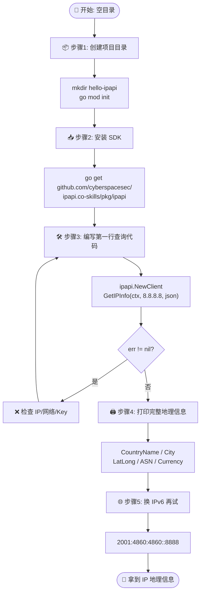
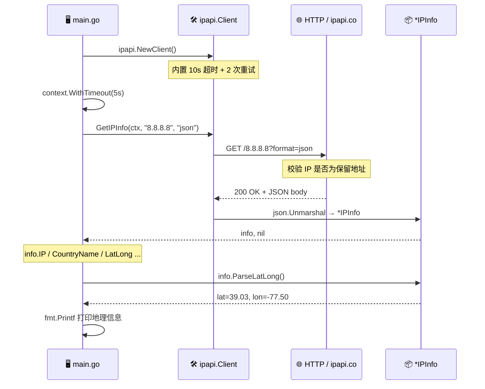

# 🎓 第一个 IP 查询

> 从零创建一个 Go 项目，安装 ipapi.co-skills SDK，发起第一次 `GetIPInfo` 查询并打印结果。

## 你将学到

- 📦 如何用 `go mod init` 从零初始化一个 Go 模块
- 📥 如何通过 `go get` 安装 `github.com/cyberspacesec/ipapi.co-skills/pkg/ipapi`
- 🛠️ 如何用 `ipapi.NewClient()` 创建一个默认客户端
- 🚀 如何用 `client.GetIPInfo(ctx, ip, "json")` 查询一个公网 IP 的地理信息
- 🖨️ 如何把返回的 `*IPInfo` 字段格式化打印到终端

## 前置条件

在开始之前，请确认你已具备以下条件：

- ✅ 已安装 **Go 1.23 或更高版本**（本教程基于 `go 1.23.4` 验证）。可用 `go version` 检查。
- ✅ 拥有一个可用的终端与文本编辑器。
- ✅ 能够访问 `https://ipapi.co/`（免登录即可查询，免费额度有限；如需更高额度请参阅 [鉴权概念](../guide/auth-concept)）。
- 💡 如果你第一次接触本 SDK，建议先通读 [快速上手](../guide/getting-started) 与 [安装](../guide/installation)，了解整体设计。

> 📌 本教程无需 API Key 即可运行。免费查询会受到速率限制，超出后可参考 [限流错误](../reference/errors/err-rate-limited) 处理。

::: tip 🎨 一图抵千言 — 本教程的完整流程
下面这张流程图展示了从「零项目」到「拿到 IP 地理信息」的全过程，对照着看每一步会更有方向感：
:::



## 步骤 1：创建项目目录

先为本次练习新建一个干净的目录，并在其中初始化 Go 模块。

```bash
mkdir hello-ipapi
cd hello-ipapi
go mod init example.com/hello-ipapi
```

执行后，目录中会出现一个 `go.mod` 文件，内容类似：

```
module example.com/hello-ipapi

go 1.23.4
```

> 🧭 `module` 路径可以随意命名，这里用 `example.com/hello-ipapi` 仅作演示。它只是本项目的内部标识，不会对外发布。

::: details 📂 项目目录结构预览
完成步骤 1–3 后，你的项目目录会长这样：

```
hello-ipapi/
├── go.mod          # 模块定义，记录 go 版本与依赖
├── go.sum          # 依赖哈希校验（go get 后自动生成）
└── main.go         # 步骤 3 编写的查询程序
```

`go.mod` 是 Go 模块的“身份证”，所有 `import` 路径都以它声明的 `module` 为根。
:::

## 步骤 2：安装 SDK

在项目根目录执行下面的命令，拉取本 SDK：

```bash
go get github.com/cyberspacesec/ipapi.co-skills/pkg/ipapi
```

安装完成后，`go.mod` 中会出现类似一行依赖：

```
require github.com/cyberspacesec/ipapi.co-skills/pkg/ipapi v0.0.0-...
```

> ⚙️ 关于安装方式、私有代理、版本选择的更多说明，参见 [安装指南](../guide/installation)。

## 步骤 3：编写第一行查询代码

在项目根目录新建 `main.go`，填入以下内容。这一步我们只做“查询 + 打印 IP 字段”这一件最小的事，确认链路通畅。

```go
package main

import (
	"context"
	"fmt"
	"log"
	"time"

	"github.com/cyberspacesec/ipapi.co-skills/pkg/ipapi"
)

func main() {
	// 1. 创建默认客户端（无需 API Key）
	client := ipapi.NewClient()

	// 2. 设置 5 秒超时，避免请求卡死
	ctx, cancel := context.WithTimeout(context.Background(), 5*time.Second)
	defer cancel()

	// 3. 查询 Google 公共 DNS 的地理位置
	info, err := client.GetIPInfo(ctx, "8.8.8.8", "json")
	if err != nil {
		log.Fatalf("查询失败: %v", err)
	}

	// 4. 打印最基础的一个字段
	fmt.Println("IP:", info.IP)
}
```

逐段说明：

- 🧱 `ipapi.NewClient()` 用默认配置构造客户端，内置 10 秒 HTTP 超时与 2 次重试，参见 [客户端概念](../guide/client-concept)。
- ⏱️ `context.WithTimeout` 给本次请求再加一道 5 秒上限，理解 `context` 的用法见 [Context 与超时](../guide/context)。
- 🎯 `GetIPInfo(ctx, ip, "json")` 是核心调用：第二个参数是要查询的 IPv4/IPv6 字符串，第三个参数固定传 `"json"` 才能被解码成结构体。详见 [GetIPInfo API](../api/get-ip-info)。
- 🧾 返回的 `info` 是 `*IPInfo`，所有字段定义见 [IPInfo 模型](../api/models) 与 [字段总览](../reference/fields/ip)。

::: tip 🎨 一图抵千言 — 一次查询的内部时序
上面讲的是「项目怎么搭」，下面这张时序图换个视角，展示 `go run main.go` 执行时，你的代码、SDK 客户端与 ipapi.co 服务之间是如何一问一答把地理信息拿回来的：
:::



运行：

```bash
go run main.go
```

如果一切正常，你会看到：

```
IP: 8.8.8.8
```

> 🎉 到这一步，你的第一次 IP 查询已经成功了！下面的步骤只是把更多有用字段打印出来。

## 步骤 4：打印完整的地理信息

`IPInfo` 里包含了国家、城市、经纬度、时区、ASN、货币等几十个字段。我们挑选最常用的几项格式化输出。

把 `main.go` 的第 4 步替换为：

```go
// 4. 打印常用地理字段
fmt.Printf("IP        : %s\n", info.IP)
fmt.Printf("国家      : %s (%s)\n", info.CountryName, info.CountryCode)
fmt.Printf("地区/城市 : %s / %s\n", info.Region, info.City)
fmt.Printf("时区      : %s (UTC%s)\n", info.Timezone, info.UTCOffset)
fmt.Printf("经纬度    : %s\n", info.LatLong)
fmt.Printf("ASN/Org   : %s / %s\n", info.ASN, info.Org)
fmt.Printf("货币      : %s (%s)\n", info.CurrencyName, info.Currency)

// 5. 解析经纬度字符串为两个浮点数
lat, lon, err := info.ParseLatLong()
if err != nil {
	log.Printf("经纬度解析失败: %v", err)
} else {
	fmt.Printf("解析坐标  : 纬度=%.4f, 经度=%.4f\n", lat, lon)
}
```

字段含义一览：

| 字段 | 含义 | 详细文档 |
|------|------|----------|
| `IP` | 查询的 IP 地址 | [ip](../reference/fields/ip) |
| `CountryName` / `CountryCode` | 国家名称与 ISO-2 代码 | [country_name](../reference/fields/country_name) / [country_code](../reference/fields/country_code) |
| `Region` / `City` | 一级行政区与城市 | [region](../reference/fields/region) / [city](../reference/fields/city) |
| `Timezone` / `UTCOffset` | 时区名与 UTC 偏移 | [时区字段](../reference/fields/latlong) |
| `LatLong` | `"lat,lon"` 字符串 | [latlong](../reference/fields/latlong) |
| `ASN` / `Org` | 自治域号与归属机构 | [asn](../reference/fields/asn) / [org](../reference/fields/org) |
| `Currency` / `CurrencyName` | 货币代码与名称 | [currency](../reference/fields/currency) |

> 🔎 `ParseLatLong()` 是 `IPInfo` 上的便捷方法，把 `"37.751,-97.822"` 拆成两个 `float64`，实现见仓库源码 [`models.go`](https://github.com/cyberspacesec/ipapi.co-skills/blob/main/pkg/ipapi/models.go)。

## 步骤 5：换个 IP 再试一次

把 `8.8.8.8` 换成你自己的公网 IP 或任意公网 IPv6，例如 `2001:4860:4860::8888`，验证 SDK 对 IPv6 的支持（见 [IPv6 指南](../guide/ipv6)）：

```go
info, err := client.GetIPInfo(ctx, "2001:4860:4860::8888", "json")
if err != nil {
	log.Fatalf("查询失败: %v", err)
}
fmt.Printf("IP版本: %s\n", info.Version)
fmt.Printf("国家  : %s\n", info.CountryName)
```

> ⚠️ 保留地址（如 `127.0.0.1`、`10.0.0.1`、`192.168.x.x`）无法查询，会返回 `ErrReservedIP`，详见 [保留 IP](../guide/reserved-ip) 与 [err-reserved-ip](../reference/errors/err-reserved-ip)。

::: info 🌐 IPv4 vs IPv6 查询对照
| 类型 | 示例 | `info.Version` | 说明 |
|------|------|----------------|------|
| IPv4 | `8.8.8.8` | `IPv4` | 32 位地址，最常见 |
| IPv6 | `2001:4860:4860::8888` | `IPv6` | 128 位地址，逐步普及 |
| 保留地址 | `127.0.0.1` / `10.0.0.1` | — | 返回 `ErrReservedIP`，无地理信息 |
:::

## 完整代码

下面是整合了步骤 3–4 的完整 `main.go`，可直接复制运行：

```go
package main

import (
	"context"
	"fmt"
	"log"
	"time"

	"github.com/cyberspacesec/ipapi.co-skills/pkg/ipapi"
)

func main() {
	// 创建默认客户端（无需 API Key）
	client := ipapi.NewClient()

	// 设置 5 秒超时
	ctx, cancel := context.WithTimeout(context.Background(), 5*time.Second)
	defer cancel()

	// 查询 8.8.8.8 的完整信息
	info, err := client.GetIPInfo(ctx, "8.8.8.8", "json")
	if err != nil {
		log.Fatalf("查询失败: %v", err)
	}

	// 打印常用地理字段
	fmt.Printf("IP        : %s\n", info.IP)
	fmt.Printf("国家      : %s (%s)\n", info.CountryName, info.CountryCode)
	fmt.Printf("地区/城市 : %s / %s\n", info.Region, info.City)
	fmt.Printf("时区      : %s (UTC%s)\n", info.Timezone, info.UTCOffset)
	fmt.Printf("经纬度    : %s\n", info.LatLong)
	fmt.Printf("ASN/Org   : %s / %s\n", info.ASN, info.Org)
	fmt.Printf("货币      : %s (%s)\n", info.CurrencyName, info.Currency)

	// 解析经纬度字符串为两个浮点数
	lat, lon, err := info.ParseLatLong()
	if err != nil {
		log.Printf("经纬度解析失败: %v", err)
	} else {
		fmt.Printf("解析坐标  : 纬度=%.4f, 经度=%.4f\n", lat, lon)
	}
}
```

源码亦可参考仓库示例 [`examples/basic_usage/main.go`](https://github.com/cyberspacesec/ipapi.co-skills/blob/main/examples/basic_usage/main.go)。

## 运行结果

在项目根目录执行 `go run main.go`，预期输出形如：

```
IP        : 8.8.8.8
国家      : United States (US)
地区/城市 : Virginia / Ashburn
时区      : America/New_York (UTC-0400)
经纬度    : 39.03,-77.50
ASN/Org   : AS15169 / Google LLC
货币      : US Dollar (USD)
解析坐标  : 纬度=39.0300, 经度=-77.5000
```

> 📋 实际的城市、经纬度等数值可能因 ipapi.co 数据更新而略有差异，但字段结构一致。`8.8.8.8` 归属 Google LLC，这一项通常稳定。

## 小结

🎉 恭喜！你已完成第一个 IP 查询程序。回顾一下关键点：

- 📦 用 `go mod init` + `go get` 两步即可引入 SDK。
- 🛠️ `ipapi.NewClient()` 开箱即用，无需配置即可查询。
- 🚀 `client.GetIPInfo(ctx, ip, "json")` 是查询指定 IP 的核心方法，返回强类型 `*IPInfo`。
- 🖨️ `IPInfo` 携带国家、城市、时区、经纬度、ASN、货币等丰富字段，并自带 `ParseLatLong()` 等便捷方法。
- ⚠️ 保留地址会返回 `ErrReservedIP`，公网 IPv4/IPv6 均可查询。

## 下一步

掌握基础查询后，可以朝这些方向继续深入：

- 🧭 **理解整体设计**：阅读 [工作原理](../guide/how-it-works) 与 [客户端概念](../guide/client-concept)。
- 🔑 **接入 API Key**：免费额度有限，提升额度请看 [鉴权概念](../guide/auth-concept) 与 [WithAPIKey](../api/with-api-key)。
- 🌐 **查当前出口 IP**：用 `GetClientIPInfo` 查询“调用方自身”的 IP，见 [GetClientIPInfo](../api/get-client-ip-info) 与 [客户端 IP 指南](../guide/client-ip)。
- 📋 **字段速查**：浏览 [字段总览](../api/fields) 与 [字段参考目录](../reference/fields/ip)。
- 🍳 **实战菜谱**：在 [Cookbook](../cookbook/) 中找到 [时区问候](../cookbook/timezone-greeting)、[按国家限流](../cookbook/rate-limit-by-country)、[日志增强](../cookbook/log-enrichment) 等完整示例。
- ➡️ **下一篇教程**：继续学习《批量查询与并发》等进阶主题（敬请期待）。
