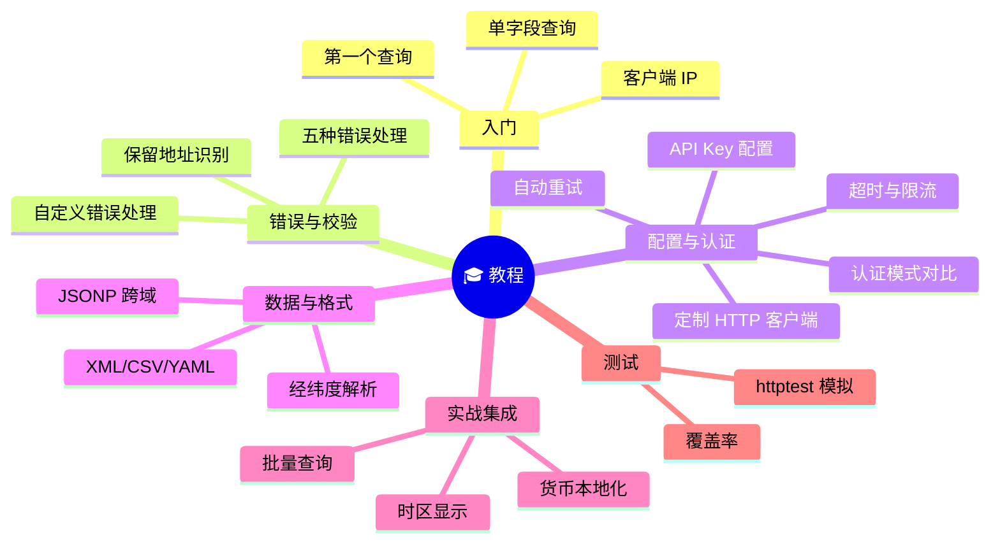

# 🎓 教程

::: tip 🖥 只想在命令行查 IP？
本节面向 Go SDK 库开发（在程序里嵌入 ipapi）。如果你只想在终端查询 IP，无需写代码 —— 见 [CLI 快速开始](../cli/quickstart)。
:::

> 循序渐进的实战教程。从第一个查询到生产级集成。

::: tip 🎨 一图抵千言
下面这张图是整个教程的学习路径：从入门第一个查询，到错误校验、配置认证、数据格式，再到实战集成与测试，逐步打怪升级。
:::

```mermaid
flowchart TD
    Start([🚀 开始学习]) --> G1["🌱 入门"]
    G1 --> G1a["第一个 IP 查询"]
    G1a --> G1b["创建 Client"]
    G1b --> G1c["探索 IPInfo 结构"]
    G1c --> G1d["查询单个字段"]
    G1d --> G1e["查询自己公网 IP"]
    G1e --> G2["🛡 错误与校验"]
    G2 --> G2a["处理五种错误"]
    G2a --> G2b["识别保留地址"]
    G2b --> G2c["自定义错误处理"]
    G2c --> G3["🔧 配置与认证"]
    G3 --> G3a["配置 API Key"]
    G3a --> G3b["两种认证对比"]
    G3b --> G3c["定制 HTTP 客户端"]
    G3c --> G3d["加超时"]
    G3d --> G3e["加限流器"]
    G3e --> G3f["观察自动重试"]
    G3f --> G4["🌐 数据与格式"]
    G4 --> G4a["XML/CSV/YAML"]
    G4a --> G4b["JSONP 跨域"]
    G4b --> G4c["经纬度算距离"]
    G4c --> G4d["IPv6 地址"]
    G4d --> G5["🚀 实战集成"]
    G5 --> G5a["批量查询一百个 IP"]
    G5a --> G5b["GeoIP 中间件"]
    G5b --> G5c["货币本地化"]
    G5c --> G5d["显示本地时间"]
    G5d --> G5e["按 ASN 过滤"]
    G5e --> G5f["生成 CSV 报表"]
    G5f --> G6["🧪 测试"]
    G6 --> G6a["用 httptest 测试"]
    G6a --> Done([✅ 进入指南与 Cookbook])
```

::: info 🌳 教程分类树
按主题与难度组织，挑你最需要的切入。
:::

## 🌱 入门

| 教程 | 关键产出 | 推荐前置 |
|------|----------|----------|
| [第一个 IP 查询](./hello-ipapi) | 跑通第一次 `GetIPInfo` | 无 |
| [创建你的第一个 Client](./first-client) | 理解 `NewClient` 默认值 | 第一个查询 |
| [探索 IPInfo 结构体](./explore-ipinfo) | 熟悉 28 个字段 | 创建 Client |
| [查询单个字段](./single-field-tutorial) | `GetField` 省带宽 | 探索结构 |
| [查询自己的公网 IP](./client-ip-tutorial) | `GetClientIPInfo` | 创建 Client |

## 🛡 错误与校验

- [处理五种错误](./error-branches-tutorial)
- [识别保留地址](./reserved-ip-tutorial)
- [自定义错误处理](./error-handler-tutorial)

## 🔧 配置与认证

- [配置 API Key](./apikey-setup)
- [两种认证方式对比](./query-auth-modes)
- [定制 HTTP 客户端](./custom-http-tutorial)
- [为请求加超时](./context-timeout-tutorial)
- [加限流器](./rate-limit-tutorial)
- [观察自动重试](./retry-tutorial)

## 🌐 数据与格式

- [获取 XML/CSV/YAML](./raw-formats-tutorial)
- [JSONP 跨域实战](./jsonp-tutorial)
- [解析经纬度并算距离](./latlong-tutorial)
- [查询 IPv6 地址](./ipv6-tutorial)

## 🚀 实战集成

- [批量查询一百个 IP](./batch-tutorial)
- [写一个 GeoIP 中间件](./middleware-tutorial)
- [按 IP 货币本地化](./currency-localization-tutorial)
- [显示用户本地时间](./timezone-display-tutorial)
- [按 ASN 过滤流量](./asn-filter-tutorial)
- [生成 CSV 报表](./csv-report-tutorial)

## 🧪 测试

- [用 httptest 测试](./test-mock-tutorial)

## 🚀 下一步

::: info 🗺 学完教程后去哪？
教程带你「能跑起来」，指南带你「理解为什么」，Cookbook 给你「可直接粘贴的方案」，最佳实践帮你「上生产」。
:::

| 去向 | 适合谁 | 你将获得 |
|------|--------|----------|
| 📖 [指南](../guide/intro) | 想理解原理 | 概念深度讲解 |
| 🍳 [Cookbook](../cookbook/) | 想要现成方案 | 可粘贴的完整食谱 |
| ✅ [最佳实践](../best-practices/) | 准备上生产 | 生产级 checklist |

