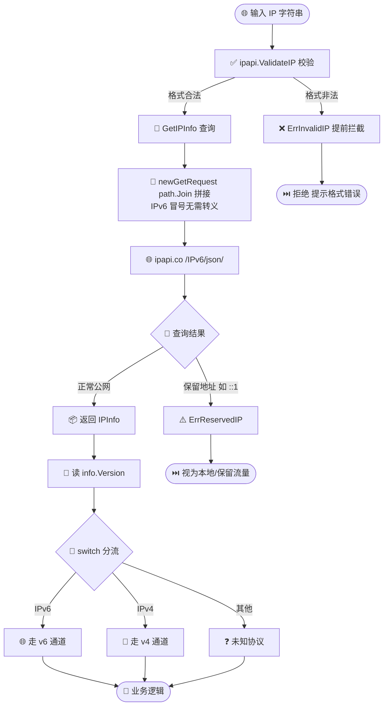
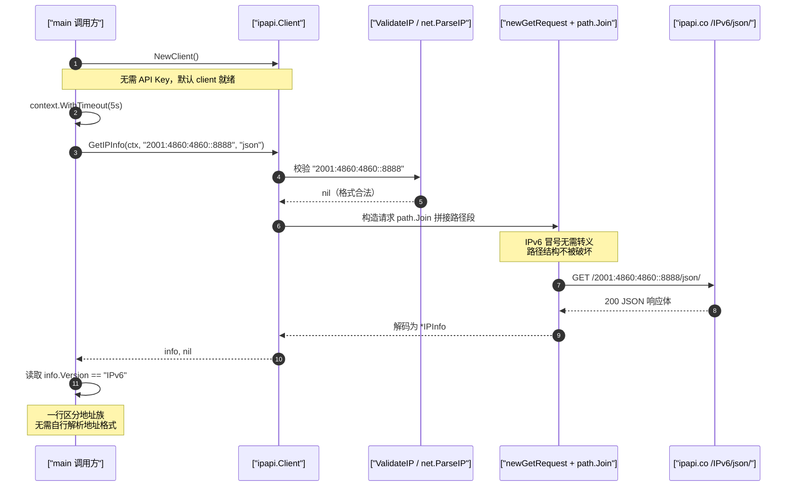

# 🎓 查询 IPv6 地址

> IPv6 正在接管互联网——移动网络、物联网与新一代 DNS 几乎都默认走 IPv6。本教程带你从零发起一次 IPv6 查询，重点掌握 IPv6 字符串输入与 `Version` 字段的判别用法。

---

## 你将学到

- 🌐 理解 IPv6 地址的形态与为什么不能直接拼到 URL 路径里
- 🚀 用 `client.GetIPInfo(ctx, ip, "json")` 查询一个公网 IPv6 地址
- 🧬 读取 `info.Version` 字段，在运行时区分 `IPv4` / `IPv6` 地址族
- ✅ 用 `ipapi.ValidateIP` 提前校验 IPv6 字符串，避免发出无效请求
- 🔁 用 `GetField` 只取 `version` 字段，做轻量级的协议判别
- ⚠️ 区分「合法但保留」的 IPv6（如 `::1`）与「格式非法」的 IPv6
- 🧪 批量对比 IPv4 与 IPv6 查询结果，验证双栈处理逻辑

::: tip 🎨 一图抵千言
本教程从「拿到一个 IPv6 字符串」到「按 Version 分流」的完整判定链路如下：
:::



---

## 前置条件

- 🐹 已安装 **Go 1.23 或更高版本**（本教程基于 `go 1.23.4` 验证）。可用 `go version` 检查。
- 📚 已完成 [第一个 IP 查询](./hello-ipapi)，能跑通一次 `GetIPInfo` 调用。
- 📖 建议先读 [IPv6 查询指南](../guide/ipv6)，了解 IPv6 支持的整体设计。
- ✅ 能够访问 `https://ipapi.co/`（免登录即可查询，免费额度有限）。

::: tip 💡 无需 API Key
本教程所有示例无需 API Key 即可运行。免费查询会受速率限制，超出后可参考 [限流错误](../reference/errors/err-rate-limited)。
:::

---

## 步骤 1：理解 IPv6 地址形态

IPv4 是 32 位地址，写作点分十进制，如 `8.8.8.8`；IPv6 是 128 位地址，写作冒号分隔的十六进制，可使用 `::` 压缩连续零段，例如：

| IPv6 地址 | 说明 |
|-----------|------|
| `2001:4860:4860::8888` | Google Public DNS（IPv6） |
| `2606:4700:4700::1111` | Cloudflare DNS（IPv6） |
| `::1` | 本地回环（保留地址，查询返回 `ErrReservedIP`） |

一个关键疑问是：IPv6 含冒号 `:`，而 HTTP 请求路径里冒号通常有特殊含义，直接拼 `https://ipapi.co/2001:4860:4860::8888/json/` 不会出问题吗？

答案是不会。SDK 内部的 `newGetRequest` 用标准库 `path.Join` 拼接路径段，IPv6 的冒号不会破坏路径结构，因此**无需对 IPv6 做任何转义或特殊处理**即可直接作为查询参数传入。原理详见仓库源码 [`api.go`](https://github.com/cyberspacesec/ipapi.co-skills/blob/main/pkg/ipapi/api.go)。

---

## 步骤 2：发起第一次 IPv6 查询

新建项目并安装 SDK（若已完成 [第一个 IP 查询](./hello-ipapi) 可跳过）：

```bash
mkdir ipv6-tutorial
cd ipv6-tutorial
go mod init example.com/ipv6-tutorial
go get github.com/cyberspacesec/ipapi.co-skills/pkg/ipapi
```

新建 `main.go`，发起一次最小查询：

```go
package main

import (
	"context"
	"fmt"
	"log"
	"time"

	"github.com/cyberspacesec/ipapi.co-skills/pkg/ipapi"
)

func main() {
	// 1. 创建默认客户端（无需 API Key）
	client := ipapi.NewClient()

	// 2. 设置 5 秒超时
	ctx, cancel := context.WithTimeout(context.Background(), 5*time.Second)
	defer cancel()

	// 3. 查询 Google Public DNS 的 IPv6 地址
	info, err := client.GetIPInfo(ctx, "2001:4860:4860::8888", "json")
	if err != nil {
		log.Fatalf("查询失败: %v", err)
	}

	// 4. 打印最基础的字段
	fmt.Println("IP     :", info.IP)
	fmt.Println("Version:", info.Version)
}
```

运行：

```bash
go run main.go
```

预期输出：

```
IP     : 2001:4860:4860::8888
Version: IPv6
```

::: tip 🎨 一图抵千言
上面这张流程图看的是「判定分支」，下面这张时序图则聚焦一次 IPv6 查询在客户端与 ipapi.co 上游之间的真实调用时序——从 `NewClient` 到读出 `info.Version` 的每一步：
:::



::: warning ⚠️ 关于 Version 的取值
本 SDK 中 `info.Version` 是 `string` 类型，ipapi.co 上游返回的取值为 `IPv4` 或 `IPv6`。早期部分文档写作 `"4"`/`"6"`，以实际响应为准——无论取何值，它都能稳定区分两个地址族。字段定义见 [version 字段参考](../reference/fields/version)。
:::

---

## 步骤 3：读取 Version 字段做协议分流

`Version` 字段存在的意义，是让你在拿到 `IPInfo` 后**无需自己解析地址格式**就能一行判断目标属于哪一代协议。这在双栈环境、IPv6 迁移度统计、合规审计等场景非常实用。

把 `main.go` 改写为根据 `Version` 走不同分支：

```go
package main

import (
	"context"
	"fmt"
	"log"
	"time"

	"github.com/cyberspacesec/ipapi.co-skills/pkg/ipapi"
)

func main() {
	client := ipapi.NewClient()
	ctx, cancel := context.WithTimeout(context.Background(), 5*time.Second)
	defer cancel()

	ips := []string{
		"8.8.8.8",               // IPv4
		"2001:4860:4860::8888",  // IPv6
	}

	for _, ip := range ips {
		info, err := client.GetIPInfo(ctx, ip, "json")
		if err != nil {
			log.Printf("%s: %v", ip, err)
			continue
		}

		// 根据 Version 字段走不同分支
		switch info.Version {
		case "IPv6":
			fmt.Printf("[%s] IPv6 流量 → 走 v6 通道 | %s, %s | %s\n",
				info.IP, info.City, info.CountryName, info.ASN)
		case "IPv4":
			fmt.Printf("[%s] IPv4 流量 → 走 v4 通道 | %s, %s | %s\n",
				info.IP, info.City, info.CountryName, info.ASN)
		default:
			fmt.Printf("[%s] 未知协议版本: %q\n", info.IP, info.Version)
		}
	}
}
```

逐段说明：

- 🧱 `ips` 切片里混用了 IPv4 与 IPv6 字符串，`GetIPInfo` 对两者一视同仁，无需区分调用入口。
- 🧬 `switch info.Version` 是核心判别点，`IPv6` / `IPv4` 两个分支可分别接入不同的下游逻辑。
- ♻️ 复用同一个 `client` 与同一个超时 `ctx`，符合 [客户端复用最佳实践](../best-practices/client-lifecycle)。

---

## 步骤 4：用 ValidateIP 提前校验

`GetIPInfo` 内部会先调用 `ValidateIP` 校验地址，非法格式会提前返回 `ErrInvalidIP`，不会发出无效请求。你也可以在调用前手动校验，给出更友好的错误提示。

```go
package main

import (
	"context"
	"fmt"
	"log"
	"time"

	"github.com/cyberspacesec/ipapi.co-skills/pkg/ipapi"
)

func main() {
	client := ipapi.NewClient()
	ctx, cancel := context.WithTimeout(context.Background(), 5*time.Second)
	defer cancel()

	candidates := []string{
		"2001:4860:4860::8888", // 合法 IPv6
		"2606:4700:4700::1111", // 合法 IPv6
		"not::an::ipv6",        // 非法
	}

	for _, ip := range candidates {
		// 提前校验，区分「格式非法」与「查询失败」
		if err := ipapi.ValidateIP(ip); err != nil {
			fmt.Printf("%-26s ✗ 格式非法: %v\n", ip, err)
			continue
		}

		info, err := client.GetIPInfo(ctx, ip, "json")
		if err != nil {
			log.Printf("%-26s 查询失败: %v", ip, err)
			continue
		}
		fmt.Printf("%-26s ✓ %s | %s\n", ip, info.Version, info.CountryName)
	}
}
```

`ValidateIP` 内部调用标准库 `net.ParseIP`，同时识别 IPv4 与 IPv6，因此 IPv6 的校验与 IPv4 完全一致。详见 [ValidateIP API](../api/validate-ip) 与 [err-invalid-ip](../reference/errors/err-invalid-ip)。

---

## 步骤 5：区分合法保留与格式非法

IPv6 中有一类特殊地址：**格式合法，但属于保留段**，查询会返回 `ErrReservedIP` 而非 `ErrInvalidIP`。最典型的是回环地址 `::1`（IPv6 版的 `127.0.0.1`）。

```go
package main

import (
	"context"
	"errors"
	"fmt"
	"log"
	"time"

	"github.com/cyberspacesec/ipapi.co-skills/pkg/ipapi"
)

func main() {
	client := ipapi.NewClient()
	ctx, cancel := context.WithTimeout(context.Background(), 5*time.Second)
	defer cancel()

	// ::1 格式合法，但属于保留地址
	ip := "::1"

	if err := ipapi.ValidateIP(ip); err == nil {
		fmt.Printf("%s 格式合法，继续查询...\n", ip)
	}

	_, err := client.GetIPInfo(ctx, ip, "json")
	switch {
	case errors.Is(err, ipapi.ErrReservedIP):
		fmt.Printf("%s 是保留地址，无地理位置数据\n", ip)
	case errors.Is(err, ipapi.ErrInvalidIP):
		fmt.Printf("%s 格式非法\n", ip)
	case err != nil:
		log.Printf("%s 查询失败: %v", ip, err)
	default:
		fmt.Println("查询成功")
	}
}
```

关键区别：

| 情形 | 校验结果 | 查询结果 | 处理建议 |
|------|----------|----------|----------|
| `2001:4860:4860::8888` | `nil`（合法） | 返回 `*IPInfo` | 正常使用 |
| `::1` | `nil`（合法） | `ErrReservedIP` | 视为本地/保留流量 |
| `not::an::ipv6` | `ErrInvalidIP` | `ErrInvalidIP`（提前拦截） | 拒绝并提示格式错误 |

保留地址的完整行为见 [保留 IP 指南](../guide/reserved-ip) 与 [err-reserved-ip](../reference/errors/err-reserved-ip)。

::: details 📚 IPv6 地址形态速查
IPv6 是 128 位地址，写作冒号分隔的十六进制，可用 `::` 压缩连续零段。常见类型对照：

| IPv6 地址 | 类型 | 查询行为 |
|-----------|------|----------|
| `2001:4860:4860::8888` | Google Public DNS（公网） | 正常返回 `*IPInfo`，Version=`IPv6` |
| `2606:4700:4700::1111` | Cloudflare DNS（公网） | 正常返回 `*IPInfo`，Version=`IPv6` |
| `::1` | 本地回环（保留） | 返回 `ErrReservedIP`，无地理数据 |
| `fe80::1` | 链路本地（保留） | 返回 `ErrReservedIP` |
| `not::an::ipv6` | 格式非法 | `ValidateIP` 返回 `ErrInvalidIP`，不发请求 |

> 关键：IPv6 含冒号，但 SDK 内部 `path.Join` 拼接路径段时不会破坏结构，**无需转义**即可直接传入。
:::

---

## 步骤 6：用 GetField 只取 version 字段

当你只需要判断协议版本、不需要完整地理信息时，用 `GetField` 只取 `version` 字段可以减少传输量与解码开销。

```go
package main

import (
	"context"
	"fmt"
	"log"
	"time"

	"github.com/cyberspacesec/ipapi.co-skills/pkg/ipapi"
)

func main() {
	client := ipapi.NewClient()
	ctx, cancel := context.WithTimeout(context.Background(), 5*time.Second)
	defer cancel()

	ips := []string{
		"8.8.8.8",              // IPv4
		"2001:4860:4860::8888", // IPv6
		"2606:4700:4700::1111", // IPv6
	}

	for _, ip := range ips {
		// 只查询 version 这一个字段
		version, err := client.GetField(ctx, ip, "version")
		if err != nil {
			log.Printf("%s: %v", ip, err)
			continue
		}
		fmt.Printf("%-26s → %s\n", ip, version)
	}
}
```

::: tip 💡 单字段查询的取舍
`GetField` 返回原始字符串、不做 JSON 解码，适合只关心单个值的场景。若你同时需要 `version`、`country`、`asn` 等多个字段，直接用 `GetIPInfo` 一次拿全量更划算，避免多次往返。字段清单见 [字段总览](../reference/fields/ip)。
:::

---

## 完整代码

下面整合了步骤 2–5 的完整 `main.go`，演示从校验、查询、协议分流到保留地址判别的完整流程，可直接复制运行：

```go
package main

import (
	"context"
	"errors"
	"fmt"
	"log"
	"time"

	"github.com/cyberspacesec/ipapi.co-skills/pkg/ipapi"
)

func main() {
	// 创建默认客户端（无需 API Key）
	client := ipapi.NewClient()

	ips := []string{
		"2001:4860:4860::8888", // Google Public DNS (IPv6)
		"2606:4700:4700::1111", // Cloudflare DNS (IPv6)
		"8.8.8.8",              // Google Public DNS (IPv4)
		"::1",                  // 本地回环（保留）
		"not::an::ipv6",        // 非法
	}

	for _, ip := range ips {
		// 1. 提前校验格式
		if err := ipapi.ValidateIP(ip); err != nil {
			fmt.Printf("%-26s ✗ 格式非法: %v\n", ip, err)
			continue
		}

		// 2. 设置每次查询的超时
		ctx, cancel := context.WithTimeout(context.Background(), 5*time.Second)

		// 3. 查询
		info, err := client.GetIPInfo(ctx, ip, "json")
		cancel()
		if err != nil {
			// 4. 区分保留地址与其他错误
			if errors.Is(err, ipapi.ErrReservedIP) {
				fmt.Printf("%-26s ⚠ 保留地址，无地理数据\n", ip)
			} else {
				log.Printf("%-26s 查询失败: %v", ip, err)
			}
			continue
		}

		// 5. 根据 Version 字段分流
		switch info.Version {
		case "IPv6":
			fmt.Printf("%-26s 🌐 v6 → %s, %s (%s)\n",
				info.IP, info.City, info.CountryName, info.ASN)
		case "IPv4":
			fmt.Printf("%-26s 📶 v4 → %s, %s (%s)\n",
				info.IP, info.City, info.CountryName, info.ASN)
		default:
			fmt.Printf("%-26s ❓ 未知版本 %q\n", info.IP, info.Version)
		}
	}
}
```

源码亦可参考仓库示例 [`examples/ipv6/main.go`](https://github.com/cyberspacesec/ipapi.co-skills/blob/main/examples/ipv6/main.go)（路径以仓库实际结构为准）。

---

## 运行结果

在项目根目录执行 `go run main.go`，预期输出形如：

```
2001:4860:4860::8888       🌐 v6 → Mountain View, United States (AS15169)
2606:4700:4700::1111       🌐 v6 → San Francisco, United States (AS13335)
8.8.8.8                    📶 v4 → Mountain View, United States (AS15169)
::1                        ⚠ 保留地址，无地理数据
not::an::ipv6              ✗ 格式非法: invalid IP address
```

> 📋 实际的城市、ASN 等数值可能因 ipapi.co 数据更新而略有差异，但 `Version` 字段的取值与保留地址的判定逻辑稳定不变。

---

## 小结

🎉 恭喜！你已掌握 IPv6 查询的完整链路。回顾关键点：

- 🌐 IPv6 字符串（如 `2001:4860:4860::8888`）可直接传给 `GetIPInfo`，SDK 内部 `path.Join` 处理冒号，无需转义。
- 🧬 `info.Version` 字段取值 `IPv4` / `IPv6`，可在运行时一行区分地址族，无需自行解析格式。
- ✅ `ipapi.ValidateIP` 提前校验，把「格式非法」与「查询失败」分开处理。
- ⚠️ `::1` 等保留地址格式合法但查询返回 `ErrReservedIP`，要与 `ErrInvalidIP` 区别对待。
- 🔁 `GetField(ctx, ip, "version")` 只取协议版本字段，适合轻量判别场景。
- 🧱 IPv4 与 IPv6 调用入口完全一致，可在同一循环中混用，复用同一 `client`。

---

## 下一步

掌握 IPv6 查询后，可以朝这些方向继续深入：

- 📖 **概念补充**：阅读 [IPv6 查询指南](../guide/ipv6) 与 [IPv4 查询指南](../guide/ipv4)，对照两代协议的查询行为。
- 🧬 **字段深读**：浏览 [version 字段参考](../reference/fields/version) 与 [ip 字段参考](../reference/fields/ip)，了解 `Version`、`IP`、`Network` 等网络类字段的完整定义。
- 🔌 **API 速查**：回顾 [GetIPInfo](../api/get-ip-info)、[GetField](../api/get-field) 与 [ValidateIP](../api/validate-ip) 的接口签名。
- 🛡 **错误处理**：系统学习 [err-invalid-ip](../reference/errors/err-invalid-ip) 与 [err-reserved-ip](../reference/errors/err-reserved-ip)，配合 [错误概念](../guide/error-concept) 写出健壮的分支逻辑。
- 🍳 **实战菜谱**：在 [Cookbook](../cookbook/) 中尝试 [日志增强](../cookbook/log-enrichment)、[ASN 过滤](../cookbook/asn-blocklist) 与 [CDN 边缘检测](../cookbook/cdn-edge-detection)，把 IPv6 字段接入真实业务。
- ❓ **常见疑问**：查阅 [支持 IPv6 吗](../faq/ipv6-support)。
- ➡️ **下一篇教程**：继续学习 [解析经纬度并算距离](./latlong-tutorial)，把 IPv6 查询得到的坐标转化为实际距离计算。
