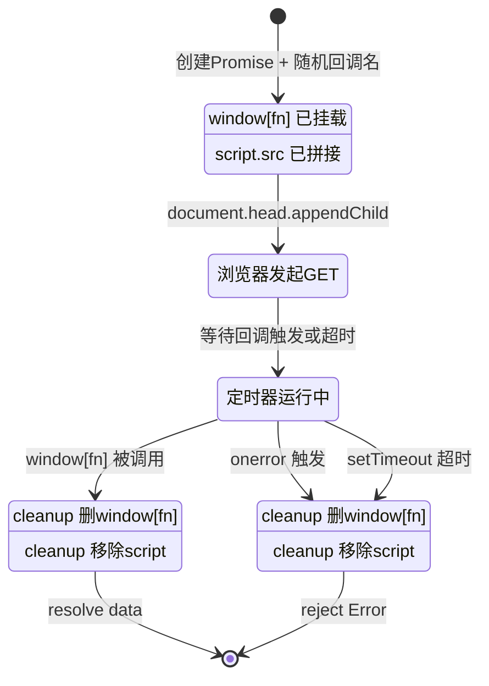

# 🎓 JSONP 跨域实战

> 后端用 `WithCallback` 产出回调脚本，前端用原生 `<script>` 标签拿到结构化 IP 数据——无需 CORS、无需构建链，绕过浏览器同源策略。

---

## 你将学到

- 🧩 理解 JSONP 的工作原理与「为什么 `<script>` 能跨域」
- ⚙️ 用 SDK 的 [`WithCallback`](../api/with-callback) + `FormatJSONP` 让上游返回回调包裹的脚本
- 🖥️ 写一个 Go JSONP 网关：把回调名透传给上游、校验回调名防 XSS、返回 `application/javascript`
- 🌐 写一段纯前端 HTML：动态注入 `<script>`、超时兜底、并发查多个 IP
- 🔑 理解 JSONP 模式下 API Key 必须走 query 参数的原因与权衡
- 🛡️ 给网关加进程内缓存与回调名白名单，做生产可用的最小骨架

::: tip 🎨 一图抵千言
下面这张流程图把「前端动态注入 script → Go 网关校验回调名 → SDK 透传到上游 → 原始字节回传」的完整 JSONP 链路串了起来，对照各步骤阅读：
:::

```mermaid
flowchart TD
    Start([🌐 前端: 随机回调名]) --> Inject[📝 动态创建 script 标签<br/>src=网关?callback=xxx]
    Inject --> Req[📨 浏览器发起 GET]
    Req --> Gateway[🖥️ Go 网关收到请求]
    Gateway --> SafeCB{🛡️ safeCallback 白名单}
    SafeCB -->|非法 callback| Fallback[↩️ 回退到 callback]
    SafeCB -->|合法| Cache{⚡ 查进程内缓存}
    Cache -->|命中| WriteJS1[📦 写 application/javascript]
    Cache -->|未命中| SDK[⚙️ ipapi.NewClient<br/>WithAPIKeyQuery + WithCallback]
    SDK --> Upstream[🌐 ipapi.co /jsonp/?callback=xxx]
    Upstream --> Raw[📦 拿到原始字节 cb(...)]
    Raw --> Wrap[🔁 wrapWithCallback 重包裹]
    Wrap --> SetCache[💾 写缓存 TTL 5min]
    SetCache --> WriteJS2[📦 写 application/javascript]
    WriteJS1 --> Browser[🌐 浏览器执行 script]
    WriteJS2 --> Browser
    Fallback --> WriteJS2
    Browser --> Exec[✨ 调用 window回调名 数据到达]
    Exec --> Timeout{⏱️ 超时?}
    Timeout -->|是| Cleanup[🧹 cleanup 删 script 防泄漏]
    Timeout -->|否| Resolve[🎉 Promise resolve]
    Resolve --> Done([✅ 数据可用])
    Cleanup --> Reject([❌ reject 超时])
```

---

## 前置条件

- 🐹 已安装 **Go 1.23.4 或更高版本**
- 📚 已完成 [快速开始](../guide/getting-started)，能跑通第一次 IP 查询
- 📖 建议先读 [JSONP 回调指南](../guide/jsonp)，了解 `WithCallback` 的基本行为
- 🌐 一个能打开 HTML 文件的浏览器（用于跑前端示例）
- 💡 可选：在 [ipapi.co](https://ipapi.co) 申请 API Key 以获得更高配额；不申请也能跑免费额度

::: tip 💡 没有构建链也能学
本教程的前端是纯静态 HTML，不需要 Node/Vite/Webpack。你只要把后端跑起来，再用浏览器打开 HTML 即可。
:::

---

## 步骤 1：理解 JSONP 的原理

浏览器的**同源策略**会阻止 `fetch('https://ipapi.co/json')` 跨域读数据（除非服务端配了 CORS 头）。但 `<script src="...">` 标签加载远程脚本**不受同源策略限制**——这是 JSONP（JSON with Padding）的立足点。

对比普通 JSON 与 JSONP 响应：

```
普通 JSON:   {"ip":"8.8.8.8","city":"Mountain View"}
JSONP:       handleIP({"ip":"8.8.8.8","city":"Mountain View"})
```

前端定义一个名为 `handleIP` 的全局函数，再用 `<script src="https://ipapi.co/8.8.8.8/jsonp/?callback=handleIP">` 加载。上游返回 `handleIP({...})` 这段合法 JS，浏览器执行后，数据就通过参数传进了你的函数。

::: info 🆚 普通 JSON vs JSONP 响应对比
| 维度 | 普通 JSON | JSONP |
|------|-----------|-------|
| 响应体形态 | `{"ip":"8.8.8.8",...}` | `handleIP({"ip":"8.8.8.8",...})` |
| 是否合法 JSON | ✅ 是 | ❌ 否（被回调包裹） |
| 跨域读取 | 需 CORS 头 | `<script>` 标签天然跨域 |
| HTTP 方法 | 任意 | 只能 GET |
| 能否设 Header | ✅ | ❌ 无法设自定义 Header |
| 能拿状态码 | ✅ | ❌ 无状态码，靠超时兜底 |
:::

::: warning ⚠️ JSONP 是只读的
`<script>` 只能 GET、无法设自定义 Header、无法拿到 HTTP 状态码。它是 CORS 普及前的方案，**只在「老旧浏览器/第三方沙盒/无 CORS 服务」时才值得用**。现代可控后端优先用 CORS。
:::

---

## 步骤 2：用 SDK 产出 JSONP 响应

SDK 的 [`WithCallback`](../api/with-callback) 选项会在请求阶段把 `?callback=<name>` 追加到上游 URL，配合 `FormatJSONP` 格式即可让 ipapi.co 返回回调包裹的脚本。

先写一段最小验证代码，确认上游返回的确实是 `回调名({...})` 形式：

```go
// main.go
package main

import (
	"context"
	"fmt"
	"log"
	"time"

	"github.com/cyberspacesec/ipapi.co-skills/pkg/ipapi"
)

func main() {
	client := ipapi.NewClient(
		// 指定回调名：上游会返回 handleIP({...})
		ipapi.WithCallback("handleIP"),
		// 超时短一点，便于演示
		ipapi.WithCustomHTTPClient(&http.Client{Timeout: 4 * time.Second}),
	)

	ctx, cancel := context.WithTimeout(context.Background(), 4*time.Second)
	defer cancel()

	// GetIPInfoRaw 返回原始字节：JSONP 不是合法 JSON，
	// 不能用 GetIPInfo（会 json.Decode 失败），必须用 *Raw 系列。
	raw, err := client.GetIPInfoRaw(ctx, "8.8.8.8", string(ipapi.FormatJSONP))
	if err != nil {
		log.Fatalf("查询失败: %v", err)
	}

	fmt.Println(string(raw))
}
```

::: tip 💡 为什么用 `GetIPInfoRaw`
[`GetIPInfo`](../api/get-ip-info) 会把响应 `json.Decode` 成 `IPInfo` 结构体，但 JSONP 响应是 `cb({...})` 形式，**不是合法 JSON**，直接 decode 会报错。[`GetIPInfoRaw`](../api/get-ip-info-raw) 返回原始 `[]byte`，正好把整段脚本原样透传。查访客自己 IP 时用 [`GetClientIPInfoRaw`](../api/get-client-ip-info-raw)。
:::

补全 import 后运行：

```bash
go mod init jsonp-demo
go get github.com/cyberspacesec/ipapi.co-skills
go run main.go
```

预期输出形如：

```
handleIP({"ip":"8.8.8.8","network":"8.8.8.0/24","version":"IPv4","city":"Mountain View",...})
```

如果看到回调名出现在最前面、JSON 被包在括号里，说明 `WithCallback` 生效了。

---

## 步骤 3：搭一个 Go JSONP 网关

直接让前端 `<script>` 打 `ipapi.co` 有三个问题：①回调名不可控、②API Key 会暴露、③没法缓存限流。所以中间架一层 Go 网关，负责透传回调名、隐藏 Key、加缓存。

新建 `jsonp_gateway.go`：

```go
// jsonp_gateway.go
package main

import (
	"context"
	"fmt"
	"log"
	"net/http"
	"os"
	"regexp"
	"sync"
	"time"

	"github.com/cyberspacesec/ipapi.co-skills/pkg/ipapi"
)

// --- 进程内缓存：减少上游调用次数（生产建议换 Redis）---
type jsonpCache struct {
	mu sync.RWMutex
	m  map[string]cacheEntry
}

type cacheEntry struct {
	payload   []byte
	expiresAt time.Time
}

func newJSONPCache() *jsonpCache {
	c := &jsonpCache{m: make(map[string]cacheEntry)}
	// 后台清理过期项，避免 map 无限膨胀
	go func() {
		ticker := time.NewTicker(time.Minute)
		defer ticker.Stop()
		for range ticker.C {
			c.mu.Lock()
			for k, v := range c.m {
				if time.Now().After(v.expiresAt) {
					delete(c.m, k)
				}
			}
			c.mu.Unlock()
		}
	}()
	return c
}

func (c *jsonpCache) get(key string) ([]byte, bool) {
	c.mu.RLock()
	defer c.mu.RUnlock()
	if e, ok := c.m[key]; ok && time.Now().Before(e.expiresAt) {
		return e.payload, true
	}
	return nil, false
}

func (c *jsonpCache) set(key string, payload []byte, ttl time.Duration) {
	c.mu.Lock()
	defer c.mu.Unlock()
	c.m[key] = cacheEntry{payload: payload, expiresAt: time.Now().Add(ttl)}
}

var (
	cache = newJSONPCache()
	// 只允许合法 JS 标识符，拦截 callback=<script> 之类的 XSS 注入
	callbackNameRe = regexp.MustCompile(`^[A-Za-z_$][A-Za-z0-9_$.]{0,63}$`)
)

// safeCallback 校验回调名，非法一律回退到 "callback"
func safeCallback(name string) string {
	if callbackNameRe.MatchString(name) {
		return name
	}
	return "callback"
}

// wrapWithCallback 把上游响应重新包成指定回调名，确保最终回调名严格等于前端期望值
func wrapWithCallback(raw []byte, callback string) []byte {
	start, end := -1, -1
	for i, b := range raw {
		if b == '(' && start == -1 {
			start = i
		}
		if b == ')' {
			end = i
		}
	}
	var jsonBody []byte
	if start != -1 && end != -1 && end > start {
		jsonBody = raw[start+1 : end]
	} else {
		jsonBody = raw // 上游可能直接给了纯 JSON，原样用
	}
	return []byte(fmt.Sprintf("%s(%s);", callback, string(jsonBody)))
}

func writeJS(w http.ResponseWriter, b []byte) {
	// 必须是 application/javascript，否则浏览器拒绝执行 <script>
	w.Header().Set("Content-Type", "application/javascript; charset=utf-8")
	w.Header().Set("Cache-Control", "no-store, max-age=0")
	w.Header().Set("X-Content-Type-Options", "nosniff")
	w.Write(b)
}

// jsonpHandler 查访客自己 IP（基于请求来源，无需前端传参，避免伪造）
func jsonpHandler(w http.ResponseWriter, r *http.Request) {
	callback := safeCallback(r.URL.Query().Get("callback"))
	clientIP := clientIPFromRequest(r)

	// 缓存 key = IP + 回调名（不同回调名产出不同脚本，需分别缓存）
	cacheKey := clientIP + "|" + callback
	if payload, ok := cache.get(cacheKey); ok {
		writeJS(w, payload)
		return
	}

	// WithAPIKeyQuery 是必须的：<script> 无法设 Header，Key 只能进 query
	client := ipapi.NewClient(
		ipapi.WithAPIKey(os.Getenv("IPAPI_KEY")),
		ipapi.WithAPIKeyQuery(),
		ipapi.WithCallback(callback),
		ipapi.WithCustomHTTPClient(&http.Client{Timeout: 4 * time.Second}),
	)

	ctx, cancel := context.WithTimeout(r.Context(), 4*time.Second)
	defer cancel()

	// GetClientIPInfoRaw 返回上游原始字节（已是 callback({...}) 形式）
	raw, err := client.GetClientIPInfoRaw(ctx, string(ipapi.FormatJSONP))
	if err != nil {
		// 出错时也返回一个调用回调的空对象，前端不会因脚本缺失而报错
		writeJS(w, []byte(fmt.Sprintf("%s({\"error\":true});", callback)))
		return
	}

	payload := wrapWithCallback(raw, callback)
	cache.set(cacheKey, payload, 5*time.Minute)
	writeJS(w, payload)
}

// lookupHandler 查任意 IP（前端通过 ?ip= 传参）
func lookupHandler(w http.ResponseWriter, r *http.Request) {
	callback := safeCallback(r.URL.Query().Get("callback"))
	ip := r.URL.Query().Get("ip")
	if ip == "" {
		writeJS(w, []byte(fmt.Sprintf("%s({\"error\":\"missing ip\"});", callback)))
		return
	}

	client := ipapi.NewClient(
		ipapi.WithAPIKey(os.Getenv("IPAPI_KEY")),
		ipapi.WithAPIKeyQuery(),
		ipapi.WithCallback(callback),
	)
	ctx, cancel := context.WithTimeout(r.Context(), 4*time.Second)
	defer cancel()

	raw, err := client.GetIPInfoRaw(ctx, ip, string(ipapi.FormatJSONP))
	if err != nil {
		writeJS(w, []byte(fmt.Sprintf("%s({\"error\":true,\"ip\":\"%s\"});", callback, ip)))
		return
	}
	writeJS(w, wrapWithCallback(raw, callback))
}

// clientIPFromRequest 取客户端出口 IP，优先 X-Forwarded-For 第一段
func clientIPFromRequest(r *http.Request) string {
	if xff := r.Header.Get("X-Forwarded-For"); xff != "" {
		for i := 0; i < len(xff); i++ {
			if xff[i] == ',' {
				return xff[:i]
			}
		}
		return xff
	}
	host := r.RemoteAddr
	for i := 0; i < len(host); i++ {
		if host[i] == ':' {
			return host[:i]
		}
	}
	return host
}

func main() {
	mux := http.NewServeMux()
	mux.HandleFunc("/api/ip", jsonpHandler)         // 查访客自己 IP
	mux.HandleFunc("/api/ip/lookup", lookupHandler) // 查任意 IP

	addr := ":8080"
	log.Printf("JSONP gateway listening on %s", addr)
	srv := &http.Server{
		Addr:              addr,
		Handler:           mux,
		ReadHeaderTimeout: 5 * time.Second,
	}
	if err := srv.ListenAndServe(); err != nil {
		log.Fatalf("server error: %v", err)
	}
}
```

::: warning ⚠️ JSONP 模式下 Key 必须走 query
`<script>` 标签**无法设置自定义 HTTP Header**，所以默认的 `Authorization: Bearer` 方案在 JSONP 下不可用。必须用 [`WithAPIKeyQuery`](../api/with-api-key-query) 把 Key 放进 `?key=` query 参数。Key 会出现在上游 URL 和网关日志里，请用受限子 Key，并避免日志落盘明文。详见 [认证机制](../guide/auth-concept)。
:::

---

## 步骤 4：写前端 HTML

前端的核心是**动态创建 `<script>` + 全局回调函数 + 超时兜底**。回调名随机生成防冲突，超时后清理避免内存泄漏。

::: tip 🎨 一图抵千言
前端一次 JSONP 调用本质上是一个 Promise 状态机：从注入 `script` 到数据回填或超时清理，下面这张状态图聚焦「单次调用的生命周期」，与前面那张全链路流程图互补：
:::



新建 `index.html`：

```html
<!DOCTYPE html>
<html lang="zh-CN">
<head>
  <meta charset="UTF-8" />
  <title>访客定位 Demo</title>
</head>
<body>
  <div id="visitor-tip">📍 定位中...</div>
  <div id="compare"></div>

  <script>
    // 封装一个 JSONP 调用器：动态创建 <script>，支持超时兜底
    function jsonp(url, timeoutMs) {
      return new Promise((resolve, reject) => {
        // 1. 在 window 上挂随机回调名，防冲突
        const fn = '__jsonp_cb_' + Math.random().toString(36).slice(2);
        window[fn] = function (data) {
          cleanup();
          resolve(data);
        };

        // 2. 拼接 URL，把回调名透传给后端
        const sep = url.indexOf('?') >= 0 ? '&' : '?';
        const script = document.createElement('script');
        script.src = url + sep + 'callback=' + fn;

        // 3. 超时兜底：JSONP 没有 HTTP 状态码，只能靠定时器
        const timer = setTimeout(() => {
          cleanup();
          reject(new Error('JSONP timeout'));
        }, timeoutMs || 4000);

        function cleanup() {
          clearTimeout(timer);
          delete window[fn];
          if (script.parentNode) script.parentNode.removeChild(script);
        }

        // 4. 加载失败（404/网络错误）也要兜底
        script.onerror = () => {
          cleanup();
          reject(new Error('script load error'));
        };

        document.head.appendChild(script);
      });
    }

    // 首屏：查访客自己 IP
    jsonp('http://localhost:8080/api/ip', 4000)
      .then((data) => {
        if (data.error) {
          document.getElementById('visitor-tip').textContent = '📍 定位失败';
          return;
        }
        document.getElementById('visitor-tip').textContent =
          '📍 检测到您来自 ' + (data.city || '未知') + '，已为您切换到就近节点。';
      })
      .catch(() => {
        document.getElementById('visitor-tip').textContent = '📍 定位失败，使用默认节点。';
      });

    // 对比：查一个固定 IP（演示查任意 IP 的能力）
    jsonp('http://localhost:8080/api/ip/lookup?ip=8.8.8.8', 4000)
      .then((data) => {
        document.getElementById('compare').textContent =
          '参考节点 8.8.8.8 → ' + (data.city || '未知') + ' / ' + (data.org || '');
      });
  </script>
</body>
</html>
```

---

## 步骤 5：运行并验证

```bash
# 1. 设置 API Key（没有也能跑，只是会触发免费额度的限流）
export IPAPI_KEY=your_key_here

# 2. 启动网关
go run jsonp_gateway.go

# 3. 用 curl 验证网关输出（模拟前端 <script> 请求）
curl 'http://localhost:8080/api/ip?callback=showIP'
# 输出形如: showIP({"ip":"203.0.113.42","city":"Shanghai",...});

# 4. 验证查任意 IP
curl 'http://localhost:8080/api/ip/lookup?ip=8.8.8.8&callback=cb'
# 输出形如: cb({"ip":"8.8.8.8","city":"Mountain View","org":"AS15169 Google LLC",...});

# 5. 用浏览器打开 index.html，观察页面上的城市提示
```

::: tip 💡 用 curl 验证回调名透传
试着传一个带特殊字符的回调名，例如 `callback=<script>`，网关会回退到 `callback(...)`，而不是把恶意字符串写进响应体——这就是 `safeCallback` 白名单的作用。
:::

---

## 完整代码

把步骤 3 的 `jsonp_gateway.go` 和步骤 4 的 `index.html` 放在同一目录下即可。完整源码也可在 GitHub 上查看：

- 后端网关：见本教程步骤 3，或参考社区示例 [jsonp-frontend 食谱](https://github.com/cyberspacesec/ipapi.co-skills/blob/main/website/cookbook/jsonp-frontend)
- 前端 HTML：见本教程步骤 4

项目结构：

```
jsonp-demo/
├── go.mod                # module jsonp-demo
├── jsonp_gateway.go      # 步骤 3 的 Go 网关
└── index.html            # 步骤 4 的前端页面
```

---

## 运行结果

启动网关后，浏览器打开 `index.html`，预期看到：

```
📍 检测到您来自 Shanghai，已为您切换到就近节点。
参考节点 8.8.8.8 → Mountain View / AS15169 Google LLC
```

（城市名取决于你的真实出口 IP；查 `8.8.8.8` 的结果固定为 Mountain View / Google。）

curl 验证时的输出形如：

```bash
$ curl 'http://localhost:8080/api/ip/lookup?ip=8.8.8.8&callback=cb'
cb({"ip":"8.8.8.8","network":"8.8.8.0/24","version":"IPv4","city":"Mountain View","region":"California","country":"US","country_name":"United States","country_code":"US","latitude":37.4056,"longitude":-122.0775,"asn":"AS15169","org":"Google LLC",...});
```

如果上游限流或网络异常，前端会显示「📍 定位失败，使用默认节点。」而不会卡死——这正是超时兜底的价值。

---

## 小结

- 🧩 JSONP 用 `<script>` 标签的跨域能力，把 JSON 包进回调函数 `cb({...})`，绕过同源策略。
- ⚙️ SDK 的 [`WithCallback`](../api/with-callback) 把 `?callback=<name>` 拼到上游 URL，配合 `FormatJSONP` 产出回调脚本。
- 🖥️ Go 网关用 [`GetClientIPInfoRaw`](../api/get-client-ip-info-raw) / [`GetIPInfoRaw`](../api/get-ip-info-raw) 拿原始字节，透传给前端。
- 🌐 前端动态注入 `<script>`、随机回调名、`setTimeout` 超时兜底，是 JSONP 的标配三件套。
- 🔑 JSONP 无法设 Header，API Key 必须用 [`WithAPIKeyQuery`](../api/with-api-key-query) 走 query 参数——Key 会暴露在上游 URL，用受限子 Key。
- 🛡️ 网关加回调名白名单（防 XSS）+ 进程内缓存（省额度），是最小可用的生产骨架。

::: warning ⚠️ 能用 CORS 就别用 JSONP
JSONP 只读、无状态码、易受 XSS。现代可控后端直接加 `Access-Control-Allow-Origin` 用 `fetch` 更干净。JSONP 留给「老旧浏览器/第三方沙盒/无 CORS 服务」这类无法配 CORS 的场景。
:::

---

## 下一步

- 📖 [JSONP 回调指南](../guide/jsonp) — `WithCallback` 的完整说明与最小示例
- 📖 [响应格式](../guide/formats) — JSON / JSONP / XML / CSV / YAML 的取舍
- 📖 [认证机制](../guide/auth-concept) — Header vs Query 两种 Key 模式的对比
- 📖 [错误处理](../guide/error-concept) — 上游限流、保留 IP 等错误如何透传给前端
- 🔧 [`WithCallback`](../api/with-callback) — 设置 JSONP 回调名的 API 参考
- 🔧 [`WithAPIKeyQuery`](../api/with-api-key-query) — Key 走 query 参数的 API 参考
- 🔧 [`GetClientIPInfoRaw`](../api/get-client-ip-info-raw) — 查访客 IP 的原始字节接口
- 🔧 [`GetIPInfoRaw`](../api/get-ip-info-raw) — 查指定 IP 的原始字节接口
- 🧪 [JSONP 示例](../examples/jsonp) — 最小可运行示例
- 🧪 [查访客 IP 示例](../examples/lookup-client-ip) — `GetClientIPInfo` 系列用法
- 🍳 [JSONP 前端跨域调用食谱](../cookbook/jsonp-frontend) — 本教程的生产级完整版（含批量回调、边缘缓存等扩展）
- 🎓 下一篇教程：[CSV 批量导出实战](./csv-report-tutorial)（即将推出）
