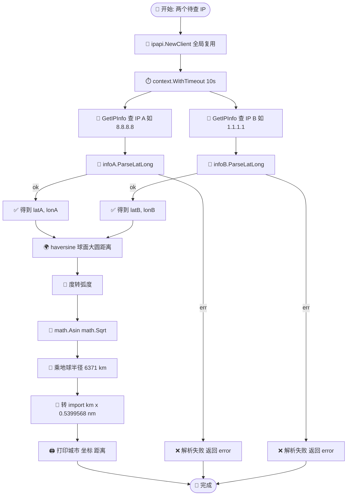
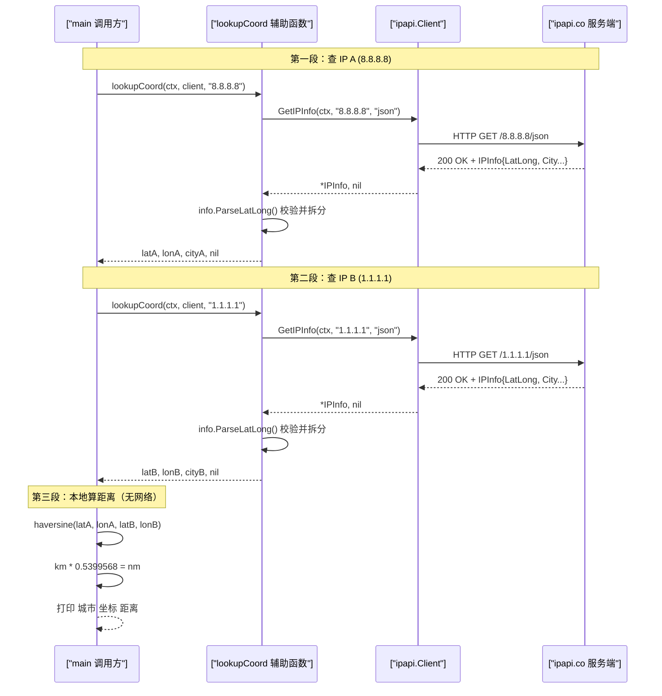

# 🎓 解析经纬度并算距离

> ipapi.co 在响应里给出 `"lat,lon"` 字符串与强类型的 `float64` 坐标。本教程带你用 `ParseLatLong()` 把字符串拆成两个浮点数，再用 **Haversine 公式**算两个 IP 之间的「球面大圆距离」，做出一个距离计算小工具。

## 🎯 你将学到

- 🧭 理解 `LatLong`、`Latitude`、`Longitude` 三个字段的关系，以及为何需要 `ParseLatLong()`
- 📐 用 `info.ParseLatLong()` 把 `"37.3860,-122.0838"` 安全拆成 `(lat, lon float64, error)`
- 🌍 手写 **Haversine 公式**，计算地球上两点之间的球面距离（单位：公里 / 海里）
- 🔁 把「查 IP → 拿坐标 → 算距离」串成一个可复用的 `DistanceBetween` 辅助函数
- 🛡️ 处理解析失败、空字符串、保留 IP 等异常路径，避免把坏数据喂给距离公式

::: tip 🎨 一图抵千言
本教程从「查两个 IP」到「算出球面距离」的完整链路如下，对照各步骤阅读更清晰：
:::



## 📋 前置条件

在开始之前，请确认你已具备以下条件：

- ✅ 已安装 **Go 1.21 或更高版本**（本教程基于 `go 1.23.4` 验证）。可用 `go version` 检查。
- ✅ 已完成 [第一个 IP 查询](./hello-ipapi) 教程，能跑通 `GetIPInfo` 的最小示例。
- ✅ 了解 `*IPInfo` 结构体的基本字段，参见 [探索 IPInfo 结构体](./explore-ipinfo) 与 [IPInfo 模型](../api/models)。
- ✅ 能够访问 `https://ipapi.co/`（免登录即可查询，免费额度有限）。
- 💡 可选：一个 ipapi.co API Key，用于提升速率限制额度。本教程全部示例在免费层即可运行。

> 📌 本教程无需 API Key。免费查询会受到速率限制，超出后可参考 [限流错误](../reference/errors/err-rate-limited) 处理。

## 🧠 步骤 1：理解三个坐标字段

ipapi.co 在 JSON 响应里返回**三个**与经纬度相关的字段。先厘清它们的区别，否则容易用错：

| 字段 | Go 类型 | 示例值 | 含义 |
|------|---------|--------|------|
| `LatLong` | `string` | `"37.3860,-122.0838"` | 经纬度组合字符串 `"lat,lon"` |
| `Latitude` | `float64` | `37.3860` | 纬度（强类型，可直接参与运算） |
| `Longitude` | `float64` | `-122.0838` | 经度（强类型，可直接参与运算） |

你可能会问：既然 `Latitude` / `Longitude` 已经是 `float64`，为什么还要 `ParseLatLong()`？

答案有三点：

- 🧱 **兼容老接口**：部分历史调用方依赖 `LatLong` 字符串字段，`ParseLatLong()` 提供一条「从字符串到坐标」的标准化路径。
- 🔁 **自洽解析**：当你只拿到 `LatLong` 字符串（例如只查了 `latlong` 单字段），`ParseLatLong()` 能在无需重新请求的情况下拆出两个浮点数。
- 🛡️ **统一校验**：`ParseLatLong()` 内部做了格式校验（两段、可解析），把「坏数据」挡在距离公式之外，比手写 `strings.Split` 更安全。

::: tip 🧭 lat 与 lon 的顺序
ipapi.co 的 `LatLong` 字符串是 **纬度在前、经度在后**，即 `"lat,lon"`。`ParseLatLong()` 返回值也是 `(lat, lon, err)`——传给 Haversine 时别把顺序搞反了，否则两点会跑到地球的另一侧。
:::

::: details 📚 为什么已有 float64 还要 ParseLatLong？
既然 `Latitude` / `Longitude` 已经是强类型 `float64`，`ParseLatLong()` 似乎多余。其实它解决三类场景：

| 场景 | 仅靠 float64 字段 | 用 ParseLatLong() |
|------|-------------------|-------------------|
| 只查了 `latlong` 单字段（`GetField`） | 拿不到 Latitude/Longitude | ✅ 从字符串直接拆出坐标 |
| 老接口只返回 `LatLong` 字符串 | 需自己 `strings.Split` | ✅ 内部统一校验，更安全 |
| 数据可能为空或格式异常 | 直接喂公式会 panic | ✅ 返回 error，挡住坏数据 |

> 三者叠加，`ParseLatLong()` 提供了一条「从字符串到坐标」的标准化、自洽、带校验的路径。
:::

字段定义详见 [坐标字段](../api/field-coord) 与字段参考 [latitude](../reference/fields/latitude)、[longitude](../reference/fields/longitude)、[latlong](../reference/fields/latlong)。

## 🚀 步骤 2：创建项目并安装 SDK

新建一个干净的目录，初始化 Go 模块并拉取 SDK：

```bash
mkdir latlong-demo
cd latlong-demo
go mod init example.com/latlong-demo
go get github.com/cyberspacesec/ipapi.co-skills/pkg/ipapi
```

> 🧭 关于安装方式、私有代理、版本选择的更多说明，参见 [安装指南](../guide/installation)。

## 🎯 步骤 3：查询两个 IP 并解析坐标

本教程的目标是算「两个 IP 之间的距离」。所以先查两个 IP，各拿一个 `*IPInfo`，再用 `ParseLatLong()` 拆出坐标。

在项目根目录新建 `main.go`：

```go
package main

import (
	"context"
	"fmt"
	"log"
	"time"

	"github.com/cyberspacesec/ipapi.co-skills/pkg/ipapi"
)

func main() {
	// 1. 创建默认客户端（无需 API Key）
	client := ipapi.NewClient()

	// 2. 设置 10 秒超时，足够两次串行查询
	ctx, cancel := context.WithTimeout(context.Background(), 10*time.Second)
	defer cancel()

	// 3. 查询第一个 IP（示例用 8.8.8.8，Google DNS）
	infoA, err := client.GetIPInfo(ctx, "8.8.8.8", "json")
	if err != nil {
		log.Fatalf("查询 8.8.8.8 失败: %v", err)
	}

	// 4. 查询第二个 IP（示例用 1.1.1.1，Cloudflare DNS）
	infoB, err := client.GetIPInfo(ctx, "1.1.1.1", "json")
	if err != nil {
		log.Fatalf("查询 1.1.1.1 失败: %v", err)
	}

	// 5. 用 ParseLatLong() 解析两个 IP 的坐标
	latA, lonA, err := infoA.ParseLatLong()
	if err != nil {
		log.Fatalf("解析 8.8.8.8 经纬度失败: %v", err)
	}
	latB, lonB, err := infoB.ParseLatLong()
	if err != nil {
		log.Fatalf("解析 1.1.1.1 经纬度失败: %v", err)
	}

	fmt.Printf("8.8.8.8  坐标: (%.4f, %.4f)  %s\n", latA, lonA, infoA.City)
	fmt.Printf("1.1.1.1  坐标: (%.4f, %.4f)  %s\n", latB, lonB, infoB.City)
}
```

逐段说明：

- 🧱 `ipapi.NewClient()` 用默认配置构造客户端，内置 10 秒 HTTP 超时与 2 次重试，参见 [客户端概念](../guide/client-concept)。
- ⏱️ `context.WithTimeout(..., 10*time.Second)` 给整个流程（含两次请求）设上限，理解 `context` 见 [Context 与超时](../guide/context)。
- 🎯 `GetIPInfo(ctx, "8.8.8.8", "json")` 查询任意指定 IP，详见 [GetIPInfo API](../api/get-ip-info)。
- 📐 `infoA.ParseLatLong()` 把 `LatLong` 字符串拆成 `(lat, lon float64, err)`，实现见仓库源码 [`models.go`](https://github.com/cyberspacesec/ipapi.co-skills/blob/main/pkg/ipapi/models.go)。

运行：

```bash
go run main.go
```

预期输出（具体城市与坐标以 ipapi.co 实际返回为准）：

```
8.8.8.8  坐标: (37.3860, -122.0838)  Mountain View
1.1.1.1  坐标: (-33.4940, 143.2100)  Sydney
```

> 📋 实际坐标取决于 ipapi.co 后端数据库，可能与示例略有差异。8.8.8.8 通常定位在美国加州，1.1.1.1 在澳洲悉尼——两者跨太平洋，正好用来演示「远距离」。

## 🌍 步骤 4：实现 Haversine 公式

拿到两对 `(lat, lon)` 后，下一步是算「球面大圆距离」。地球是球体（近似），两点之间的最短路径是穿过球面的大圆弧，用 **Haversine 公式** 计算：

$$
d = 2R \cdot \arcsin\!\left(\sqrt{\sin^2\!\tfrac{\Delta\varphi}{2} + \cos\varphi_1\cos\varphi_2\sin^2\!\tfrac{\Delta\lambda}{2}}\right)
$$

其中 $\varphi$ 是纬度、$\lambda$ 是经度、$R$ 是地球半径。Go 标准库的 `math` 包就够用，无需第三方依赖。

在 `main.go` 顶部追加这个函数：

```go
package main

import (
	"context"
	"fmt"
	"log"
	"math"
	"time"

	"github.com/cyberspacesec/ipapi.co-skills/pkg/ipapi"
)

// 地球平均半径（千米）。海里版用 3440.065。
const earthRadiusKm = 6371.0

// haversine 返回两点 (lat1,lon1) 与 (lat2,lon2) 之间的球面大圆距离（千米）。
// 角度参数单位为「度」，函数内部转换为弧度。
func haversine(lat1, lon1, lat2, lon2 float64) float64 {
	const toRad = math.Pi / 180.0

	lat1r := lat1 * toRad
	lat2r := lat2 * toRad
	dlat := (lat2 - lat1) * toRad
	dlon := (lon2 - lon1) * toRad

	a := math.Sin(dlat/2)*math.Sin(dlat/2) +
		math.Cos(lat1r)*math.Cos(lat2r)*math.Sin(dlon/2)*math.Sin(dlon/2)
	c := 2 * math.Asin(math.Sqrt(a))

	return earthRadiusKm * c
}
```

几点说明：

- 🌐 `earthRadiusKm = 6371.0` 是地球平均半径（千米），算海里把常量换成 `3440.065` 即可。
- 📐 `math.Asin(math.Sqrt(a))` 对应公式里的 $\arcsin(\sqrt{a})$；用 `math.Atan2(math.Sqrt(a), math.Sqrt(1-a))` 也能得到等价结果，且在 $a$ 接近 1 时数值更稳。本教程选 `Asin` 版本以便对照公式。
- 🧱 公式假设地球是正球体，忽略椭率，误差通常在 0.5% 以内，对「城市级距离」足够。

::: tip 🧭 为什么不直接用平面距离公式？
两点经纬度画在地图上像直角坐标，但地球是球面：在高纬度，1° 经度的实际距离远小于 1° 纬度。用平面欧氏距离 $(\Delta lat)^2 + (\Delta lon)^2$ 会让悉尼到伦敦的距离错算好几倍。Haversine 才是球面最短路径的正确解。
:::

## 🔁 步骤 5：封装「查 IP → 拿坐标」辅助函数

两次查询 + 两次解析的样板代码会重复。封装成一个返回坐标的辅助函数，让 `main` 更清爽：

下面这张时序图展示 `main`、`lookupCoord`、ipapi.co 服务端三者在这段流程里的协作顺序，帮助理解「两次串行查询 + 一次本地距离计算」的运行时节奏：



```go
// lookupCoord 查询给定 IP 的完整信息，并解析出 (lat, lon)。
// 任一步出错都返回 error，调用方负责处理。
func lookupCoord(ctx context.Context, client *ipapi.Client, ip string) (lat, lon float64, city string, err error) {
	info, err := client.GetIPInfo(ctx, ip, "json")
	if err != nil {
		return 0, 0, "", fmt.Errorf("查询 %s 失败: %w", ip, err)
	}
	lat, lon, err = info.ParseLatLong()
	if err != nil {
		return 0, 0, info.City, fmt.Errorf("解析 %s 经纬度失败: %w", ip, err)
	}
	return lat, lon, info.City, nil
}
```

然后把 `main` 改成调用它：

```go
func main() {
	client := ipapi.NewClient()

	ctx, cancel := context.WithTimeout(context.Background(), 10*time.Second)
	defer cancel()

	latA, lonA, cityA, err := lookupCoord(ctx, client, "8.8.8.8")
	if err != nil {
		log.Fatal(err)
	}
	latB, lonB, cityB, err := lookupCoord(ctx, client, "1.1.1.1")
	if err != nil {
		log.Fatal(err)
	}

	km := haversine(latA, lonA, latB, lonB)
	nm := km * 0.5399568 // 千米转海里

	fmt.Printf("A  8.8.8.8   %s   (%.4f, %.4f)\n", cityA, latA, lonA)
	fmt.Printf("B  1.1.1.1   %s   (%.4f, %.4f)\n", cityB, latB, lonB)
	fmt.Printf("球面距离: %.1f km  /  %.1f nm\n", km, nm)
}
```

> 🛡️ 注意 `lookupCoord` 把查询错误与解析错误都包成 `error` 返回，不在函数内部 `log.Fatal`——这样调用方能决定是中断还是跳过（例如批量场景里跳过某个坏 IP 继续算下一个）。

## 📦 完整代码

下面是整合步骤 3–5 的完整 `main.go`，可直接复制运行：

```go
package main

import (
	"context"
	"fmt"
	"log"
	"math"
	"time"

	"github.com/cyberspacesec/ipapi.co-skills/pkg/ipapi"
)

// 地球平均半径（千米）。海里版用 3440.065。
const earthRadiusKm = 6371.0

// haversine 返回两点 (lat1,lon1) 与 (lat2,lon2) 之间的球面大圆距离（千米）。
// 角度参数单位为「度」，函数内部转换为弧度。
func haversine(lat1, lon1, lat2, lon2 float64) float64 {
	const toRad = math.Pi / 180.0

	lat1r := lat1 * toRad
	lat2r := lat2 * toRad
	dlat := (lat2 - lat1) * toRad
	dlon := (lon2 - lon1) * toRad

	a := math.Sin(dlat/2)*math.Sin(dlat/2) +
		math.Cos(lat1r)*math.Cos(lat2r)*math.Sin(dlon/2)*math.Sin(dlon/2)
	c := 2 * math.Asin(math.Sqrt(a))

	return earthRadiusKm * c
}

// lookupCoord 查询给定 IP 的完整信息，并解析出 (lat, lon)。
// 任一步出错都返回 error，调用方负责处理。
func lookupCoord(ctx context.Context, client *ipapi.Client, ip string) (lat, lon float64, city string, err error) {
	info, err := client.GetIPInfo(ctx, ip, "json")
	if err != nil {
		return 0, 0, "", fmt.Errorf("查询 %s 失败: %w", ip, err)
	}
	lat, lon, err = info.ParseLatLong()
	if err != nil {
		return 0, 0, info.City, fmt.Errorf("解析 %s 经纬度失败: %w", ip, err)
	}
	return lat, lon, info.City, nil
}

func main() {
	client := ipapi.NewClient()

	ctx, cancel := context.WithTimeout(context.Background(), 10*time.Second)
	defer cancel()

	latA, lonA, cityA, err := lookupCoord(ctx, client, "8.8.8.8")
	if err != nil {
		log.Fatal(err)
	}
	latB, lonB, cityB, err := lookupCoord(ctx, client, "1.1.1.1")
	if err != nil {
		log.Fatal(err)
	}

	km := haversine(latA, lonA, latB, lonB)
	nm := km * 0.5399568 // 千米转海里

	fmt.Printf("A  8.8.8.8   %s   (%.4f, %.4f)\n", cityA, latA, lonA)
	fmt.Printf("B  1.1.1.1   %s   (%.4f, %.4f)\n", cityB, latB, lonB)
	fmt.Printf("球面距离: %.1f km  /  %.1f nm\n", km, nm)
}
```

## 🖥️ 运行结果

在项目根目录执行 `go run main.go`，预期输出形如：

```
A  8.8.8.8   Mountain View   (37.3860, -122.0838)
B  1.1.1.1   Sydney   (-33.4940, 143.2100)
球面距离: 11943.7 km  /  6449.5 nm
```

> 📋 实际城市与坐标取决于 ipapi.co 后端数据库，与示例不同是正常的。距离数值会随坐标精度小幅波动，但应在「千千米」量级——8.8.8.8 与 1.1.1.1 一个在北美西海岸、一个在大洋洲，跨太平洋约 1.2 万千米是合理的。

## 🧠 小结

🎉 恭喜！你已掌握「解析经纬度 + 算球面距离」的全部要点。回顾一下：

- 🧭 ipapi.co 给出三个坐标字段：`LatLong`（字符串）、`Latitude` / `Longitude`（`float64`），定义见 [坐标字段](../api/field-coord)。
- 📐 `info.ParseLatLong()` 把 `"lat,lon"` 拆成 `(lat, lon float64, err)`，顺序是**纬度在前**，实现见 [`models.go`](https://github.com/cyberspacesec/ipapi.co-skills/blob/main/pkg/ipapi/models.go)。
- 🌍 Haversine 公式用 `math` 标准库即可实现，无需第三方依赖；地球半径取 6371 km，海里取 3440.065。
- 🔁 把「查 IP → 解析坐标」封进 `lookupCoord` 辅助函数，错误统一向上抛，调用方决定中断或跳过。
- 🛡️ 解析失败、空字符串、保留 IP 都会让 `ParseLatLong()` 或 `GetIPInfo()` 返回 error——别把坏数据喂给距离公式。

## ➡️ 下一步

掌握坐标解析与距离计算后，可以朝这些方向继续深入：

- 📖 **深入概念**：阅读 [字段概念](../guide/field-concept) 与 [工作原理](../guide/how-it-works)。
- 🔧 **API 速查**：浏览 [`GetIPInfo`](../api/get-ip-info)、[`GetField`](../api/get-field)（可只取 `latlong` 单字段）与 [IPInfo 模型](../api/models)。
- 📋 **字段参考**：在 [坐标字段](../api/field-coord) 与字段参考 [latitude](../reference/fields/latitude)、[longitude](../reference/fields/longitude)、[latlong](../reference/fields/latlong) 中查看坐标字段细节。
- 🍳 **实战菜谱**：把本教程的距离计算直接用于 [就近选服](../cookbook/nearest-server)（从候选机房中选最近节点）、[日志增强](../cookbook/log-enrichment)（给日志带上地理坐标）或 [欺诈检测](../cookbook/fraud-detection)（异地登录距离判定）。
- ➡️ **下一篇教程**：继续学习《查询 IPv6 地址》（[./ipv6-tutorial](./ipv6-tutorial)），了解如何查询 IPv6 地址的坐标与保留地址处理。
