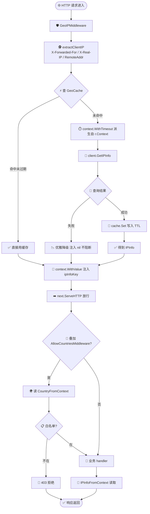
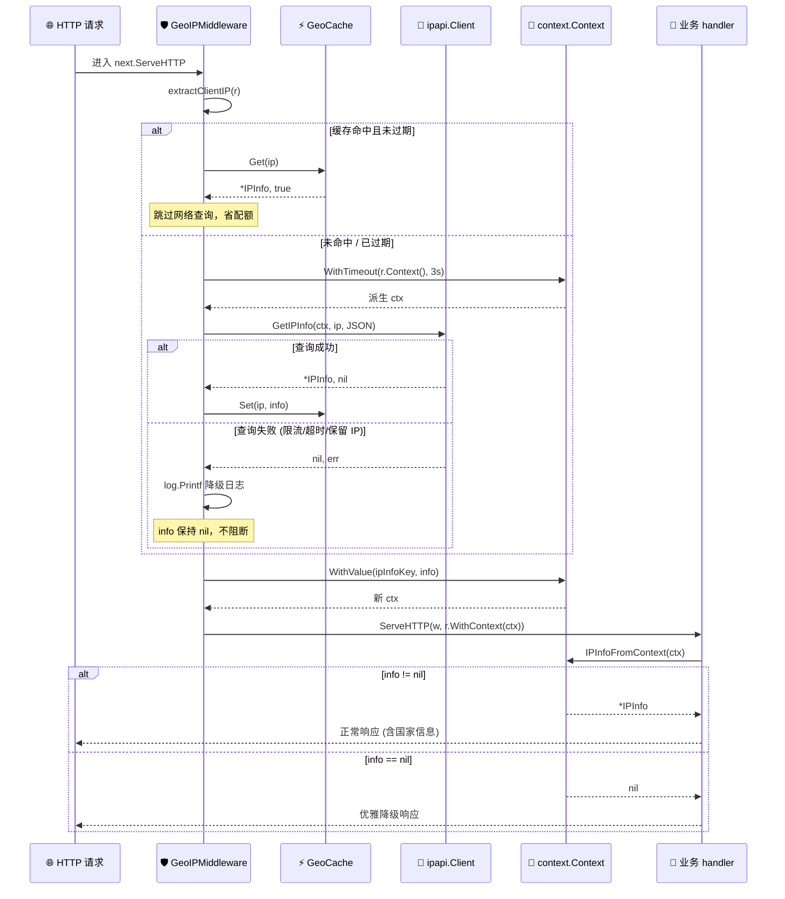

# 🎓 写一个 GeoIP 中间件

> 把「识别访问者地理位置」这件事从 handler 里抽出来，收敛成一处 HTTP 中间件，结果通过 `context.Context` 向下传递——下游业务只管读取，不再重复查询、不再各自处理错误。本篇带你从零搭出一个生产可用的 GeoIP 中间件。

## 🎯 你将学到

- 🔍 从 `X-Forwarded-For` / `X-Real-IP` / `RemoteAddr` 还原真实客户端 IP
- 🧩 用不导出的自定义类型做 `context` key，安全地把 `*ipapi.IPInfo` 注入请求上下文
- ⚡ 用带 TTL 的并发安全缓存（`sync.RWMutex`）避免对同一 IP 重复查询、规避限流
- ⏱️ 为单次查询派生独立超时（`context.WithTimeout`），不拖垮整条请求链路
- 🛡️ 让 GeoIP 查询「优雅降级」——失败不阻断主链路，handler 判空即可
- 🚦 在中间件之上叠加访问控制（按国家白名单/黑名单放行或拒绝）

::: tip 🎨 一图抵千言
本教程从「HTTP 请求进入」到「下游 handler 读取注入的 IPInfo」的完整中间件链路如下：
:::



## ✅ 前置条件

- 🐹 已安装 **Go 1.23.4+**（本库 `go.mod` 声明 `go 1.23.4`）
- 📦 完成教程：[创建你的第一个 Client](./first-client)（或阅读 [安装指南](../guide/installation)）
- 🧭 理解 [`NewClient`](../api/new-client) 的默认值与「Client 应全局复用」的原则（见 [Client 概念](../guide/client-concept)）
- ⏱️ 大致了解 [`context.Context`](../guide/context) 的取消与超时语义
- 🌐 一台能访问 `https://ipapi.co/` 的机器；生产环境建议[配置 API Key](./apikey-setup) 以提升配额与速率上限

::: tip 💡 为什么把 GeoIP 做成中间件？
如果每个 handler 各自查询，同一个 IP 在一次请求生命周期内会被反复查询，既浪费配额、又让错误处理散落各处。中间件把这件事收敛到一处：查一次、缓存住、注入 context，下游只读取。
:::

## 🧠 整体思路

中间件要解决四个问题：

| 问题 | 解法 |
| --- | --- |
| 🕵️ 怎么拿到真实 IP | 解析 `X-Forwarded-For` → `X-Real-IP` → `RemoteAddr` |
| 🔁 同一 IP 重复查询 | 本地缓存（带 TTL + `RWMutex` 并发安全） |
| 🧩 结果怎么传给下游 | 存进 `context.Context`，handler 用自定义 key 取出 |
| 💥 查询失败怎么办 | 注入 `nil` 继续放行（优雅降级），不返回 500 |

下面分步实现。每一步都给出可运行的完整代码，最后再汇总。

::: details 📚 真实客户端 IP 提取优先级
反向代理场景下，请求头里可能携带多种来源。提取顺序与信任边界如下：

| 优先级 | 来源 | 形态 | 可信前提 |
|--------|------|------|----------|
| 1 | `X-Forwarded-For` 第一段 | `client, proxy1, proxy2` | 仅当请求确实经过你信任的反代 |
| 2 | `X-Real-IP` | 单个 IP | 部分代理只设此头 |
| 3 | `RemoteAddr` | `1.2.3.4:5678` 或 `[::1]:8080` | 直连场景可信，兜底 |

> ⚠️ `X-Forwarded-For` 可被客户端伪造。服务直接暴露公网时只用 `RemoteAddr`，或在代理层强制覆盖该头。
:::

## 🪜 步骤 1：创建项目并引入 SDK

初始化一个最小项目：

```bash
mkdir geoip-middleware && cd geoip-middleware
go mod init geoip-middleware
go get github.com/cyberspacesec/ipapi.co-skills/pkg/ipapi
```

新建 `main.go`，先把 SDK 跑通，确认环境正常：

```go
package main

import (
	"context"
	"fmt"
	"log"

	"github.com/cyberspacesec/ipapi.co-skills/pkg/ipapi"
)

func main() {
	client := ipapi.NewClient()

	ctx := context.Background()
	info, err := client.GetIPInfo(ctx, "8.8.8.8", string(ipapi.FormatJSON))
	if err != nil {
		log.Fatalf("查询失败: %v", err)
	}
	fmt.Printf("IP: %s\n国家: %s (%s)\n组织: %s\n",
		info.IP, info.CountryName, info.CountryCode, info.Org)
}
```

确认能跑通后再继续：

```bash
go run main.go
```

## 🕵️ 步骤 2：提取真实客户端 IP

反向代理（Nginx / Cloudflare / ALB）通常把客户端 IP 放进 `X-Forwarded-For`。注意这个头可能形如 `client, proxy1, proxy2`，要取**第一个**才是真实客户端。`RemoteAddr` 仅在直连场景可信，作为兜底。

新建一个 `ip.go`（或直接写在 `main.go` 里），实现 IP 提取：

```go
package main

import (
	"net"
	"net/http"
	"strings"
)

// extractClientIP 从请求头/RemoteAddr 中还原真实客户端 IP。
// 顺序：X-Forwarded-For 第一个非空 -> X-Real-IP -> RemoteAddr 的 host 部分。
func extractClientIP(r *http.Request) string {
	// 1. X-Forwarded-For：取逗号分隔的第一项（最靠近客户端的一跳）
	if xff := r.Header.Get("X-Forwarded-For"); xff != "" {
		if idx := strings.IndexByte(xff, ','); idx >= 0 {
			xff = xff[:idx]
		}
		if ip := strings.TrimSpace(xff); ip != "" {
			return ip
		}
	}
	// 2. X-Real-IP：部分代理只设这个头
	if xri := strings.TrimSpace(r.Header.Get("X-Real-IP")); xri != "" {
		return xri
	}
	// 3. RemoteAddr：直连场景的兜底，形如 "1.2.3.4:5678" 或 "[::1]:8080"
	host, _, err := net.SplitHostPort(r.RemoteAddr)
	if err != nil {
		return r.RemoteAddr
	}
	return host
}
```

> ⚠️ **信任边界**：`X-Forwarded-For` 可被客户端伪造。只有当请求**确实经过了你信任的反向代理**时，才应取这个头。如果你的服务直接暴露在公网，请只用 `RemoteAddr`，或在代理层强制覆盖该头。

## 🧩 步骤 3：定义 context key 与读取函数

Go 官方推荐：context key 用**不导出的自定义类型**，避免不同包之间 key 冲突（裸 `string` 类型的 key 在跨包时极易撞名）。

```go
package main

import (
	"context"

	"github.com/cyberspacesec/ipapi.co-skills/pkg/ipapi"
)

// contextKey 是不导出的 context key 类型，避免与其他包冲突。
type contextKey string

const ipInfoKey contextKey = "ipinfo"

// IPInfoFromContext 从 context 取出注入的 IPInfo。
// 查询失败或不存在时返回 nil，调用方需判空。
func IPInfoFromContext(ctx context.Context) *ipapi.IPInfo {
	v, _ := ctx.Value(ipInfoKey).(*ipapi.IPInfo)
	return v
}

// CountryFromContext 从 context 取出国家代码（如 "US"、"CN"）。
// 查询失败或不存在则返回空串，便于 handler 做降级判断。
func CountryFromContext(ctx context.Context) string {
	if v := IPInfoFromContext(ctx); v != nil {
		return v.CountryCode
	}
	return ""
}
```

## ⚡ 步骤 4：实现带 TTL 的并发安全缓存

GeoIP 信息相对稳定，但同一个 IP 可能被成百上千个请求携带。给它加一层本地缓存，既省配额、又少一次网络往返。读多写少，用 `sync.RWMutex`；带 TTL，避免 IP 易主后拿到过期归属。

```go
package main

import (
	"sync"
	"time"

	"github.com/cyberspacesec/ipapi.co-skills/pkg/ipapi"
)

// cacheEntry 缓存条目：值 + 过期时刻。
type cacheEntry struct {
	info *ipapi.IPInfo
	exp  time.Time
}

// GeoCache 是并发安全的 IP -> 地理位置 缓存。
type GeoCache struct {
	mu    sync.RWMutex
	items map[string]cacheEntry
	ttl   time.Duration
}

// NewGeoCache 创建一个带 TTL 的缓存。
func NewGeoCache(ttl time.Duration) *GeoCache {
	return &GeoCache{items: make(map[string]cacheEntry), ttl: ttl}
}

// Get 命中且未过期则返回结果，第二个返回值表示是否命中。
func (c *GeoCache) Get(ip string) (*ipapi.IPInfo, bool) {
	c.mu.RLock()
	defer c.mu.RUnlock()
	e, ok := c.items[ip]
	if !ok || time.Now().After(e.exp) {
		return nil, false
	}
	return e.info, true
}

// Set 写入缓存，自动加上 TTL。
func (c *GeoCache) Set(ip string, info *ipapi.IPInfo) {
	c.mu.Lock()
	defer c.mu.Unlock()
	c.items[ip] = cacheEntry{info: info, exp: time.Now().Add(c.ttl)}
}
```

> 📌 **懒过期 vs 主动淘汰**：上面用「Get 时判断是否过期」的懒过期策略，简单且无后台 goroutine。高负载场景下 map 可能无界增长，可改用 LRU（如 `hashicorp/golang-lru`）做容量上限，或加一个后台 goroutine 定期清理。

## 🛡️ 步骤 5：组装 GeoIP 中间件

把前三步组合起来：提取 IP → 查缓存 → 未命中则查询（带独立超时）→ 写缓存 → 注入 context → 放行下游。

```go
package main

import (
	"context"
	"log"
	"net/http"
	"time"

	"github.com/cyberspacesec/ipapi.co-skills/pkg/ipapi"
)

// GeoIPMiddleware 在每个请求中识别访问者地理位置并注入 context。
// 查询失败时注入 nil，请求继续放行（业务侧需自行判空）。
func GeoIPMiddleware(client *ipapi.Client, cache *GeoCache, next http.Handler) http.Handler {
	return http.HandlerFunc(func(w http.ResponseWriter, r *http.Request) {
		ip := extractClientIP(r)

		var info *ipapi.IPInfo
		if ip != "" {
			// 1. 先查缓存
			if cached, ok := cache.Get(ip); ok {
				info = cached
			} else {
				// 2. 未命中则查询：派生自 r.Context()，客户端断开时查询会被一并取消
				ctx, cancel := context.WithTimeout(r.Context(), 3*time.Second)
				got, err := client.GetIPInfo(ctx, ip, string(ipapi.FormatJSON))
				cancel() // 用完立即释放，避免泄漏 timer
				if err != nil {
					// 查询失败不阻断主链路，仅记录日志
					log.Printf("geoip lookup failed for %s: %v", ip, err)
				} else {
					info = got
					cache.Set(ip, got)
				}
			}
		}

		// 3. 注入 context，供下游 handler 使用
		ctx := context.WithValue(r.Context(), ipInfoKey, info)
		next.ServeHTTP(w, r.WithContext(ctx))
	})
}
```

> 💡 **为什么派生自 `r.Context()`？** 当客户端断开连接时，`r.Context()` 会被自动取消，派生出的查询 ctx 也会一并取消，避免做无用查询。这是中间件场景下用 `context.WithTimeout` 而非裸 `context.Background()` 的关键原因——见 [Context 概念](../guide/context)。

> 🧠 **复用同一个 Client**：`ipapi.Client` 线程安全且内部复用连接池，**全局只创建一次**（在 `main` 里），所有请求共享。每请求新建 Client 会丢失连接复用并制造大量临时对象。

::: tip 🎨 一图抵千言
上面的 flowchart 画的是「请求往哪走」的链路。下面这张时序图换个视角，聚焦一次请求里中间件与缓存、Client、context、下游 handler 之间的交互顺序——尤其能看清缓存命中走「短路径」、未命中走「查询路径」、失败走「降级短路径」三条分支的差异。
:::



## 🚦 步骤 6：叠加访问控制中间件

GeoIP 中间件把国家信息注入 context 后，再叠一层访问控制就很容易——比如只放行白名单国家。这一步演示中间件的**可组合性**。

```go
package main

import (
	"net/http"
)

// AllowCountriesMiddleware 仅放行指定国家代码（大小写敏感）。
// 不在白名单内返回 403。依赖上游 GeoIPMiddleware 已注入 IPInfo。
func AllowCountriesMiddleware(allowed []string, next http.Handler) http.Handler {
	allow := make(map[string]struct{}, len(allowed))
	for _, c := range allowed {
		allow[c] = struct{}{}
	}
	return http.HandlerFunc(func(w http.ResponseWriter, r *http.Request) {
		country := CountryFromContext(r.Context())
		if country == "" {
			// 未知地理位置：策略上选择拒绝（合规场景）或放行（容错场景）
			http.Error(w, "location unknown, access denied", http.StatusForbidden)
			return
		}
		if _, ok := allow[country]; !ok {
			http.Error(w, "access denied for region "+country, http.StatusForbidden)
			return
		}
		next.ServeHTTP(w, r)
	})
}
```

## 🧪 步骤 7：写示例 handler 并启动服务

写两个 handler 演示下游如何读取注入的 IPInfo，然后用中间件把路由包起来启动服务。

```go
package main

import (
	"fmt"
	"log"
	"net/http"
	"os"
	"time"

	"github.com/cyberspacesec/ipapi.co-skills/pkg/ipapi"
)

// indexHandler 演示优雅降级：查询失败时显示 location unknown。
func indexHandler(w http.ResponseWriter, r *http.Request) {
	info := IPInfoFromContext(r.Context())
	if info == nil {
		fmt.Fprintf(w, "👋 Hello, visitor! (location unknown)\n")
		return
	}
	fmt.Fprintf(w, "👋 Hello from %s (%s)!\n", info.CountryName, info.CountryCode)
}

// detailHandler 演示读取更多字段。
func detailHandler(w http.ResponseWriter, r *http.Request) {
	info := IPInfoFromContext(r.Context())
	if info == nil {
		http.Error(w, "geoip unavailable", http.StatusServiceUnavailable)
		return
	}
	fmt.Fprintf(w, "IP:       %s\n", info.IP)
	fmt.Fprintf(w, "Country:  %s (%s)\n", info.CountryName, info.CountryCode)
	fmt.Fprintf(w, "City:     %s\n", info.City)
	fmt.Fprintf(w, "Timezone: %s\n", info.Timezone)
	fmt.Fprintf(w, "Org:      %s\n", info.Org)
}

func main() {
	// 1. 全局复用的客户端（生产环境建议带 API Key）
	client := ipapi.NewClient(
		ipapi.WithAPIKey(os.Getenv("IPAPI_KEY")),
	)

	// 2. 缓存 10 分钟
	cache := NewGeoCache(10 * time.Minute)

	mux := http.NewServeMux()
	mux.HandleFunc("/", indexHandler)
	mux.HandleFunc("/detail", detailHandler)

	// 3. 中间件链：GeoIP -> (访问控制) -> 业务路由
	//    这里 / 走容错策略，/detail 叠加白名单
	var handler http.Handler = mux
	handler = GeoIPMiddleware(client, cache, handler)

	log.Println("listening on :8080")
	if err := http.ListenAndServe(":8080", handler); err != nil {
		log.Fatal(err)
	}
}
```

## 📝 完整代码

下面是整合了 IP 提取、context key、缓存、GeoIP 中间件、访问控制与示例 handler 的完整可运行示例。把它存为 `main.go` 即可运行（实际项目里建议拆分成多个文件）：

```go
package main

import (
	"context"
	"fmt"
	"log"
	"net"
	"net/http"
	"os"
	"strings"
	"sync"
	"time"

	"github.com/cyberspacesec/ipapi.co-skills/pkg/ipapi"
)

// ---------- context key ----------

type contextKey string

const ipInfoKey contextKey = "ipinfo"

func IPInfoFromContext(ctx context.Context) *ipapi.IPInfo {
	v, _ := ctx.Value(ipInfoKey).(*ipapi.IPInfo)
	return v
}

func CountryFromContext(ctx context.Context) string {
	if v := IPInfoFromContext(ctx); v != nil {
		return v.CountryCode
	}
	return ""
}

// ---------- IP 提取 ----------

func extractClientIP(r *http.Request) string {
	if xff := r.Header.Get("X-Forwarded-For"); xff != "" {
		if idx := strings.IndexByte(xff, ','); idx >= 0 {
			xff = xff[:idx]
		}
		if ip := strings.TrimSpace(xff); ip != "" {
			return ip
		}
	}
	if xri := strings.TrimSpace(r.Header.Get("X-Real-IP")); xri != "" {
		return xri
	}
	host, _, err := net.SplitHostPort(r.RemoteAddr)
	if err != nil {
		return r.RemoteAddr
	}
	return host
}

// ---------- 带 TTL 的缓存 ----------

type cacheEntry struct {
	info *ipapi.IPInfo
	exp  time.Time
}

type GeoCache struct {
	mu    sync.RWMutex
	items map[string]cacheEntry
	ttl   time.Duration
}

func NewGeoCache(ttl time.Duration) *GeoCache {
	return &GeoCache{items: make(map[string]cacheEntry), ttl: ttl}
}

func (c *GeoCache) Get(ip string) (*ipapi.IPInfo, bool) {
	c.mu.RLock()
	defer c.mu.RUnlock()
	e, ok := c.items[ip]
	if !ok || time.Now().After(e.exp) {
		return nil, false
	}
	return e.info, true
}

func (c *GeoCache) Set(ip string, info *ipapi.IPInfo) {
	c.mu.Lock()
	defer c.mu.Unlock()
	c.items[ip] = cacheEntry{info: info, exp: time.Now().Add(c.ttl)}
}

// ---------- 中间件 ----------

func GeoIPMiddleware(client *ipapi.Client, cache *GeoCache, next http.Handler) http.Handler {
	return http.HandlerFunc(func(w http.ResponseWriter, r *http.Request) {
		ip := extractClientIP(r)

		var info *ipapi.IPInfo
		if ip != "" {
			if cached, ok := cache.Get(ip); ok {
				info = cached
			} else {
				ctx, cancel := context.WithTimeout(r.Context(), 3*time.Second)
				got, err := client.GetIPInfo(ctx, ip, string(ipapi.FormatJSON))
				cancel()
				if err != nil {
					log.Printf("geoip lookup failed for %s: %v", ip, err)
				} else {
					info = got
					cache.Set(ip, got)
				}
			}
		}

		ctx := context.WithValue(r.Context(), ipInfoKey, info)
		next.ServeHTTP(w, r.WithContext(ctx))
	})
}

func AllowCountriesMiddleware(allowed []string, next http.Handler) http.Handler {
	allow := make(map[string]struct{}, len(allowed))
	for _, c := range allowed {
		allow[c] = struct{}{}
	}
	return http.HandlerFunc(func(w http.ResponseWriter, r *http.Request) {
		country := CountryFromContext(r.Context())
		if country == "" {
			http.Error(w, "location unknown, access denied", http.StatusForbidden)
			return
		}
		if _, ok := allow[country]; !ok {
			http.Error(w, "access denied for region "+country, http.StatusForbidden)
			return
		}
		next.ServeHTTP(w, r)
	})
}

// ---------- handler ----------

func indexHandler(w http.ResponseWriter, r *http.Request) {
	info := IPInfoFromContext(r.Context())
	if info == nil {
		fmt.Fprintf(w, "👋 Hello, visitor! (location unknown)\n")
		return
	}
	fmt.Fprintf(w, "👋 Hello from %s (%s)!\n", info.CountryName, info.CountryCode)
}

func detailHandler(w http.ResponseWriter, r *http.Request) {
	info := IPInfoFromContext(r.Context())
	if info == nil {
		http.Error(w, "geoip unavailable", http.StatusServiceUnavailable)
		return
	}
	fmt.Fprintf(w, "IP:       %s\n", info.IP)
	fmt.Fprintf(w, "Country:  %s (%s)\n", info.CountryName, info.CountryCode)
	fmt.Fprintf(w, "City:     %s\n", info.City)
	fmt.Fprintf(w, "Timezone: %s\n", info.Timezone)
	fmt.Fprintf(w, "Org:      %s\n", info.Org)
}

// ---------- main ----------

func main() {
	client := ipapi.NewClient(
		ipapi.WithAPIKey(os.Getenv("IPAPI_KEY")),
	)
	cache := NewGeoCache(10 * time.Minute)

	mux := http.NewServeMux()
	mux.HandleFunc("/", indexHandler)
	mux.HandleFunc("/detail", detailHandler)

	// /detail 只放行指定国家
	mux.Handle("/admin", AllowCountriesMiddleware(
		[]string{"US", "JP"},
		http.HandlerFunc(func(w http.ResponseWriter, r *http.Request) {
			fmt.Fprintln(w, "🔓 welcome, you are in an allowed region")
		}),
	))

	var handler http.Handler = mux
	handler = GeoIPMiddleware(client, cache, handler)

	log.Println("listening on :8080")
	if err := http.ListenAndServe(":8080", handler); err != nil {
		log.Fatal(err)
	}
}
```

> 📦 完整源码也可在仓库查看：[examples/](https://github.com/cyberspacesec/ipapi.co-skills/blob/main/examples/) 与 [`pkg/ipapi`](https://github.com/cyberspacesec/ipapi.co-skills/blob/main/pkg/ipapi/)。

## 🖥 运行结果

启动服务：

```bash
go run main.go
# 2026/07/03 20:30:00 listening on :8080
```

本机直连访问（`RemoteAddr` 是 `127.0.0.1`，属保留地址，查询可能返回 reserved）：

```bash
curl http://localhost:8080/
```

```text
👋 Hello, visitor! (location unknown)
```

带上伪造的 `X-Forwarded-For` 模拟一个公网 IP（仅用于演示，生产环境需信任代理）：

```bash
curl -H "X-Forwarded-For: 8.8.8.8" http://localhost:8080/
```

```text
👋 Hello from United States (US)!
```

访问 `/detail`：

```bash
curl -H "X-Forwarded-For: 1.1.1.1" http://localhost:8080/detail
```

```text
IP:       1.1.1.1
Country:  Australia (AU)
City:     South Brisbane
Timezone: Australia/Brisbane
Org:      Cloudflare, Inc.
```

访问受白名单保护的 `/admin`（`1.1.1.1` 属 AU，不在 `US/JP` 白名单内）：

```bash
curl -H "X-Forwarded-For: 1.1.1.1" http://localhost:8080/admin
```

```text
access denied for region AU
```

```bash
curl -H "X-Forwarded-For: 8.8.8.8" http://localhost:8080/admin
```

```text
🔓 welcome, you are in an allowed region
```

服务端日志在查询失败时会记录降级信息（例如保留地址或限流时）：

```text
2026/07/03 20:30:05 geoip lookup failed for 127.0.0.1: reserved IP address: 127.0.0.1
```

> 🐛 **排错**：如果所有请求都返回 `location unknown`，先看服务端日志里的 `geoip lookup failed`。常见原因是没配 API Key 触发 [`429` 限流](../reference/errors/err-rate-limited)，或本机直连导致 `RemoteAddr` 落在保留地址段（见 [`ErrReservedIP`](../reference/errors/err-reserved-ip)）。

## ✅ 小结

- 🕵️ 真实 IP 的提取顺序：`X-Forwarded-For` → `X-Real-IP` → `RemoteAddr`，并注意信任边界
- 🧩 context key 用**不导出自定义类型**，避免跨包冲突；`IPInfoFromContext` 提供类型安全的读取
- ⚡ 缓存用 `sync.RWMutex` + TTL，读多写少不阻塞并发读，TTL 防止 IP 易主后拿到过期归属
- ⏱️ 单次查询派生自 `r.Context()` 并加独立超时，客户端断开时查询自动取消
- 🛡️ GeoIP 是「增强」而非「必需」——查询失败注入 `nil` 继续放行，handler 判空优雅降级
- 🚦 中间件可组合：在 GeoIP 之上叠加 `AllowCountriesMiddleware` 即可实现按国家访问控制
- 🧠 `ipapi.Client` 全局复用一次，所有请求共享连接池

## 🚀 下一步

- 📖 深入阅读 [Client 概念](../guide/client-concept)、[Context 概念](../guide/context) 与 [鉴权概念](../guide/auth-concept)
- 🔌 学习 [`GetIPInfo`](../api/get-ip-info) 与轻量回退接口 [`GetClientField`](../api/get-client-field)
- 🗺 浏览 [`IPInfo` 模型字段](../api/models) 与各 [字段参考](../reference/fields/ip)（如 [`country_code`](../reference/fields/country_code)、[`asn`](../reference/fields/asn)）
- ⚠️ 了解 [错误类型](../reference/errors/err-rate-limited) 与 [`errors.Is`](../api/errors) 的容错用法
- 📘 在 [Cookbook](../cookbook/) 找实战配方，如 [GeoIP 中间件](../cookbook/geoip-middleware)、[按国家限流](../cookbook/rate-limit-by-country)、[按语言重定向](../cookbook/redirect-by-language)、[CDN 边缘检测](../cookbook/cdn-edge-detection)
- 📚 看 [最佳实践](../best-practices/) 中关于缓存与并发的内容
- ➡️ 继续下一篇教程：[按 IP 货币本地化](./currency-localization-tutorial)
