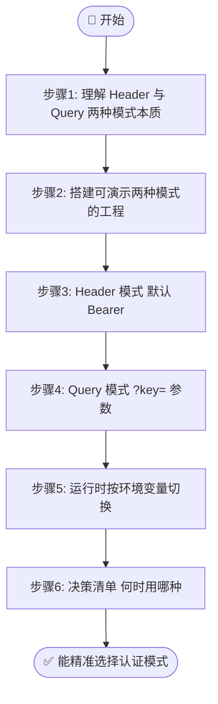
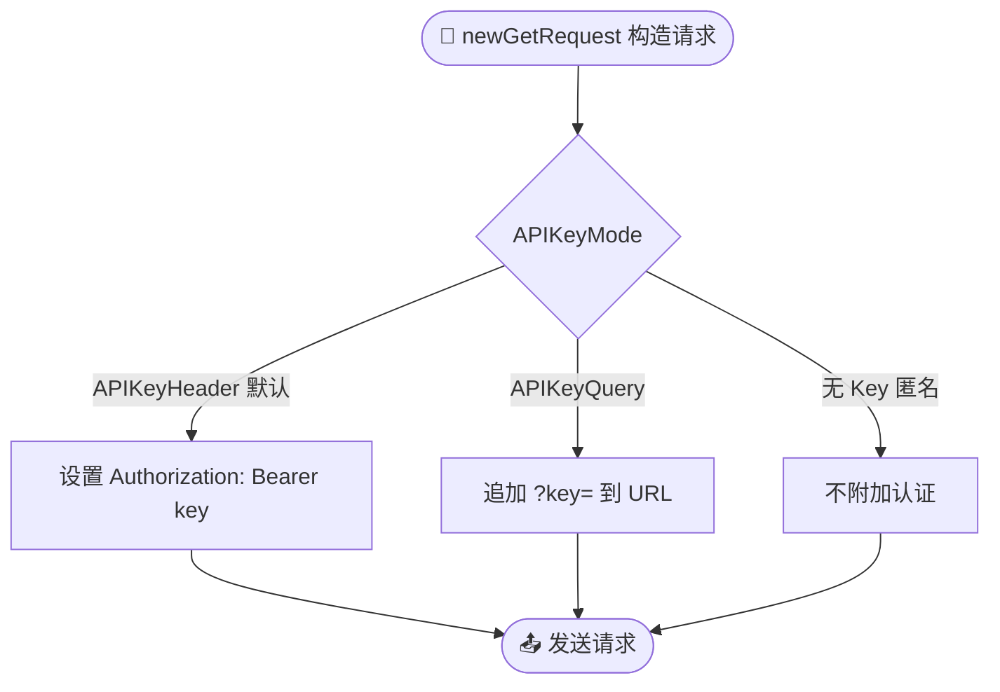

# 🎓 两种认证方式对比：Header vs Query

> ipapi.co-skills 支持两种 API Key 传递方式。本教程带你跑通两种方式，并讲清何时用哪种。

::: tip 🎨 一图抵千言
本教程流程：先理解 Header/Query 两种模式本质 → 搭工程 → 用 httptest 观察请求差异 → 运行时切换 → 按场景决策。
:::



## 你将学到

- 🧠 理解 `APIKeyHeader` 与 `APIKeyQuery` 两种模式的区别
- 🔧 用 `WithAPIKey` + `WithAPIKeyQuery` 切换认证方式
- 🕵️ 观察两种模式发出的真实 HTTP 请求差异
- 🛡 掌握何时该用 Header、何时必须用 Query
- 🧪 写一个可同时演示两种模式的可运行程序

## 前置条件

- ✅ 已安装 **Go 1.18+**（`go version` 可正常输出）
- ✅ 已完成 [配置 API Key](./apikey-setup) 教程，知道如何从环境变量读取 Key
- ✅ 已完成 [第一个 IP 查询](./hello-ipapi)，熟悉 `GetIPInfo` 的基本调用
- 🗝 准备一个 ipapi.co API Key（可在 [ipapi.co](https://ipapi.co) 控制台获取；没有也能跑匿名模式，但下文示例以带 Key 为例）

::: tip 💡 没有 Key 也能学
若暂无 Key，把示例里的 `IPAPI_KEY` 环境变量留空，客户端会以匿名方式请求，两种模式的代码结构依然成立，只是不会附加认证信息。本教程对比的是"带 Key 时两种传递方式"。
:::

## 步骤 1：理解两种模式的本质

ipapi.co 接受两种 API Key 传递方式，SDK 通过 `APIKeyMode` 枚举控制：

```go
// client.go 中的定义
type APIKeyMode int

const (
    APIKeyHeader APIKeyMode = iota // 0，默认：放在 Authorization 头
    APIKeyQuery                    // 1：放在 ?key= 查询参数
)
```

它们的差别只在 **Key 出现在 HTTP 报文的哪个位置**：

::: tip 🎨 applyAuth 内部分支
SDK 的 `applyAuth` 根据 `APIKeyMode` 决定把 Key 放哪儿：
:::



| 维度 | 📨 Header 模式（默认） | 🔗 Query 模式 |
|------|----------------------|--------------|
| Key 位置 | `Authorization: Bearer <key>` 请求头 | URL 的 `?key=<key>` 参数 |
| 是否出现在 URL | ❌ 否 | ✅ 是 |
| 是否出现在访问日志 | ❌ 否（默认日志不记请求头） | ✅ 是 |
| 是否出现在 Referer | ❌ 否 | ✅ 是 |
| 是否能被 CDN/网关按 URL 鉴权 | ❌ 否 | ✅ 是 |
| 浏览器 `<script>` / JSONP 能用 | ❌ 否（无法设头） | ✅ 是 |
| 安全性 | 🟢 高 | 🟡 较低 |

核心结论先记住：**默认且推荐用 Header；只有当 Header 不可用时才退而求其次用 Query。** 接下来我们用代码验证这张表。

## 步骤 2：搭建可同时演示两种模式的工程

新建一个目录并初始化模块：

```bash
mkdir query-auth-modes && cd query-auth-modes
go mod init query-auth-modes
go get github.com/cyberspacesec/ipapi.co-skills/pkg/ipapi
```

工程结构：

```
query-auth-modes/
├── go.mod
├── main.go          # 入口：演示两种模式
└── probe.go         # 工具：打印实际请求的 URL 与请求头
```

先写 `probe.go`。它用 `httptest` 起一个本地服务器，把 SDK 实际发出的 **URL** 和 **Authorization 头** 打印出来——这样不用真的打到 ipapi.co，也能看清两种模式的差异：

```go
// probe.go
package main

import (
	"fmt"
	"net/http"
	"net/http/httptest"
)

// startProbe 启动一个本地测试服务器，记录每个请求的 URL 和 Authorization 头。
// 返回服务器地址和一个关闭函数。
func startProbe() (baseURL string, shutdown func()) {
	mux := http.NewServeMux()
	mux.HandleFunc("/", func(w http.ResponseWriter, r *http.Request) {
		fmt.Printf("  -> 收到请求: %s %s\n", r.Method, r.URL.String())
		if auth := r.Header.Get("Authorization"); auth != "" {
			fmt.Printf("     Authorization 头: %s\n", auth)
		} else {
			fmt.Printf("     Authorization 头: (空)\n")
		}
		// 返回一个最小的合法 JSON，让 SDK 能解析
		w.Header().Set("Content-Type", "application/json")
		fmt.Fprint(w, `{"ip":"8.8.8.8","city":"Mountain View","country_name":"United States"}`)
	})

	srv := httptest.NewServer(mux)
	return srv.URL, srv.Close
}
```

::: tip 🧪 为什么用 httptest
真实请求会把 Key 发到 ipapi.co，且没法看到"SDK 到底把 Key 放哪了"。用 `httptest` 起本地服务器，把 `BaseURL` 指过来，就能 100% 还原 SDK 的发请求逻辑，同时把 Key 留在本地。这套手法在 [用 httptest 测试](./test-mock-tutorial) 会详细讲。
:::

## 步骤 3：Header 模式（默认）

写一个函数，用 **默认的 Header 模式** 查询 `8.8.8.8`：

```go
// main.go（续）
package main

import (
	"context"
	"fmt"
	"os"
	"time"

	"github.com/cyberspacesec/ipapi.co-skills/pkg/ipapi"
)

// runHeaderMode 演示默认的 Bearer Header 认证。
func runHeaderMode(baseURL, apiKey, ip string) {
	client := ipapi.NewClient(
		ipapi.WithAPIKey(apiKey),
		// 不调用 WithAPIKeyQuery()，保持默认 APIKeyHeader
	)
	client.BaseURL = baseURL // 指向本地 probe 服务器

	ctx, cancel := context.WithTimeout(context.Background(), 5*time.Second)
	defer cancel()

	fmt.Println("\n[模式 1] Header（默认 Bearer）")
	info, err := client.GetIPInfo(ctx, ip, "json")
	if err != nil {
		fmt.Printf("查询失败: %v\n", err)
		return
	}
	fmt.Printf("  解析结果: %s 来自 %s\n", info.IP, info.City)
}
```

运行后，probe 服务器会打印类似：

```
[模式 1] Header（默认 Bearer）
  -> 收到请求: GET /8.8.8.8/json/
     Authorization 头: Bearer your_api_key_here
  解析结果: 8.8.8.8 来自 Mountain View
```

注意两点：**URL 里没有 Key**，**Key 只在 `Authorization` 头里**。这正是 Header 模式安全的根源。

## 步骤 4：Query 模式

再加一个函数，用 `WithAPIKeyQuery()` 切到 **Query 模式**：

```go
// runQueryMode 演示 ?key= 查询参数认证。
func runQueryMode(baseURL, apiKey, ip string) {
	client := ipapi.NewClient(
		ipapi.WithAPIKey(apiKey),
		ipapi.WithAPIKeyQuery(), // 关键：切到 APIKeyQuery 模式
	)
	client.BaseURL = baseURL

	ctx, cancel := context.WithTimeout(context.Background(), 5*time.Second)
	defer cancel()

	fmt.Println("\n[模式 2] Query（?key= 参数）")
	info, err := client.GetIPInfo(ctx, ip, "json")
	if err != nil {
		fmt.Printf("查询失败: %v\n", err)
		return
	}
	fmt.Printf("  解析结果: %s 来自 %s\n", info.IP, info.City)
}
```

probe 输出会变成：

```
[模式 2] Query（?key= 参数）
  -> 收到请求: GET /8.8.8.8/json/?key=your_api_key_here
     Authorization 头: (空)
  解析结果: 8.8.8.8 来自 Mountain View
```

对比步骤 3：**Key 现在出现在 URL 的查询串里**，而 `Authorization` 头是空的。这意味着任何记录 URL 的中间件（Nginx access log、APM、CDN 日志、浏览器 Referer）都会留下 Key 痕迹。

::: warning ⚠️ Query 模式的安全代价
一旦切到 Query 模式，请确保：
- 📋 不要把带 `?key=` 的完整 URL 写进日志（对 HTTP 客户端 Transport 加日志过滤）
- 🚫 不要把带 Key 的链接暴露给前端（除非是 JSONP 这类无法设头的场景）
- 🔁 更勤地轮换 Key，因为它更容易泄露
:::

## 步骤 5：运行时切换模式

`APIKeyMode` 是 `Client` 的一个普通字段，所以你可以**在创建客户端时按需选择**，甚至把两种客户端都备好：

```go
// runSwitch 演示根据环境变量动态选择模式。
func runSwitch(baseURL, apiKey, ip string) {
	// 例如：通过网关鉴权时用 Query，否则用 Header
	useQuery := os.Getenv("IPAUTH_MODE") == "query"

	opts := []ipapi.ClientOption{ipapi.WithAPIKey(apiKey)}
	if useQuery {
		opts = append(opts, ipapi.WithAPIKeyQuery())
	}

	client := ipapi.NewClient(opts...)
	client.BaseURL = baseURL

	ctx, cancel := context.WithTimeout(context.Background(), 5*time.Second)
	defer cancel()

	label := "Header"
	if useQuery {
		label = "Query"
	}
	fmt.Printf("\n[动态切换] 当前模式: %s\n", label)
	if _, err := client.GetIPInfo(ctx, ip, "json"); err != nil {
		fmt.Printf("  查询失败: %v\n", err)
	}
}
```

这样部署时只需改一个环境变量 `IPAUTH_MODE=query`，就能在两种模式间切换，无需改代码。

## 步骤 6：何时用哪种——决策清单

结合前面观察到的差异，给出可落地的判断标准：

| 你的场景 | 推荐模式 | 理由 |
|---------|---------|------|
| 🖥 一般后端服务（Go 服务直连 ipapi.co） | **Header** | Key 不入 URL/日志，最安全 |
| 🛡 安全要求高（金融、合规） | **Header** | 避免任何日志泄露面 |
| 🌐 前端 JSONP `<script>` 调用 | **Query** | 浏览器无法给 `<script>` 设请求头 |
| 🚪 网关/CDN 需按 URL 做 Key 鉴权 | **Query** | 网关只能看 URL，看不到头 |
| 🔀 经老旧代理（剥离/改写请求头） | **Query** | Header 可能被代理破坏 |
| 📦 容器内 sidecar 统一加 Key | **Header** | sidecar 能注入头，更隐蔽 |
| 🧪 本地调试/快速验证 | 任意 | 看方便，通常 Header |

一句话总结：

::: tip 🎯 选择原则
**能用 Header 就用 Header；只在"无法设头"或"网关只能看 URL"时才用 Query。**
:::

::: details ⚠️ 认证模式常见反模式
- ❌ **后端服务却用 Query 模式** → Key 暴露在 Nginx access log、APM、Referer 里，等同明文泄露。
- ❌ **前端硬编码 Header 模式 Key** → 浏览器无法给 `<script>` 设头，且 Key 一旦进前端代码即公开。
- ❌ **两种模式来回切换却不重新构造 Client** → `APIKeyMode` 是构造时确定的，运行中改字段不会回溯重写已发出的请求。
- ❌ **Query 模式下把完整 URL 打进日志** → 必须对 Transport 加日志过滤，脱敏 `?key=`。
:::

## 完整代码

把前面的 `probe.go` 和 `main.go` 拼成完整可运行程序：

```go
// probe.go
package main

import (
	"fmt"
	"net/http"
	"net/http/httptest"
)

func startProbe() (baseURL string, shutdown func()) {
	mux := http.NewServeMux()
	mux.HandleFunc("/", func(w http.ResponseWriter, r *http.Request) {
		fmt.Printf("  -> 收到请求: %s %s\n", r.Method, r.URL.String())
		if auth := r.Header.Get("Authorization"); auth != "" {
			fmt.Printf("     Authorization 头: %s\n", auth)
		} else {
			fmt.Printf("     Authorization 头: (空)\n")
		}
		w.Header().Set("Content-Type", "application/json")
		fmt.Fprint(w, `{"ip":"8.8.8.8","city":"Mountain View","country_name":"United States"}`)
	})

	srv := httptest.NewServer(mux)
	return srv.URL, srv.Close
}
```

```go
// main.go
package main

import (
	"context"
	"fmt"
	"os"
	"time"

	"github.com/cyberspacesec/ipapi.co-skills/pkg/ipapi"
)

func runHeaderMode(baseURL, apiKey, ip string) {
	client := ipapi.NewClient(ipapi.WithAPIKey(apiKey))
	client.BaseURL = baseURL

	ctx, cancel := context.WithTimeout(context.Background(), 5*time.Second)
	defer cancel()

	fmt.Println("\n[模式 1] Header（默认 Bearer）")
	info, err := client.GetIPInfo(ctx, ip, "json")
	if err != nil {
		fmt.Printf("查询失败: %v\n", err)
		return
	}
	fmt.Printf("  解析结果: %s 来自 %s\n", info.IP, info.City)
}

func runQueryMode(baseURL, apiKey, ip string) {
	client := ipapi.NewClient(
		ipapi.WithAPIKey(apiKey),
		ipapi.WithAPIKeyQuery(),
	)
	client.BaseURL = baseURL

	ctx, cancel := context.WithTimeout(context.Background(), 5*time.Second)
	defer cancel()

	fmt.Println("\n[模式 2] Query（?key= 参数）")
	info, err := client.GetIPInfo(ctx, ip, "json")
	if err != nil {
		fmt.Printf("查询失败: %v\n", err)
		return
	}
	fmt.Printf("  解析结果: %s 来自 %s\n", info.IP, info.City)
}

func runSwitch(baseURL, apiKey, ip string) {
	useQuery := os.Getenv("IPAUTH_MODE") == "query"

	opts := []ipapi.ClientOption{ipapi.WithAPIKey(apiKey)}
	if useQuery {
		opts = append(opts, ipapi.WithAPIKeyQuery())
	}

	client := ipapi.NewClient(opts...)
	client.BaseURL = baseURL

	ctx, cancel := context.WithTimeout(context.Background(), 5*time.Second)
	defer cancel()

	label := "Header"
	if useQuery {
		label = "Query"
	}
	fmt.Printf("\n[动态切换] 当前模式: %s\n", label)
	if _, err := client.GetIPInfo(ctx, ip, "json"); err != nil {
		fmt.Printf("  查询失败: %v\n", err)
	}
}

func main() {
	baseURL, shutdown := startProbe()
	defer shutdown()

	apiKey := os.Getenv("IPAPI_KEY")
	if apiKey == "" {
		apiKey = "your_api_key_here"
		fmt.Println("提示: 未设置 IPAPI_KEY，使用占位值（不会真正认证）")
	}

	const ip = "8.8.8.8"

	runHeaderMode(baseURL, apiKey, ip)
	runQueryMode(baseURL, apiKey, ip)
	runSwitch(baseURL, apiKey, ip)
}
```

源码可参考仓库示例目录：<https://github.com/cyberspacesec/ipapi.co-skills/blob/main/examples/advanced_usage/main.go>

## 运行结果

```bash
$ go run .
提示: 未设置 IPAPI_KEY，使用占位值（不会真正认证）

[模式 1] Header（默认 Bearer）
  -> 收到请求: GET /8.8.8.8/json/
     Authorization 头: Bearer your_api_key_here
  解析结果: 8.8.8.8 来自 Mountain View

[模式 2] Query（?key= 参数）
  -> 收到请求: GET /8.8.8.8/json/?key=your_api_key_here
     Authorization 头: (空)
  解析结果: 8.8.8.8 来自 Mountain View

[动态切换] 当前模式: Header
  -> 收到请求: GET /8.8.8.8/json/
     Authorization 头: Bearer your_api_key_here
```

把环境变量切到 Query 再跑一次：

```bash
$ IPAUTH_MODE=query go run .

[动态切换] 当前模式: Query
  -> 收到请求: GET /8.8.8.8/json/?key=your_api_key_here
     Authorization 头: (空)
```

观察要点：
- ✅ 模式 1 的 URL **不含 Key**，Key 只在头里
- ✅ 模式 2 的 URL **含 `?key=`**，头为空
- ✅ 动态切换按 `IPAUTH_MODE` 正确选择模式

## 小结

- 🧠 两种模式的唯一区别是 **Key 放在请求头还是 URL 查询串**，由 `APIKeyMode` 枚举（`APIKeyHeader` / `APIKeyQuery`）控制
- 🔧 默认即 Header；调用 `ipapi.WithAPIKeyQuery()` 切到 Query
- 🕵️ Header 模式 Key 不入 URL/日志，更安全；Query 模式 Key 会暴露在 URL、日志、Referer 中
- 🛡 **决策原则：能用 Header 就用 Header；只在无法设请求头（JSONP）或网关只能看 URL 时才用 Query**
- 🧪 用 `httptest` 本地服务器可以直接观察 SDK 发出的真实请求，无需打到真实 API

## 下一步

- 📖 深入读认证机制概念：[认证机制](../guide/auth-concept)
- 📋 看两个核心选项的 API 文档：[WithAPIKey](../api/with-api-key) · [WithAPIKeyQuery](../api/with-api-key-query)
- 🛡 认证失败会返回 `ErrInvalidKey`，了解错误处理：[err-invalid-key](../reference/errors/err-invalid-key)
- 🍳 JSONP 场景必须用 Query 模式，看实战：[JSONP 前端](../cookbook/jsonp-frontend)
- 🚀 下一篇教程：[定制 HTTP 客户端](./custom-http-tutorial)——学会自定义 Transport，给请求加日志过滤、连接池等
