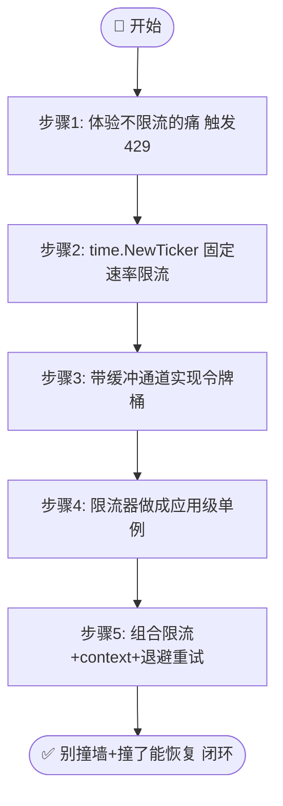
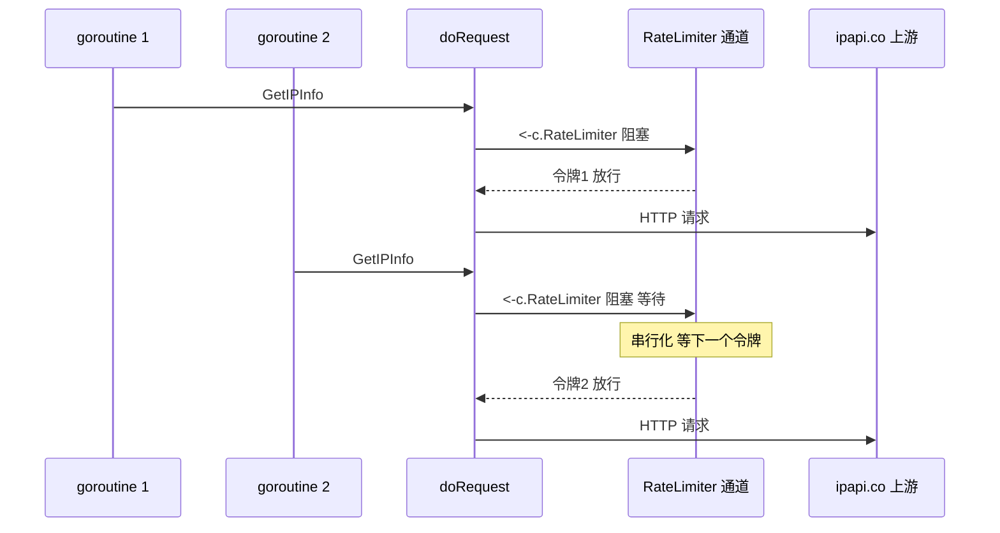

# 🎓 加限流器

> 用 `Client.RateLimiter` 通道为 SDK 装上客户端限流，从源头规避 ipapi.co 的 `429 Too Many Requests`。本篇带你从「为什么会被限流」讲到「固定速率」「令牌桶」两种实战限流器，最后串起限流 + 重试的完整闭环。

::: tip 🎨 一图抵千言
本教程流程：先体验不限流的痛 → 用 Ticker 实现固定速率 → 用令牌桶支持突发 → 做成应用级单例 → 组合 context+退避重试闭环。
:::



## 你将学到

- 🧠 理解为什么会触发 `ErrRateLimited`，以及为什么要在客户端侧主动限流
- 🎛 认识 `Client.RateLimiter <-chan time.Time` 字段与 `doRequest` 中的 `<-c.RateLimiter` 阻塞语义
- ⏱ 用 `time.NewTicker` 实现**固定速率**限流器（每秒 N 个请求）
- 🪣 用带缓冲通道实现**令牌桶**限流器（允许突发 + 长期平均速率）
- 🔁 让限流器成为应用级单例，在多 goroutine 并发下安全共享同一配额
- 🧯 把限流与 `context` 超时、`ErrRateLimited` 退避重试组合成生产级闭环

## 前置条件

在开始之前，请确认你已经具备：

- 🐹 **Go `1.23.4` 或更高版本**（本库 `go.mod` 声明 `go 1.23.4`）
- 📦 已完成 [安装指南](../guide/installation)，能在项目里 `import "github.com/cyberspacesec/ipapi.co-skills/pkg/ipapi"`
- 🧭 已读完 [第一个 Client](./first-client) 与 [Context 与超时](../guide/context)，了解 `NewClient` 的默认值与 `context` 用法
- 🌐 一台能访问 `https://ipapi.co/` 的机器；本教程示例无需 API Key 即可跑通（免费额度约 1000 次/天）

> 📌 本教程聚焦客户端限流。服务端配额、`429` 状态码映射、`ErrRateLimited` 的完整语义见 [限流错误参考](../reference/errors/err-rate-limited)；整体策略总览见 [限流策略](../best-practices/rate-limit-strategy)。

## 🧠 为什么需要限流

ipapi.co 对每个 API Key（匿名访问时按出口 IP）设有请求配额。一旦超出，服务端返回 `HTTP 429 Too Many Requests`，SDK 会将其映射为 [`ipapi.ErrRateLimited`](../api/errors)。此时**立即重试只会再次撞墙**，形成「请求 → 429 → 重试 → 429」的恶性循环——既浪费带宽，又拖慢整体吞吐。

限流的本质是**主动让请求慢下来**，而不是被动等服务器拒绝。本 SDK 在 [`Client`](../api/client) 上暴露了一个公开字段：

```go
// pkg/ipapi/client.go
type Client struct {
	// ...
	RateLimiter  <-chan time.Time // 速率限制通道
	// ...
}
```

每次发起请求前，`doRequest` 都会先执行：

```go
// pkg/ipapi/api.go
func (c *Client) doRequest(req *http.Request) (*http.Response, error) {
	if c.RateLimiter != nil {
		<-c.RateLimiter // 阻塞，直到从通道取到一个「令牌」才放行
	}
	// ... 发送请求、重试、错误映射
}
```

这种基于通道的设计天然适配 Go 的并发模型：多个 goroutine 共享同一个 `Client` 时，限流器会自动串行化它们的请求，无需手动加锁。

::: tip 🎨 doRequest 限流时序
下图展示 `doRequest` 在发请求前先 `<-c.RateLimiter` 阻塞取令牌，多 goroutine 共享同一限流器时请求被自动串行化。
:::



::: tip 💡 为什么用通道而不是计数器
通道是 goroutine 安全的。用 `time.Tick` 通道即可实现固定速率，用带缓冲的通道即可实现令牌桶，都不需要引入额外依赖。SDK 把限流策略的选择权留给你——只要提供一个 `<-chan time.Time` 即可。
:::

> ⚠️ `RateLimiter` 是**零值安全**的：不设置（保持 `nil`）时，`doRequest` 会跳过限流步骤，请求照常发出。但**绝对不要**手动把它设成一个永远不投递的通道或 `nil` 之外的「假通道」，那会让所有请求永久阻塞——详见文末[反模式](#反面教材)。

## 步骤 1：先体验「不限流」的痛

先建一个最小项目，故意以高并发撞向 ipapi.co，亲眼看一次 `ErrRateLimited`：

```bash
mkdir rate-limit-demo && cd rate-limit-demo
go mod init rate-limit-demo
go get github.com/cyberspacesec/ipapi.co-skills/pkg/ipapi
```

新建 `main.go`：

```go
package main

import (
	"context"
	"errors"
	"fmt"
	"sync"
	"time"

	"github.com/cyberspacesec/ipapi.co-skills/pkg/ipapi"
)

func main() {
	client := ipapi.NewClient() // 不设限流器
	ctx, cancel := context.WithTimeout(context.Background(), 30*time.Second)
	defer cancel()

	ips := []string{"8.8.8.8", "1.1.1.1", "9.9.9.9", "8.8.4.4", "1.0.0.1"}

	var wg sync.WaitGroup
	for _, ip := range ips {
		wg.Add(1)
		go func(ip string) {
			defer wg.Done()
			_, err := client.GetIPInfo(ctx, ip, "json")
			if err != nil {
				if errors.Is(err, ipapi.ErrRateLimited) {
					fmt.Printf("⚠️  %s 命中限流\n", ip)
					return
				}
				fmt.Printf("❌ %s 查询失败: %v\n", ip, err)
				return
			}
			fmt.Printf("✅ %s 查询成功\n", ip)
		}(ip)
	}
	wg.Wait()
}
```

运行：

```bash
go run main.go
```

> 🐛 如果你一次跑通了、没触发 429，多跑几次或加大 IP 列表。免费额度下，瞬时并发冲击很容易撞上限流墙。看到 `⚠️ ... 命中限流` 就说明你成功复现了问题——下面我们用限流器把它消灭在源头。

## 步骤 2：用 `time.NewTicker` 实现固定速率

最简单的限流是**严格每秒 N 个请求**。用 `time.NewTicker` 每隔固定间隔投递一个令牌即可。

把 `main.go` 改成：

```go
package main

import (
	"context"
	"fmt"
	"log"
	"sync"
	"time"

	"github.com/cyberspacesec/ipapi.co-skills/pkg/ipapi"
)

func main() {
	// 每 250ms 放行一个请求 → 4 QPS，稳稳低于免费额度上限
	ticker := time.NewTicker(250 * time.Millisecond)
	defer ticker.Stop() // 关键：用完停止，避免 goroutine 泄漏

	client := ipapi.NewClient()
	client.RateLimiter = ticker.C // 把 ticker 的通道交给客户端

	ctx, cancel := context.WithTimeout(context.Background(), 30*time.Second)
	defer cancel()

	ips := []string{"8.8.8.8", "1.1.1.1", "9.9.9.9", "8.8.4.4", "1.0.0.1"}

	var wg sync.WaitGroup
	start := time.Now()
	for _, ip := range ips {
		wg.Add(1)
		go func(ip string) {
			defer wg.Done()
			info, err := client.GetIPInfo(ctx, ip, "json")
			if err != nil {
				log.Printf("%s 查询失败: %v", ip, err)
				return
			}
			fmt.Printf("✅ %-14s -> %s, %s\n", info.IP, info.CountryName, info.Org)
		}(ip)
	}
	wg.Wait()
	fmt.Printf("⏱ 总耗时: %v\n", time.Since(start).Round(time.Millisecond))
}
```

逐段说明：

- ⏱ `time.NewTicker(250 * time.Millisecond)` 创建一个每 250ms 触发一次的定时器，其 `C` 字段就是一个 `<-chan time.Time`，正好匹配 `RateLimiter` 的类型。
- 🔌 `client.RateLimiter = ticker.C` 把通道塞给客户端。之后每次 `doRequest` 都会先 `<-ticker.C` 阻塞，等到下一个 tick 才放行。
- 🛡 `defer ticker.Stop()` 必不可少：`time.NewTicker` 创建的底层定时器不会被 GC 回收，必须显式停止。
- 🧵 多个 goroutine 共享同一个 `Client`（和同一个限流器），`doRequest` 中的 `<-c.RateLimiter` 会自动串行化它们的请求——5 个并发 goroutine 实际仍按 4 QPS 鱼贯而出。

运行后你会看到请求被「拉成」一条匀速的线，总耗时约 `(5-1) * 250ms = 1s` 左右：

```bash
go run main.go
```

::: warning 📌 关于 time.Tick
标准库还提供了更简短的 `time.Tick(d)`，它会直接返回一个 `<-chan time.Time`，无需手动 `Stop()`——代价是底层 ticker **无法被回收**。它只适合长生命周期的全局 `Client`；如果 `Client` 是短生命周期对象，请务必用 `time.NewTicker` + `defer ticker.Stop()`，像本教程这样。
:::

## 步骤 3：用带缓冲通道实现令牌桶

固定速率有个短板：**无法应对突发**。偶尔需要短时间内连发几个请求时，严格 4 QPS 会让你干等。令牌桶允许你**攒一定额度的令牌用于突发**，同时维持长期平均速率。

::: info 📋 两种限流器对比
| 维度 | ⏱ 固定速率（Ticker） | 🪣 令牌桶（带缓冲通道） |
| --- | --- | --- |
| 实现复杂度 | 极简，一行 `time.NewTicker` | 中等，需后台补令牌 goroutine |
| 支持突发 | ❌ 严格匀速 | ✅ 桶容量内可瞬时并发 |
| 长期平均速率 | 精确等于 tick 频率 | 等于补充速率 |
| 资源回收 | 需 `defer ticker.Stop()` | 需停止 ticker + 关闭 bucket |
| 适用场景 | 配额紧张、要求匀速 | 有突发流量、需吞吐弹性 |
:::

下面封装一个可复用的令牌桶构造函数：

```go
package main

import (
	"context"
	"fmt"
	"log"
	"sync"
	"time"

	"github.com/cyberspacesec/ipapi.co-skills/pkg/ipapi"
)

// NewTokenBucket 返回一个令牌桶限流器。
//   capacity    - 桶容量（最大瞬时突发请求数）
//   refillEvery - 每隔多久补充一个令牌（决定长期平均速率）
func NewTokenBucket(capacity int, refillEvery time.Duration) <-chan time.Time {
	bucket := make(chan time.Time, capacity)
	// 预填满令牌，允许起始突发
	for i := 0; i < capacity; i++ {
		bucket <- time.Now()
	}
	go func() {
		ticker := time.NewTicker(refillEvery)
		defer ticker.Stop()
		for t := range ticker.C {
			// 桶满时投递会阻塞，用非阻塞写避免泄漏 goroutine
			select {
			case bucket <- t:
			default: // 桶已满，丢弃本次补充
			}
		}
	}()
	return bucket
}

func main() {
	// 桶容量 5（最多突发 5 个），每 200ms 补一个 → 长期平均 5 QPS
	bucket := NewTokenBucket(5, 200*time.Millisecond)

	client := ipapi.NewClient()
	client.RateLimiter = bucket

	ctx, cancel := context.WithTimeout(context.Background(), 30*time.Second)
	defer cancel()

	ips := []string{"8.8.8.8", "1.1.1.1", "9.9.9.9", "8.8.4.4", "1.0.0.1"}

	var wg sync.WaitGroup
	start := time.Now()
	for _, ip := range ips {
		wg.Add(1)
		go func(ip string) {
			defer wg.Done()
			info, err := client.GetIPInfo(ctx, ip, "json")
			if err != nil {
				log.Printf("%s 查询失败: %v", ip, err)
				return
			}
			fmt.Printf("✅ %-14s -> %s, %s\n", info.IP, info.CountryName, info.Org)
		}(ip)
	}
	wg.Wait()
	fmt.Printf("⏱ 总耗时: %v\n", time.Since(start).Round(time.Millisecond))
}
```

关键点：

- 🪣 `make(chan time.Time, capacity)` 是带缓冲的通道，缓冲大小就是桶容量。预填满后，前 `capacity` 个请求可以**立即**拿到令牌（突发）。
- 🔄 后台 goroutine 以 `refillEvery` 间隔持续补令牌；桶满时用 `select { case bucket <- t: default: }` 非阻塞写入，避免补令牌的 goroutine 被卡住。
- ⚡ 对比步骤 2：5 个请求在固定速率下要排队 ~1 秒；在令牌桶下，前 5 个可以**几乎同时**发出（突发），之后才回落到 5 QPS 的补充速率。

::: tip 🧠 突发 ≠ 无限
令牌桶的 `capacity` 决定了**最大瞬时并发**。把它设得远超服务端允许的并发数，限流就形同虚设。一个保守的起点：`capacity` 等于你计划的最大并发 goroutine 数。
:::

## 步骤 4：把限流器做成应用级单例

限流器是有状态的，应该**跨请求复用**，而不是每次调用新建。把它和 `Client` 一起作为应用级单例，所有调用共用同一配额：

```go
package main

import (
	"context"
	"fmt"
	"log"
	"sync"
	"time"

	"github.com/cyberspacesec/ipapi.co-skills/pkg/ipapi"
)

// 全局共享一个令牌桶，所有调用共用同一配额
var sharedLimiter = NewTokenBucket(5, 200*time.Millisecond)

// newClient 构造一个复用全局限流器的客户端
func newClient() *ipapi.Client {
	c := ipapi.NewClient()
	c.RateLimiter = sharedLimiter
	return c
}

func main() {
	ctx, cancel := context.WithTimeout(context.Background(), 30*time.Second)
	defer cancel()

	ips := []string{"8.8.8.8", "1.1.1.1", "9.9.9.9"}

	var wg sync.WaitGroup
	for _, ip := range ips {
		wg.Add(1)
		go func(ip string) {
			defer wg.Done()
			// 每个 goroutine 各自 newClient()，但共享同一个 sharedLimiter
			info, err := newClient().GetIPInfo(ctx, ip, "json")
			if err != nil {
				log.Printf("%s 失败: %v", ip, err)
				return
			}
			fmt.Printf("✅ %s -> %s\n", info.IP, info.CountryName)
		}(ip)
	}
	wg.Wait()
}
```

> 🧠 **原理**：限流的意义是约束**总速率**。如果每个 goroutine 各自建一个限流器，N 个 goroutine 就会发出 N 倍速率的请求，等于没限流。把它们指向**同一个**通道，配额才会被正确分摊。

## 步骤 5：组合限流 + context + 退避重试

`<-c.RateLimiter` 是 SDK 内置的、**无超时**的阻塞——如果令牌迟迟不来，请求会一直卡住。在长队列场景，建议给等待加上上限，并在万一还是撞上 `429` 时做指数退避重试。

> ⚠️ 注意：SDK 内置的 `<-c.RateLimiter` **不感知 `ctx`**。要给「等待令牌」加超时，需要在调用业务方法前**自己先消耗令牌**，这样能结合 `select` + `ctx.Done()`。下面的示例展示这种模式。

```go
package main

import (
	"context"
	"errors"
	"fmt"
	"log"
	"time"

	"github.com/cyberspacesec/ipapi.co-skills/pkg/ipapi"
)

// tryGetToken 尝试在 ctx 超时前从限流器取一个令牌
func tryGetToken(ctx context.Context, limiter <-chan time.Time) error {
	select {
	case <-limiter:
		return nil // 拿到令牌
	case <-ctx.Done():
		return ctx.Err()
	case <-time.After(2 * time.Second):
		return fmt.Errorf("rate limiter wait timeout")
	}
}

// queryWithBackoff 带指数退避的查询：先取令牌，再发请求，撞 429 则退避后重试
func queryWithBackoff(ctx context.Context, client *ipapi.Client, ip string) (*ipapi.IPInfo, error) {
	backoff := 500 * time.Millisecond
	var lastErr error
	for attempt := 0; attempt < 3; attempt++ {
		// 1. 先取令牌（带超时）
		if err := tryGetToken(ctx, client.RateLimiter); err != nil {
			return nil, fmt.Errorf("等待令牌失败: %w", err)
		}
		// 2. 发请求
		info, err := client.GetIPInfo(ctx, ip, "json")
		if err == nil {
			return info, nil
		}
		lastErr = err
		// 3. 撞上限流才退避重试；其他错误直接返回
		if !errors.Is(err, ipapi.ErrRateLimited) {
			return nil, err
		}
		log.Printf("⚠️ %s 命中限流，%v 后重试（第 %d 次）", ip, backoff, attempt+1)
		select {
		case <-time.After(backoff):
		case <-ctx.Done():
			return nil, ctx.Err()
		}
		backoff *= 2 // 指数退避
	}
	return nil, lastErr
}

func main() {
	ticker := time.NewTicker(200 * time.Millisecond)
	defer ticker.Stop()

	client := ipapi.NewClient()
	client.RateLimiter = ticker.C

	ctx, cancel := context.WithTimeout(context.Background(), 30*time.Second)
	defer cancel()

	info, err := queryWithBackoff(ctx, client, "8.8.8.8")
	if err != nil {
		log.Fatalf("查询失败: %v", err)
	}
	fmt.Printf("✅ %s -> %s, %s\n", info.IP, info.CountryName, info.Org)
}
```

逐段说明：

- 🎟 `tryGetToken` 用 `select` 同时监听「令牌到达」「ctx 取消」「2 秒兜底超时」三条分支，避免无限阻塞。
- 🔁 `queryWithBackoff` 把「取令牌 → 发请求」循环 3 次，只在 `ErrRateLimited` 时退避（500ms → 1s → 2s 指数增长），其他错误立即抛出。
- 🧾 `IsRetryableError(err)` 返回 `true` 的错误（含 `ErrRateLimited`、`ErrServerError`、`ErrNotFound`）都适合这种退避模式，见 [IsRetryable API](../api/is-retryable) 与 [可重试性](../reference/errors/err-rate-limited)。

::: tip 🔗 限流与重试是搭档
限流负责「别撞墙」，重试退避负责「万一撞了怎么恢复」。两者协同才能既保吞吐又稳如老狗。整体退避策略见 [重试策略](../best-practices/retry-strategy) 与 [重试概念](../guide/retry-concept)。
:::

## 完整代码

下面是整合了令牌桶、应用级单例、context 超时与指数退避的完整可运行示例。把它存为 `main.go` 即可运行：

```go
package main

import (
	"context"
	"errors"
	"fmt"
	"log"
	"sync"
	"time"

	"github.com/cyberspacesec/ipapi.co-skills/pkg/ipapi"
)

// NewTokenBucket 返回一个令牌桶限流器。
//   capacity    - 桶容量（最大瞬时突发请求数）
//   refillEvery - 每隔多久补充一个令牌（决定长期平均速率）
func NewTokenBucket(capacity int, refillEvery time.Duration) <-chan time.Time {
	bucket := make(chan time.Time, capacity)
	for i := 0; i < capacity; i++ {
		bucket <- time.Now()
	}
	go func() {
		ticker := time.NewTicker(refillEvery)
		defer ticker.Stop()
		for t := range ticker.C {
			select {
			case bucket <- t:
			default:
			}
		}
	}()
	return bucket
}

// 全局共享一个令牌桶，所有调用共用同一配额
var sharedLimiter = NewTokenBucket(5, 200*time.Millisecond)

// tryGetToken 尝试在 ctx 超时前从限流器取一个令牌
func tryGetToken(ctx context.Context, limiter <-chan time.Time) error {
	select {
	case <-limiter:
		return nil
	case <-ctx.Done():
		return ctx.Err()
	case <-time.After(2 * time.Second):
		return fmt.Errorf("rate limiter wait timeout")
	}
}

// queryWithBackoff 带指数退避的查询
func queryWithBackoff(ctx context.Context, client *ipapi.Client, ip string) (*ipapi.IPInfo, error) {
	backoff := 500 * time.Millisecond
	var lastErr error
	for attempt := 0; attempt < 3; attempt++ {
		if err := tryGetToken(ctx, client.RateLimiter); err != nil {
			return nil, fmt.Errorf("等待令牌失败: %w", err)
		}
		info, err := client.GetIPInfo(ctx, ip, "json")
		if err == nil {
			return info, nil
		}
		lastErr = err
		if !errors.Is(err, ipapi.ErrRateLimited) {
			return nil, err
		}
		log.Printf("⚠️ %s 命中限流，%v 后重试（第 %d 次）", ip, backoff, attempt+1)
		select {
		case <-time.After(backoff):
		case <-ctx.Done():
			return nil, ctx.Err()
		}
		backoff *= 2
	}
	return nil, lastErr
}

func main() {
	client := ipapi.NewClient()
	client.RateLimiter = sharedLimiter

	ips := []string{"8.8.8.8", "1.1.1.1", "9.9.9.9", "8.8.4.4", "1.0.0.1"}

	ctx, cancel := context.WithTimeout(context.Background(), 30*time.Second)
	defer cancel()

	var wg sync.WaitGroup
	start := time.Now()
	for _, ip := range ips {
		wg.Add(1)
		go func(ip string) {
			defer wg.Done()
			info, err := queryWithBackoff(ctx, client, ip)
			if err != nil {
				log.Printf("❌ %s 失败: %v", ip, err)
				return
			}
			fmt.Printf("✅ %-14s -> %-20s | %s\n", info.IP, info.CountryName, info.Org)
		}(ip)
	}
	wg.Wait()
	fmt.Printf("⏱ 总耗时: %v\n", time.Since(start).Round(time.Millisecond))
}
```

## 运行结果

在项目根目录执行 `go run main.go`，预期输出形如：

```text
✅ 8.8.8.8        -> United States      | Google LLC
✅ 1.1.1.1        -> Australia          | Cloudflare, Inc.
✅ 9.9.9.9        -> United States      | Quad9
✅ 8.8.4.4        -> United States      | Google LLC
✅ 1.0.0.1        -> Australia          | Cloudflare, Inc.
⏱ 总耗时: 1.2s
```

> 📋 由于令牌桶预填了 5 个令牌，前几个请求几乎同时发出（突发），随后回落到 5 QPS 的补充速率，因此总耗时通常远小于「严格 5 QPS 串行」的 1 秒，且不会触发 429。实际城市、组织名可能因数据更新略有差异。

如果免费额度已被耗尽（当天请求过多），你可能看到退避重试的日志：

```text
2026/07/03 21:10:12 ⚠️ 8.8.8.8 命中限流，500ms 后重试（第 1 次）
2026/07/03 21:10:13 ⚠️ 8.8.8.8 命中限流，1s 后重试（第 2 次）
2026/07/03 21:10:14 ❌ 8.8.8.8 失败: API rate limit exceeded: ...
```

> 🐛 排查：看到持续 429，说明当日配额已耗尽，需等待 UTC 次日重置或申请 API Key 提升额度（见 [鉴权概念](../guide/auth-concept)）。可用 `curl -i https://ipapi.co/8.8.8.8/json/` 直连观察响应头。

## 小结

🎉 恭喜！你已为 SDK 装上客户端限流器。回顾关键点：

- 🎛 `Client.RateLimiter` 是一个 `<-chan time.Time`，`doRequest` 在每次请求前 `<-c.RateLimiter` 阻塞取令牌；`nil` 时跳过限流，零值安全。
- ⏱ **固定速率**用 `time.NewTicker(d)` + `defer ticker.Stop()`，适合严格 QPS 场景；短生命周期对象勿用 `time.Tick`（无法回收）。
- 🪣 **令牌桶**用带缓冲通道 + 后台补令牌 goroutine，支持突发又维持长期平均速率，`capacity` 应贴近真实并发需求。
- 🔌 限流器必须是**应用级单例**，被所有 goroutine 共享；每人一个限流器等于没限流。
- 🧯 把限流与 `context` 超时、`ErrRateLimited` 指数退避重试组合，构成「别撞墙 + 撞了能恢复」的生产级闭环。
- 🚫 切忌把 `RateLimiter` 设成 `nil` 之外的「永不投递通道」、遗忘 `ticker.Stop()`、或触发 429 后盲撞重试。

## 反面教材

避免以下反模式（完整清单见 [限流策略 - 反模式](../best-practices/rate-limit-strategy#反模式)）：

- ❌ **`time.Tick(0)` 或永不投递的通道** → `doRequest` 永久阻塞，所有请求假死。
- ❌ **每个 goroutine 一个限流器** → N 倍速率，照样撞 429。
- ❌ **令牌桶容量设得过大**（如 `make(chan time.Time, 100000)`）→ 一次性挥霍长期配额，随后被 429 教做人。
- ❌ **触发 429 后立即无间隔重试** → 恶性循环，应配合指数退避。
- ❌ **遗忘 `ticker.Stop()`** → 底层定时器无法 GC，长期运行泄漏 goroutine。

## 下一步

掌握限流器后，可以朝这些方向继续深入：

- 📖 **字段与原理**：阅读 [`Client` 结构体](../api/client) 的 `RateLimiter` 字段定义，与 [客户端概念](../guide/client-concept) 的整体设计。
- 🚨 **限流错误**：深入了解 [`ErrRateLimited`](../reference/errors/err-rate-limited) 的两条触发路径与 `errors.Is` 判定。
- 📚 **API 参考**：浏览 [`NewClient`](../api/new-client)、[选项总览](../api/options) 与 [`IsRetryable`](../api/is-retryable)。
- 🧭 **限流策略总览**：在 [最佳实践 - 限流策略](../best-practices/rate-limit-strategy) 看检查清单与反模式汇总。
- 🔄 **重试联动**：阅读 [重试概念](../guide/retry-concept) 与 [重试策略](../best-practices/retry-strategy)，把限流与指数退避串成完整闭环。
- ⏱ **超时分层**：配合 [Context 用法](../guide/context) 与 [超时策略](../best-practices/timeout-strategy)，为「等待令牌」加超时。
- 🍳 **实战菜谱**：在 [Cookbook](../cookbook/) 中找到 [按国家限流](../cookbook/rate-limit-by-country)、[异步查询](../cookbook/async-lookup)、[日志增强](../cookbook/log-enrichment) 等完整配方。
- ➡️ **下一篇教程**：继续学习 [为请求加超时](./context-timeout-tutorial) 与 [观察自动重试](./retry-tutorial)，把限流、超时、重试三者彻底打通。
