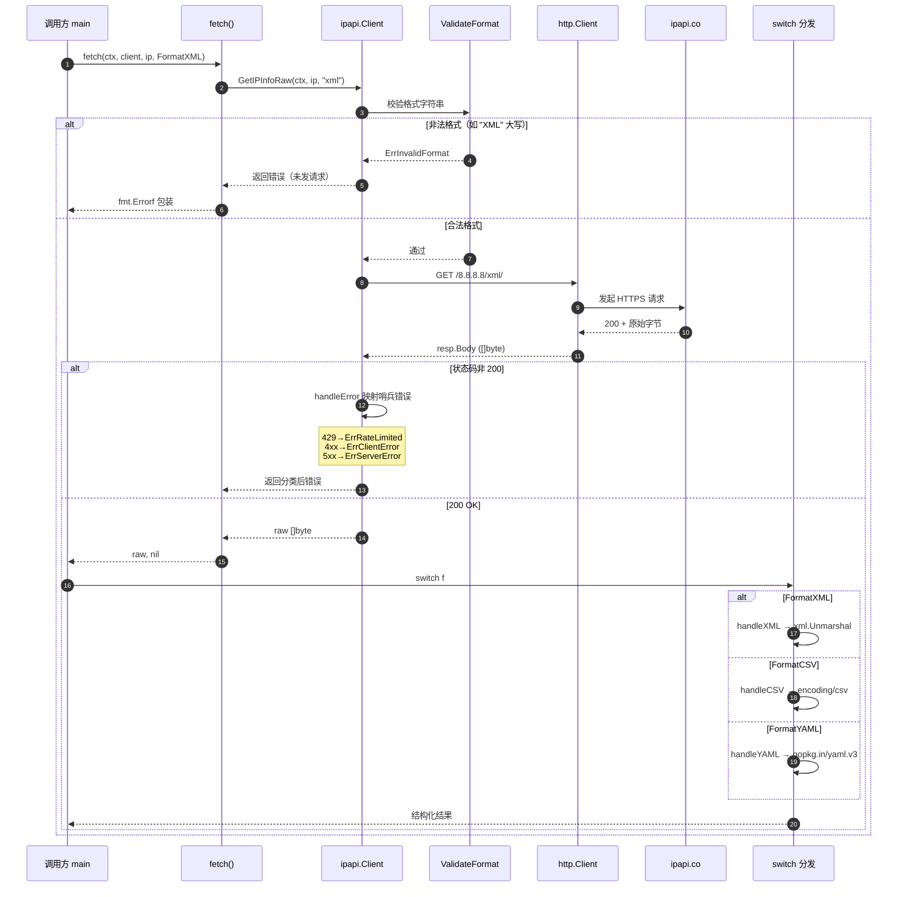

# 🎓 获取 XML/CSV/YAML：GetIPInfoRaw 多格式实战

> 同一组 IP 数据，ipapi.co 能以 **JSON / JSONP / XML / CSV / YAML** 五种格式返回。当你要对接遗留系统、写日志管道、或直接喂给前端模板时，拿到「原始字节」比拿到结构化 `IPInfo` 更顺手——这正是 [`GetIPInfoRaw`](../api/get-ip-info-raw) 的用武之地。

---

## 你将学到

- 🧩 理解为什么 XML / CSV / YAML 必须用 `*Raw` 系列方法，而不能用 [`GetIPInfo`](../api/get-ip-info)
- ⚙️ 用 [`GetIPInfoRaw`](../api/get-ip-info-raw) 分别拉取 **XML / CSV / YAML** 三种格式的原始响应
- 🏷️ 用 `Format` 类型的常量（`FormatXML` / `FormatCSV` / `FormatYAML`）替代手写字符串，避免 [`ErrInvalidFormat`](../reference/errors/err-invalid-format)
- 🧹 把原始字节按格式分发：XML 进解析器、CSV 进 `encoding/csv`、YAML 进 `gopkg.in/yaml.v3`
- 🛡️ 用 `context` 超时 + 错误分类，写出生产可用的多格式查询骨架

::: tip 🎨 一图抵千言
下面这张流程图把本教程从「选格式」到「按格式分发原始字节」的完整链路一次性勾勒出来，对照步骤阅读更清晰：
:::

```mermaid
flowchart TD
    Start([🚀 开始: 选定目标格式]) --> CheckConst[🏷️ 用 Format 常量<br/>FormatXML / FormatCSV / FormatYAML]
    CheckConst --> Validate[✅ ValidateFormat 校验]
    Validate -->|非法格式| ErrFmt[❌ ErrInvalidFormat<br/>不发请求]
    Validate -->|合法| DoReq[🌐 GetIPInfoRaw 发请求]
    DoReq --> RateLimit{⏳ 限流?}
    RateLimit -->|是| Retry[🔄 仅网络/5xx 重试<br/>4xx 含 429 不重试]
    Retry --> DoReq
    RateLimit -->|否| Status{📡 状态码映射}
    Status -->|200| RawBytes[📦 拿到原始字节 []byte]
    Status -->|4xx/5xx| HandleErr[🛡️ handleError 哨兵映射]
    RawBytes --> Switch{🔀 按格式分发}
    Switch -->|XML| HandleXML[🧹 xml.Unmarshal]
    Switch -->|CSV| HandleCSV[🧹 encoding/csv]
    Switch -->|YAML| HandleYAML[🧹 gopkg.in/yaml.v3]
    HandleXML --> Done([🎉 结构化结果])
    HandleCSV --> Done
    HandleYAML --> Done
```

---

## 前置条件

- 🐹 已安装 **Go 1.23.4 或更高版本**
- 📚 已完成 [快速开始](../guide/getting-started)，能跑通第一次 IP 查询
- 📖 建议先读 [响应格式](../guide/formats) 与 [Format 概念](../guide/format-concept)，了解 5 种格式的取舍
- 💡 可选：在 [ipapi.co](https://ipapi.co) 申请 API Key 以获得更高配额；不申请也能跑免费额度
- 📦 步骤 5 会用到 `gopkg.in/yaml.v3`，请先执行 `go get gopkg.in/yaml.v3`

::: tip 💡 为什么不用 GetIPInfo？
[`GetIPInfo`](../api/get-ip-info) 内部用 `json.Decode` 解析响应体，只认 JSON。XML / CSV / YAML 都不是合法 JSON，传给它会触发 [`ErrUnexpectedData`](../reference/errors/err-unexpected-data)。所以非 JSON 格式**必须**走 [`GetIPInfoRaw`](../api/get-ip-info-raw) / [`GetClientIPInfoRaw`](../api/get-client-ip-info-raw) 拿原始字节自己处理。
:::

---

## 步骤 1：理解格式与端点的关系

ipapi.co 的 URL 路径最后一段就是格式名：

```
GET https://ipapi.co/8.8.8.8/xml/    → XML 响应
GET https://ipapi.co/8.8.8.8/csv/    → CSV 响应
GET https://ipapi.co/8.8.8.8/yaml/   → YAML 响应
```

SDK 用 `Format` 类型和一组常量统一管理这些字符串，定义在 [client.go](https://github.com/cyberspacesec/ipapi.co-skills/blob/main/pkg/ipapi/client.go) 中：

| 常量 | 值 | 用途 |
| --- | --- | --- |
| `FormatJSON`  | `"json"`  | 结构化数据，配合 `GetIPInfo` |
| `FormatJSONP` | `"jsonp"` | 跨域回调脚本，见 [JSONP 教程](./jsonp-tutorial) |
| `FormatXML`   | `"xml"`   | 遗留系统 / SOAP 风格对接 |
| `FormatCSV`   | `"csv"`   | 日志管道、Excel 导入 |
| `FormatYAML`  | `"yaml"`  | 配置文件、人类可读快照 |

[`GetIPInfoRaw`](../api/get-ip-info-raw) 会先调用 [`ValidateFormat`](../api/validate-format) 校验格式字符串，不在上表里的值会直接返回 [`ErrInvalidFormat`](../reference/errors/err-invalid-format)，**不会**发出网络请求。

::: warning ⚠️ 别手写字符串
能用 `string(ipapi.FormatXML)` 就别手敲 `"xml"`。手敲一旦拼错（比如 `"XML"` 大写），校验会失败；用常量则由编译器兜底。
:::

::: details 📚 五种格式速查对照表
把格式、对应常量、典型场景与下游解析方式整理成一张决策表，方便按需挑选：

| 格式 | 常量 | 典型场景 | Go 解析方式 | 是否合法 JSON |
|------|------|----------|-------------|---------------|
| JSON  | `FormatJSON`  | 结构化数据、SDK 自动解码 | `json.Unmarshal` / `GetIPInfo` | ✅ 是 |
| JSONP | `FormatJSONP` | 跨域 `<script>` 回调 | 原样透传，前端执行 | ❌ 否 |
| XML   | `FormatXML`   | 遗留 SOAP 对接 | `xml.Unmarshal` | ❌ 否 |
| CSV   | `FormatCSV`   | 日志管道、Excel 导入 | `encoding/csv` | ❌ 否 |
| YAML  | `FormatYAML`  | 配置文件、人类可读 | `gopkg.in/yaml.v3` | ❌ 否 |

> 凡是「❌ 否」的格式，都不能用 [`GetIPInfo`](../api/get-ip-info)，必须走 `*Raw` 系列。
:::

---

## 步骤 2：拉取 XML 原始响应

XML 适合对接遗留 SOAP 风格服务或需要标签语义的场景。我们先用 `GetIPInfoRaw` 拿到原始字节并打印。

```go
// main.go
package main

import (
	"context"
	"fmt"
	"log"
	"time"

	"github.com/cyberspacesec/ipapi.co-skills/pkg/ipapi"
)

func main() {
	client := ipapi.NewClient() // 免费额度无需 Key

	ctx, cancel := context.WithTimeout(context.Background(), 5*time.Second)
	defer cancel()

	// 用 FormatXML 常量，避免手写 "xml" 拼错
	raw, err := client.GetIPInfoRaw(ctx, "8.8.8.8", string(ipapi.FormatXML))
	if err != nil {
		log.Fatalf("XML 查询失败: %v", err)
	}

	fmt.Println(string(raw))
}
```

预期会得到类似这样的 XML（节选）：

```xml
<?xml version="1.0" encoding="utf-8"?>
<response>
  <ip>8.8.8.8</ip>
  <network>8.8.8.0/24</network>
  <version>IPv4</version>
  <city>Mountain View</city>
  <region>California</region>
  <country>US</country>
  <country_name>United States</country_name>
  <asn>AS15169</asn>
  <org>Google LLC</org>
  ...
</response>
```

::: tip 💡 为什么要 string() 转换？
`Format` 的底层类型是 `string`，但 Go 不会把自定义类型隐式当 `string` 用。`GetIPInfoRaw` 的 `format` 参数是 `string`，所以传 `string(ipapi.FormatXML)`。这是 [client.go](https://github.com/cyberspacesec/ipapi.co-skills/blob/main/pkg/ipapi/client.go) 里 `type Format string` 的直接结果。
:::

---

## 步骤 3：拉取 CSV 原始响应

CSV 是日志管道和 Excel 导入的最爱——一行表头、一行数据，`encoding/csv` 直接能解析。

```go
// main.go
package main

import (
	"context"
	"encoding/csv"
	"fmt"
	"log"
	"strings"
	"time"

	"github.com/cyberspacesec/ipapi.co-skills/pkg/ipapi"
)

func main() {
	client := ipapi.NewClient()

	ctx, cancel := context.WithTimeout(context.Background(), 5*time.Second)
	defer cancel()

	raw, err := client.GetIPInfoRaw(ctx, "8.8.8.8", string(ipapi.FormatCSV))
	if err != nil {
		log.Fatalf("CSV 查询失败: %v", err)
	}

	// 用 encoding/csv 解析原始字节
	reader := csv.NewReader(strings.NewReader(string(raw)))
	records, err := reader.ReadAll()
	if err != nil {
		log.Fatalf("CSV 解析失败: %v", err)
	}

	// 第一行是表头，第二行是数据
	for i, row := range records {
		fmt.Printf("第 %d 行: %v\n", i, row)
	}
}
```

ipapi.co 的 CSV 响应形如：

```csv
ip,network,version,city,region,country,country_name,asn,org,...
8.8.8.8,8.8.8.0/24,IPv4,Mountain View,California,US,United States,AS15169,Google LLC,...
```

解析后 `records[0]` 是表头切片、`records[1]` 是数据切片。你可以按下标对齐，比如 `records[1][0]` 就是 `ip` 字段的值 `8.8.8.8`。

::: tip 💡 CSV 字段顺序不稳定？
上游可能调整字段顺序。生产代码里建议先把 `records[0]` 转成「字段名 → 列号」的 map，再按下标取值，避免硬编码列号。
:::

---

## 步骤 4：拉取 YAML 原始响应

YAML 人类可读、配置友好，适合把 IP 快照直接写进配置文件。先拿原始字节看看长什么样。

```go
// main.go
package main

import (
	"context"
	"fmt"
	"log"
	"time"

	"github.com/cyberspacesec/ipapi.co-skills/pkg/ipapi"
)

func main() {
	client := ipapi.NewClient()

	ctx, cancel := context.WithTimeout(context.Background(), 5*time.Second)
	defer cancel()

	raw, err := client.GetIPInfoRaw(ctx, "8.8.8.8", string(ipapi.FormatYAML))
	if err != nil {
		log.Fatalf("YAML 查询失败: %v", err)
	}

	fmt.Println(string(raw))
}
```

输出形如：

```yaml
ip: 8.8.8.8
network: 8.8.8.0/24
version: IPv4
city: Mountain View
region: California
country: US
country_name: United States
asn: AS15169
org: Google LLC
...
```

直接就是个合法 YAML 文档，可以直接粘进配置文件。

---

## 步骤 5：把 YAML 解析进 map[string]any

拿到原始字节后，往往要进一步结构化。YAML 用 `gopkg.in/yaml.v3` 解析最方便。先装依赖：

```bash
go get gopkg.in/yaml.v3
```

然后把字节解进 `map[string]any`，按需取字段：

```go
// main.go
package main

import (
	"context"
	"fmt"
	"log"
	"time"

	"github.com/cyberspacesec/ipapi.co-skills/pkg/ipapi"
	"gopkg.in/yaml.v3"
)

func main() {
	client := ipapi.NewClient()

	ctx, cancel := context.WithTimeout(context.Background(), 5*time.Second)
	defer cancel()

	raw, err := client.GetIPInfoRaw(ctx, "8.8.8.8", string(ipapi.FormatYAML))
	if err != nil {
		log.Fatalf("YAML 查询失败: %v", err)
	}

	// 解进 map，字段名就是 YAML 的 key
	var data map[string]any
	if err := yaml.Unmarshal(raw, &data); err != nil {
		log.Fatalf("YAML 解析失败: %v", err)
	}

	// 按需取字段
	fmt.Printf("IP     = %v\n", data["ip"])
	fmt.Printf("城市   = %v\n", data["city"])
	fmt.Printf("国家   = %v\n", data["country_name"])
	fmt.Printf("ASN    = %v\n", data["asn"])
	fmt.Printf("组织   = %v\n", data["org"])
}
```

::: tip 💡 为什么解进 map 而不是结构体？
`GetIPInfoRaw` 拿到的是上游的原始字段名，和 SDK 的 [`IPInfo`](../api/models) 结构体字段不完全一致（YAML 里是 `country_name`，结构体里是 `CountryName`）。用 `map[string]any` 最省心；要类型安全就自定义一个带 `yaml:"..."` tag 的结构体。
:::

---

## 步骤 6：多格式按需分发的统一骨架

实际项目里，你往往要根据上游系统的偏好**动态选格式**。下面这个骨架接受格式参数，把原始字节按格式分发到不同的处理函数：

::: tip 🎨 一图抵千言
上面的流程图看的是「整体链路」，下面这张时序图聚焦**一次 `fetch` 调用在 SDK 内部与上游之间的交互顺序**——`ValidateFormat` 如何在发请求前就拦截非法格式、`handleError` 如何把状态码映射成哨兵错误、原始字节最终如何按格式落到不同 handler，对照骨架代码读更直观：
:::



```go
// main.go
package main

import (
	"context"
	"encoding/csv"
	"fmt"
	"log"
	"strings"
	"time"

	"github.com/cyberspacesec/ipapi.co-skills/pkg/ipapi"
	"gopkg.in/yaml.v3"
)

// fetch 按 IP + 格式拉取原始字节
func fetch(ctx context.Context, client *ipapi.Client, ip string, f ipapi.Format) ([]byte, error) {
	return client.GetIPInfoRaw(ctx, ip, string(f))
}

// handleXML 直接打印 XML（可换成 xml.Unmarshal 进自定义结构体）
func handleXML(raw []byte) {
	fmt.Println("=== XML ===")
	fmt.Println(string(raw))
}

// handleCSV 用 encoding/csv 解析成二维切片
func handleCSV(raw []byte) {
	fmt.Println("=== CSV ===")
	reader := csv.NewReader(strings.NewReader(string(raw)))
	records, err := reader.ReadAll()
	if err != nil {
		log.Printf("CSV 解析失败: %v", err)
		return
	}
	for i, row := range records {
		fmt.Printf("第 %d 行: %v\n", i, row)
	}
}

// handleYAML 解进 map 按需取值
func handleYAML(raw []byte) {
	fmt.Println("=== YAML ===")
	var data map[string]any
	if err := yaml.Unmarshal(raw, &data); err != nil {
		log.Printf("YAML 解析失败: %v", err)
		return
	}
	fmt.Printf("ip=%v city=%v org=%v\n", data["ip"], data["city"], data["org"])
}

func main() {
	client := ipapi.NewClient()

	ctx, cancel := context.WithTimeout(context.Background(), 8*time.Second)
	defer cancel()

	ip := "8.8.8.8"

	// 遍历三种非 JSON 格式，按格式分发
	formats := []ipapi.Format{ipapi.FormatXML, ipapi.FormatCSV, ipapi.FormatYAML}
	for _, f := range formats {
		raw, err := fetch(ctx, client, ip, f)
		if err != nil {
			log.Printf("%s 查询失败: %v", f, err)
			continue
		}

		switch f {
		case ipapi.FormatXML:
			handleXML(raw)
		case ipapi.FormatCSV:
			handleCSV(raw)
		case ipapi.FormatYAML:
			handleYAML(raw)
		}
		fmt.Println()
	}
}
```

::: warning ⚠️ 复用同一个 Client
注意 `ipapi.NewClient()` 只创建一次，循环里复用。**不要**每次查询都 `NewClient`——那会重复建 HTTP 连接池、丢掉重试配置，拖慢响应。
:::

---

## 完整代码

把步骤 6 的骨架补全错误分类和超时控制，就是可直接跑的完整版：

```go
// main.go
package main

import (
	"context"
	"encoding/csv"
	"errors"
	"fmt"
	"log"
	"strings"
	"time"

	"github.com/cyberspacesec/ipapi.co-skills/pkg/ipapi"
	"gopkg.in/yaml.v3"
)

// fetch 按 IP + 格式拉取原始字节，带错误分类
func fetch(ctx context.Context, client *ipapi.Client, ip string, f ipapi.Format) ([]byte, error) {
	raw, err := client.GetIPInfoRaw(ctx, ip, string(f))
	if err != nil {
		// 区分可重试错误与致命错误，便于上层决策
		if ipapi.IsRetryableError(err) {
			return nil, fmt.Errorf("可重试错误（%s）: %w", f, err)
		}
		return nil, fmt.Errorf("查询失败（%s）: %w", f, err)
	}
	return raw, nil
}

func handleXML(raw []byte) {
	fmt.Println("=== XML ===")
	fmt.Println(string(raw))
}

func handleCSV(raw []byte) {
	fmt.Println("=== CSV ===")
	reader := csv.NewReader(strings.NewReader(string(raw)))
	records, err := reader.ReadAll()
	if err != nil {
		log.Printf("CSV 解析失败: %v", err)
		return
	}
	for i, row := range records {
		fmt.Printf("第 %d 行: %v\n", i, row)
	}
}

func handleYAML(raw []byte) {
	fmt.Println("=== YAML ===")
	var data map[string]any
	if err := yaml.Unmarshal(raw, &data); err != nil {
		log.Printf("YAML 解析失败: %v", err)
		return
	}
	fmt.Printf("ip=%v city=%v country=%v asn=%v org=%v\n",
		data["ip"], data["city"], data["country_name"], data["asn"], data["org"])
}

func main() {
	client := ipapi.NewClient()

	// 整体超时 8 秒，覆盖三种格式串行查询
	ctx, cancel := context.WithTimeout(context.Background(), 8*time.Second)
	defer cancel()

	ip := "8.8.8.8"
	formats := []ipapi.Format{ipapi.FormatXML, ipapi.FormatCSV, ipapi.FormatYAML}

	for _, f := range formats {
		raw, err := fetch(ctx, client, ip, f)
		if err != nil {
			// 限流错误单独提示，引导用户加 Key
			if errors.Is(err, ipapi.ErrRateLimited) {
				log.Printf("⚠️ %s 触发限流，建议配置 API Key: %v", f, err)
			} else {
				log.Printf("%v", err)
			}
			continue
		}

		switch f {
		case ipapi.FormatXML:
			handleXML(raw)
		case ipapi.FormatCSV:
			handleCSV(raw)
		case ipapi.FormatYAML:
			handleYAML(raw)
		}
		fmt.Println()
	}
}
```

::: tip 💡 想要 JSON 也走 Raw？
`FormatJSON` 同样可以传给 [`GetIPInfoRaw`](../api/get-ip-info-raw)，拿到原始 JSON 字节自己 `json.Unmarshal` 进自定义结构体——当你不需要 SDK 自动塞的 `RetrievedAt` 时间戳时，这比 [`GetIPInfo`](../api/get-ip-info) 更轻。
:::

---

## 运行结果

执行 `go run main.go`，预期输出（实际字段以 ipapi.co 实时返回为准）：

```
=== XML
<?xml version="1.0" encoding="utf-8"?>
<response>
  <ip>8.8.8.8</ip>
  <network>8.8.8.0/24</network>
  <version>IPv4</version>
  <city>Mountain View</city>
  <region>California</region>
  <country>US</country>
  <country_name>United States</country_name>
  <asn>AS15169</asn>
  <org>Google LLC</org>
  ...
</response>

=== CSV
第 0 行: [ip network version city region country country_name asn org ...]
第 1 行: [8.8.8.8 8.8.8.0/24 IPv4 Mountain View California US United States AS15169 Google LLC ...]

=== YAML
ip=8.8.8.8 city=Mountain View country=United States asn=AS15169 org=Google LLC
```

如果触发限流，会看到：

```
⚠️ xml 触发限流，建议配置 API Key: API rate limit exceeded: ...
```

此时按 [API Key 配置教程](./apikey-setup) 给 `NewClient` 加上 `ipapi.WithAPIKey("你的Key")` 即可提升配额。

---

## 小结

- 🧩 XML / CSV / YAML 都不是合法 JSON，**不能**用 [`GetIPInfo`](../api/get-ip-info)（会触发 [`ErrUnexpectedData`](../reference/errors/err-unexpected-data)），必须用 [`GetIPInfoRaw`](../api/get-ip-info-raw) 拿原始字节。
- 🏷️ 用 `Format` 常量（`FormatXML` / `FormatCSV` / `FormatYAML`）替代手写字符串，由 [`ValidateFormat`](../api/validate-format) 兜底，编译器查错。
- 🧹 原始字节按格式分发：XML 进 `xml.Unmarshal`、CSV 进 `encoding/csv`、YAML 进 `gopkg.in/yaml.v3`，各取所长。
- ⏱️ `context.WithTimeout` 统一控超时，`IsRetryableError` 区分可重试与致命错误，限流时引导用户加 Key。
- ♻️ 复用同一个 `Client`，别循环里 `NewClient`——连接池和重试配置都是有状态的。

::: warning ⚠️ 格式≠端点能力
[`GetIPInfoRaw`](../api/get-ip-info-raw) 校验的是格式字符串是否合法，**不**校验上游对该格式的支持。若上游未来下线某格式，会以 HTTP 错误（如 [`ErrServerError`](../reference/errors/err-server-error)）形式返回，记得按状态码兜底。
:::

---

## 下一步

- 📖 [响应格式](../guide/formats) — 5 种格式的取舍与选型建议
- 📖 [Format 概念](../guide/format-concept) — `Format` 类型与常量的设计动机
- 🔧 [`GetIPInfoRaw`](../api/get-ip-info-raw) — 查指定 IP 原始字节的接口参考
- 🔧 [`GetClientIPInfoRaw`](../api/get-client-ip-info-raw) — 查访客 IP 原始字节的接口参考
- 🔧 [`ValidateFormat`](../api/validate-format) — 格式校验函数参考
- 📚 [`ErrInvalidFormat`](../reference/errors/err-invalid-format) / [`ErrUnexpectedData`](../reference/errors/err-unexpected-data) — 相关错误码
- 🍳 [CSV 导出食谱](../cookbook/csv-export) — 把 CSV 查询扩成批量导出工具
- 🍳 [YAML 配置食谱](../cookbook/yaml-config) — 把 IP 快照写进 YAML 配置文件
- 🎓 下一篇教程：[JSONP 跨域实战](./jsonp-tutorial) — 用 `FormatJSONP` + `WithCallback` 绕过浏览器同源策略
