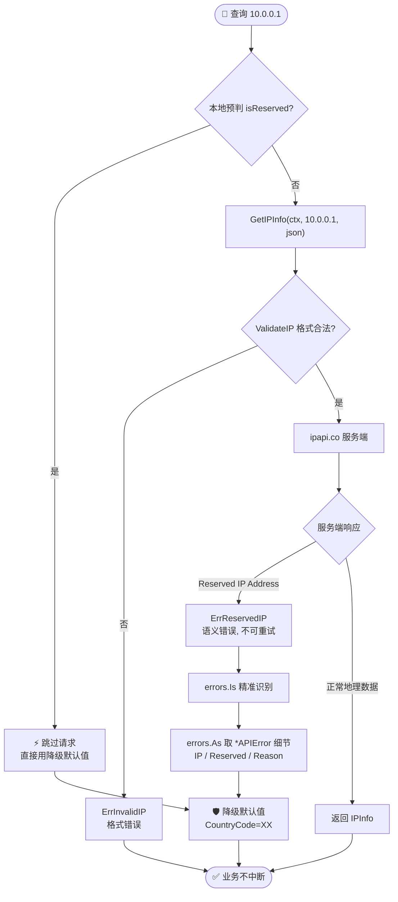
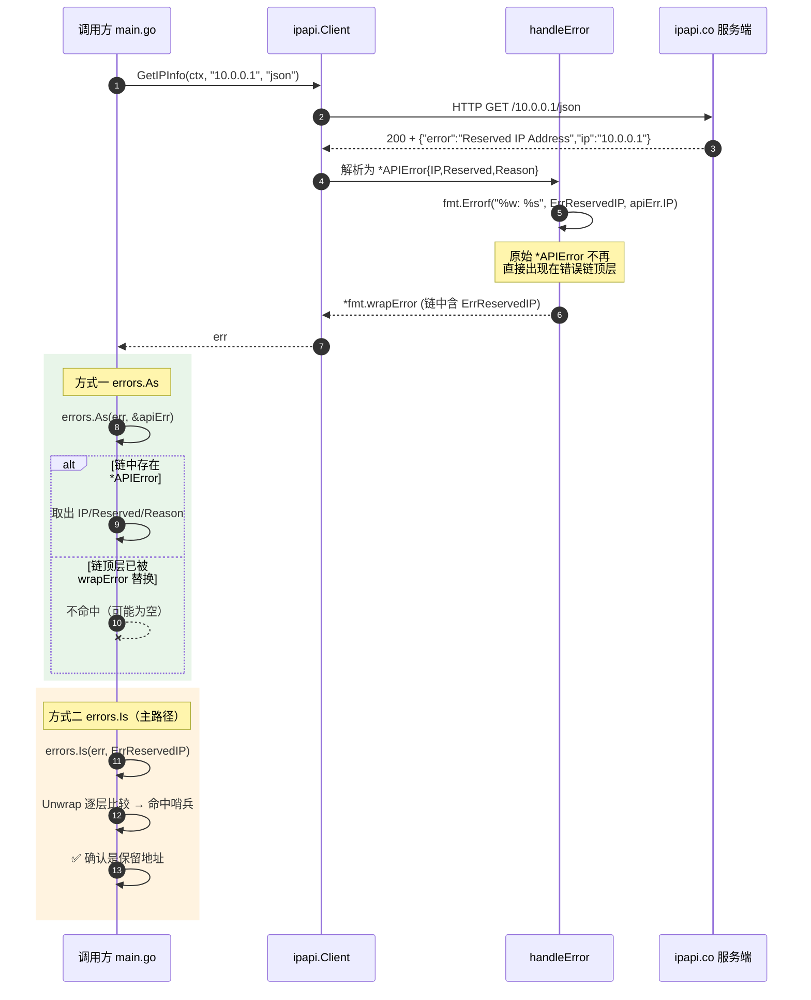

# 🎓 识别保留地址

> `10.0.0.1` 这样的私有地址没有地理意义，查询 ipapi.co 会得到一个特殊错误。本篇带你从一次失败的查询开始，认识 `ErrReservedIP`，区分它与 `ErrInvalidIP`，并学会优雅地处理它。

## 你将学到

- 🔒 理解什么是保留地址，为什么 ipapi.co 不返回其地理位置
- 🚀 主动查询 `10.0.0.1` 并触发 `ErrReservedIP`
- 🧭 用 `errors.Is` 精确识别保留地址错误
- 🔬 用 `errors.As` 取出 `*APIError` 细节（`IP`、`Reserved` 字段）
- ⚖️ 区分 `ErrReservedIP`（语义错误）与 `ErrInvalidIP`（格式错误）
- 🛡️ 在业务层为保留地址提供降级默认值
- 🧯 用 `net.IP.IsPrivate()` 在请求前做本地预判，省一次网络往返

## 前置条件

在开始之前，请确认你已具备以下条件：

- ✅ 已安装 **Go 1.23 或更高版本**（本教程基于 `go 1.23.4` 验证）。可用 `go version` 检查。
- ✅ 完成教程《[第一个 IP 查询](./hello-ipapi)》，能独立创建客户端并发起一次成功的 `GetIPInfo` 调用。
- ✅ 了解 Go 标准库 `errors` 包的 `Is` / `As` 用法；若不熟悉，建议先读本 SDK的[错误概念](../guide/error-concept)。
- ✅ 能够访问 `https://ipapi.co/`（免登录即可查询）。

> 📌 本教程无需 API Key 即可运行。保留地址的判定由 ipapi.co 服务端完成，因此**必须真实发起网络请求**才能触发 `ErrReservedIP`；离线场景可用 `httptest` 模拟，参见《[用 httptest 测试](./test-mock-tutorial)》。

::: tip 🎨 一图抵千言 — 保留地址的识别与处理全流程
下图展示从「查询保留地址失败」到「识别、取细节、降级、本地预判」的完整路径：
:::



## 步骤 1：创建项目目录

新建一个干净的目录并初始化 Go 模块。

```bash
mkdir reserved-ip
cd reserved-ip
go mod init example.com/reserved-ip
```

执行后，目录中会出现一个 `go.mod` 文件，内容类似：

```
module example.com/reserved-ip

go 1.23.4
```

> 🧭 `module` 路径可以随意命名，这里用 `example.com/reserved-ip` 仅作演示，不会对外发布。

## 步骤 2：安装 SDK

在项目根目录执行下面的命令，拉取本 SDK：

```bash
go get github.com/cyberspacesec/ipapi.co-skills/pkg/ipapi
```

安装完成后，`go.mod` 中会出现类似一行依赖：

```
require github.com/cyberspacesec/ipapi.co-skills/pkg/ipapi v0.0.0-...
```

> ⚙️ 关于安装方式、私有代理、版本选择的更多说明，参见[安装指南](../guide/installation)。

## 步骤 3：查询保留地址

`10.0.0.1` 属于 RFC 1918 定义的私有地址段 `10.0.0.0/8`，不会出现在公网路由中，因此没有真实的地理归属。我们故意去查它，看看会发生什么。

在项目根目录新建 `main.go`：

```go
package main

import (
	"context"
	"fmt"
	"log"
	"time"

	"github.com/cyberspacesec/ipapi.co-skills/pkg/ipapi"
)

func main() {
	// 1. 创建默认客户端（无需 API Key）
	client := ipapi.NewClient()

	// 2. 设置 5 秒超时，避免请求卡死
	ctx, cancel := context.WithTimeout(context.Background(), 5*time.Second)
	defer cancel()

	// 3. 查询一个保留地址（私有网段）
	info, err := client.GetIPInfo(ctx, "10.0.0.1", "json")
	if err != nil {
		log.Printf("查询失败: %v", err)
		return
	}

	// 保留地址不会走到这里
	fmt.Printf("IP: %s, 国家: %s\n", info.IP, info.CountryName)
}
```

逐段说明：

- 🧱 `ipapi.NewClient()` 用默认配置构造客户端，内置 10 秒 HTTP 超时与 2 次重试，参见[客户端概念](../guide/client-concept)。
- ⏱️ `context.WithTimeout` 给本次请求再加一道 5 秒上限，理解 `context` 的用法见 [Context 与超时](../guide/context)。
- 🎯 `GetIPInfo(ctx, "10.0.0.1", "json")` 把私有地址当作普通 IP 查询。**注意**：客户端的 `ValidateIP` 只判断格式合法性（`net.ParseIP` 能解析即合法），不会拦私有地址，详见[保留 IP 指南](../guide/reserved-ip)。

运行：

```bash
go run main.go
```

你会看到一条失败日志，而不是国家信息——这正是我们要研究的错误。

> 🎉 失败符合预期！下一步我们就来识别它到底是什么错误。

## 步骤 4：用 errors.Is 识别 ErrReservedIP

SDK 把服务端的 `Reserved IP Address` 响应映射为哨兵错误 [`ErrReservedIP`](../reference/errors/err-reserved-ip)。判断它最地道的方式是 `errors.Is`，因为错误经过了 `fmt.Errorf("%w: ...", ErrReservedIP, ...)` 包装，哨兵值藏在错误链里。

把 `main.go` 的错误处理部分改成：

```go
	if err != nil {
		switch {
		case errors.Is(err, ipapi.ErrReservedIP):
			fmt.Println("👉 这是保留地址，没有地理信息")
		case errors.Is(err, ipapi.ErrInvalidIP):
			fmt.Println("👉 IP 格式不合法")
		case errors.Is(err, ipapi.ErrRateLimited):
			fmt.Println("👉 触发速率限制，稍后再试")
		default:
			log.Printf("其他错误: %v", err)
		}
		return
	}
```

别忘了在 `import` 中加上 `"errors"`：

```go
import (
	"context"
	"errors"
	"fmt"
	"log"
	"time"

	"github.com/cyberspacesec/ipapi.co-skills/pkg/ipapi"
)
```

要点：

- 🧭 `errors.Is(err, ipapi.ErrReservedIP)` 会沿着 `Unwrap` 链逐层比较，因此即便外层包了 `reserved IP address: 10.0.0.1` 这样的附文本，也能命中。这是 Go 1.13+ 哨兵错误的标准用法。
- ⚖️ `ErrReservedIP` 与 `ErrInvalidIP` 是两回事：`10.0.0.1` 格式完全合法（`net.ParseIP` 能解析），所以**不会**触发 `ErrInvalidIP`；它只是语义上属于保留段。两者的对比见[错误详解](../reference/errors/err-reserved-ip)。
- 🔁 `ErrReservedIP` 属于**业务语义错误，不可重试**——重试多少次结果都一样。`IsRetryableError` 对它返回 `false`，参见 [`IsRetryableError`](../api/is-retryable)。

::: details ⚖️ ErrReservedIP vs ErrInvalidIP 对照
| 维度 | `ErrReservedIP` | `ErrInvalidIP` |
|------|-----------------|---------------|
| 错误性质 | 语义错误 | 格式错误 |
| 触发环节 | 服务端响应后 | 客户端请求前 |
| IP 格式 | ✅ 合法（能被 `net.ParseIP` 解析） | ❌ 非法 |
| 典型输入 | `10.0.0.1` `192.168.1.5` `127.0.0.1` | `not.an.ip` `999.999.999.999` |
| 是否联网 | 需要联网触发 | 离线即触发 |
| 可重试 | ❌ 否 | ❌ 否 |
| 业务处理 | 降级默认值 | 提示用户修正 |

`10.0.0.1` 之所以走到服务端才报错，是因为 `ValidateIP` 只校验「能不能解析」，不校验「是不是保留段」。保留段判定由 ipapi.co 数据库完成。
:::

## 步骤 5：用 errors.As 取出错误细节

服务端返回的 `*APIError` 携带 `IP`、`Reserved`、`Reason` 等字段。SDK 在 `handleError` 里用 `fmt.Errorf("%w: %s", ErrReservedIP, apiErr.IP)` 把它包成 `ErrReservedIP`，原始 `*APIError` 不再直接暴露在错误链上。因此要拿细节，需要在**调用层**保留原始错误。

最简单的做法是先用 `errors.As` 探一下错误链里有没有 `*APIError`；如果没有，再退回 `errors.Is`。下面这段演示两种取值方式：

```go
	if err != nil {
		// 方式一：尝试取出 *APIError 细节
		var apiErr *ipapi.APIError
		if errors.As(err, &apiErr) {
			fmt.Printf("APIError.IP       : %s\n", apiErr.IP)
			fmt.Printf("APIError.Reserved : %v\n", apiErr.Reserved)
			fmt.Printf("APIError.Reason   : %s\n", apiErr.Reason)
			fmt.Printf("APIError.Message  : %s\n", apiErr.Message)
		}

		// 方式二：用哨兵错误做分支
		if errors.Is(err, ipapi.ErrReservedIP) {
			fmt.Println("✅ 确认是保留地址")
		}
		return
	}
```

> 📌 当 SDK 内置的 `handleError` 已经把 `*APIError` 转译为 `ErrReservedIP` 时，错误链顶层通常是 `*fmt.wrapError`，`errors.As` 对 `*APIError` 可能不命中。此时方式二的哨兵判断是**最可靠**的主路径，方式一作为可选增强——在自定义错误处理器（见[自定义错误处理](./error-handler-tutorial)）中保留原始 `*APIError` 时尤为有用。`*APIError` 的结构定义见仓库源码 [`models.go`](https://github.com/cyberspacesec/ipapi.co-skills/blob/main/pkg/ipapi/models.go)。

::: tip 🎨 一图抵千言 — 保留地址错误从服务端到调用方的时序
下图从时序视角展示 `*APIError` 如何在 `handleError` 中被包装进 `ErrReservedIP`，以及调用方用 `errors.Is` / `errors.As` 两条路径分别取值的过程：
:::



## 步骤 6：为保留地址提供降级默认值

真实业务里，遇到保留地址通常不是“报错退出”，而是“用一个默认值兜底”。例如内网审计日志里出现 `10.0.0.1`，我们把它标记为 `XX`（未知国家）继续往下走。

把查询逻辑封装成函数：

```go
// lookupSafe 对保留地址返回降级默认值，其他错误原样上抛
func lookupSafe(ctx context.Context, client *ipapi.Client, ip string) (*ipapi.IPInfo, error) {
	info, err := client.GetIPInfo(ctx, ip, "json")
	switch {
	case errors.Is(err, ipapi.ErrReservedIP):
		// 保留地址：用占位值降级，业务不中断
		return &ipapi.IPInfo{
			IP:          ip,
			CountryCode: "XX",
			CountryName: "Reserved",
			Version:     "IPv4",
		}, nil
	case err != nil:
		return nil, err
	}
	return info, nil
}
```

调用方拿到的永远是一个可用的 `*IPInfo`，无需关心保留地址的特例：

```go
	info, err := lookupSafe(ctx, client, "10.0.0.1")
	if err != nil {
		log.Fatalf("查询失败: %v", err)
	}
	fmt.Printf("IP: %s, 国家: %s\n", info.IP, info.CountryName)
```

> 🛡️ 这种“错误即默认值”的降级模式在生产环境很常见，更系统的论述见[优雅降级](../best-practices/graceful-degradation)与[错误处理策略](../best-practices/error-handling-strategy)。

## 步骤 7：请求前用 net.IP 本地预判

保留地址的判定其实可以在客户端完成——Go 标准库 `net.IP` 提供了 `IsPrivate()`、`IsLoopback()`、`IsLinkLocalUnicast()` 等方法。在调用 API 前先过滤，能省一次网络往返，也避免占用免费额度。

```go
import (
	"net"
)

// isReserved 本地判断 IP 是否属于保留段（无需联网）
func isReserved(ipStr string) bool {
	ip := net.ParseIP(ipStr)
	if ip == nil {
		return false // 格式非法另算
	}
	return ip.IsPrivate() ||
		ip.IsLoopback() ||
		ip.IsLinkLocalUnicast() ||
		ip.IsUnspecified()
}

func lookupSmart(ctx context.Context, client *ipapi.Client, ip string) (*ipapi.IPInfo, error) {
	if isReserved(ip) {
		fmt.Printf("⚡ 本地预判 %s 为保留地址，跳过请求\n", ip)
		return &ipapi.IPInfo{IP: ip, CountryCode: "XX", CountryName: "Reserved"}, nil
	}
	return client.GetIPInfo(ctx, ip, "json")
}
```

> 🧯 `IsPrivate()` 覆盖 `10.0.0.0/8`、`172.16.0.0/12`、`192.168.0.0/16` 与 IPv6 唯一本地地址 `fc00::/7`；`IsLoopback()` 覆盖 `127.0.0.0/8` 与 `::1`。完整保留段表见[保留 IP 指南](../guide/reserved-ip)。
>
> ⚠️ 本地预判与服务端判定**可能不完全一致**（例如测试网段 `192.0.2.0/24` 不被 `IsPrivate` 命中，但 ipapi.co 仍可能视为保留）。把本地判断当作“快速过滤 + 省额度”的优化，最终语义仍以服务端 `ErrReservedIP` 为准。

::: details 📋 常见保留地址段速查表
| 类别 | IPv4 段 | IPv6 段 | `net.IP` 方法 |
|------|---------|---------|--------------|
| 私有地址 (RFC 1918) | `10.0.0.0/8` `172.16.0.0/12` `192.168.0.0/16` | `fc00::/7` | `IsPrivate()` |
| 回环地址 | `127.0.0.0/8` | `::1` | `IsLoopback()` |
| 链路本地 | `169.254.0.0/16` | `fe80::/10` | `IsLinkLocalUnicast()` |
| 未指定地址 | `0.0.0.0` | `::` | `IsUnspecified()` |
| 文档/测试网段 | `192.0.2.0/24` `198.51.100.0/24` | `2001:db8::/32` | ⚠️ `IsPrivate` 不命中 |

最后两类「文档/测试网段」是本地预判与服务端判定可能不一致的典型来源，建议最终以服务端 `ErrReservedIP` 为准。
:::

## 完整代码

下面是整合了步骤 3–7 的完整 `main.go`，可直接复制运行：

```go
package main

import (
	"context"
	"errors"
	"fmt"
	"log"
	"net"
	"time"

	"github.com/cyberspacesec/ipapi.co-skills/pkg/ipapi"
)

func main() {
	client := ipapi.NewClient()

	ctx, cancel := context.WithTimeout(context.Background(), 5*time.Second)
	defer cancel()

	ip := "10.0.0.1"

	// 1) 本地预判：先看是不是保留地址
	if isReserved(ip) {
		fmt.Printf("⚡ 本地预判 %s 为保留地址，跳过请求\n", ip)
	}

	// 2) 直接查询，触发服务端的 ErrReservedIP
	info, err := client.GetIPInfo(ctx, ip, "json")
	if err != nil {
		// 取 *APIError 细节
		var apiErr *ipapi.APIError
		if errors.As(err, &apiErr) {
			fmt.Printf("APIError.IP       : %s\n", apiErr.IP)
			fmt.Printf("APIError.Reserved : %v\n", apiErr.Reserved)
			fmt.Printf("APIError.Reason   : %s\n", apiErr.Reason)
			fmt.Printf("APIError.Message  : %s\n", apiErr.Message)
		}

		// 哨兵判断
		switch {
		case errors.Is(err, ipapi.ErrReservedIP):
			fmt.Println("✅ 确认是保留地址（ErrReservedIP）")
		case errors.Is(err, ipapi.ErrInvalidIP):
			fmt.Println("👉 IP 格式不合法（ErrInvalidIP）")
		default:
			log.Printf("其他错误: %v", err)
		}

		// 3) 降级：用默认值兜底
		info = &ipapi.IPInfo{
			IP:          ip,
			CountryCode: "XX",
			CountryName: "Reserved",
			Version:     "IPv4",
		}
	}

	fmt.Printf("最终结果 -> IP: %s, 国家: %s\n", info.IP, info.CountryName)
}

// isReserved 本地判断 IP 是否属于保留段（无需联网）
func isReserved(ipStr string) bool {
	ip := net.ParseIP(ipStr)
	if ip == nil {
		return false
	}
	return ip.IsPrivate() ||
		ip.IsLoopback() ||
		ip.IsLinkLocalUnicast() ||
		ip.IsUnspecified()
}
```

源码亦可参考仓库示例 [`examples/error_handling/main.go`](https://github.com/cyberspacesec/ipapi.co-skills/blob/main/examples/error_handling/main.go)，其中包含保留 IP 在内的多种错误场景测试。

## 运行结果

在项目根目录执行 `go run main.go`，预期输出形如：

```
⚡ 本地预判 10.0.0.1 为保留地址，跳过请求
APIError.IP       : 10.0.0.1
APIError.Reserved : true
APIError.Reason   : Reserved IP Address
APIError.Message  : 10.0.0.1 is an ip address reserved for private networks
✅ 确认是保留地址（ErrReservedIP）
最终结果 -> IP: 10.0.0.1, 国家: Reserved
```

> 📋 服务端返回的 `Message` 文案可能因 ipapi.co 数据更新而略有差异，但 `Reason: "Reserved IP Address"` 与 `Reserved: true` 这两个字段稳定。若 `errors.As` 未命中 `*APIError`（见步骤 5 说明），则中间四行 `APIError.*` 不会打印，但 `✅ 确认是保留地址` 这行一定出现——它是基于哨兵错误的可靠判定。

## 小结

🎉 恭喜！你已学会识别和处理保留地址错误。回顾一下关键点：

- 🔒 保留地址（`10.0.0.0/8`、`172.16.0.0/12`、`192.168.0.0/16`、`127.0.0.0/8`、`::1` 等）没有地理归属，ipapi.co 返回 `Reserved IP Address`，SDK 映射为 [`ErrReservedIP`](../reference/errors/err-reserved-ip)。
- 🧭 用 `errors.Is(err, ipapi.ErrReservedIP)` 做主判断，可靠穿透 `fmt.Errorf("%w: ...")` 的包装。
- 🔬 用 `errors.As(err, &apiErr)` 取 `*APIError` 的 `IP`、`Reserved`、`Reason`、`Message` 细节。
- ⚖️ `ErrReservedIP`（语义错误，格式合法）≠ `ErrInvalidIP`（格式错误）；前者不可重试，[`IsRetryableError`](../api/is-retryable) 返回 `false`。
- 🛡️ 业务层可用降级默认值（如 `CountryCode: "XX"`）兜底，避免保留地址中断主流程。
- 🧯 `net.IP.IsPrivate()` / `IsLoopback()` 可在请求前本地预判，省一次网络往返与一次免费额度。

## 下一步

掌握保留地址后，可以朝这些方向继续深入：

- 📖 **理解错误体系**：阅读[错误概念](../guide/error-concept)与[错误类型 API](../api/errors)，通览 SDK 的全部哨兵错误。
- 🛡️ **错误处理策略**：在生产环境组合使用降级、重试与超时，见[错误处理策略](../best-practices/error-handling-strategy)与[优雅降级](../best-practices/graceful-degradation)。
- 🧪 **测试错误分支**：用 `httptest` 模拟保留地址响应、无需联网即可测试，见[测试最佳实践](../best-practices/testing)。
- 🍳 **实战菜谱**：在 [Cookbook](../cookbook/) 中看保留地址如何融入[日志增强](../cookbook/log-enrichment)、[欺诈检测](../cookbook/fraud-detection)等完整场景。
- ❓ **常见疑问**：`192.168.x.x` 报错是不是 bug？见 [FAQ：查 192.168 报错](../faq/private-ip-error)。
- ➡️ **下一篇教程**：继续学习《[自定义错误处理](./error-handler-tutorial)》，用 `WithErrorHandler` 统一接管所有错误映射。
