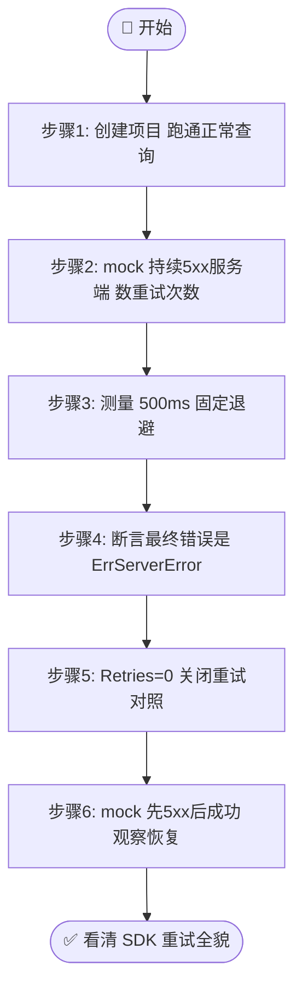
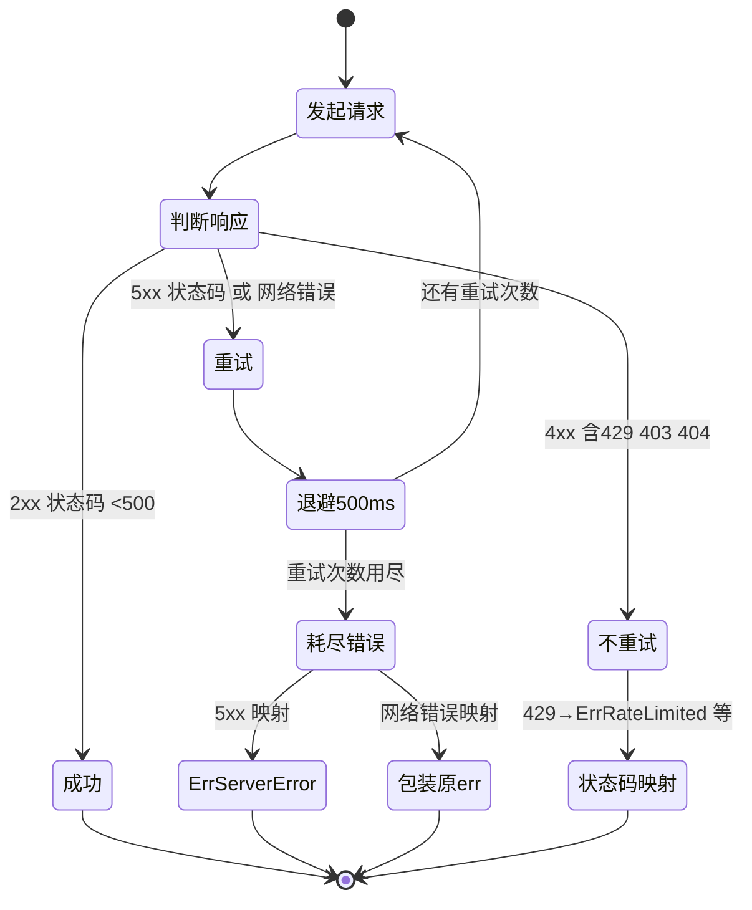

# 🎓 观察自动重试

> 网络抖动、5xx 抖动是真实世界里的常态。本库内置了重试，但你看得见它吗？本篇用一个 mock 服务端持续返回 `500`，让你亲眼数清 SDK 到底重试了几次、等了多久、最后吐什么错误。

::: tip 🎨 一图抵千言
本教程流程：先用 mock 持续 5xx 数出重试次数 → 测量 500ms 退避 → 断言最终错误 → 关闭重试对照 → 验证先 5xx 后成功的恢复。
:::



## 🎯 你将学到

- 🔁 理解 SDK 内置重试的**触发条件**与**重试次数**
- 🧪 用 `net/http/httptest` 起一个**持续 5xx** 的 mock 服务端
- 📊 用计数器精确**数出 SDK 发起了几次请求**
- ⏱️ 用计时器验证重试之间的 **500ms 固定退避**
- 🛑 验证重试耗尽后的**最终错误语义**（`ErrServerError`）
- ✅ 构造「**先 5xx 后成功**」链路，观察重试后的恢复

## ✅ 前置条件

- 已安装 **Go 1.21+**（推荐 1.23+）
- 完成教程：[定制 HTTP 客户端](./custom-http-tutorial)（你需要会注入自定义 `http.Client` 与改写 `BaseURL`）
- 了解 [`NewClient`](../api/new-client) 与 [`WithCustomHTTPClient`](../api/with-custom-http-client) 的用法
- 阅读过 [重试与限流概念](../guide/retry-concept)，对 `Retries` / `defaultRetryDelay` 有印象

## 🧠 先弄懂：SDK 怎么重试

[`doRequest`](../reference/internal/do-request) 是所有查询方法（[`GetIPInfo`](../api/get-ip-info)、[`GetField`](../api/get-field) 等）的共同请求中枢，它内部跑着这样一段重试循环：

```go
for i := 0; i <= c.Retries; i++ {
    resp, err = c.HTTPClient.Do(req)
    if err == nil && resp.StatusCode < 500 { // 仅网络错误和 5xx 错误重试
        break
    }
    if err == nil { // 处理 5xx 错误：先关闭上一轮的 Body
        resp.Body.Close()
    }
    if i == c.Retries {
        // 重试耗尽：返回错误
        if err != nil {
            return nil, fmt.Errorf("request failed after %d retries: %w", c.Retries, err)
        }
        return nil, fmt.Errorf("server error after %d retries (status: %d)", c.Retries, resp.StatusCode)
    }
    time.Sleep(defaultRetryDelay) // ⏱️ 固定退避 500ms
}
```

记住这几条关键事实，后面的实验就是在验证它们：

::: tip 🎨 HTTP 状态码 → 重试决策
下图展示 `doRequest` 重试循环如何按状态码分流：5xx 重试、4xx 不重试、2xx 直接成功。
:::



| 规则 | 值 |
| --- | --- |
| 🎯 触发条件 | 网络错误（`Do` 返回 `err`）**或** HTTP `5xx` |
| 🚫 不重试 | `4xx`（客户端错误不可恢复，如 403/404/429） |
| 🔢 重试次数 | `Retries + 1` 次尝试（默认 `Retries=2`，共 **3** 次） |
| ⏱️ 退避策略 | 固定 `500ms`（非指数退避） |
| 💬 耗尽语义 | 5xx → `ErrServerError`；网络错误 → 包装原 `err` |

> 💡 **为什么用 mock？** 真实的 `ipapi.co` 不会稳定地返回 5xx，你无法控制它何时抖动。而 `httptest.NewServer` 让你**完全掌控**响应状态码，从而把 SDK 的重试行为变成可观测、可断言的事实。这正是 SDK 自身测试的做法，见 [源码 `api_test.go`](https://github.com/cyberspacesec/ipapi.co-skills/blob/main/pkg/ipapi/api_test.go) 中的 `TestClient_GetIPInfo_RetryLogic`。

## 🪜 步骤 1：创建项目并引入 SDK

```bash
mkdir retry-demo && cd retry-demo
go mod init retry-demo
go get github.com/cyberspacesec/ipapi.co-skills/pkg/ipapi
```

新建 `main.go`，先跑一个正常查询，确认环境就绪：

```go
package main

import (
	"context"
	"fmt"
	"log"

	"github.com/cyberspacesec/ipapi.co-skills/pkg/ipapi"
)

func main() {
	client := ipapi.NewClient()

	ctx := context.Background()
	info, err := client.GetIPInfo(ctx, "8.8.8.8", "json")
	if err != nil {
		log.Fatalf("查询失败: %v", err)
	}
	fmt.Printf("环境就绪：IP %s 来自 %s\n", info.IP, info.CountryName)
}
```

```bash
go run main.go
```

看到正常输出后，我们就可以开始 mock 5xx 了。

## 🔥 步骤 2：mock 一个持续 5xx 的服务端

用 `httptest.NewServer` 起一个**每次请求都返回 `500`** 的服务端，然后把 SDK 的 `BaseURL` 指过去。注意三件事：① 用 `WithCustomHTTPClient(ts.Client())` 注入 mock 服务端的客户端；② 把 `BaseURL` 设为 `ts.URL + "/"`（URL 末尾要带斜杠，见 [URL 构造逻辑](../reference/internal/new-get-request)）；③ 显式设 `Retries = 2` 与默认值对齐，方便数数。

```go
package main

import (
	"context"
	"fmt"
	"log"
	"net/http"
	"net/http/httptest"

	"github.com/cyberspacesec/ipapi.co-skills/pkg/ipapi"
)

func main() {
	// 🧪 每次 HTTP 请求都返回 500，并且把请求次数数出来
	callCount := 0
	failServer := httptest.NewServer(http.HandlerFunc(func(w http.ResponseWriter, r *http.Request) {
		callCount++
		fmt.Printf("  [mock] 收到第 %d 次请求 -> 返回 500\n", callCount)
		w.WriteHeader(http.StatusInternalServerError) // 500
	}))
	defer failServer.Close()

	// 把 SDK 指向 mock 服务端
	client := ipapi.NewClient(
		ipapi.WithCustomHTTPClient(failServer.Client()),
	)
	client.BaseURL = failServer.URL + "/"
	client.Retries = 2 // 默认值；首次 + 2 次重试 = 3 次尝试

	ctx := context.Background()
	_, err := client.GetIPInfo(ctx, "8.8.8.8", "json")

	fmt.Printf("\n总请求数（应 = 3）: %d\n", callCount)
	if err != nil {
		log.Printf("最终错误: %v", err)
	}
}
```

> 📌 **关键点**：`callCount` 是在 handler 里自增的，它记录的是「mock 服务端实际收到几次请求」，也就是 SDK 真正发了几次。这是观测重试次数最直接的方式——**数服务端，而不是数客户端**。

## ⏱️ 步骤 3：测量重试之间的 500ms 退避

光数次数还不够，我们还要验证每次重试之间确实**睡了 500ms**。在步骤 2 的基础上加一个 `time.Now()` 计时器，并把每次请求的时间戳也打出来：

```go
package main

import (
	"context"
	"fmt"
	"log"
	"net/http"
	"net/http/httptest"
	"time"

	"github.com/cyberspacesec/ipapi.co-skills/pkg/ipapi"
)

func main() {
	start := time.Now()
	callCount := 0
	failServer := httptest.NewServer(http.HandlerFunc(func(w http.ResponseWriter, r *http.Request) {
		callCount++
		fmt.Printf("  [mock] 第 %d 次请求 @ +%-6v -> 500\n", callCount,
			time.Since(start).Round(time.Millisecond))
		w.WriteHeader(http.StatusInternalServerError)
	}))
	defer failServer.Close()

	client := ipapi.NewClient(
		ipapi.WithCustomHTTPClient(failServer.Client()),
	)
	client.BaseURL = failServer.URL + "/"
	client.Retries = 2

	ctx := context.Background()
	_, err := client.GetIPInfo(ctx, "8.8.8.8", "json")

	elapsed := time.Since(start).Round(time.Millisecond)
	fmt.Printf("\n总请求: %d 次 | 总耗时: %v | 预期睡眠: 2 × 500ms = 1s\n", callCount, elapsed)
	if err != nil {
		log.Printf("最终错误: %v", err)
	}
}
```

> 🧠 **预期解读**：3 次请求，相邻两次之间间隔约 `500ms`，总耗时约 `1s`。`defaultRetryDelay` 是固定 500ms，详见 [默认重试间隔](../reference/internal/default-retry-delay)。注意最后一次请求失败后**不再睡眠**，直接返回错误，所以是 2 段睡眠而非 3 段。

## 🛑 步骤 4：断言最终错误是 ErrServerError

重试耗尽后，5xx 会被映射成 [`ErrServerError`](../reference/errors/err-server-error)。用 `errors.Is` 验证这一点，这是后续业务分支判断的基础（见 [`IsRetryableError`](../api/is-retryable)）：

```go
package main

import (
	"context"
	"errors"
	"fmt"
	"net/http"
	"net/http/httptest"

	"github.com/cyberspacesec/ipapi.co-skills/pkg/ipapi"
)

func main() {
	failServer := httptest.NewServer(http.HandlerFunc(func(w http.ResponseWriter, r *http.Request) {
		w.WriteHeader(http.StatusInternalServerError) // 500
	}))
	defer failServer.Close()

	client := ipapi.NewClient(
		ipapi.WithCustomHTTPClient(failServer.Client()),
	)
	client.BaseURL = failServer.URL + "/"
	client.Retries = 2

	ctx := context.Background()
	_, err := client.GetIPInfo(ctx, "8.8.8.8", "json")
	if err == nil {
		fmt.Println("意外：本应失败")
		return
	}

	// ✅ 5xx 重试耗尽 -> ErrServerError
	if errors.Is(err, ipapi.ErrServerError) {
		fmt.Println("命中 ErrServerError（符合预期）")
	}
	// ✅ ErrServerError 属于可重试错误
	if ipapi.IsRetryableError(err) {
		fmt.Println("IsRetryableError = true（业务层可叠加退避）")
	}
	fmt.Printf("完整错误: %v\n", err)
}
```

> ⚠️ **注意区分**：5xx 走的是 `doRequest` 重试循环，耗尽后返回 `ErrServerError`；而 4xx（如 403/404/429）**不会重试**，会直接进入状态码映射，分别返回 [`ErrInvalidKey`](../reference/errors/err-invalid-key) / [`ErrNotFound`](../reference/errors/err-not-found) / [`ErrRateLimited`](../reference/errors/err-rate-limited)。如果想观察「不重试」的对照实验，把 handler 里的 `StatusInternalServerError` 换成 `StatusTooManyRequests`（429），`callCount` 就只会是 1。

::: details 🧪 重试与不重试对照实验清单
| mock 返回状态码 | 是否重试 | callCount 期望 | 最终错误 |
| --- | --- | --- | --- |
| 500 Internal Server Error | ✅ 重试 | 3（默认 Retries=2） | `ErrServerError` |
| 502 Bad Gateway | ✅ 重试 | 3 | `ErrServerError` |
| 503 Service Unavailable | ✅ 重试 | 3 | `ErrServerError` |
| 403 Forbidden | ❌ 不重试 | 1 | `ErrInvalidKey` |
| 404 Not Found | ❌ 不重试 | 1 | `ErrNotFound` |
| 429 Too Many Requests | ❌ 不重试 | 1 | `ErrRateLimited` |
| 网络错误（Do 返回 err） | ✅ 重试 | 3 | 包装原 err |

::: tip 💡 改 mock 即覆盖所有分支
把步骤 2 的 handler 里 `w.WriteHeader(...)` 换成上表任意状态码，就能逐一验证 SDK 的重试与状态码映射行为，无需真实网络。
:::
:::

## 🔢 步骤 5：把 Retries 改成 0，验证关闭重试

把 `Retries` 设为 `0`，SDK 应当**只发 1 次请求**、立即失败、不睡眠。这是验证「重试次数由 `Retries` 字段控制」最干净的对照实验：

```go
package main

import (
	"context"
	"fmt"
	"net/http"
	"net/http/httptest"
	"time"

	"github.com/cyberspacesec/ipapi.co-skills/pkg/ipapi"
)

func main() {
	callCount := 0
	failServer := httptest.NewServer(http.HandlerFunc(func(w http.ResponseWriter, r *http.Request) {
		callCount++
		w.WriteHeader(http.StatusInternalServerError)
	}))
	defer failServer.Close()

	client := ipapi.NewClient(
		ipapi.WithCustomHTTPClient(failServer.Client()),
	)
	client.BaseURL = failServer.URL + "/"
	client.Retries = 0 // 关闭重试：只发 1 次

	start := time.Now()
	ctx := context.Background()
	_, err := client.GetIPInfo(ctx, "8.8.8.8", "json")
	elapsed := time.Since(start).Round(time.Millisecond)

	fmt.Printf("Retries=0 -> 请求 %d 次，耗时 %v（应 ≈ 0，无睡眠）\n", callCount, elapsed)
	if err != nil {
		fmt.Printf("错误: %v\n", err)
	}
}
```

## ✅ 步骤 6：mock「先 5xx 后成功」，观察重试后恢复

真实场景里 5xx 往往是瞬时的——重试一次就好了。构造一个**第一次返回 502、第二次返回正常 JSON** 的服务端，验证 SDK 在退避一次后能成功拿到数据：

```go
package main

import (
	"context"
	"fmt"
	"net/http"
	"net/http/httptest"
	"time"

	"github.com/cyberspacesec/ipapi.co-skills/pkg/ipapi"
)

func main() {
	callCount := 0
	recoverServer := httptest.NewServer(http.HandlerFunc(func(w http.ResponseWriter, r *http.Request) {
		callCount++
		if callCount == 1 {
			fmt.Printf("  [mock] 第 1 次 -> 502（模拟瞬时故障）\n")
			w.WriteHeader(http.StatusBadGateway) // 502
			return
		}
		fmt.Printf("  [mock] 第 %d 次 -> 200 正常 JSON\n", callCount)
		w.Header().Set("Content-Type", "application/json")
		fmt.Fprint(w, `{"ip":"8.8.8.8","city":"Mountain View","country_name":"United States"}`)
	}))
	defer recoverServer.Close()

	client := ipapi.NewClient(
		ipapi.WithCustomHTTPClient(recoverServer.Client()),
	)
	client.BaseURL = recoverServer.URL + "/"
	client.Retries = 2

	start := time.Now()
	ctx := context.Background()
	info, err := client.GetIPInfo(ctx, "8.8.8.8", "json")
	elapsed := time.Since(start).Round(time.Millisecond)

	if err != nil {
		fmt.Printf("意外失败: %v\n", err)
		return
	}
	fmt.Printf("\n重试后成功！请求 %d 次，耗时 %v（期间睡眠 1 × 500ms）\n", callCount, elapsed)
	fmt.Printf("结果: ip=%s, city=%s, country=%s\n", info.IP, info.City, info.CountryName)
}
```

> 🎉 **这就是重试存在的意义**：第一次 502，业务层什么都没做，SDK 自动退避 500ms 重试，第二次就拿到了正确数据。对调用方完全透明。

## 📝 完整代码

下面是整合了「持续 5xx 计数 + 计时 + 错误断言 + 先 5xx 后成功」两套场景的完整可运行示例，存为 `main.go` 即可：

```go
package main

import (
	"context"
	"errors"
	"fmt"
	"net/http"
	"net/http/httptest"
	"time"

	"github.com/cyberspacesec/ipapi.co-skills/pkg/ipapi"
)

func main() {
	ctx := context.Background()

	// ───────── 场景一：持续 5xx，验证重试次数、退避时长、最终错误 ─────────
	fmt.Println("===== 场景一：持续 500，重试耗尽 =====")
	runAlwaysFail(ctx)

	fmt.Println()

	// ───────── 场景二：先 5xx 后成功，验证重试后恢复 ─────────
	fmt.Println("===== 场景二：先 502 后成功，重试恢复 =====")
	runRecover(ctx)
}

// runAlwaysFail 起一个永远返回 500 的服务端，验证 SDK 重试行为。
func runAlwaysFail(ctx context.Context) {
	start := time.Now()
	callCount := 0
	failServer := httptest.NewServer(http.HandlerFunc(func(w http.ResponseWriter, r *http.Request) {
		callCount++
		fmt.Printf("  [mock] 第 %d 次请求 @ +%-6v -> 500\n",
			callCount, time.Since(start).Round(time.Millisecond))
		w.WriteHeader(http.StatusInternalServerError)
	}))
	defer failServer.Close()

	client := ipapi.NewClient(ipapi.WithCustomHTTPClient(failServer.Client()))
	client.BaseURL = failServer.URL + "/"
	client.Retries = 2 // 首次 + 2 次重试 = 3 次尝试

	_, err := client.GetIPInfo(ctx, "8.8.8.8", "json")
	elapsed := time.Since(start).Round(time.Millisecond)

	fmt.Printf("总请求: %d 次（预期 3）| 总耗时: %v（预期 ≈ 1s，2×500ms）\n", callCount, elapsed)
	if err != nil {
		fmt.Printf("errors.Is(ErrServerError) = %v\n", errors.Is(err, ipapi.ErrServerError))
		fmt.Printf("IsRetryableError(err)    = %v\n", ipapi.IsRetryableError(err))
		fmt.Printf("完整错误: %v\n", err)
	}
}

// runRecover 起一个首次 502、第二次成功的服务端，验证重试后恢复。
func runRecover(ctx context.Context) {
	callCount := 0
	recoverServer := httptest.NewServer(http.HandlerFunc(func(w http.ResponseWriter, r *http.Request) {
		callCount++
		if callCount == 1 {
			fmt.Printf("  [mock] 第 1 次 -> 502\n")
			w.WriteHeader(http.StatusBadGateway)
			return
		}
		fmt.Printf("  [mock] 第 %d 次 -> 200\n", callCount)
		w.Header().Set("Content-Type", "application/json")
		fmt.Fprint(w, `{"ip":"8.8.8.8","city":"Mountain View","country_name":"United States"}`)
	}))
	defer recoverServer.Close()

	client := ipapi.NewClient(ipapi.WithCustomHTTPClient(recoverServer.Client()))
	client.BaseURL = recoverServer.URL + "/"
	client.Retries = 2

	start := time.Now()
	info, err := client.GetIPInfo(ctx, "8.8.8.8", "json")
	elapsed := time.Since(start).Round(time.Millisecond)

	if err != nil {
		fmt.Printf("意外失败: %v\n", err)
		return
	}
	fmt.Printf("重试后成功！请求 %d 次，耗时 %v\n", callCount, elapsed)
	fmt.Printf("结果: ip=%s, city=%s, country=%s\n", info.IP, info.City, info.CountryName)
}
```

## 🖥 运行结果

```bash
go run main.go
```

预期输出（耗时数值会因机器略有浮动，但相邻请求间隔应稳定在约 500ms）：

```text
===== 场景一：持续 500，重试耗尽 =====
  [mock] 第 1 次请求 @ +0ms    -> 500
  [mock] 第 2 次请求 @ +500ms  -> 500
  [mock] 第 3 次请求 @ +1s     -> 500
总请求: 3 次（预期 3）| 总耗时: 1.001s（预期 ≈ 1s，2×500ms）
errors.Is(ErrServerError) = true
IsRetryableError(err)    = true
完整错误: server error after 2 retries (status: 500)

===== 场景二：先 502 后成功，重试恢复 =====
  [mock] 第 1 次 -> 502
  [mock] 第 2 次 -> 200
重试后成功！请求 2 次，耗时 502ms
结果: ip=8.8.8.8, city=Mountain View, country=United States
```

> 🐛 **排错**：如果你的「场景一」总请求数不是 3，先检查有没有显式覆盖 `client.Retries`——`NewClient` 默认就是 2，但被别处赋值过会改变结果。如果「场景二」总耗时远大于 500ms，多半是 `BaseURL` 没带末尾斜杠，导致 URL 拼接出现多余段、走了重定向路径。

## ✅ 小结

- 🔁 SDK 内置重试**只对网络错误和 `5xx`** 生效，**不重试 `4xx`**
- 🔢 默认 `Retries=2`，即最多 **3 次**尝试；设为 `0` 即关闭重试
- ⏱️ 重试之间**固定退避 `500ms`**（`defaultRetryDelay`），最后一次失败后不再睡眠
- 🛑 5xx 重试耗尽 → 返回 [`ErrServerError`](../reference/errors/err-server-error)，可被 `errors.Is` 识别
- 🧪 观测重试最可靠的办法是**在 mock 服务端里数 `callCount`**，而不是在客户端打日志
- ✅ 「先 5xx 后成功」是重试机制的核心价值——对调用方完全透明地吸收瞬时故障

## 🚀 下一步

- 📖 深入阅读 [重试与限流概念](../guide/retry-concept) 与 [`doRequest` 内部调度](../reference/internal/do-request)
- ⏱️ 结合 [默认重试间隔](../reference/internal/default-retry-delay) 与 [Context 超时控制](../guide/context)，理解退避与超时如何协同
- 🔁 学习 [`IsRetryableError` API](../api/is-retryable)，在业务层叠加**指数退避**
- 🚨 浏览 [错误类型参考](../reference/errors/err-server-error) 与 [`ErrRateLimited`](../reference/errors/err-rate-limited)，掌握各状态码的错误语义
- 📘 在 [Cookbook](../cookbook/) 找实战配方，如 [缓存查询](../cookbook/cached-lookup)、[异步查询](../cookbook/async-lookup)
- ➡️ 继续下一篇教程：[用 httptest 测试](./test-mock-tutorial)
