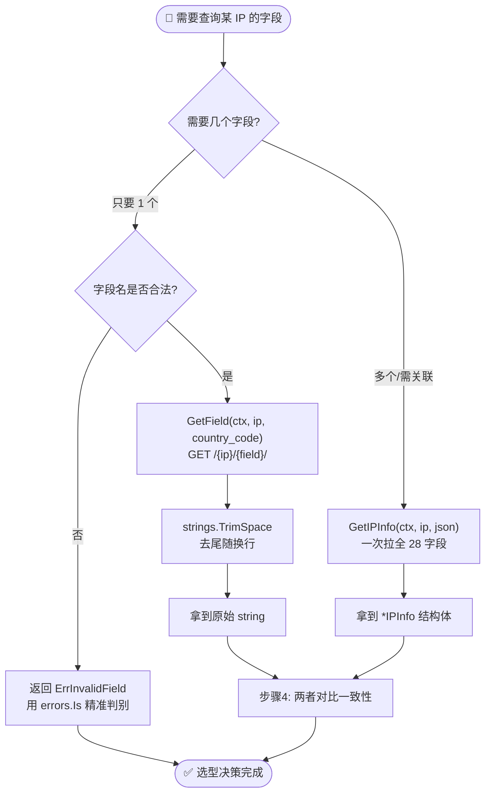
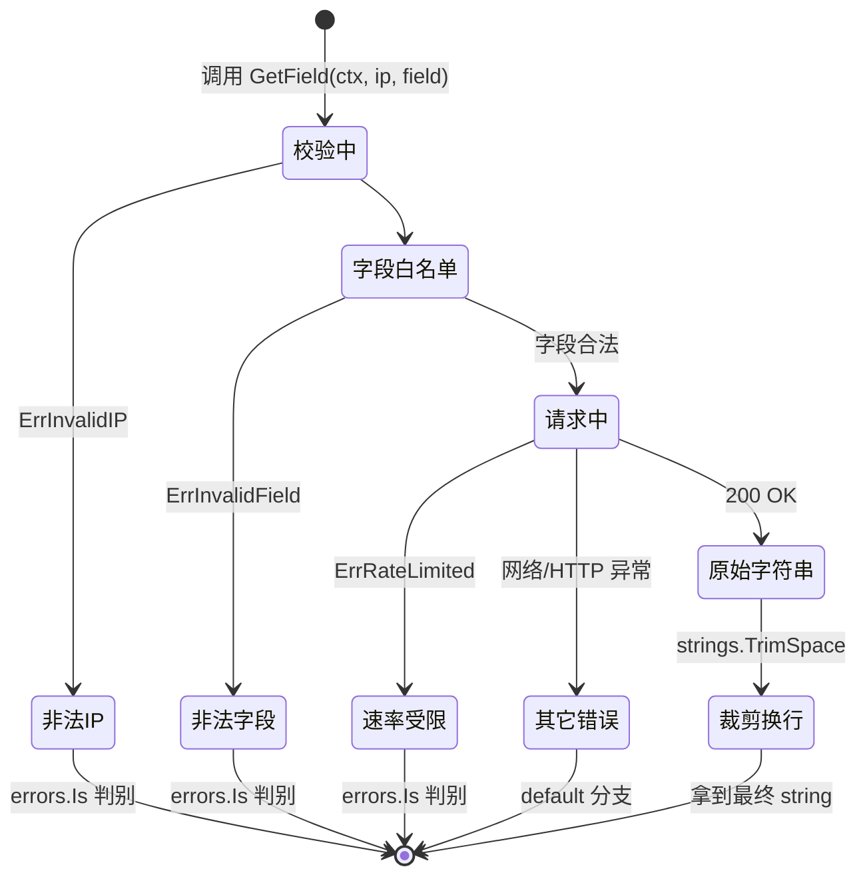

# 🎓 查询单个字段：用 GetField 只取 country_code

> 当你只需要一个字段（比如国家代码）时，不必拉取完整的 JSON 响应。本教程带你用 `GetField` 精准取值，并与完整查询做对比。

## 🎯 你将学到

- 📥 用 `GetField` 查询指定 IP 的单个字段
- 🌍 只取 `country_code` 这一字段
- ⚖️ 对比 `GetField` 与 `GetIPInfo` 完整查询的差异
- 🧹 处理字段返回值中的尾随换行符
- 🛡️ 用 `errors.Is` 判断字段无效等错误

## 📋 前置条件

- ✅ 已安装 **Go 1.21+**（本教程基于 Go 1.23）
- ✅ 已完成 [快速入门](../guide/getting-started) 或 [安装指南](../guide/installation)，能跑通第一个查询
- ✅ 了解 `Client` 与 `context` 的基本用法（参见 [客户端概念](../guide/client-concept) 与 [Context](../guide/context)）
- 💡 可选：拥有一个 ipapi.co API Key，用于提升速率限制额度（免费层亦可运行本教程示例）

::: tip 🎨 一图抵千言 — 单字段查询的决策与对比流程
本教程围绕「只要一个字段时该用 `GetField` 还是 `GetIPInfo`」展开，下图给出完整决策路径：
:::



## 🚀 步骤 1：初始化项目与客户端

先建一个可运行的项目，并引入 SDK。

```bash
mkdir single-field-demo && cd single-field-demo
go mod init single-field-demo
go get github.com/cyberspacesec/ipapi.co-skills/pkg/ipapi
```

接着写一个最小程序，创建客户端并打印一行确认信息：

```go
package main

import (
	"context"
	"fmt"
	"log"
	"time"

	"github.com/cyberspacesec/ipapi.co-skills/pkg/ipapi"
)

func main() {
	// 创建客户端；如有 API Key 可传入 ipapi.WithAPIKey("xxx")
	client := ipapi.NewClient()

	ctx, cancel := context.WithTimeout(context.Background(), 5*time.Second)
	defer cancel()

	_ = ctx
	fmt.Println("✅ 客户端就绪，客户端指针：", client != nil)
	if client == nil {
		log.Fatal("客户端初始化失败")
	}
}
```

运行：

```bash
go run main.go
```

预期输出：

```
✅ 客户端就绪，客户端指针： true
```

## 🌍 步骤 2：用 GetField 只取 country_code

`GetField(ctx, ip, field)` 对应 `GET https://ipapi.co/{ip}/{field}/`，只返回单个字段的原始字符串，不解析为结构体，**省带宽、省内存**。

下面查询 `8.8.8.8` 的 `country_code`：

```go
package main

import (
	"context"
	"fmt"
	"log"
	"strings"
	"time"

	"github.com/cyberspacesec/ipapi.co-skills/pkg/ipapi"
)

func main() {
	client := ipapi.NewClient()

	ctx, cancel := context.WithTimeout(context.Background(), 5*time.Second)
	defer cancel()

	// 只取 country_code 这一个字段
	code, err := client.GetField(ctx, "8.8.8.8", "country_code")
	if err != nil {
		log.Fatalf("查询 country_code 失败: %v", err)
	}

	// API 返回的原始字符串通常带一个尾随换行符，按需裁剪
	code = strings.TrimSpace(code)

	fmt.Printf("8.8.8.8 的国家代码: %s\n", code)
}
```

运行：

```bash
go run main.go
```

预期输出：

```
8.8.8.8 的国家代码: US
```

::: tip 为什么返回的是 string？
`GetField` 返回的是 API 原始响应体（`string`），而非结构体字段。这样既能取字符串型字段（如 `country_code`），也能取数值型字段（如 `latitude`），调用方按需自行类型转换。
:::

## ⚖️ 步骤 3：对比完整查询 GetIPInfo

作为对照，用 `GetIPInfo(ctx, ip, "json")` 拉取完整 JSON 并解析为 `IPInfo` 结构体，再从中读取 `CountryCode`：

```go
package main

import (
	"context"
	"fmt"
	"log"
	"time"

	"github.com/cyberspacesec/ipapi.co-skills/pkg/ipapi"
)

func main() {
	client := ipapi.NewClient()

	ctx, cancel := context.WithTimeout(context.Background(), 5*time.Second)
	defer cancel()

	// 完整查询：一次性返回所有字段
	info, err := client.GetIPInfo(ctx, "8.8.8.8", "json")
	if err != nil {
		log.Fatalf("完整查询失败: %v", err)
	}

	fmt.Printf("8.8.8.8 的国家代码: %s\n", info.CountryCode)
	fmt.Printf("顺便看到的其它信息 -> 城市: %s, ASN: %s\n", info.City, info.ASN)
}
```

运行：

```bash
go run main.go
```

预期输出：

```
8.8.8.8 的国家代码: US
顺便看到的其它信息 -> 城市: Mountain View, ASN: AS15169
```

## 📊 步骤 4：两种方式放在一起对比

把两种查询写进同一个程序，直观对比响应体大小与结果一致性：

```go
package main

import (
	"context"
	"fmt"
	"log"
	"strings"
	"time"

	"github.com/cyberspacesec/ipapi.co-skills/pkg/ipapi"
)

func main() {
	client := ipapi.NewClient()

	ctx, cancel := context.WithTimeout(context.Background(), 5*time.Second)
	defer cancel()

	// 方式 A：只取单字段
	single, err := client.GetField(ctx, "8.8.8.8", "country_code")
	if err != nil {
		log.Fatalf("GetField 失败: %v", err)
	}
	single = strings.TrimSpace(single)

	// 方式 B：完整查询后取字段
	full, err := client.GetIPInfo(ctx, "8.8.8.8", "json")
	if err != nil {
		log.Fatalf("GetIPInfo 失败: %v", err)
	}

	fmt.Println("=== 对比结果 ===")
	fmt.Printf("GetField  -> country_code = %q\n", single)
	fmt.Printf("GetIPInfo -> country_code = %q\n", full.CountryCode)
	fmt.Println("两者是否一致：", single == full.CountryCode)
}
```

运行：

```bash
go run main.go
```

预期输出：

```
=== 对比结果 ===
GetField  -> country_code = "US"
GetIPInfo -> country_code = "US"
两者是否一致： true
```

::: tip 选型建议
- 只需要 **1 个字段** 且不在乎其它信息 → 用 `GetField`，响应体仅几个字节，最快最省。
- 需要 **多个字段** 或要做关联分析（如“城市 + ASN”一起判）→ 用 `GetIPInfo` 一次拉全，比多次调 `GetField` 更划算。
- 想要 **非 JSON 格式**（csv/yaml/xml）的原始字节 → 用 `GetIPInfoRaw`。
:::

::: details ⚖️ GetField vs GetIPInfo 全维度对比
| 维度 | `GetField` | `GetIPInfo` |
|------|-----------|-------------|
| 端点 | `GET /{ip}/{field}/` | `GET /{ip}/json/` |
| 返回类型 | 原始 `string` | `*IPInfo` 结构体 |
| 响应体大小 | 几字节~几十字节 | 数百字节~1KB |
| 是否解析 | ❌ 不解析，原样返回 | ✅ JSON 反序列化 |
| 字段数 | 1 个 | 28 个 |
| 尾随换行 | 有，需 `TrimSpace` | 无，结构体已解析 |
| 错误校验 | `ErrInvalidField` 白名单 | `ErrInvalidIP` 格式校验 |
| 典型场景 | 只取 country_code / ip | 关联分析多字段 |

带宽敏感场景优先 `GetField`；需要上下文关联优先 `GetIPInfo`。
:::

## 🛡️ 步骤 5：处理无效字段与错误

`GetField` 会对字段名做白名单校验（见源码 [`api.go`](https://github.com/cyberspacesec/ipapi.co-skills/blob/main/pkg/ipapi/api.go) 中的 `validFields`）。传入非法字段会返回 `ErrInvalidField`。用 `errors.Is` 精准判别：

::: tip 🎨 一图抵千言 — GetField 调用的状态机视角
把上图中的「决策分支」换成「状态流转」，能更直观地看到一次 `GetField` 调用从入参校验到拿到结果（或落到某类错误）经历哪些状态：
:::



```go
package main

import (
	"context"
	"errors"
	"fmt"
	"log"
	"time"

	"github.com/cyberspacesec/ipapi.co-skills/pkg/ipapi"
)

func main() {
	client := ipapi.NewClient()

	ctx, cancel := context.WithTimeout(context.Background(), 5*time.Second)
	defer cancel()

	// 故意传一个不存在的字段
	_, err := client.GetField(ctx, "8.8.8.8", "not_a_field")
	if err != nil {
		switch {
		case errors.Is(err, ipapi.ErrInvalidField):
			fmt.Println("⛔ 字段名非法，请查阅可用字段列表")
		case errors.Is(err, ipapi.ErrRateLimited):
			log.Fatalf("触发速率限制: %v", err)
		case errors.Is(err, ipapi.ErrInvalidIP):
			log.Fatalf("IP 地址非法: %v", err)
		default:
			log.Fatalf("其它错误: %v", err)
		}
		return
	}

	fmt.Println("不会执行到这里")
}
```

运行：

```bash
go run main.go
```

预期输出：

```
⛔ 字段名非法，请查阅可用字段列表
```

::: warning 合法字段清单
`country_code` 只是众多可用字段之一。完整列表见 [`validFields`](https://github.com/cyberspacesec/ipapi.co-skills/blob/main/pkg/ipapi/api.go)，文档化版本见 [字段参考 - country_code](../reference/fields/country_code) 与 [字段总览](../reference/fields/ip)。
:::

::: details 📋 常用合法字段速查（部分）
| 字段名 | 含义 | 返回示例 |
|--------|------|----------|
| `ip` | IP 地址 | `8.8.8.8` |
| `city` | 城市 | `Mountain View` |
| `region` | 州/省 | `California` |
| `country` | 国家代码 | `US` |
| `country_name` | 国家全名 | `United States` |
| `country_code` | ISO alpha-2 | `US` |
| `asn` | 自治域号 | `AS15169` |
| `org` | 归属组织 | `Google LLC` |
| `timezone` | IANA 时区 | `America/Los_Angeles` |
| `latitude` | 纬度 | `37.4056` |
| `longitude` | 经度 | `-122.0775` |
| `currency` | 货币代码 | `USD` |

注意：`continent` 不在白名单（合法的是 `continent_code`），传错会触发 `ErrInvalidField`。
:::

## 📦 完整代码

下面是整合后的可运行示例，包含 `GetField`、`GetIPInfo` 对比与错误处理：

```go
package main

import (
	"context"
	"errors"
	"fmt"
	"log"
	"strings"
	"time"

	"github.com/cyberspacesec/ipapi.co-skills/pkg/ipapi"
)

func main() {
	client := ipapi.NewClient()

	ctx, cancel := context.WithTimeout(context.Background(), 5*time.Second)
	defer cancel()

	const ip = "8.8.8.8"

	// 1) GetField：只取 country_code
	single, err := client.GetField(ctx, ip, "country_code")
	if err != nil {
		if errors.Is(err, ipapi.ErrInvalidField) {
			log.Fatalf("字段名非法: %v", err)
		}
		log.Fatalf("GetField 失败: %v", err)
	}
	single = strings.TrimSpace(single)

	// 2) GetIPInfo：完整查询后取同名字段
	full, err := client.GetIPInfo(ctx, ip, "json")
	if err != nil {
		log.Fatalf("GetIPInfo 失败: %v", err)
	}

	// 3) 对比输出
	fmt.Println("=== 单字段 vs 完整查询 ===")
	fmt.Printf("GetField  -> country_code = %q\n", single)
	fmt.Printf("GetIPInfo -> country_code = %q\n", full.CountryCode)
	fmt.Printf("结果一致: %v\n", single == full.CountryCode)
	fmt.Printf("完整查询额外信息: 城市=%s, ASN=%s, 时区=%s\n",
		full.City, full.ASN, full.Timezone)

	// 4) 演示非法字段错误处理
	if _, err := client.GetField(ctx, ip, "not_a_field"); err != nil {
		fmt.Printf("非法字段错误演示: errors.Is(ErrInvalidField) = %v\n",
			errors.Is(err, ipapi.ErrInvalidField))
	}
}
```

## 🖥️ 运行结果

```bash
go run main.go
```

```
=== 单字段 vs 完整查询 ===
GetField  -> country_code = "US"
GetIPInfo -> country_code = "US"
结果一致: true
完整查询额外信息: 城市=Mountain View, ASN=AS15169, 时区=America/Los_Angeles
非法字段错误演示: errors.Is(ErrInvalidField) = true
```

## 🧠 小结

- 🎯 `GetField(ctx, ip, field)` 对应 `GET /{ip}/{field}/`，**只返回单个字段的原始字符串**，最适合“只要一个值”的场景。
- 🌍 取 `country_code` 时记得 `strings.TrimSpace` 去掉尾随换行。
- ⚖️ 对比 `GetIPInfo`：单字段更省带宽、更快；完整查询一次拿全、便于关联分析。
- 🛡️ 非法字段返回 `ErrInvalidField`，用 `errors.Is` 精准判别，配合 [错误处理策略](../best-practices/error-handling-strategy) 更稳健。
- 📚 `GetField` 的 API 细节见 [GetField 方法参考](../api/get-field)；查本机 IP 的单字段用 [`GetClientField`](../api/get-client-field)。

## ➡️ 下一步

- 📖 深入阅读：[字段概念](../guide/field-concept) · [GetField API](../api/get-field) · [country_code 字段参考](../reference/fields/country_code)
- 🍳 实战配方：[按国家做速率限制](../cookbook/rate-limit-by-country) · [货币展示](../cookbook/currency-display) · [时区问候语](../cookbook/timezone-greeting)
- 🧭 更多参考：[客户端选项](../api/options) · [错误总览](../reference/errors/err-invalid-field) · [最佳实践](../best-practices/index)
- 📚 继续学习：下一篇教程 [批量查询多个 IP](./batch-tutorial)（待发布）——一次性查询多个 IP 并聚合结果
