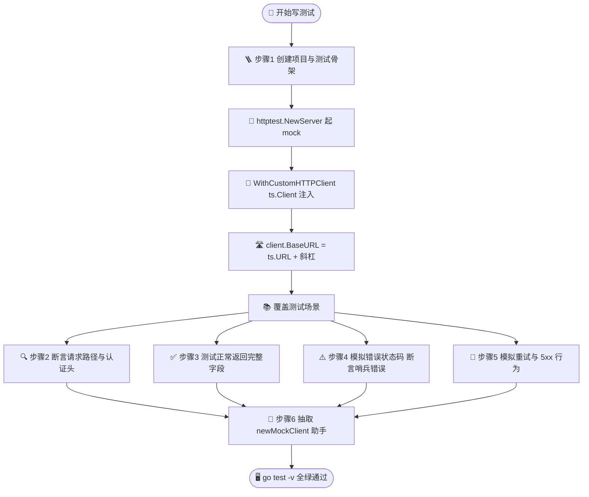
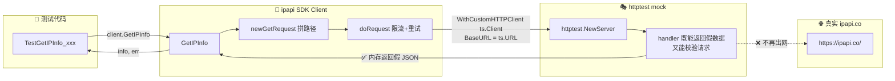

# 🎓 用 httptest 测试 SDK

> 调用真实 `ipapi.co` 跑测试既慢又不稳定——受网络波动、限流、配额影响，结果还不可复现。本篇教你用 Go 标准库 `net/http/httptest` 起一个本地 mock 服务器，把 `Client` 的真实出网请求换成对内存里假服务的调用，写出快、稳、免费的单测。

## 🎯 你将学到

- 🤔 理解为什么要 mock `ipapi.co`，以及它带来的收益
- 🧪 用 `httptest.NewServer` 搭建一个返回假 JSON 的 mock 服务器
- 🔌 通过 `WithCustomHTTPClient(ts.Client())` 把 mock 注入 [`Client`](../api/client)
- 🛣 覆盖 `client.BaseURL` 让请求指向 mock 地址而非 `https://ipapi.co/`
- ✅ 验证 `GetIPInfo` / `GetField` 的正常路径返回值
- ⚠️ 模拟 4xx/5xx 错误状态码，断言 SDK 把它们映射成正确的哨兵错误
- 🧹 用 `defer ts.Close()` 与表驱动测试保持用例整洁可复用

::: tip 🎨 一图抵千言
下面这张流程图展示了本教程的完整路径：从搭 mock 服务器，到注入 Client，再到覆盖各类测试场景。
:::



| 步骤 | 测试目标 | mock 关键技术 | 断言重点 |
|------|----------|---------------|----------|
| 1 | 骨架跑通 | `httptest.NewServer` + 固定 JSON | `info.IP` / `info.City` |
| 2 | 请求构造正确 | handler 读 `r.URL.Path` / `r.Header` | 路径 / Bearer / User-Agent |
| 3 | 字段反序列化 | 完整 JSON + `postal:null` 用例 | 数值/布尔/`*string` 类型 |
| 4 | 状态码→哨兵错误 | `w.WriteHeader(code)` 表驱动 | `errors.Is` 哨兵匹配 |
| 5 | 重试逻辑 | 计数器 + 先 5xx 后成功 | 重试次数=3 / 自愈 |
| 6 | 消除样板 | `newMockClient` 助手 | BaseURL 尾斜杠统一 |

## ✅ 前置条件

- 已安装 **Go 1.21+**（推荐 1.23+），`go test` 可用
- 完成教程：[Hello, ipapi](./hello-ipapi)（或阅读 [安装指南](../guide/installation)）
- 了解 [`NewClient`](../api/new-client) 与 [`WithCustomHTTPClient`](../api/with-custom-http-client) 的用法
- 熟悉 [`IPInfo`](../api/models) 结构与 [`GetIPInfo`](../api/get-ip-info) 的返回值
- 对 [`errors.Is`](../api/errors) 哨兵错误匹配有基本概念

## 🧠 为什么要 mock ipapi.co

直接对真实 `ipapi.co` 写单测看起来最“真实”，但实践中会踩一堆坑：

| 痛点 | 不 mock 的后果 |
| --- | --- |
| 🐌 网络延迟 | 每个用例几百毫秒，套件跑几分钟 |
| 🚫 限流 / 配额 | 免费额度 1000 次/天，CI 跑几次就耗光 |
| 🌐 网络抖动 | 偶发 `request failed after 2 retries`，CI 红得不可复现 |
| 🔀 数据变化 | IP 归属可能调整，硬编码断言会随机失败 |
| 🎯 难测错误分支 | 没法让真实服务器稳定返回 429 / 500 / 保留 IP |

mock 服务器把“能不能联网”“服务器今天心情如何”这些不可控因素全部剔除，让测试**确定性**地验证你的代码逻辑。SDK 的设计天然支持 mock——[`BaseURL`](../api/client) 是公开字段，[`WithCustomHTTPClient`](../api/with-custom-http-client) 允许注入任意 `*http.Client`，二者配合就能把请求重定向到本地 mock。

::: tip 🎨 一图抵千言
下面是 mock 注入的原理：SDK 的真实出网请求被"劫持"到本地 httptest 服务器，全程零网络依赖。
:::



## 🪜 步骤 1：创建项目与测试文件骨架

初始化一个最小项目并引入 SDK：

```bash
mkdir ipapi-mock-test && cd ipapi-mock-test
go mod init ipapi-mock-test
go get github.com/cyberspacesec/ipapi.co-skills/pkg/ipapi
```

新建 `client_test.go`，写一个最简单的 mock 用例，先把骨架跑通：

```go
package ipapi_test

import (
	"context"
	"fmt"
	"net/http"
	"net/http/httptest"
	"testing"

	"github.com/cyberspacesec/ipapi.co-skills/pkg/ipapi"
)

func TestGetIPInfo_MockSuccess(t *testing.T) {
	// 1. 启动一个 mock 服务器，返回固定的 JSON
	ts := httptest.NewServer(http.HandlerFunc(func(w http.ResponseWriter, r *http.Request) {
		// 校验请求路径：GetIPInfo("8.8.8.8", "json") 会请求 /8.8.8.8/json/
		if r.URL.Path != "/8.8.8.8/json/" {
			t.Errorf("unexpected path: %s", r.URL.Path)
		}
		w.Header().Set("Content-Type", "application/json")
		fmt.Fprint(w, `{"ip":"8.8.8.8","city":"Mountain View","country":"US","country_name":"United States","org":"Google LLC"}`)
	}))
	defer ts.Close()

	// 2. 把 Client 指向 mock：注入 ts 的 http.Client，并覆盖 BaseURL
	client := ipapi.NewClient(ipapi.WithCustomHTTPClient(ts.Client()))
	client.BaseURL = ts.URL + "/"

	// 3. 调用，断言
	info, err := client.GetIPInfo(context.Background(), "8.8.8.8", "json")
	if err != nil {
		t.Fatalf("unexpected error: %v", err)
	}
	if info.IP != "8.8.8.8" {
		t.Errorf("expected 8.8.8.8, got %s", info.IP)
	}
	if info.City != "Mountain View" {
		t.Errorf("expected Mountain View, got %s", info.City)
	}
}
```

运行它：

```bash
go test -v -run TestGetIPInfo_MockSuccess
```

> 💡 **关键三步**：① `httptest.NewServer` 起 mock；② `WithCustomHTTPClient(ts.Client())` 让 SDK 用 mock 的客户端；③ `client.BaseURL = ts.URL + "/"` 把请求地址换成 mock。注意末尾的 `/`，因为 SDK 内部用 `path.Join` 拼路径，结尾斜杠能保证 `/8.8.8.8/json/` 这种路径拼接正确——见步骤 6 的解释。

> ⚠️ **包名用 `ipapi_test`**：外部测试包（`package ipapi_test`）只通过公开 API 访问 SDK，更贴近真实使用方式。如果你需要测试未导出字段（如直接断言 `client.Retries`），才用内部测试包 `package ipapi`。

## 🔍 步骤 2：断言请求路径与认证头

mock 不光能返回假数据，还能**校验 SDK 发出的请求是否正确**。在 handler 里读取 `r.URL.Path`、`r.Header`，就能验证 SDK 是否按预期构造了请求。

```go
package ipapi_test

import (
	"context"
	"fmt"
	"net/http"
	"net/http/httptest"
	"testing"

	"github.com/cyberspacesec/ipapi.co-skills/pkg/ipapi"
)

func TestGetIPInfo_VerifiesRequest(t *testing.T) {
	ts := httptest.NewServer(http.HandlerFunc(func(w http.ResponseWriter, r *http.Request) {
		// 校验路径：GetField("8.8.8.8", "country") -> /8.8.8.8/country/
		if r.URL.Path != "/8.8.8.8/country/" {
			t.Errorf("unexpected path: %s", r.URL.Path)
		}
		// 校验 User-Agent（SDK 默认 ipapi-go-client/1.0）
		if ua := r.Header.Get("User-Agent"); ua != "ipapi-go-client/1.0" {
			t.Errorf("unexpected User-Agent: %q", ua)
		}
		// 校验 Bearer 认证头
		if auth := r.Header.Get("Authorization"); auth != "Bearer my-secret-key" {
			t.Errorf("unexpected Authorization: %q", auth)
		}
		// 校验方法
		if r.Method != http.MethodGet {
			t.Errorf("expected GET, got %s", r.Method)
		}

		fmt.Fprint(w, "US")
	}))
	defer ts.Close()

	client := ipapi.NewClient(
		ipapi.WithCustomHTTPClient(ts.Client()),
		ipapi.WithAPIKey("my-secret-key"),
	)
	client.BaseURL = ts.URL + "/"

	got, err := client.GetField(context.Background(), "8.8.8.8", "country")
	if err != nil {
		t.Fatalf("unexpected error: %v", err)
	}
	if got != "US" {
		t.Errorf("expected US, got %s", got)
	}
}
```

> 📌 **mock 的双重职责**：handler 既扮演服务器（返回响应），又扮演探针（校验请求）。在 handler 里调用 `t.Errorf` 不会立即终止测试，但会让用例失败——错误信息会出现在测试输出里。

## ✅ 步骤 3：测试正常返回的完整字段

`GetIPInfo` 把 JSON 反序列化进 [`IPInfo`](../api/models) 结构。写一个用例覆盖尽可能多的字段，确保 JSON tag 和字段类型对得上。注意 `postal` 是 `*string`（可能为 `null`）。

```go
package ipapi_test

import (
	"context"
	"fmt"
	"net/http"
	"net/http/httptest"
	"testing"

	"github.com/cyberspacesec/ipapi.co-skills/pkg/ipapi"
)

func TestGetIPInfo_FullFields(t *testing.T) {
	ts := httptest.NewServer(http.HandlerFunc(func(w http.ResponseWriter, r *http.Request) {
		w.Header().Set("Content-Type", "application/json")
		fmt.Fprint(w, `{
			"ip": "8.8.8.8",
			"network": "8.8.8.0/24",
			"version": "IPv4",
			"city": "Mountain View",
			"region": "California",
			"region_code": "CA",
			"country": "US",
			"country_name": "United States",
			"country_code": "US",
			"country_code_iso3": "USA",
			"continent_code": "NA",
			"in_eu": false,
			"postal": "94043",
			"latitude": 37.3860,
			"longitude": -122.0838,
			"timezone": "America/Los_Angeles",
			"utc_offset": "-0700",
			"currency": "USD",
			"asn": "AS15169",
			"org": "Google LLC"
		}`)
	}))
	defer ts.Close()

	client := ipapi.NewClient(ipapi.WithCustomHTTPClient(ts.Client()))
	client.BaseURL = ts.URL + "/"

	info, err := client.GetIPInfo(context.Background(), "8.8.8.8", "json")
	if err != nil {
		t.Fatalf("unexpected error: %v", err)
	}

	// 字符串字段
	if info.Network != "8.8.8.0/24" {
		t.Errorf("network: got %s", info.Network)
	}
	if info.CountryCodeISO3 != "USA" {
		t.Errorf("country_code_iso3: got %s", info.CountryCodeISO3)
	}
	if info.Org != "Google LLC" {
		t.Errorf("org: got %s", info.Org)
	}

	// 数值字段
	if info.Latitude != 37.3860 {
		t.Errorf("latitude: got %f", info.Latitude)
	}
	if info.Longitude != -122.0838 {
		t.Errorf("longitude: got %f", info.Longitude)
	}

	// 布尔字段
	if info.InEU != false {
		t.Errorf("in_eu: got %v", info.InEU)
	}

	// 指针字段 postal（*string）
	if info.Postal == nil || *info.Postal != "94043" {
		t.Errorf("postal: got %v", info.Postal)
	}
	if info.GetPostal() != "94043" {
		t.Errorf("GetPostal(): got %q", info.GetPostal())
	}

	// SDK 自动填充的时间戳
	if info.RetrievedAt.IsZero() {
		t.Error("RetrievedAt should be set by SDK")
	}
}
```

测试 `postal` 为 `null` 的情况也很重要——这是真实 API 对部分 IP 的常见返回：

```go
package ipapi_test

import (
	"context"
	"fmt"
	"net/http"
	"net/http/httptest"
	"testing"

	"github.com/cyberspacesec/ipapi.co-skills/pkg/ipapi"
)

func TestGetIPInfo_NullPostal(t *testing.T) {
	ts := httptest.NewServer(http.HandlerFunc(func(w http.ResponseWriter, r *http.Request) {
		w.Header().Set("Content-Type", "application/json")
		fmt.Fprint(w, `{"ip":"1.1.1.1","city":"Sydney","country":"AU","postal":null}`)
	}))
	defer ts.Close()

	client := ipapi.NewClient(ipapi.WithCustomHTTPClient(ts.Client()))
	client.BaseURL = ts.URL + "/"

	info, err := client.GetIPInfo(context.Background(), "1.1.1.1", "json")
	if err != nil {
		t.Fatalf("unexpected error: %v", err)
	}

	if info.Postal != nil {
		t.Errorf("expected nil postal, got %v", info.Postal)
	}
	if info.GetPostal() != "" {
		t.Errorf("expected empty string from GetPostal(), got %q", info.GetPostal())
	}
}
```

> 💡 **`GetPostal()` 的意义**：[`IPInfo`](../api/models) 的 `Postal` 是 `*string`，直接解引用 nil 指针会 panic。`GetPostal()` 方法把 nil 安全地转成空字符串，生产代码里建议用它而非直接访问指针。

## ⚠️ 步骤 4：模拟错误状态码，断言哨兵错误

SDK 把 HTTP 4xx/5xx 映射成一组哨兵错误（[`ErrNotFound`](../api/errors)、[`ErrRateLimited`](../api/errors) 等）。mock 让你能稳定触发每种状态码，验证映射正确。

### 4.1 纯状态码（无错误 body）

当响应体不是合法的 `APIError` JSON 时，SDK 走 `mapStatusCodeToError`，按状态码返回哨兵错误：

```go
package ipapi_test

import (
	"context"
	"errors"
	"fmt"
	"net/http"
	"net/http/httptest"
	"testing"

	"github.com/cyberspacesec/ipapi.co-skills/pkg/ipapi"
)

func TestGetIPInfo_StatusCodes(t *testing.T) {
	tests := []struct {
		name       string
		statusCode int
		wantErr    error
	}{
		{"404 maps to ErrNotFound", http.StatusNotFound, ipapi.ErrNotFound},
		{"429 maps to ErrRateLimited", http.StatusTooManyRequests, ipapi.ErrRateLimited},
		{"403 maps to ErrInvalidKey", http.StatusForbidden, ipapi.ErrInvalidKey},
		{"405 maps to ErrMethodNotAllowed", http.StatusMethodNotAllowed, ipapi.ErrMethodNotAllowed},
	}

	for _, tt := range tests {
		t.Run(tt.name, func(t *testing.T) {
			ts := httptest.NewServer(http.HandlerFunc(func(w http.ResponseWriter, r *http.Request) {
				w.WriteHeader(tt.statusCode)
				fmt.Fprint(w, `not a valid api error json`)
			}))
			defer ts.Close()

			client := ipapi.NewClient(ipapi.WithCustomHTTPClient(ts.Client()))
			// 4xx 不会触发重试，但 5xx 会——这里都是 4xx，无需调整 Retries
			client.BaseURL = ts.URL + "/"

			_, err := client.GetIPInfo(context.Background(), "8.8.8.8", "json")
			if !errors.Is(err, tt.wantErr) {
				t.Errorf("status %d: expected %v, got %v", tt.statusCode, tt.wantErr, err)
			}
		})
	}
}
```

### 4.2 带 APIError JSON 的错误体

真实 ipapi.co 在 4xx 时常返回 `{"error":true,"reason":"...","message":"..."}` 结构。SDK 会解析它并进一步细化错误类型：

```go
package ipapi_test

import (
	"context"
	"encoding/json"
	"errors"
	"net/http"
	"net/http/httptest"
	"testing"

	"github.com/cyberspacesec/ipapi.co-skills/pkg/ipapi"
)

func TestGetIPInfo_APIErrorBody(t *testing.T) {
	ts := httptest.NewServer(http.HandlerFunc(func(w http.ResponseWriter, r *http.Request) {
		w.WriteHeader(http.StatusTooManyRequests)
		// 返回带 reason 的结构化错误
		json.NewEncoder(w).Encode(ipapi.APIError{
			HasError: true,
			Reason:   "RateLimited",
			Message:  "API rate limit exceeded",
		})
	}))
	defer ts.Close()

	client := ipapi.NewClient(ipapi.WithCustomHTTPClient(ts.Client()))
	client.BaseURL = ts.URL + "/"

	_, err := client.GetIPInfo(context.Background(), "8.8.8.8", "json")
	// reason=RateLimited 被 handleError 识别并包装成 ErrRateLimited
	if !errors.Is(err, ipapi.ErrRateLimited) {
		t.Errorf("expected ErrRateLimited, got %v", err)
	}
}
```

> 🧠 **错误双层映射**：[`mapStatusCodeToError`](../api/errors) 按状态码给第一层粗粒度错误；[`handleError`](../api/errors) 再按 `APIError.Reason` 细化（如 `RateLimited` → `ErrRateLimited`，`Reserved IP Address` → `ErrReservedIP`）。两层都能用 mock 触发，见 [错误处理概念](../guide/error-concept)。

::: details 🎨 一图抵千言：HTTP 状态码到哨兵错误的双层映射
下图展示 SDK 如何把一个 HTTP 响应最终翻译成哨兵错误，mock 可在任意节点触发。
:::


## 🔁 步骤 5：模拟重试与 5xx 行为

SDK 默认对 5xx 重试 2 次（共 3 次请求）。用 mock 计数可以验证重试逻辑。**注意**：5xx 会触发重试，测试时建议把 `client.Retries` 调小，避免每个用例等待 `500ms × 重试次数`。

```go
package ipapi_test

import (
	"context"
	"errors"
	"net/http"
	"net/http/httptest"
	"strings"
	"testing"

	"github.com/cyberspacesec/ipapi.co-skills/pkg/ipapi"
)

// 5.1 持续 500，验证重试次数后最终失败
func TestGetIPInfo_RetryExhausted(t *testing.T) {
	callCount := 0
	ts := httptest.NewServer(http.HandlerFunc(func(w http.ResponseWriter, r *http.Request) {
		callCount++
		w.WriteHeader(http.StatusInternalServerError) // 5xx 触发重试
	}))
	defer ts.Close()

	client := ipapi.NewClient(ipapi.WithCustomHTTPClient(ts.Client()))
	client.BaseURL = ts.URL + "/"
	client.Retries = 2 // 默认值，这里显式写出便于理解

	_, err := client.GetIPInfo(context.Background(), "8.8.8.8", "json")
	if err == nil {
		t.Fatal("expected error after retries exhausted")
	}
	// 初始 1 次 + 2 次重试 = 3 次
	if callCount != 3 {
		t.Errorf("expected 3 attempts, got %d", callCount)
	}
	if !strings.Contains(err.Error(), "500") {
		t.Errorf("error should mention status 500, got %v", err)
	}
}

// 5.2 先 502 后成功，验证重试能自愈
func TestGetIPInfo_RetryThenSuccess(t *testing.T) {
	callCount := 0
	ts := httptest.NewServer(http.HandlerFunc(func(w http.ResponseWriter, r *http.Request) {
		callCount++
		if callCount == 1 {
			w.WriteHeader(http.StatusBadGateway) // 502，触发重试
			return
		}
		w.Header().Set("Content-Type", "application/json")
		// 第二次返回正常 JSON，重试成功
		w.Write([]byte(`{"ip":"8.8.8.8","city":"Mountain View"}`))
	}))
	defer ts.Close()

	client := ipapi.NewClient(ipapi.WithCustomHTTPClient(ts.Client()))
	client.BaseURL = ts.URL + "/"
	client.Retries = 2

	info, err := client.GetIPInfo(context.Background(), "8.8.8.8", "json")
	if err != nil {
		t.Fatalf("expected success after retry, got %v", err)
	}
	if callCount != 2 {
		t.Errorf("expected 2 calls, got %d", callCount)
	}
	if info.IP != "8.8.8.8" {
		t.Errorf("expected 8.8.8.8, got %s", info.IP)
	}
}
```

> ⚠️ **5xx 会重试，4xx 不会**：`doRequest` 只对 `resp.StatusCode >= 500` 或网络错误重试。所以测 4xx 时不必担心重试拖慢测试；测 5xx 失败用例时，每次重试间隔 `defaultRetryDelay`（500ms），把 `Retries` 设成 0 或 1 能显著加速。

## 🧩 步骤 6：抽取可复用的 mock 构造助手

每个用例都重复“起 server + 注入客户端 + 覆盖 BaseURL”三步，容易写漏（比如忘了 `+ "/"`）。抽一个助手函数统一处理，既减少样板代码，又避免 BaseURL 拼接错误。

```go
package ipapi_test

import (
	"net/http"
	"net/http/httptest"
	"testing"

	"github.com/cyberspacesec/ipapi.co-skills/pkg/ipapi"
)

// newMockClient 启动一个 mock 服务器并返回指向它的 Client。
// handler 决定 mock 的响应行为；返回的 ts 由调用方 defer Close。
func newMockClient(t *testing.T, handler http.HandlerFunc) (*ipapi.Client, *httptest.Server) {
	t.Helper()
	ts := httptest.NewServer(handler)
	client := ipapi.NewClient(ipapi.WithCustomHTTPClient(ts.Client()))
	// 关键：末尾必须带 "/"，否则 path.Join 会拼出错误路径
	client.BaseURL = ts.URL + "/"
	return client, ts
}
```

用它重写步骤 1 的用例，清爽很多：

```go
func TestGetIPInfo_WithHelper(t *testing.T) {
	client, ts := newMockClient(t, func(w http.ResponseWriter, r *http.Request) {
		w.Header().Set("Content-Type", "application/json")
		w.Write([]byte(`{"ip":"8.8.8.8","city":"Mountain View"}`))
	})
	defer ts.Close()

	info, err := client.GetIPInfo(context.Background(), "8.8.8.8", "json")
	if err != nil {
		t.Fatalf("unexpected error: %v", err)
	}
	if info.IP != "8.8.8.8" {
		t.Errorf("expected 8.8.8.8, got %s", info.IP)
	}
}
```

> 🐛 **为什么 BaseURL 要带尾斜杠？** SDK 的 `newGetRequest` 用 `path.Join(u.Path, ...)` 拼路径再补 `/`。`httptest.NewServer` 返回的 `ts.URL` 形如 `http://127.0.0.1:xxxxx`（无尾斜杠）。如果不补 `/`，`url.Parse` 后 `u.Path` 为空，拼接仍能工作，但在带路径前缀的 BaseURL（如 `http://host/api`）下会丢路径。统一补 `/` 是最稳妥的写法，也与 SDK 默认 `defaultBaseURL = "https://ipapi.co/"` 一致。

## 📝 完整代码

下面是整合了正常路径、字段断言、错误状态码、重试逻辑与助手的完整测试文件。存为 `client_test.go` 即可 `go test -v` 运行：

```go
package ipapi_test

import (
	"context"
	"encoding/json"
	"errors"
	"fmt"
	"net/http"
	"net/http/httptest"
	"strings"
	"testing"

	"github.com/cyberspacesec/ipapi.co-skills/pkg/ipapi"
)

// newMockClient 启动 mock 服务器并返回指向它的 Client。
func newMockClient(t *testing.T, handler http.HandlerFunc) (*ipapi.Client, *httptest.Server) {
	t.Helper()
	ts := httptest.NewServer(handler)
	client := ipapi.NewClient(ipapi.WithCustomHTTPClient(ts.Client()))
	client.BaseURL = ts.URL + "/"
	return client, ts
}

// --- 正常路径 ---

func TestGetIPInfo_MockSuccess(t *testing.T) {
	client, ts := newMockClient(t, func(w http.ResponseWriter, r *http.Request) {
		if r.URL.Path != "/8.8.8.8/json/" {
			t.Errorf("unexpected path: %s", r.URL.Path)
		}
		w.Header().Set("Content-Type", "application/json")
		fmt.Fprint(w, `{"ip":"8.8.8.8","city":"Mountain View","country_name":"United States","org":"Google LLC"}`)
	})
	defer ts.Close()

	info, err := client.GetIPInfo(context.Background(), "8.8.8.8", "json")
	if err != nil {
		t.Fatalf("unexpected error: %v", err)
	}
	if info.IP != "8.8.8.8" {
		t.Errorf("expected 8.8.8.8, got %s", info.IP)
	}
	if info.City != "Mountain View" {
		t.Errorf("expected Mountain View, got %s", info.City)
	}
	if info.Org != "Google LLC" {
		t.Errorf("expected Google LLC, got %s", info.Org)
	}
}

// --- 字段类型断言 ---

func TestGetIPInfo_NullPostal(t *testing.T) {
	client, ts := newMockClient(t, func(w http.ResponseWriter, r *http.Request) {
		w.Header().Set("Content-Type", "application/json")
		fmt.Fprint(w, `{"ip":"1.1.1.1","city":"Sydney","country":"AU","postal":null}`)
	})
	defer ts.Close()

	info, err := client.GetIPInfo(context.Background(), "1.1.1.1", "json")
	if err != nil {
		t.Fatalf("unexpected error: %v", err)
	}
	if info.Postal != nil {
		t.Errorf("expected nil postal, got %v", info.Postal)
	}
	if info.GetPostal() != "" {
		t.Errorf("expected empty GetPostal(), got %q", info.GetPostal())
	}
}

// --- 错误状态码映射 ---

func TestGetIPInfo_StatusCodes(t *testing.T) {
	tests := []struct {
		name       string
		statusCode int
		wantErr    error
	}{
		{"404", http.StatusNotFound, ipapi.ErrNotFound},
		{"429", http.StatusTooManyRequests, ipapi.ErrRateLimited},
		{"403", http.StatusForbidden, ipapi.ErrInvalidKey},
		{"405", http.StatusMethodNotAllowed, ipapi.ErrMethodNotAllowed},
	}
	for _, tt := range tests {
		t.Run(tt.name, func(t *testing.T) {
			client, ts := newMockClient(t, func(w http.ResponseWriter, r *http.Request) {
				w.WriteHeader(tt.statusCode)
				fmt.Fprint(w, `not valid api error json`)
			})
			defer ts.Close()

			_, err := client.GetIPInfo(context.Background(), "8.8.8.8", "json")
			if !errors.Is(err, tt.wantErr) {
				t.Errorf("status %d: expected %v, got %v", tt.statusCode, tt.wantErr, err)
			}
		})
	}
}

// --- 带 APIError JSON 的错误体 ---

func TestGetIPInfo_APIErrorBody(t *testing.T) {
	client, ts := newMockClient(t, func(w http.ResponseWriter, r *http.Request) {
		w.WriteHeader(http.StatusTooManyRequests)
		json.NewEncoder(w).Encode(ipapi.APIError{
			HasError: true,
			Reason:   "RateLimited",
			Message:  "API rate limit exceeded",
		})
	})
	defer ts.Close()

	_, err := client.GetIPInfo(context.Background(), "8.8.8.8", "json")
	if !errors.Is(err, ipapi.ErrRateLimited) {
		t.Errorf("expected ErrRateLimited, got %v", err)
	}
}

// --- 重试逻辑 ---

func TestGetIPInfo_RetryExhausted(t *testing.T) {
	callCount := 0
	client, ts := newMockClient(t, func(w http.ResponseWriter, r *http.Request) {
		callCount++
		w.WriteHeader(http.StatusInternalServerError)
	})
	defer ts.Close()
	client.Retries = 2

	_, err := client.GetIPInfo(context.Background(), "8.8.8.8", "json")
	if err == nil {
		t.Fatal("expected error after retries exhausted")
	}
	if callCount != 3 {
		t.Errorf("expected 3 attempts, got %d", callCount)
	}
	if !strings.Contains(err.Error(), "500") {
		t.Errorf("error should mention 500, got %v", err)
	}
}

func TestGetIPInfo_RetryThenSuccess(t *testing.T) {
	callCount := 0
	client, ts := newMockClient(t, func(w http.ResponseWriter, r *http.Request) {
		callCount++
		if callCount == 1 {
			w.WriteHeader(http.StatusBadGateway) // 502
			return
		}
		w.Header().Set("Content-Type", "application/json")
		fmt.Fprint(w, `{"ip":"8.8.8.8","city":"Mountain View"}`)
	})
	defer ts.Close()
	client.Retries = 2

	info, err := client.GetIPInfo(context.Background(), "8.8.8.8", "json")
	if err != nil {
		t.Fatalf("expected success after retry, got %v", err)
	}
	if callCount != 2 {
		t.Errorf("expected 2 calls, got %d", callCount)
	}
	if info.IP != "8.8.8.8" {
		t.Errorf("expected 8.8.8.8, got %s", info.IP)
	}
}
```

## 🖥 运行结果

在项目目录下运行：

```bash
go test -v
```

预期输出（节选）：

```text
=== RUN   TestGetIPInfo_MockSuccess
--- PASS: TestGetIPInfo_MockSuccess (0.00s)
=== RUN   TestGetIPInfo_NullPostal
--- PASS: TestGetIPInfo_NullPostal (0.00s)
=== RUN   TestGetIPInfo_StatusCodes
=== RUN   TestGetIPInfo_StatusCodes/404
=== RUN   TestGetIPInfo_StatusCodes/429
=== RUN   TestGetIPInfo_StatusCodes/403
=== RUN   TestGetIPInfo_StatusCodes/405
--- PASS: TestGetIPInfo_StatusCodes (0.00s)
=== RUN   TestGetIPInfo_APIErrorBody
--- PASS: TestGetIPInfo_APIErrorBody (0.00s)
=== RUN   TestGetIPInfo_RetryExhausted
--- PASS: TestGetIPInfo_RetryExhausted (1.00s)
=== RUN   TestGetIPInfo_RetryThenSuccess
--- PASS: TestGetIPInfo_RetryThenSuccess (0.50s)
PASS
ok      ipapi-mock-test  1.50s
```

> 🐛 **排错**：如果看到 `unexpected path: /8.8.8.8/json`（少了结尾 `/`），说明 `BaseURL` 漏了尾斜杠——检查 `newMockClient` 是否写了 `ts.URL + "/"`。如果 `RetryExhausted` 耗时远超 1s，多半是 `Retries` 被设得过大，每次重试间隔 500ms 会线性累加。

> 💡 **覆盖率**：想看测试覆盖了多少 SDK 代码，运行 `go test -coverprofile=cover.out && go tool cover -html=cover.out`。本教程的用例可覆盖 `GetIPInfo`、`GetField`、`doRequest`、`mapStatusCodeToError`、`handleError` 等核心路径。

## ✅ 小结

- 🤔 mock `ipapi.co` 让测试**快、稳、免费、可复现**，剔除网络与配额等不可控因素
- 🧪 `httptest.NewServer(handler)` 起一个本地 HTTP mock，`handler` 既返回响应又校验请求
- 🔌 `WithCustomHTTPClient(ts.Client())` 注入 mock 客户端，`client.BaseURL = ts.URL + "/"` 重定向请求
- ✅ 在 handler 里返回固定 JSON，配合 `errors.Is` / 字段断言验证正常路径
- ⚠️ `w.WriteHeader(code)` 模拟 4xx/5xx，断言 SDK 把状态码映射成正确的哨兵错误
- 🧠 带结构化 `APIError` body 的错误会被 `handleError` 按 `Reason` 二次细化
- 🔁 5xx 触发重试，用计数器验证重试次数；测 5xx 失败用例时调小 `Retries` 加速
- 🧹 抽 `newMockClient` 助手消除样板代码，统一处理 BaseURL 尾斜杠陷阱

## 🚀 下一步

- 📖 深入阅读 [自定义 HTTP 客户端概念](../guide/custom-http) 与 [`WithCustomHTTPClient` API](../api/with-custom-http-client)，理解 mock 注入的底层原理
- ⚠️ 学习 [错误处理概念](../guide/error-concept) 与 [错误 API 参考](../api/errors)，掌握哨兵错误的完整映射表
- 🔁 了解 [重试机制](../guide/retry-concept)，知道哪些错误会重试、间隔多久
- 📘 在 [Cookbook](../cookbook/) 找实战配方，如 [缓存查询](../cookbook/cached-lookup)、[代理检测](../cookbook/proxy-detection)，它们都可用 mock 测试
- 📚 浏览 [API 参考](../api/methods) 的 [`GetIPInfo`](../api/get-ip-info)、[`GetField`](../api/get-field)、[`Client`](../api/client) 了解可 mock 的全部方法
- ➡️ 继续下一篇教程：[错误处理入门](./error-branches-tutorial)，系统学习 SDK 的错误分支与自定义 `ErrorHandler`
