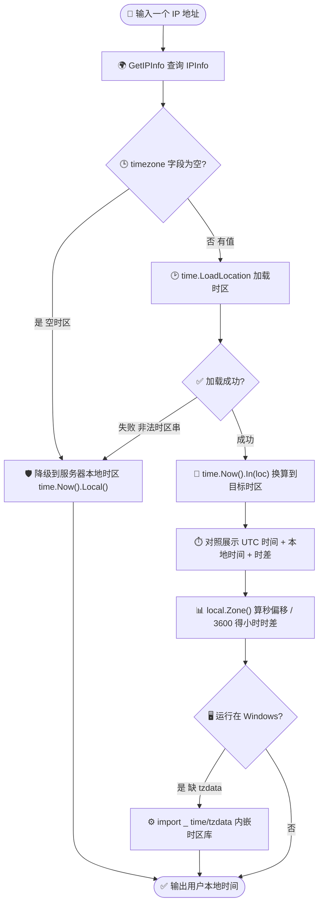
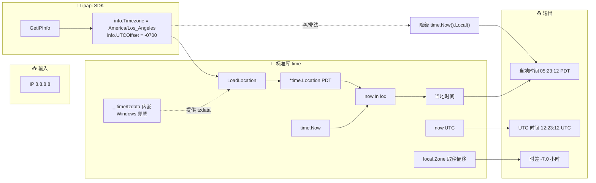

# 🎓 显示用户本地时间：用 Timezone + time.LoadLocation

> 🕐 知道访客的 IP，就能知道他的时区；知道时区，就能把"我的服务器时间"换成"他的本地时间"。本教程带你从 `GetIPInfo` 取出 `timezone` 字段，用标准库 `time.LoadLocation` 加载时区，输出对用户友好的本地时间。

## 🎯 你将学到

- 🌍 用 `GetIPInfo` 获取指定 IP 的 `timezone` 与 `utc_offset` 字段
- 🕑 用标准库 `time.LoadLocation` 把 IANA 时区字符串（如 `America/Los_Angeles`）转成 `*time.Location`
- 🔄 用 `time.Now().In(loc)` 把"此刻"换算到目标时区
- ⏱️ 同时展示 UTC 时间与本地时间，并算出时差
- 🛡️ 处理空时区、非法时区字符串等异常，并做兜底降级
- ⚙️ 了解 Windows 下缺少 tzdata 时如何用 `_ "time/tzdata"` 兜底

::: tip 🎨 一图抵千言
下面这张流程图概括了本教程从「拿到一个 IP」到「输出用户本地时间」的完整路径，包含异常兜底与 Windows 跨平台分支。
:::



| 步骤 | 输入 | 关键调用 | 产出 |
|------|------|----------|------|
| 1. 查询 | IP 字符串 | `client.GetIPInfo(ctx, ip, "json")` | `info.Timezone` / `info.UTCOffset` |
| 2. 加载 | IANA 时区串 | `time.LoadLocation(info.Timezone)` | `*time.Location` |
| 3. 换算 | 当前时刻 | `time.Now().In(loc)` | 目标时区 `time.Time` |
| 4. 对照 | 同一时刻 | `now.UTC()` + `now.In(loc)` | UTC + 本地 + 时差 |
| 5. 兜底 | 空/非法时区 | `time.Now().Local()` | 服务器本地时间 |

## 📋 前置条件

- ✅ 已安装 **Go 1.21+**（本教程基于 Go 1.23）
- ✅ 已完成 [快速入门](../guide/getting-started) 或 [Hello, ipapi](./hello-ipapi)，能跑通第一个 `GetIPInfo` 查询
- ✅ 了解 `Client` 与 `context` 的基本用法（参见 [客户端概念](../guide/client-concept) 与 [Context](../guide/context)）
- 💡 可选：拥有一个 ipapi.co API Key，用于提升速率限制额度（免费层亦可运行本教程示例）

## 🚀 步骤 1：初始化项目与客户端

先建一个可运行的项目，并引入 SDK。

```bash
mkdir timezone-display-demo && cd timezone-display-demo
go mod init timezone-display-demo
go get github.com/cyberspacesec/ipapi.co-skills/pkg/ipapi
```

写一个最小程序，创建客户端并打印确认信息：

```go
package main

import (
	"context"
	"fmt"
	"log"
	"time"

	"github.com/cyberspacesec/ipapi.co-skills/pkg/ipapi"
)

func main() {
	// 创建客户端；如有 API Key 可传入 ipapi.WithAPIKey("xxx")
	client := ipapi.NewClient()

	ctx, cancel := context.WithTimeout(context.Background(), 5*time.Second)
	defer cancel()

	_ = ctx
	fmt.Println("✅ 客户端就绪，客户端指针：", client != nil)
	if client == nil {
		log.Fatal("客户端初始化失败")
	}
}
```

运行：

```bash
go run main.go
```

预期输出：

```
✅ 客户端就绪，客户端指针： true
```

## 🌍 步骤 2：取出 timezone 字段

`GetIPInfo(ctx, ip, "json")` 返回完整的 `IPInfo` 结构体，其中 `Timezone` 是 IANA 时区标识（如 `America/Los_Angeles`、`Asia/Shanghai`），`UTCOffset` 是形如 `-0700` 的字符串。先把它打印出来确认数据形态：

```go
package main

import (
	"context"
	"fmt"
	"log"
	"time"

	"github.com/cyberspacesec/ipapi.co-skills/pkg/ipapi"
)

func main() {
	client := ipapi.NewClient()

	ctx, cancel := context.WithTimeout(context.Background(), 5*time.Second)
	defer cancel()

	// 查询 Google DNS 的地理位置信息
	info, err := client.GetIPInfo(ctx, "8.8.8.8", "json")
	if err != nil {
		log.Fatalf("查询失败: %v", err)
	}

	fmt.Printf("IP: %s\n", info.IP)
	fmt.Printf("时区标识: %s\n", info.Timezone)
	fmt.Printf("UTC 偏移: %s\n", info.UTCOffset)
}
```

运行：

```bash
go run main.go
```

预期输出：

```
IP: 8.8.8.8
时区标识: America/Los_Angeles
UTC 偏移: -0700
```

::: tip 为什么用完整查询而不是 GetField？
本教程后面还会用到 `utc_offset` 做对照展示，一次 `GetIPInfo` 拿全字段更划算。如果你只想要 `timezone` 一个值，也可以用 `GetField(ctx, ip, "timezone")`，详见 [查询单个字段](./single-field-tutorial)。
:::

## 🕑 步骤 3：用 time.LoadLocation 加载时区

拿到 `America/Los_Angeles` 这样的字符串后，用标准库 `time.LoadLocation` 把它解析成 `*time.Location`，再用 `time.Now().In(loc)` 把"此刻"换算到该时区：

```go
package main

import (
	"context"
	"fmt"
	"log"
	"time"

	"github.com/cyberspacesec/ipapi.co-skills/pkg/ipapi"
)

func main() {
	client := ipapi.NewClient()

	ctx, cancel := context.WithTimeout(context.Background(), 5*time.Second)
	defer cancel()

	info, err := client.GetIPInfo(ctx, "8.8.8.8", "json")
	if err != nil {
		log.Fatalf("查询失败: %v", err)
	}

	// 把 IANA 时区字符串加载为 *time.Location
	loc, err := time.LoadLocation(info.Timezone)
	if err != nil {
		log.Fatalf("加载时区失败: %v", err)
	}

	// 当前时刻换算到目标时区
	now := time.Now().In(loc)
	fmt.Printf("8.8.8.8 当地时间: %s\n", now.Format("2006-01-02 15:04:05 MST"))
}
```

运行：

```bash
go run main.go
```

预期输出（具体时间随运行时刻变化，时区缩写 `PDT`/`PST` 随夏令时变化）：

```
8.8.8.8 当地时间: 2026-07-03 05:22:12 PDT
```

::: tip IANA 时区是什么？
`America/Los_Angeles` 是 [IANA 时区数据库](https://www.iana.org/time-zones) 中的区域标识，能自动处理夏令时（DST）。Go 的 `time.LoadLocation` 会从系统时区数据库读取；`info.Timezone` 返回的正是这种标识，可直接喂给 `time.LoadLocation`。
:::

## ⏱️ 步骤 4：UTC 与本地时间对照

把 UTC 时间、目标时区本地时间、以及两者时差放在一起展示，是"用户本地时间"功能最常见的形态。注意要用**同一个 `time.Time` 实例**去派生 UTC 和本地时间，避免两次 `time.Now()` 之间产生微小偏差：

```go
package main

import (
	"context"
	"fmt"
	"log"
	"time"

	"github.com/cyberspacesec/ipapi.co-skills/pkg/ipapi"
)

func main() {
	client := ipapi.NewClient()

	ctx, cancel := context.WithTimeout(context.Background(), 5*time.Second)
	defer cancel()

	info, err := client.GetIPInfo(ctx, "8.8.8.8", "json")
	if err != nil {
		log.Fatalf("查询失败: %v", err)
	}

	loc, err := time.LoadLocation(info.Timezone)
	if err != nil {
		log.Fatalf("加载时区失败: %v", err)
	}

	// 同一时刻，分别派生 UTC 与目标时区表示
	now := time.Now()
	utc := now.UTC()
	local := now.In(loc)

	fmt.Printf("IP: %s\n", info.IP)
	fmt.Printf("时区: %s (UTC 偏移 %s)\n", info.Timezone, info.UTCOffset)
	fmt.Printf("UTC 时间:  %s\n", utc.Format("2006-01-02 15:04:05 MST"))
	fmt.Printf("当地时间:  %s\n", local.Format("2006-01-02 15:04:05 MST"))

	// Zone() 返回时区缩写与相对 UTC 的秒数偏移（含夏令时）
	_, offset := local.Zone()
	fmt.Printf("时差: %.1f 小时\n", float64(offset)/3600)
}
```

运行：

```bash
go run main.go
```

预期输出：

```
IP: 8.8.8.8
时区: America/Los_Angeles (UTC 偏移 -0700)
UTC 时间:  2026-07-03 12:23:12 UTC
当地时间:  2026-07-03 05:23:12 PDT
时差: -7.0 小时
```

::: tip 用 Zone() 算时差最准
不要用 `local.Sub(utc).Hours()` 算时差——`Sub` 算的是"两个时钟读数之差"，而 UTC 与本地时间读数本就相差一个偏移量，结果会恒为 0。正确做法是调用 `local.Zone()`，它的第二个返回值就是相对 UTC 的秒数偏移（已含夏令时），除以 3600 即得小时数。
:::

## 🛡️ 步骤 5：处理空时区与非法时区

真实环境里 `timezone` 字段可能为空（保留地址、查不到数据的 IP），也可能拿到系统不认识的时区串。把"取本地时间"封装成函数，统一处理这两类异常，并在失败时降级到服务器本地时区：

```go
package main

import (
	"context"
	"fmt"
	"log"
	"time"

	"github.com/cyberspacesec/ipapi.co-skills/pkg/ipapi"
)

// localTime 把 IANA 时区字符串换算成当前本地时间。
// timezone 为空或非法时返回 error，由调用方决定如何兜底。
func localTime(timezone string) (time.Time, error) {
	if timezone == "" {
		return time.Time{}, fmt.Errorf("时区字段为空")
	}
	loc, err := time.LoadLocation(timezone)
	if err != nil {
		return time.Time{}, fmt.Errorf("无法加载时区 %q: %w", timezone, err)
	}
	return time.Now().In(loc), nil
}

func main() {
	client := ipapi.NewClient()

	ctx, cancel := context.WithTimeout(context.Background(), 5*time.Second)
	defer cancel()

	info, err := client.GetIPInfo(ctx, "8.8.8.8", "json")
	if err != nil {
		log.Fatalf("查询失败: %v", err)
	}

	local, err := localTime(info.Timezone)
	if err != nil {
		// 兜底：退回服务器本地时区，并打印告警
		log.Printf("⚠️ %v，降级使用服务器本地时区", err)
		local = time.Now().Local()
	}

	fmt.Printf("8.8.8.8 当地时间: %s\n", local.Format("2006-01-02 15:04:05 MST"))

	// 演示：故意传一个非法时区串，触发错误分支
	if _, err := localTime("Invalid/Zone"); err != nil {
		fmt.Printf("兜底演示: %v\n", err)
	}
}
```

运行：

```bash
go run main.go
```

预期输出：

```
8.8.8.8 当地时间: 2026-07-03 05:23:12 PDT
兜底演示: 无法加载时区 "Invalid/Zone": unknown time zone Invalid/Zone
```

::: warning 保留地址的时区是空的
查询 `127.0.0.1`、`192.168.x.x` 等保留地址时，API 会返回错误或空 `timezone`（详见 [保留地址](../guide/reserved-ip) 与 [`ErrReservedIP`](../reference/errors/err-reserved-ip)）。生产代码务必像上面那样做空值判断，否则 `time.LoadLocation("")` 会返回 UTC 而非报错，掩盖真实问题。
:::

::: details 🧭 time.LoadLocation 的行为对照表
`time.LoadLocation` 对不同输入的返回行为差异很大，下表帮你避坑：

| 输入 timezone | 返回 | 行为 |
|---------------|------|------|
| `America/Los_Angeles` | `*time.Location` (PDT/PST) | ✅ 正常加载，自动夏令时 |
| `Asia/Shanghai` | `*time.Location` (CST) | ✅ 正常加载 |
| `""` 空串 | `time.UTC` | ⚠️ **不报错**，静默返回 UTC，掩盖问题 |
| `"Invalid/Zone"` | `nil, error` | ❌ 报 `unknown time zone` |
| `"UTC"` | `*time.Location` (UTC) | ✅ 等价于直接用 UTC |
| 系统无 tzdata (Windows) | `nil, error` | ❌ 需 `_ "time/tzdata"` 兜底 |

结论：空串是"静默陷阱"，必须显式判 `timezone == ""` 再喂给 `LoadLocation`。
:::

## ⚙️ 步骤 6：Windows 兜底 tzdata

在 Linux/macOS 上，`time.LoadLocation` 读取系统时区数据库。但 **Windows 默认没有 IANA tzdata**，会导致 `time.LoadLocation("America/Los_Angeles")` 报 `unknown time zone`。解决办法是引入标准库自带的 tzdata 包，把时区数据库编译进二进制：

```go
package main

import (
	"context"
	"fmt"
	"log"
	"time"

	// 关键：把 IANA tzdata 内嵌进二进制，Windows 上也能正常加载时区
	_ "time/tzdata"

	"github.com/cyberspacesec/ipapi.co-skills/pkg/ipapi"
)

func main() {
	client := ipapi.NewClient()

	ctx, cancel := context.WithTimeout(context.Background(), 5*time.Second)
	defer cancel()

	info, err := client.GetIPInfo(ctx, "8.8.8.8", "json")
	if err != nil {
		log.Fatalf("查询失败: %v", err)
	}

	loc, err := time.LoadLocation(info.Timezone)
	if err != nil {
		log.Fatalf("加载时区失败: %v", err)
	}

	fmt.Printf("8.8.8.8 当地时间: %s\n",
		time.Now().In(loc).Format("2006-01-02 15:04:05 MST"))
}
```

运行（在 Windows 上同样有效）：

```bash
go run main.go
```

预期输出：

```
8.8.8.8 当地时间: 2026-07-03 05:23:12 PDT
```

::: tip 何时需要 _ "time/tzdata"
只要你的程序可能部署到 Windows，或者目标镜像（如 `scratch`、精简 `alpine`）里没有 tzdata，就建议无脑加上这一行导入。它会增加约 450KB 二进制体积，换来跨平台的一致时区行为。详见 Go 官方文档 [time/tzdata](https://pkg.go.dev/time/tzdata)。
:::

## 📦 完整代码

下面是整合后的可运行示例，涵盖取字段、加载时区、UTC 对照、时差计算、异常兜底与 Windows tzdata 内嵌：

```go
package main

import (
	"context"
	"fmt"
	"log"
	"time"

	// 内嵌 IANA tzdata，确保 Windows/精简镜像下也能加载时区
	_ "time/tzdata"

	"github.com/cyberspacesec/ipapi.co-skills/pkg/ipapi"
)

// localTime 把 IANA 时区字符串换算成当前本地时间。
func localTime(timezone string) (time.Time, error) {
	if timezone == "" {
		return time.Time{}, fmt.Errorf("时区字段为空")
	}
	loc, err := time.LoadLocation(timezone)
	if err != nil {
		return time.Time{}, fmt.Errorf("无法加载时区 %q: %w", timezone, err)
	}
	return time.Now().In(loc), nil
}

func main() {
	client := ipapi.NewClient()

	ctx, cancel := context.WithTimeout(context.Background(), 5*time.Second)
	defer cancel()

	// 1) 查询 IP 的地理位置信息
	info, err := client.GetIPInfo(ctx, "8.8.8.8", "json")
	if err != nil {
		log.Fatalf("查询失败: %v", err)
	}

	fmt.Printf("IP: %s\n", info.IP)
	fmt.Printf("时区: %s (UTC 偏移 %s)\n", info.Timezone, info.UTCOffset)

	// 2) 加载时区；失败则降级到服务器本地时区
	local, err := localTime(info.Timezone)
	if err != nil {
		log.Printf("⚠️ %v，降级使用服务器本地时区", err)
		local = time.Now().Local()
	}

	// 3) 同一时刻派生 UTC 与本地时间并对照
	now := time.Now()
	utc := now.UTC()
	localSame := now.In(local.Location())

	fmt.Printf("UTC 时间:  %s\n", utc.Format("2006-01-02 15:04:05 MST"))
	fmt.Printf("当地时间:  %s\n", localSame.Format("2006-01-02 15:04:05 MST"))

	_, offset := localSame.Zone()
	fmt.Printf("时差: %.1f 小时\n", float64(offset)/3600)

	// 4) 异常演示：非法时区串
	if _, err := localTime("Invalid/Zone"); err != nil {
		fmt.Printf("兜底演示: %v\n", err)
	}
}
```

## 🖥️ 运行结果

```bash
go run main.go
```

```
IP: 8.8.8.8
时区: America/Los_Angeles (UTC 偏移 -0700)
UTC 时间:  2026-07-03 12:23:12 UTC
当地时间:  2026-07-03 05:23:12 PDT
时差: -7.0 小时
兜底演示: 无法加载时区 "Invalid/Zone": unknown time zone Invalid/Zone
```

::: tip 🎨 一图抵千言
下面是最终完整程序的数据流，把"查询→加载→换算→对照→兜底"五步串起来，含 Windows tzdata 分支。
:::




## 🧠 小结

- 🌍 `GetIPInfo(ctx, ip, "json")` 返回的 `info.Timezone` 是 IANA 时区标识，可直接交给标准库 `time.LoadLocation`。
- 🕑 `time.Now().In(loc)` 把"此刻"换算到目标时区，且自动遵循夏令时。
- ⏱️ 用 `local.Zone()` 的第二个返回值算时差最准，**不要**用 `local.Sub(utc)`。
- 🛡️ 真实环境必须做空值与非法时区判断，失败时降级到 `time.Now().Local()`，避免 `LoadLocation("")` 静默返回 UTC。
- ⚙️ 跨平台部署（尤其 Windows）记得 `_ "time/tzdata"` 内嵌时区数据库。
- 📚 相关 API 细节见 [`GetIPInfo` 方法参考](../api/get-ip-info)；时区/偏移字段含义见 [`utc_offset` 字段参考](../reference/fields/utc_offset)。

## ➡️ 下一步

- 📖 深入阅读：[客户端概念](../guide/client-concept) · [`GetIPInfo` API](../api/get-ip-info) · [`utc_offset` 字段参考](../reference/fields/utc_offset) · [字段总览](../reference/fields/ip)
- 🍳 实战配方：[时区问候语](../cookbook/timezone-greeting) · [按语言重定向](../cookbook/redirect-by-language) · [最近节点路由](../cookbook/nearest-server)
- 🧭 更多参考：[客户端选项](../api/options) · [`ErrReservedIP` 参考](../reference/errors/err-reserved-ip) · [最佳实践](../best-practices/index)
- 📚 继续学习：下一篇教程 [按 ASN 过滤流量](./asn-filter-tutorial)——用 `asn` 字段识别并过滤来自指定自治系统的请求
